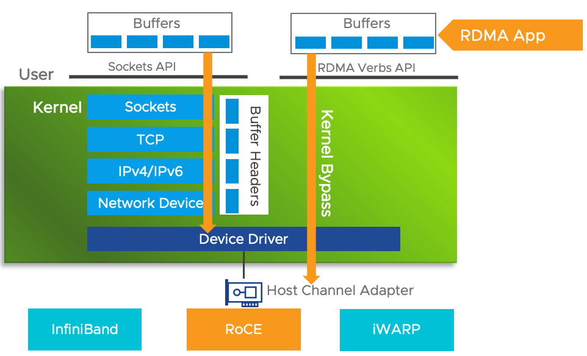

# RDMA

---

## 简介

---

&emsp;&emsp;[RDMA](https://zh.m.wikipedia.org/zh-hans/%E8%BF%9C%E7%A8%8B%E7%9B%B4%E6%8E%A5%E5%86%85%E5%AD%98%E8%AE%BF%E9%97%AE)（Remote Direct Memory Access）全称**远程直接数据存取**，是一种绕过远程主机操作系统内核访问其内存中数据的技术，由于不经过操作系统，不仅节省了大量CPU资源，同样也提高了系统吞吐量，降低了系统的网络通信延迟，尤其适合大规模并行计算机集群中有广泛应用。在基于NVMe-OF（NVMe over Fabric）的数据中心中，RDMA可以配合高性能的NVMe SSD构建高性能、低延迟的存储网络。

&emsp;&emsp;RDMA支持零复制网络传输，通过使网络适配器直接在应用程序内存间传输数据，不在需要在应用程序内存与操作系统缓冲区之间复制数据。

&emsp;&emsp;为了消除传统网络通信带给计算任务的瓶颈，希望更快和更轻量级的网络通信，由此提出了RDMA技术。RDMA利用[**Kernel Bypass**](https://zhuanlan.zhihu.com/p/48703677)（内核旁路）和[**Zero Copy**](https://baike.baidu.com/item/%E9%9B%B6%E5%A4%8D%E5%88%B6/22742547)技术提供了低延迟的特性，同时减少了CPU占用，减少了内存带宽瓶颈，提高了很高的带宽利用率。RDMA提供了基于I/O的通道，这种通道允许一个应用程序通过RDMA设备对远程的虚拟内存进行直接的读写。

&emsp;&emsp;传统的TCP/IP网络通信，数据需要通过用户空间发送到远程机器的用户空间，在这个过程中需要经历若干次内存拷贝。

传统网络通信与RDMA网络通信

RDMA数据传输

## 工作原理

---

&emsp;&emsp;普通网卡集成了支持硬件校验的功能，并对软件进行了改进，从而减少了发送数据的拷贝量，但无法减少接收数据的拷贝量，而这部分拷贝量需要占用CPU的大量计算周期。

&emsp;&emsp;普通网卡的工作过程：先把收到的数据包缓存到系统上，数据包经过处理后，响应数据被分配到一个TCP连接；然后，接收系统再把主动提供的TCP数据同相应的应用程序联系起来，并将数据从系统缓冲区拷贝到目标存储地址。由于应用通信强度不断增加和主机CPU在内核与应用存储器间处理数据的任务繁重使系统要不断追加主机CPU资源。这样CPU在很大一部分资源参与了数据传输工作。

&emsp;&emsp;RDMA的三个特性：Low-Latency（低延迟）、Low CPU overhead（低CPU消耗）、high banddwidth（高带宽）

RDMA整体框架架构图

&emsp;&emsp;上图是RDMA的整体框架架构图，从图中可看出，RDMA在应用程序用户空间，提供了一系列Verbs接口操作RDMA硬件。RDMA绕过内核直接从用户空间访问RDMA网卡。RNIC网卡中包括Cached Page Table Entry，用来将虚拟页面映射到相应的物理页面。

**RDMA技术优势特点**：

* **CPU Offload（CPU卸载）**：指在远端CPU不参与通信的情况下，应用程序可以访问远程主机内存而不消耗远程主机中的任何CPU。远程主机内存能够被读取而不需要远程主机上的进程（或CPU）参与。远程主机的CPU的缓存不会被访问的内存内容所填充。
* **Kernel Bypass（内核旁路）**：RDMA提供一个专有的Verbs interface而不是传统的TCP/IP Socket interface。应用程序可以直接在用户态执行数据传输，不需要在内核态与用户态之间做上下文切换。
* **Zero Copy（零拷贝）**：每个应用程序都能直接访问集群中的设备的虚拟内存，这意味着应用程序能够直接执行数据传输，在不涉及到网络软件栈的情况下，数据能够被直接发送到缓冲区或者能够直接从缓冲区里接收，而不需要被复制到网络层。

零拷贝与内核旁路

### 工作过程

1. 当一个应用执行RDMA读或写请求时，不执行任何数据赋值，在不需要任何内核内存参与的条件下，RDMA请求从运行在用户空间中的应用中发送到本地NIC网卡；
2. NIC读取缓冲的内容，并通过网络传送到远程NIC；
3. 在网络上传输的RDMA信息包含目标机器虚拟地址、内存钥匙和数据本身。请求完成既可以完全在用户空间中处理，也可以在应用一直睡眠到请求完成时的情况下通过内核处理。RDMA操作使应用可以从一个远程应用的内存中读取数据或向这个内存写入数据。
4. 目标NIC确认内存钥匙，直接将数据写入应用缓存中，用于操作远程虚拟内存地址包含在RDMA信息中。

RDMA 数据传输

RDMA传输过程

### RDMA三种不同的硬件实现

* **Infiniband**：基于InfiniBand架构的RDMA技术，由IBTA（InfiniBand Trade Assocation）提出。搭建基于IB技术的RDMA网络需要专用的IB网卡和IB交换机。从性能上，很明显Infiniband网络最好，但网卡和交换机的价格相对也比较高，RoCEv2和iWARP进需使用特殊的网卡即可，价格相对便宜。
* **iWARP**：Internet Wide Area RDMA Protocal，基于TCP/IP协议的RDMA技术，由IETF标准定义。iWARP支持在标准以太网基础设施上使用RDMA技术，而不需要交换机支持无损以太网传输，但服务器需要使用支持iWARP的网卡。与此同时，收TCP影响，性能稍差。
* **RoCE**：RDMA over Converged Ethernet，基于以太网的RDMA技术，也是由IBTA提出。RoCE支持在标准以太网基础设施上使用RDMA技术，但是需要交换机支持无损以太网传输，需要服务器使用RoCE网卡，性能与IB相当。

RDMA三种硬件实现

## InfiniBand

&emsp;&emsp;InfiniBand是一种基于InfiniBand架构的RDMA技术，它提供了一种基于通道的点对点消息队列转发模型，每个应用都可通过创建的虚拟通道直接获取本应用的数据消息，无需其他操作系统及协议栈的介入。InfiniBand架构的应用层采用RDMA技术，可以提供远程节点RDMA读写访问，完全卸载CPU工作负载；网络传输采用高带宽的传输；链路层设置特定的重传机制保证服务质量，不需要数据缓冲。

&emsp;&emsp;**InfiniBand必须运行在InfiniBand网络环境下，必须使用IB交换机及IB网卡才可以实现。**

InfiniBand技术特点：

* 应用层采用RDMA技术，降低主机侧数据处理的延迟；
* 消息转发控制由子网管理器完成，没有类似以太网复杂的协议交互计算；
* 链路层通过重传机制保证服务质量，不需要数据缓冲，无丢包；
* 具有低延迟、高带宽、低处理开销的特点。

## iWARP

&emsp;&emsp;iWARP是基于以太网和TCP/IP协议的RDMA技术，可以运行在标准的以太网基础设施上。

&emsp;&emsp;iWARP并没有指定物理层信息，所以能够工作在任何使用TCP/IP协议的网络上层。iWARP允许很多传输类型来共享相同的物理连接，如网络、I/O、文件系统、块存储和处理器之间的消息通讯。

### 组成

&emsp;&emsp;iWARP协议一共有三层，所以更准确说iWARP是一组协议的统称，如下图绿色部分所示，[IETF](https://zh.m.wikipedia.org/zh-hans/%E4%BA%92%E8%81%94%E7%BD%91%E5%B7%A5%E7%A8%8B%E4%BB%BB%E5%8A%A1%E7%BB%84)（互联网工程任务组）也将这三层称为RDDP。图中的ULP指的是Upper Layer Protocol，即上层协议，iWARP通过[Verbs接口](https://zhuanlan.zhihu.com/p/329198771)向上层提供服务。ULP可以是一些存储协议，例如：[iSCSI](https://zh.m.wikipedia.org/zh-hans/ISCSI)（Internet小型计算机系统接口）[^iSCSI]，可能是中间件，例如：[UCX](https://blog.csdn.net/weixin_42952928/article/details/118295861)[^UCX]，也可能是用户应用程序。

iWARP协议栈的层次关系

&emsp;&emsp;与iWARP直接相关联的下层协议可以是TCP，也可以是[SCTP](https://zh.m.wikipedia.org/zh-hans/%E6%B5%81%E6%8E%A7%E5%88%B6%E4%BC%A0%E8%BE%93%E5%8D%8F%E8%AE%AE)（Stream Control Transmission Protocol）

1. **DDP（Data Placement Protocol）**

&emsp;&emsp;DDP是iWARP的核心，负责在传输层协议之上实现零拷贝的功能。DDP的报文中包含有描述内存区域的信息，硬件可以直接根据DDP报文中的控制信息，通过DMA搬移DDP报文中的数据到内存中的目的地。上述过程不需要CPU的参与，所以DDP是最能体现RDMA技术核心思想的一层。

DDP层的功能示意图

2. **RDMAP（Remote Direct Memory Access Protocol）**

&emsp;&emsp;RDMA是iWARP协议栈中最靠近用户的一层，主要功能是为上层用户提供RDMA语义，支撑他们的Send/RDMA Read/RDMA Write等各种类型的请求。RDMAP依赖于下层的DDP提供的零拷贝功能来实现对应的用户请求。

RDMAP层的功能示意图

3. **MPA（Marker Protocol Data Unit Aligned Framing）**

&emsp;&emsp;MPA这一层负责在发送端按照一定的算法在TCP流中加入控制信息，从而使得接收端可以按照算法识别出流中的DDP消息的分界。实际上完成的是将DDP适配TCP的工作。当DDP的下层是SCTP协议时就不需要MPA这一层了，因为SCTP可以识别出上层协议的分界。

MPA层的功能示意图

[^iSCSI]:iSCSI又称为IP-SAN，是一种基于因特网即SCSI-3协议下的存储技术，由IETF提出，iSCSI利用TCP/IP的port 860和3260作为沟通的渠道。透过两个计算机之间利用iSCSI协议来交换SCSI命令，让计算机可以透过告诉局域网集线来把SAN模拟为本地的储存装置。

[^UCX]:统一通信X（UCX）提供了一组抽象的同心圆与，它与消息传递接口（MPI）、分区全局空间（PGAS）/OpenSHMEM库和RPC/以数据为中心的应用程序提供了一个优化的通信层。UCX利用高速网络进行节点间通信，并利用共享内存机制进行有效的节点内通信。这些原语可以充分利用可用的硬件资源和卸载。包括RDMA（InfiniBand和RoCE）、TCP、GPU、共享内存和网络原子操作。UCX通过提供高级API促进快速开发，屏蔽底层细节，同时保持高性能和可伸缩性。

## RoCE

&emsp;&emsp;RoCE技术支持在以太网上承载IB协议，实现RDMA over Ethernet。RoCE与InfiniBand技术有相同的软件应用层及传输控制层，仅网络层及以太网链路层存在差异。

RoCE架构

&emsp;&emsp;RoCE v1协议：基于以太网承载RDMA，只能部署二层网络，它的报文结构实在原有的IB架构的报文上增加二层一外网的报文头，通过Ethertype 0x8915标识RoCE报文。

&emsp;&emsp;RoCE v2协议：基于UDP/IP协议承载RDMA，可部署于三层网络，它的报文结构是在原有的IB架构的报文上增加UDP头、IP头和以太网报文头，通过UDP目的端口4791标识RoCE报文。RoCE v2支持基于源端口号hash，采用ECMP实现负载分担，提高了网络利用率。

&emsp;&emsp;RoCE技术可通过普通以太网交换机实现，但服务器需要支持RoCE网卡，网络侧需要支持无损以太网络，这是由于IB的丢包处理机制中，任意一个报文的丢失都会造成大量的重传，严重影响数据传输性能。在RoCE网络中，需要构建无损以太网用于保证网络传输过程不丢包。

## RDMA通信原理

&emsp;&emsp;RDMA协议定义RC、UC、UD三种通信模式，其中RC（Reliable Connection）模式，保证报文正确的传输到目的端，支持报文ACK确认、超时重传，若某个报文超时没有确认，则重传该报文后的所有报文。UC（Unreliable Conection）模式需要提前建立链接，报文不需要携带地址信息，不需要ACK确认、重传，不保证对端能正确接收。UD（Unreliable Datagram）模式不需要建立链接，每个报文都携带目标地址、目标队列信息，不需要ACK确认、重传，每个报文不能大于网络[MTU限制](https://baike.baidu.com/item/%E6%9C%80%E5%A4%A7%E4%BC%A0%E8%BE%93%E5%8D%95%E5%85%83/9730690?fromtitle=mtu&fromid=508920)[^MTU]。三种模式稳定性依次下降，执行效率依次升高，RC、UC链路资源都需要占用网卡的Cache资源，并发链路数量过多时，需要考虑UD模式。

&emsp;&emsp;协议定义双边、单边两种通信原语。**send**、**recv**指令属于双边原语，接收端执行recv指令等待数据到达，发送端执行send指令发起数据传输，双边CPU都参与传输过程，适合小数据传输。**read**、**write**指令属于单边原语，得知远端内存地址后，本地网卡直接访问远端内存，远端CPU无感知。单边源于是RDMA规范中最具创新的特性，通过RDMA协议把本地内存总线延伸到其他主机，传输效率高，适合较大数据的传输。不同模式下支持原语不同，RC模式支持全部原语，UC模式不支持read，UD模式仅支持send、recv单边操作。

## 服务类型

|                    | 可靠（Reliable）          | 不可靠（Unreliable）        |
| ------------------ | ------------------------- | --------------------------- |
| 连接（Connection） | RC（Reliable Connection） | UC（Unreliable Connection） |
| 数据报（Datagram） | RD（Reliable Datagram）   | UD（Unreliable Datagram）   |

#### [RC](#RC)

&emsp;&emsp;面向连接的可靠服务；队列对仅与另一个QP关联

#### [UC](#uc)

&emsp;&emsp;面向连接的不可靠服务

#### UD

&emsp;&emsp;面向数据报的可靠服务；

#### RD

&emsp;&emsp;面向数据报的不可靠服务

#### 服务类型差异

面向连接 vs 面向数据报

|        | 面向连接                                           | 面向数据报                                                  |
| ------ | -------------------------------------------------- | ----------------------------------------------------------- |
| 相同点 | 通信均包括双方QP对的参与                           | 通信均包括双方QP对的参与                                    |
| 不同点 | 面向连接的通信若有N个节点与之通信，本机需要N个QP对 | 面向数据报的通信可以做到N个节点与之通信，本机仅需一个QP队； |

## 关键概念

| 缩略语 | 全称                                   |
| ------ | -------------------------------------- |
| WQ     | [Work Queue](#wq)                      |
| WQE    | [Work Queue Entry/Element](#wqe)       |
| QP     | [Queue Pair](#qp)                      |
| SQ     | [Send Queue](#sq)                      |
| RQ     | [Receive Queue](#rq)                   |
| SRQ    | [Shared Receive Queue](#srq)           |
| CQ     | [Completion Queue](#cq)                |
| CQE    | [Completion Queue Entry/Element](#cqe) |
| WR     | [Work Request](#wr)                    |
| WC     | [Work Completion](#wc)                 |

### <a id=wq >WQ</a>

&emsp;&emsp;Work Queue简称WQ，它是一个储存工作请求的队列；即保存[WQE](#wqe)，WQ里可以容纳很多WQE，WQ总是由软件向其增加WQE（入队），硬件从中取出WQE，即软件给硬件“下发任务”。这种软件下发和硬件执行的方式通常称为“**Post**”

### <a id=wqe>WQE</a>

&emsp;&emsp;WQE表示RDMA的一种“任务说明”，其中包含了软件所希望硬件去做的任务以及关于这个任务的详细信息；

WQ与WQE关系

### <a id=qp>QP</a>

&emsp;&emsp;每对QP由Send Queue（SQ）和Receive Queue（RQ）构成也就是一对WQ的总称，这些队列中管理着各种类型的消息。QP会被映射到应用的虚拟地址空间，使得应用直接通过它访问RNIC网卡。

[9. RDMA之Queue Pair - 知乎 (zhihu.com)](https://zhuanlan.zhihu.com/p/195757767) qp详细讲解。

### <a id=sq>SQ</a>和<a id=rq>RQ</a>

&emsp;&emsp;任何通信过程都需要收、发两端，SQ表示发送队列，用来存放发送任务，RQ表示接收队列，用来存放接收任务。再一次Send-Recv过程中，发送端软件需要把表示一次发送任务的WQE放在SQ中，同样需要接收端软件需要给硬件下发一个表示接收任务的WQE，这样接收过去的任务才能知道存放在哪个位置。这个过程对于发送SQ来说称为Post Send，对于接收SQ来说称为Post-Receive。

接收与发送端的队列

&emsp;&emsp;在RDMA技术中，通信的基本单元称为QP，而不是节点，对于每个节点来说，每个进程都可以使用若干个QP，而每个本地QP可以关联一个远端QP。

SQ、RQ、QP关系

&emsp;&emsp;每个节点的每个QP都有一个唯一的编号，称为QPN（Query Pair Number），通过QPN可以唯一确定一个节点上的QP。

### <a id=SRQ>SRQ</a>

&emsp;&emsp;SRQ即Shared Receive Queue，意为共享接收队列，即多个QP共享一个RQ时称其为SRQ。

共享接收队列

### <a id=cq>CQ</a>与<a id=cqe>CQE</a>

&emsp;&emsp;CQ即完成队列，与WQ相同，其中也包含多个CQE，可以认为CQE和WQE是相反的概念，即CQE可认为是硬件给软件的“任务报告”，CQE中描述了某个任务是否被正确的执行，如果错误会将错误的信息描述在CQE中。

CQ与CQE的关系

&emsp;&emsp;每个CQE都包含某个WQE的完成信息，关系如下：

CQE与WQE关系

&emsp;&emsp;一次可靠服务类型的SEND-RECV操作中软硬件的协同如下：

步骤如下：

1. 接收端APP以WQE的形式下发一次RECV任务到RQ；
2. 发送端APP以WQE的形式下发一次SEND任务到SQ；
3. 发送端硬件从SQ中拿到任务，从内存中哪到待发送的数据，组装数据包；
4. 发送端网卡将数据包通过物理链路发送到接收端网卡；
5. 接收端收到数据，进行校验后回复ACK报文给发送端；
6. 接收端硬件从RQ中取出一个任务（WQE）；
7. 接收端硬件将数据放到WQE中指定的位置，生成任务报告CQE，放置于CQ中；
8. 接收端APP取得任务完成信息；
9. 发送端网卡收到ACK后，生成CQE，放置于CQ中；
10. 发送端APP取得任务完成信息。

### <a id=WR>WR</a>和<a id=wc>WC</a>

&emsp;&emsp;WR称为Work Request，意为工作请求；WC称为Work Completion，意为工作完成。这两者是WQE和CQE在用户层的映射。WQE与CQE本身对用户不可见，是驱动实现中的概念，用户只通过APU下发WR，接收端收到WC。

WQ与CQ

RDMA传输层主要完成数据与应用的绑定，即在硬件收到报文时，由哪个应用来处理这个报文；传统的TCP/IP网络使用端口号（port）来区分，即在TCP/IP网络上，某两个IP地址对应的节点的端口之间进行通信，RDMA中使用新的概念<a id=qp>**Queue Pair**</a>来进行数据传输，在RDMA硬件上会同时运行多个QP，每个QP都会有编号（number），这个编号即可决定哪个应用来进行处理当前的QP，[RDMA编程基础5:00：InfiniBand_腾讯视频 (qq.com)](https://v.qq.com/x/page/j0319e5j7ay.html)

## 数据收发

当建立QP可以指定不同的传输操作。可用的操作选项如下表所示。RD不被当前API支持。

|                                                | <a id=UD>UD</a> | <a id=uc >UC</a> | <a id=rc >RC</a> | <a id=RD>RD</a> |
| ---------------------------------------------- | --------------- | ---------------- | ---------------- | --------------- |
| Send                                           | √               | √                | √                | √               |
| Receive                                        | √               | √                | √                | √               |
| RDMA Write                                     |                 | √                | √                | √               |
| RDMA Read                                      |                 |                  | √                | √               |
| Atomic Fetch and Add / Atomic Compare and Swap |                 |                  | √                | √               |
| Max message size                               | MTU[^MTU]       | 1GB              | 1GB              | 1GB             |

Send/Receive和RDMA Read/Write最大的区别是Send/Receive发送端只管发，最终数据存储在哪里由接收端决定。RDMA Read/Write在在发送时就携带了远端节点的写入地址

发送与接收，因为接收端是个被动的行为，不知道在哪个时刻会有数据的到来，所以需要在接收之前就需要指定好接收数据的地址，这种行为称为**Post Receive Request（RR）**。

### RDMA双边操作（SEND/RECV）

RDMA的send/receive是双边操作，即必须要远端的应用感知参与才能完成收发。在实际中，send/receive多用于连接控制类报文，而数据报文多是通过READ/WRITE进行。

双边操作的基本流程如下（A发送数据至B）：

1. A和B获取RDMA设备并打开RDMA设备；
2. A和B都需要创建并初始化各自的QP、CQ；
3. A和B分别向自己的WQ注册WQE，对于A，WQ=SQ，WQE指向一个等待被发送的数据头；对于B，WQ=RQ，WQE表示指向一块用于存储数据的BUFFER；
4. A的RNIC异步调度到A的WQE，解析为SEND数据，将从buffer中直接向B发出数据。数据流到达B的RNIC之后，B的WQE被消耗，并把数据存储到WQE指向的存储位置。
5. A、B通信完成后A的CQ中会产生完成消息CQE表示发送完成，与此同时，B的CQ也会产生一个完成消息表示接收完成，每个WQ中的WQE完成都会产生对应的CQE。

Post Receive Request（RR）行为

### 单边操作（RDMA READ）

1. A、B建立连接，创建QP并完成初始化；
2. 数据存放在B的buffer地址VB，这里的VB应提前注册给RNIC，并拿到返回的local key，即A操作B的权限。
3. B将数据地址VB、key封装到专用的报文传送至A，相当于B把数据buffer的操作权交给A。同时B在它的WQ中注册一个WR，用于接收数据传输的A返回的状态。
4. A在收到B送过来的数据VB和key后，RNIC会把它联同自己存储地址VA封装到RDMA READ请求，将这个消息请求发送给B，这个过程A、B两端不需要软件参与，即可将B的数据存储至A的VA虚拟地址。
5. A存储完成之后，会给B返回整个数据传输的状态信息。

单边操作不需要对方应用程序参与，只需提供直接访问远程的虚拟地址，适用于批量的数据传输。

单边操作READ

### 单边操作（RDMA WRITE）

1. A、B建立连接，创建并初始化QP；
2. B注册VB至RNIC用于存储远端写入的数据，并且产生local key；
3. B将数据写入地址VB、key封装到专用的报文传送给A，同时在B的WQ中创建WR，用于接收数据传输返回的状态；
4. A接收到VB、key后，RNIC会将他们联通自身地址VA封装到RDMA WRITE请求，此过程无需A、B两端软件参与，就可以将A的数据存放B的VB地址；
5. A发送完成后会向B发出整个数据传输的状态信息；
6. 所有传输完成后，B返回一个ACK给A，表示RDMA WRITE请求已完成。

RDMA Read/Write行为

## OFED

Mellanox OFED是一个单一的软件堆栈，包括驱动、中间件、用户接口，以及一系列的标准协议IPoIB、SDP、SRP、iSER、RDS、DAPL(Direct Access Programming Library)，支持MPI、Lustre/NFS over RDMA等协议，并提供Verbs编程接口；Mellanox OFED由开源OpenFabrics组织维护。

Mellanox OFED架构

## 相关软件

### [rdma-core]([linux-rdma/rdma-core: RDMA core userspace libraries and daemons (github.com)](https://github.com/linux-rdma/rdma-core))

用户态核心代码，API，文档以及各厂商的用户态驱动；

### [perftest]([linux-rdma/perftest: Infiniband Verbs Performance Tests (github.com)](https://github.com/linux-rdma/perftest))

测试RDMA性能的工具；

[^MTU]:表示Infiniband协议最大传输单元（Maximum Transmission Unit，MTU）用来通知对方所能接受[数据服务](https://baike.baidu.com/item/数据服务/23724818?fromModule=lemma_inlink)[单元](https://baike.baidu.com/item/单元/32922?fromModule=lemma_inlink)的最大尺寸，定义的大小有256B、512B、1024B、2048B和4096B，说明发送方能够接受的[有效载荷](https://baike.baidu.com/item/有效载荷/3653893?fromModule=lemma_inlink)大小。默认情况下为1024B（active_mtu）

# 参考

1. [RDMA学习资料总目录](https://blog.csdn.net/bandaoyu/article/details/120485737)
2. [12. RDMA之Verbs](https://zhuanlan.zhihu.com/p/329198771)
3. [19. RDMA之iWARP & Soft-iWARP](https://zhuanlan.zhihu.com/p/449189540)
4. [浅谈 Linux下的零拷贝机制 - 简书 (jianshu.com)](https://www.jianshu.com/p/e76e3580e356)
5. [【RDMA】技术详解（四）：RDMA之Verbs和编程步骤](https://blog.csdn.net/bandaoyu/article/details/112860396)
6. [RDMA编程基础：InfiniBand_腾讯视频 (qq.com)](https://v.qq.com/x/page/j0319e5j7ay.html)
7. [Remote Direct Memory Access - IBM Documentation](https://www.ibm.com/docs/en/aix/7.1?topic=networking-remote-direct-memory-access)
8. [Understanding InfiniBand Software Commands - Sun Datacenter InfiniBand Switch 648 Topic Set (oracle.com)](https://docs.oracle.com/cd/E19632-01/835-0783-03/bbgdebai.html#scrolltoc)
9. https://blog.csdn.net/github_33873969/article/details/83017820
10. [[MLNX_OFED Documentation Rev 5.0-2.1.8.0 pdf](https://www.liberouter.org/repo/mlnx-ofed/MLNX_OFED Documentation Rev 5.0-2.1.8.0__04_30_2020.pdf)
11. [MTU Considerations for RoCE based Applications (mellanox.com)](https://support.mellanox.com/s/article/MLNX2-117-1682kn) MTU相应解释
12. [【RDMA】基于RoCE的应用程序的MTU注意事项|探测网络中的MTU设置_bandaoyu的博客-CSDN博客](https://blog.csdn.net/bandaoyu/article/details/116706925) MTU相应解释

🎈

🥉

🀄

