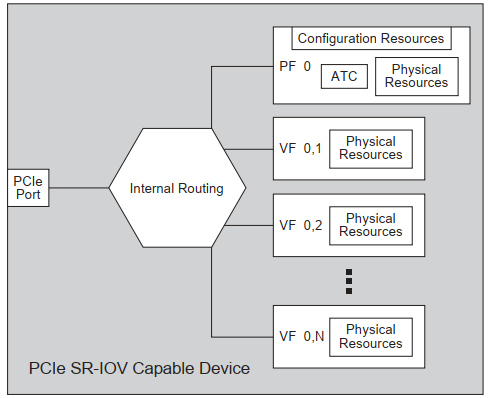
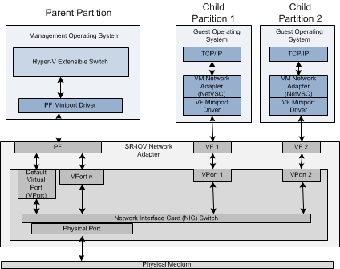
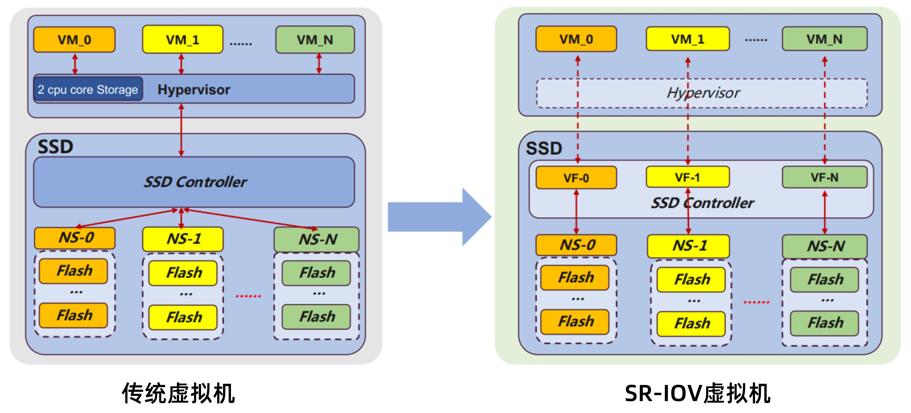
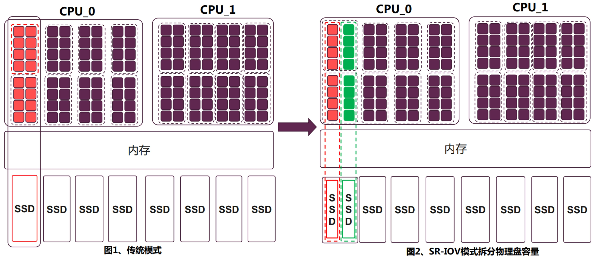
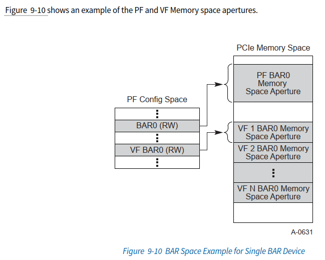

# SR-IOV

&emsp;&emsp;`SR-IOV` 是技术是一种基于硬件的虚拟化解决方案，可提高性能和可伸缩性。SR-IOV标准允许在虚拟机之间高效共享PCIe（`Peripheral Component Interconnect Express`，快速外设组件互连）设备，由于采用硬件实现，所以可以获得能够与本机性能相媲美的I/O性能。SR-IOV规范定义了新的标准，根据该标准，创建的新设备可允许将虚拟机直接连接到I/O设备。

`SR-IOV`是通过改变物理设备硬件设计的方式来实现硬件设备的透传以及虚拟机共享的目的，同时也建立了一套基于`PF->VF`的标准，SR-IOV能够为虚拟机提供独立的内存空间、中断、DMA流来绕过[VMM](#VMM)实现数据访问。

## SR-IOV的优缺点

SR-IOV相对与软件模拟IO虚拟化的优点：

1.降低了IO延迟和对CPU的占用，获得了接近原生的IO性能，因为虚拟机直接使用VFs，没有了VMM的陷入处理。

2.数据更加安全，因为每个VF属于一个IOMMU Group，共享IOMMU Group的设备不能分配给不同的虚拟机，而每个IOMMU Group又有独立的内存。

SR-IOV的缺点：

使用了VFs的虚拟机不能在线迁移。

# SR-IOV原理

## SR-IOV硬件实现

### SR-IOV基本结构

&emsp;&emsp;SR-IOV是在PCIe规范的基础上实现的，SR-IOV协议引入了两种类型功能的概念叫做PCIe Function

* PF（Physical Function）

&emsp;&emsp;包括SR-IOV的扩张能力，支持SR-IOV功能的PCI功能，如SR-IOV规范中定义，PF包含SR-IOV功能配置结构体，用于管理SR-IOV功能。PF是全功能的PCIe功能，可以像其他任何PCIe设备一样进行发现、管理和处理。PF拥有完全配置资源，可以用于配置或控制PCIe设备。

* VF（Virtual Function）

&emsp;&emsp;与物理功能关联的一种功能，VF包含轻量级的PCIe功能，相当于一个非常轻量级的虚拟网络设备，每一个VF又它自己独享的PCI配置区域，并且可能与其他VF共享同一个物理资源，VF仅允许拥有用于其自身行为的配置资源；



<center>SR-IOV基本结构图</center>

《[Single Root I/O Virtualization and Sharing Specification Revision 1.1.pdf](https://composter.com.ua/documents/sr-iov1_1_20Jan10_cb.pdf)》

&emsp;&emsp;每个SR-IOV设备都可有一个物理功能PF，并且每个PF最多可有64000个与其相关联的虚拟功能VF，PF可以通过寄存器创建VF，这些寄存器设计有专用于此的属性。一旦在PF中启用了SR-IOV，就可以通过PF的总线、设备和功能编号（路由ID）访问各个VF的PCI配置空间，每个VF都具有一个PCI内存空间，用于映射其寄存器集。VF设备驱动程序对寄存器集进行操作以启用其功能，并且显示为实际存在的PCI设备。创建VF后，可以直接将其指定给IO来宾域或各个应用；



<center>SR-IOV</center>

&emsp;&emsp;传统虚拟化系统使用 [Hypervisor](https://zh.wikipedia.org/zh-hans/Hypervisor)（或者KVM）软件对虚拟机进行管理，软件层既消耗CPU资源，又有较深的调用栈，使得PCIe设备的性能优势无法彻底发挥。而SR-IOV可以实现多个虚拟机共享物理资源，且Bypass Hypervisor（或者VMM）软件层，使得虚拟机可以使用到NVMe SSD的高性能。

&emsp;&emsp;对比传统虚拟化系统，再有SR-IOV技术的云业务虚拟机应用场景下，VM可直接与VF通信，不需要Hypervisor接入IO处理，节约vCPU资源的同时，又可以实现不同VF之间的



**SR-IOV**优势：

* 实现SR-IOV之后，VMM把中断交给虚拟机处理，提高I/O性能；
* 虚拟机直接和PCIe设备交互，Bypass掉中间的Hypervisor/VMM层，减轻物理主机CPU负担，使之有能力承载更多虚拟机；
* SR-IOV虚拟化技术可以减少客户所需PCIe设备数量，进而节省PCIe插槽；
* SR-IOV可以与其他的I/O虚拟化技术进行结合，提供一个更加完整的兼具高性能和安全性的解决方案；

&emsp;&emsp;虚拟化分区方式场景下，通过SR-IOV技术挂载SSD方式如下图所示：



# SR-IOV实现

## 物理功能 (Physical Function, PF)

用于支持 SR-IOV 功能的 PCI 功能，如 SR-IOV 规范中定义。PF 包含 SR-IOV 功能结构，用于管理 SR-IOV 功能。PF 是全功能的 PCIe 功能，可以像其他任何 PCIe 设备一样进行发现、管理和处理。PF 拥有完全配置资源，可以用于配置或控制 PCIe 设备。

### 如何确定PF数量


## 虚拟功能 (Virtual Function, VF)

与物理功能关联的一种功能。VF 是一种轻量级 PCIe 功能，可以与物理功能以及与同一物理功能关联的其他 VF 共享一个或多个物理资源。VF 仅允许拥有用于其自身行为的配置资源，**基本上，它们只有将数据移入和移出的能力**。VF无法进行配置，因为这会改变底层PF，从而影响所有其他VF；配置只能针对PF进行。因为VF无法像完整的PCIe设备一样处理，所以操作系统或虚拟化管理程序实例必须知道它们不是完整的PCIe设备。因此，SR-IOV需要操作系统或虚拟化管理程序的支持，以便操作系统实例或虚拟化管理程序可以正确地检测和正确地初始化PF和VF。

每个 SR-IOV 设备都可有一个物理功能 (Physical Function, PF)，并且每个 PF 最多可有 64,000 个与其关联的虚拟功能 (Virtual Function, VF)。PF 可以通过寄存器创建 VF，这些寄存器设计有专用于此目的的属性。

一旦在 PF 中启用了 SR-IOV，就可以通过 PF 的总线、设备和功能编号（路由 ID）访问各个 VF 的 PCI 配置空间。每个 VF 都具有一个 PCI 内存空间，用于映射其寄存器集。VF 设备驱动程序对寄存器集进行操作以启用其功能，并且显示为实际存在的 PCI 设备。创建 VF 后，可以直接将其指定给 IO 来宾域或各个应用程序（如裸机平台上的 Oracle Solaris Zones）。此功能使得虚拟功能可以共享物理设备，并在没有 CPU 和虚拟机管理程序软件开销的情况下执行 I/O。

### VF的BAR空间分配[^1]

VF的BAR[n]空间是通过PF的SR-IOV Capability中每个VF_BAR[n]来分配的，和VF Configuration Space的BAR无关。

SR-IOV Capability中VF_BAR[n]的介绍如下：

>**9.3.3.14 VF BAR0 (Offset 24h), VF BAR1 (Offset 28h), VF BAR2 (Offset 2Ch), VF BAR3 (Offset**
>**30h), VF BAR4 (Offset 34h), VF BAR5 (Offset 38h)**
>These fields must define the VF’s Base Address Registers (BARs). These fields behave as normal PCI BARs, as described in Section 7.5.1 . They can be sized by writing all 1s and reading back the contents of the BARs as described in Section 7.5.1.2.1 , complying with the low order bits that define the BAR type fields.
>These fields may have their attributes affected by the VF Resizable BAR Extended Capability (see Section 9.3.7.5 ) if it is implemented.
>The amount of address space decoded by each BAR shall be an integral multiple of System Page Size.

> 这些字段必须定义VF的基地址寄存器(BARs)。这些字段的作用与正常的PCI BARs相似，如7.5.1节所述。它们可以通过写入全1并按照第7.5.1.2.1节中描述的那样读入BAR的内容来调整大小，通过低BIT可以判断BAR的类型和属性。
>
> 如果实现了VF可调整大小的BAR扩展功能，这些字段的属性可能会受到影响(参见9.3.7.5节)

>Each VF BARn, when “sized” by writing 1s and reading back the contents, describes the amount of address space consumed and alignment required by a single Virtual Function, per BAR. When written with an actual address value, and VF Enable and VF MSE are Set, the BAR maps NumVFs BARs. In other words, the base address is the address of the first VF BARn associated with this PF and all subsequent VF BARn address ranges follow as described below.

>每个VF BARn通过写入1并读取内容来“调整大小”时，每个VF BAR都描述了单个VF所消耗的地址空间量和所需的对齐方式。当使用实际的地址值写入时，并且设置了VF Enable和VF MSE，则VF BAR映射了NumVFs个 BAR空间。换句话说，VF BAR的起始地址是与这个PF关联的第一个VF BAR的起始地址，所有后续VF的 BAR地址空间则依次向后排列。

>VF BARs shall only support 32-bit and 64-bit memory space. PCI I/O Space is not supported in VFs. Bit 0 of any implemented VF BARx must be RO 0b except for a VF BARx used to map the upper 32 bits of a 64-bit memory VF BAR pair.
>The alignment requirement and size read is for a single VF, but when VF Enable is Set and VF MSE is Set, the BAR contains the base address for all (NumVFs) VF BARn.

>VF BARs只能支持32位和64位内存空间映射。VFs中不支持PCI I/O空间。所有VF BARx的bit0必须是只读的0值，除了用于映射64位内存VF BAR上32位的VF BARx。
>对齐要求和大小读取是针对单个VF的，但是当使能VF Enable和VF MSE时，该BAR实际上包含所有(NumVFs多个) VF BAR的BAR地址空间。

> 《PCI Express® Base Specification Revision 5.0.pdf》9.3.3 SR-IOV Extended Capability

下图为PF的BAR0，VF的BAR0和每个VF的BAR0的对应关系，其他的BAR1~BAR6都相同。



**总结**：

* PF 的VF_BAR[n]行为上是和常规的BAR是一样的（全写1来确定大小...等等分配机制）；
* 但是PF 的VF_BAR 地址空间分配之后，代表的含义与PF自己的BAR不同。VF_BAR对应的是PF关联的每个VF的BAR空间；
* VF1（VF计数从1开始）的BAR空间完全与PF 的VF_BAR 地址空间相同，也就是PF 的VF_BAR[0-5]空间刚好就是对应第一个VF的bar[0-5]；
* VFn的每一个BAR[n]空间都依次在VF1的bar[n]后依次排列（大小是相同的）；
* 虽然VF_BAR只显式的看到一份VF的BAR空间，但实际上有NumVFs份 BAR空间在每个VF_BAR后依次存在，然后对应就是每个VF的bar。（类似一个矩阵，PF有关联的NumVFs个VF,每个VF有6个BAR）。


# SR-IOV启动流程

## 硬件条件

1. CPU 支持 Intel VT-x 和 VT-D （或者 AMD 的 SVM 和 IOMMU）；
2. 有支持 SR-IOV 规范的设备；
3. CPU必须支持IOMMU（比如英特尔的 VT-d 或者AMD的 AMD-Vi，Power8 处理器默认支持IOMMU），并且在BIOS中已开启；
4. 支持PCI-SIG* Single Root I/O Virtualization and Sharing(SR-IOV)，并且在BIOS中已开启。

## 命令行使能SR-IOV功能

```bash
echo 2 > /sys/bus/pci/devices/xxxx:xx:xx.x/sriov_numvfs
```

### `sriov_numvfs`的产生

`/drivers/pci/iov.c`

```c
static DEVICE_ATTR_RO(sriov_totalvfs);
static DEVICE_ATTR_RW(sriov_numvfs);
static DEVICE_ATTR_RO(sriov_offset);
static DEVICE_ATTR_RO(sriov_stride);
static DEVICE_ATTR_RO(sriov_vf_device);
static DEVICE_ATTR_RW(sriov_drivers_autoprobe);

static struct attribute *sriov_pf_dev_attrs[] = {
	&dev_attr_sriov_totalvfs.attr,
	&dev_attr_sriov_numvfs.attr,
	&dev_attr_sriov_offset.attr,
	&dev_attr_sriov_stride.attr,
	&dev_attr_sriov_vf_device.attr,
	&dev_attr_sriov_drivers_autoprobe.attr,
#ifdef CONFIG_PCI_MSI
	&dev_attr_sriov_vf_total_msix.attr,
#endif
	NULL,
};

const struct attribute_group sriov_pf_dev_attr_group = {
	.attrs = sriov_pf_dev_attrs,
	.is_visible = sriov_pf_attrs_are_visible,
};
```

`DEVICE_ATTR_RW`宏可以快速定义一个可读写的sysfs属性，并提供了相应的读取和写入回调函数，这个属性可以通过`/sys/bus/pci/devices/xxxx:xx:xx.x/sriov_numvfs`文件进行读写操作。

`/drivers/pci/pci-sysfs.c`

```c

static const struct attribute_group *pci_dev_attr_groups[] = {
	&pci_dev_attr_group,
	&pci_dev_hp_attr_group,
#ifdef CONFIG_PCI_IOV
	&sriov_pf_dev_attr_group,
	&sriov_vf_dev_attr_group,
#endif
	&pci_bridge_attr_group,
	&pcie_dev_attr_group,
#ifdef CONFIG_PCIEAER
	&aer_stats_attr_group,
#endif
#ifdef CONFIG_PCIEASPM
	&aspm_ctrl_attr_group,
#endif
	NULL,
};

const struct device_type pci_dev_type = {
	.groups = pci_dev_attr_groups,
};
```

`/drivers/pci/probe.c`

```c
struct pci_dev *pci_alloc_dev(struct pci_bus *bus)
{
	struct pci_dev *dev;

	dev = kzalloc(sizeof(struct pci_dev), GFP_KERNEL);
	if (!dev)
		return NULL;

	INIT_LIST_HEAD(&dev->bus_list);
	dev->dev.type = &pci_dev_type;
	dev->bus = pci_bus_get(bus);

	return dev;
}
EXPORT_SYMBOL(pci_alloc_dev);
```


## 初始化

SR-IOV的初始化由内核函数`pci_init_capabilities`中调用`pci_iov_init`开始。

```c
pci_scan_single_device
	-->pci_scan_device
    	-->pci_alloc_dev
    		-->dev->dev.type = &pci_dev_type; /* 用于生成sysfs里/sys/bus/pci/devices/xxxx:xx:xx.x/sriov_numvfs文件 */
	-->pci_device_add
		-->pci_init_capabilities
			-->pci_iov_init
```

### pci_init_capabilities

`pci_init_capabilities`函数用于初始化 PCI 设备功能。该函数的主要任务是检测 PCI 设备是否支持一些特定的功能（如 MSI 和 MSI-X 中断、SR-IOV 虚拟化等），并在必要时启用这些功能。

`/drivers/pci/probe.c`

```c
static void pci_init_capabilities(struct pci_dev *dev)
{
	pci_ea_init(dev);		/* Enhanced Allocation */
	pci_msi_init(dev);		/* Disable MSI */
	pci_msix_init(dev);		/* Disable MSI-X */

	/* Buffers for saving PCIe and PCI-X capabilities */
	pci_allocate_cap_save_buffers(dev);

	pci_pm_init(dev);		/* Power Management */
	pci_vpd_init(dev);		/* Vital Product Data */
	pci_configure_ari(dev);		/* Alternative Routing-ID Forwarding */
	pci_iov_init(dev);		/* Single Root I/O Virtualization */
	pci_ats_init(dev);		/* Address Translation Services */
	pci_pri_init(dev);		/* Page Request Interface */
	pci_pasid_init(dev);		/* Process Address Space ID */
	pci_acs_init(dev);		/* Access Control Services */
	pci_ptm_init(dev);		/* Precision Time Measurement */
	pci_aer_init(dev);		/* Advanced Error Reporting */
	pci_dpc_init(dev);		/* Downstream Port Containment */
	pci_rcec_init(dev);		/* Root Complex Event Collector */

	pcie_report_downtraining(dev);
	pci_init_reset_methods(dev);
}
```

### pci_iov_init

`/drivers/pci/iov.c`

```c
/**
 * pci_iov_init - initialize the IOV capability
 * @dev: the PCI device
 *
 * Returns 0 on success, or negative on failure.
 */
int pci_iov_init(struct pci_dev *dev)
{
	int pos;

	if (!pci_is_pcie(dev))
		return -ENODEV;

    /* 查找Capability结构体，确定设备是否支持SR-IOV功能 */
	pos = pci_find_ext_capability(dev, PCI_EXT_CAP_ID_SRIOV);
	if (pos)
		return sriov_init(dev, pos);

	return -ENODEV;
}
```


## 使能过程

由使能SR-IOV命令来看，入口为每个PCIe设备的`sriov_numvfs`节点。

内核源码中SR-IOV相关代码位于`/drivers/pci/iov.c`文件下，当用户使用命令行配置`sriov_numvfs`的数量时，会触发内核调用函数`sriov_numvfs_store`，此时配置的数量便是函数的最后一个参数，用于决定开启的vf的数量。

### sriov_numvfs_store

`/drivers/pci/iov.c`

```bash
/*
 * num_vfs > 0; number of VFs to enable
 * num_vfs = 0; disable all VFs
 *
 * Note: SRIOV spec does not allow partial VF
 *	 disable, so it's all or none.
 */
static ssize_t sriov_numvfs_store(struct device *dev,
				  struct device_attribute *attr,
				  const char *buf, size_t count)
{
	struct pci_dev *pdev = to_pci_dev(dev);
	int ret;
	u16 num_vfs;

	ret = kstrtou16(buf, 0, &num_vfs);
	if (ret < 0)
		return ret;

	if (num_vfs > pci_sriov_get_totalvfs(pdev))
		return -ERANGE;

	device_lock(&pdev->dev);

	if (num_vfs == pdev->sriov->num_VFs)
		goto exit;

	/* is PF driver loaded w/callback */
	if (!pdev->driver || !pdev->driver->sriov_configure) {
		pci_info(pdev, "Driver does not support SRIOV configuration via sysfs\n");
		ret = -ENOENT;
		goto exit;
	}

	if (num_vfs == 0) {
		/* disable VFs */
		ret = pdev->driver->sriov_configure(pdev, 0);
		goto exit;
	}

	/* enable VFs */
	if (pdev->sriov->num_VFs) {
		pci_warn(pdev, "%d VFs already enabled. Disable before enabling %d VFs\n",
			 pdev->sriov->num_VFs, num_vfs);
		ret = -EBUSY;
		goto exit;
	}

	ret = pdev->driver->sriov_configure(pdev, num_vfs);
	if (ret < 0)
		goto exit;

	if (ret != num_vfs)
		pci_warn(pdev, "%d VFs requested; only %d enabled\n",
			 num_vfs, ret);

exit:
	device_unlock(&pdev->dev);

	if (ret < 0)
		return ret;

	return count;
}
```

`sriov_numvfs_store()` 函数通常在设置一个支持 `SR-IOV（Single Root I/O Virtualization）`功能的 PCI 设备的 VF（Virtual Function）数量时被调用。当用户使用命令行写入VF到`/sys/bus/pci/devices/xxxx:xx:xx.x/sriov_numvfs`时，内核会调用`sriov_numvfs_store`函数来设置设备的VF以及启用SR-IOV功能。

### sriov_configure

从上面的内核驱动代码来看，支持SR-IOV的设备驱动需要实现以下回调函数接口:

```c
static int xxx_pci_sriov_configure(struct pci_dev *pdev, int num_vfs)
{
    ...
    pci_enable_sriov(pdev, num_vfs);
    ...
}

static struct pci_driver xxx_driver {
    ...
	.sriov_configure = xxx_pci_sriov_configure,
    ...
};
```

设备驱动编写的`sriov_configure`回调函数最终会调用内核接口`pci_enable_sriov`。

### pci_enable_sriov

`/drivers/pci/iov.c`

```c
/**
 * pci_enable_sriov - enable the SR-IOV capability
 * @dev: the PCI device
 * @nr_virtfn: number of virtual functions to enable
 *
 * Returns 0 on success, or negative on failure.
 */
int pci_enable_sriov(struct pci_dev *dev, int nr_virtfn)
{
	might_sleep();

	if (!dev->is_physfn)
		return -ENOSYS;

	return sriov_enable(dev, nr_virtfn);
}
EXPORT_SYMBOL_GPL(pci_enable_sriov);
```

#### sriov_enable

`/drivers/pci/iov.c`

```c
static int sriov_enable(struct pci_dev *dev, int nr_virtfn)
{
	int rc;
	int i;
	int nres;
	u16 initial;
	struct resource *res;
	struct pci_dev *pdev;
	struct pci_sriov *iov = dev->sriov;
	int bars = 0;
	int bus;

	if (!nr_virtfn)
		return 0;

	if (iov->num_VFs)
		return -EINVAL;

    /* 确保 SR-IOV 配置的初始 VF（Virtual Function）数量不超过总 VF 数量 */
	pci_read_config_word(dev, iov->pos + PCI_SRIOV_INITIAL_VF, &initial);
	if (initial > iov->total_VFs ||
	    (!(iov->cap & PCI_SRIOV_CAP_VFM) && (initial != iov->total_VFs)))
		return -EIO;

	if (nr_virtfn < 0 || nr_virtfn > iov->total_VFs ||
	    (!(iov->cap & PCI_SRIOV_CAP_VFM) && (nr_virtfn > initial)))
		return -EINVAL;

	nres = 0;
    /* 计算BAR数量并标记使用情况 */
	for (i = 0; i < PCI_SRIOV_NUM_BARS; i++) {
		bars |= (1 << (i + PCI_IOV_RESOURCES));
		res = &dev->resource[i + PCI_IOV_RESOURCES];
		if (res->parent)
			nres++;
	}
	if (nres != iov->nres) {
		pci_err(dev, "not enough MMIO resources for SR-IOV\n");
		return -ENOMEM;
	}

    /* 检查vf数量是否超出物理总线范围 */
	bus = pci_iov_virtfn_bus(dev, nr_virtfn - 1);
	if (bus > dev->bus->busn_res.end) {
		pci_err(dev, "can't enable %d VFs (bus %02x out of range of %pR)\n",
			nr_virtfn, bus, &dev->bus->busn_res);
		return -ENOMEM;
	}

    /* 设置VFs 配置空间的PCI_COMMAND字段 */
	if (pci_enable_resources(dev, bars)) {
		pci_err(dev, "SR-IOV: IOV BARS not allocated\n");
		return -ENOMEM;
	}

    /* 判断是否需要创建设备依赖链 */
	if (iov->link != dev->devfn) {
		pdev = pci_get_slot(dev->bus, iov->link);
		if (!pdev)
			return -ENODEV;

		if (!pdev->is_physfn) {
			pci_dev_put(pdev);
			return -ENOSYS;
		}

		rc = sysfs_create_link(&dev->dev.kobj,
					&pdev->dev.kobj, "dep_link");
		pci_dev_put(pdev);
		if (rc)
			return rc;
	}

    /* 配置初始化vf数量 */
	iov->initial_VFs = initial;
	if (nr_virtfn < initial)
		initial = nr_virtfn;

    /* 启用 SR-IOV 设备并设置初始 VF  */
	rc = pcibios_sriov_enable(dev, initial);
	if (rc) {
		pci_err(dev, "failure %d from pcibios_sriov_enable()\n", rc);
		goto err_pcibios;
	}

    /* 设置VFs number，读取offset，stride */
	pci_iov_set_numvfs(dev, nr_virtfn);
	iov->ctrl |= PCI_SRIOV_CTRL_VFE | PCI_SRIOV_CTRL_MSE; /* 配置ctrl寄存器的VFE位和MSE位 */
	pci_cfg_access_lock(dev);
	pci_write_config_word(dev, iov->pos + PCI_SRIOV_CTRL, iov->ctrl);/* 将ctrl的值写入配置空间的PCI_SRIOV_CTRL寄存器 */
	msleep(100);
	pci_cfg_access_unlock(dev);

    /* 向设备添加VF */
	rc = sriov_add_vfs(dev, initial);
	if (rc)
		goto err_pcibios;

    /* 发送一个内核事件，通知用户空间SR-IOV设备属性改变 */
	kobject_uevent(&dev->dev.kobj, KOBJ_CHANGE);
	iov->num_VFs = nr_virtfn;

	return 0;

/* 启用失败处理 */
err_pcibios:
	iov->ctrl &= ~(PCI_SRIOV_CTRL_VFE | PCI_SRIOV_CTRL_MSE);
	pci_cfg_access_lock(dev);
	pci_write_config_word(dev, iov->pos + PCI_SRIOV_CTRL, iov->ctrl);
	ssleep(1);
	pci_cfg_access_unlock(dev);

	pcibios_sriov_disable(dev);

	if (iov->link != dev->devfn)
		sysfs_remove_link(&dev->dev.kobj, "dep_link");

	pci_iov_set_numvfs(dev, 0);
	return rc;
}
```

# 相关词汇

HPA（Host Physical Address）宿主机物理内存地址；

GPA（Guest Physical Address）虚拟机访问的物理地址；

[IOMMU](https://zhuanlan.zhihu.com/p/348826888)（Input/Output Memory Mangement Uint）输入输出内存管理单元；

<span id="VMM">VMM</span>（Virtual Machine Manage）虚拟机管理器

# 参考

《Single Root I/O Virtualization and Sharing Specification Revision 1.0》

《PCI Express® Base Specification Revision 5.0.pdf》第9节

[PCIe_BGONE的博客-CSDN博客](https://blog.csdn.net/bgone/category_9450900.html)

[Single Root IO Virtualization - SR-IOV - NVIDIA Networking Docs](https://docs.nvidia.com/networking/m/view-rendered-page.action?abstractPageId=19798214) mellanox网卡开启SR-IOV

[PCIe\] SR-IOV （单根虚拟化） 及linux驱动浅析（device的PF和VF及其驱动）_pcie pf vf_Lenz's law的博客-CSDN博客](https://blog.csdn.net/u010443710/article/details/104756445)

[SR-IOV 驱动程序 - 编写设备驱动程序 (oracle.com)](https://docs.oracle.com/cd/E38902_01/html/E38873/sriov.html#scrolltoc)

[pcie SRIOV linux 调用流程_pcilib: error reading /sys/bus/pci/devices/0000:00_Runner_Linux的博客-CSDN博客](https://blog.csdn.net/Runner_Linux/article/details/107109011)

[PCIe_BGONE的博客-CSDN博客](https://blog.csdn.net/bgone/category_9450900.html)

[深入理解SR-IOV和IO虚拟化 - 知乎 (zhihu.com)](https://zhuanlan.zhihu.com/p/464911642)

[Chapter 13. SR-IOV Red Hat Enterprise Linux 6 | Red Hat Customer Portal](https://access.redhat.com/documentation/en-us/red_hat_enterprise_linux/6/html/virtualization_host_configuration_and_guest_installation_guide/chap-virtualization_host_configuration_and_guest_installation_guide-sr_iov#doc-wrapper)

https://www.one-tab.com/page/BxsaLOL9S0y7W59cTFPlMw SR-IOV相关学习资料

[Specifications | PCI-SIG (pcisig.com)](https://pcisig.com/specifications/pciexpress?order=field_revision&sort=asc)

[深入理解SR-IOV和IO虚拟化 - Leo Hou (leo-hou.github.io)](https://leo-hou.github.io/2022/02/08/深入理解SR-IOV和IO虚拟化/)

[3. PCI Express I/O 虚拟化指南 — The Linux Kernel documentation](https://www.kernel.org/doc/html/next/translations/zh_CN/PCI/pci-iov-howto.html) 简单的SR-IOV驱动框架

[KVM 介绍（4）：I/O 设备直接分配和 SR-IOV KVM PCI/PCIe Pass-Through SR-IOV\] - SammyLiu - 博客园 (cnblogs.com)](https://www.cnblogs.com/sammyliu/p/4548194.html)

[What is SR-IOV? - Scott's Weblog - The weblog of an IT pro focusing on cloud computing, Kubernetes, Linux, containers, and networking (scottlowe.org)](https://blog.scottlowe.org/2009/12/02/what-is-sr-iov/) SR-IOV部分限制解释。

[Intel SR-IOV Explanation - YouTube](https://www.youtube.com/watch?v=hRHsk8Nycdg) Intel对于SR-IOV的解释（经典）。

《RichardSolomon_PCI_Express.pdf》 SR-IOV PF、VF配置空间例子。

[SR-IOV 虚拟化](https://www.wenwoha.com/blog_detail-675.html) 虚拟机使用网卡

[^1]:《PCI Express® Base Specification Revision 5.0.pdf》9.3.3.14节

