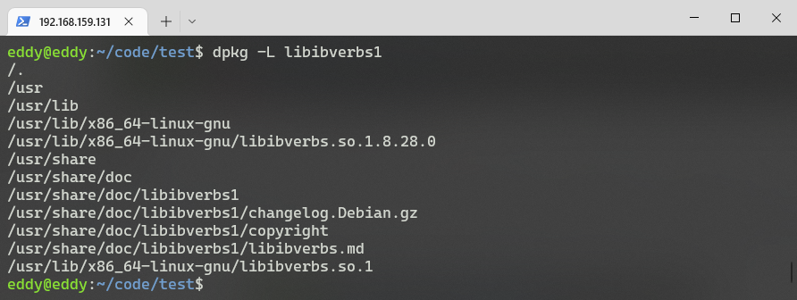
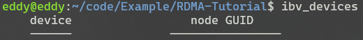
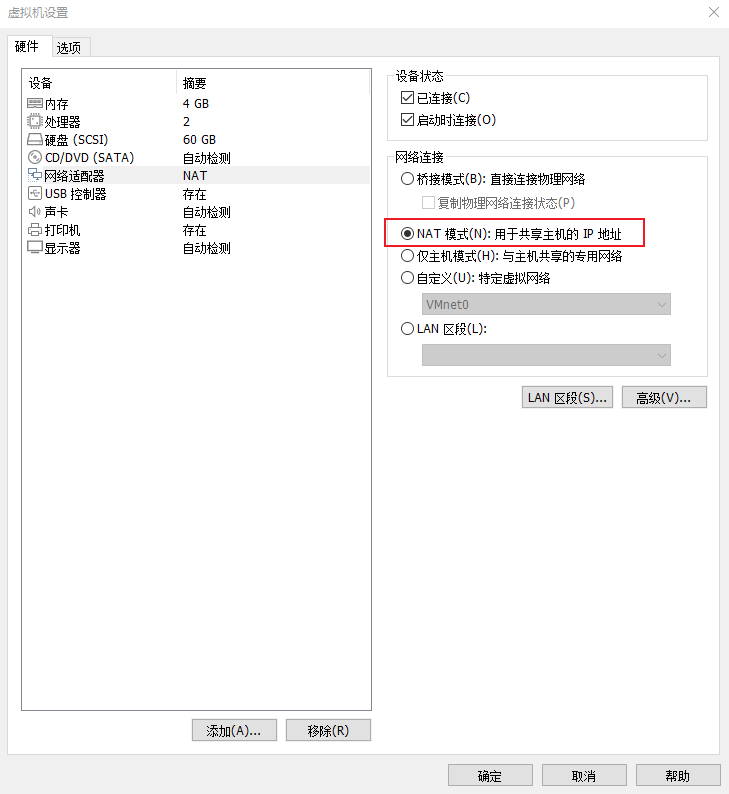
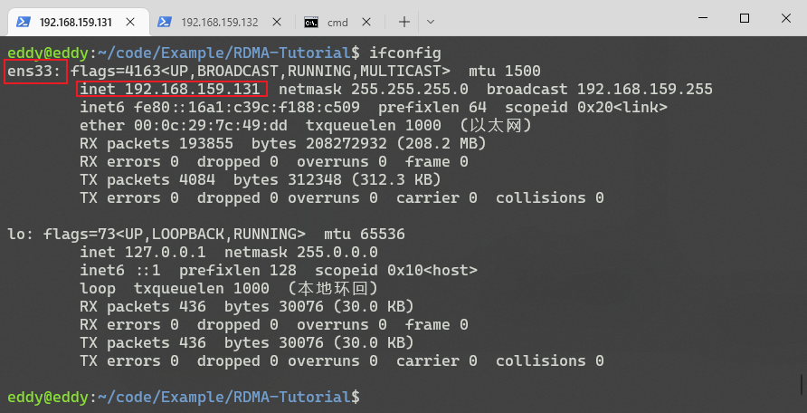
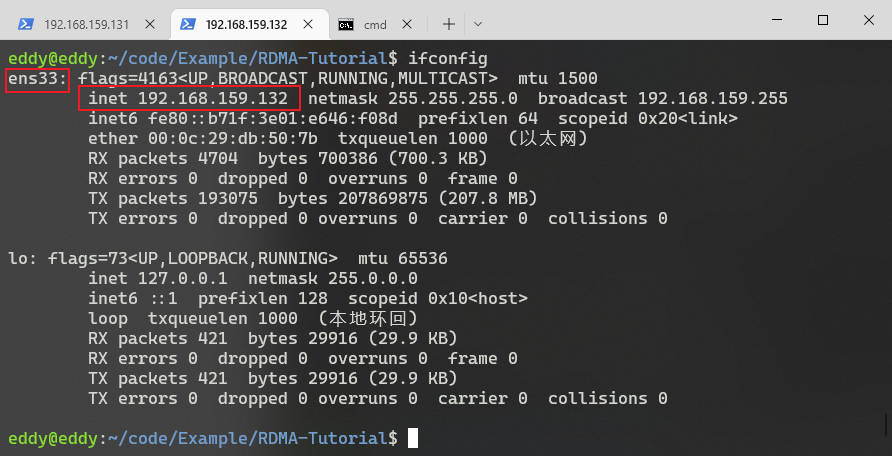
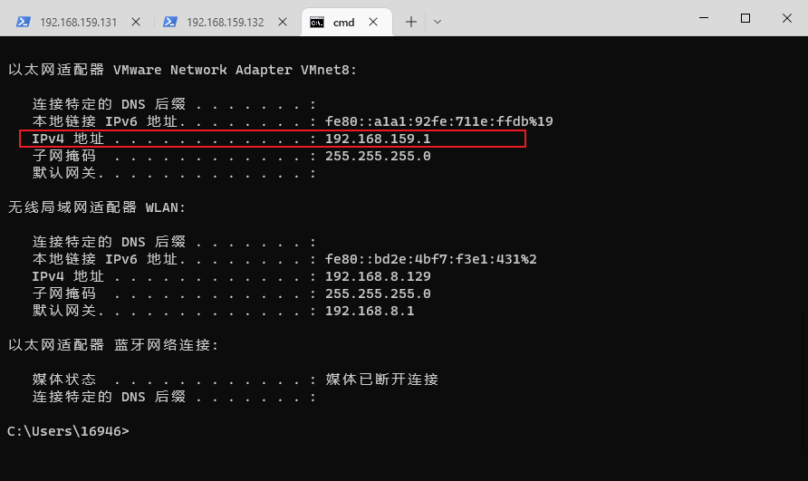
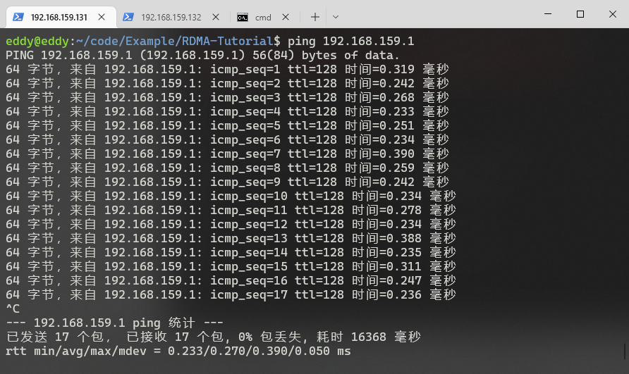
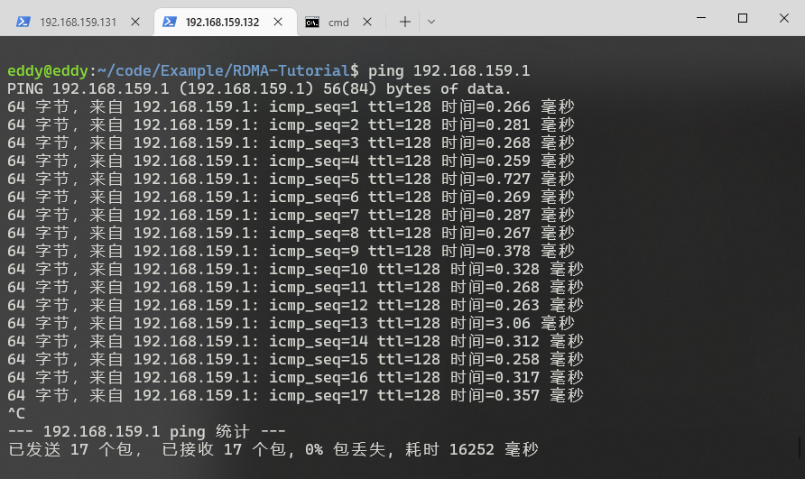
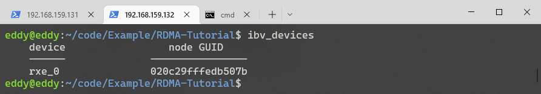
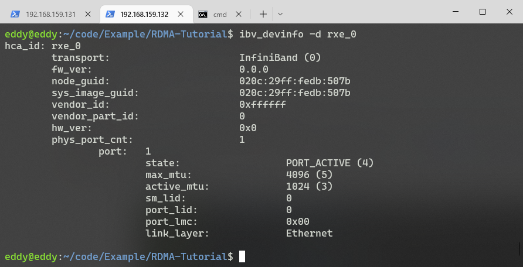

# Soft-RoCE部署及通信测试

# 环境

操作系统：

Windows10+Ubuntu20.04*2（虚拟机）

软件：

VmWare Workstation 16 Pro 16.2.4

虚拟机*2

ubuntu-20.04.3-desktop-amd64 

# 测试步骤

### 部署RDMA软件栈

#### 确认内核是否支持RXE

```bash
cat /boot/config-$(uname -r) | grep RXE
```


如果CONFIG_RDMA_RXE的值为y或者m，表示当前的操作系统可以使用RXE。

#### 安装用户态动态链接库

```bash
sudo apt-get install libibverbs1 ibverbs-utils librdmacm1 libibumad3 ibverbs-providers rdma-core
dpkg -L libibverbs1   //查看包内容
```



安装完成后查看ibv_devices



### 安装其他工具

1. iproute2

```bash
sudo apt-get install iproute2
```

iproute2是用来替代net-tools软件包的，是一组开源的网络工具集合，比如用更强大ip命令替换了以前常用的ifconfig。我们需要其中的rdma工具来对RXE进行配置。一般的操作系统都已经包含了，安装也很简单：

2. perftest

```bash
sudo apt-get install perftest
```

### 克隆虚拟机

注意：需要选择完整克隆

### [配置网络模式](#in)

两台虚拟机均选择NET模式（N）：用于共享主机的IP地址



查看两台虚拟机IP地址





查看Windows主机虚拟网卡IP地址：



这里需要注意如果没在同一网段的话需要更改虚拟机网阔模式为自定义，自定义i选择虚拟网卡

查看两台虚拟机与Windows主机网络连通性





### [配置RXE网卡](#rxe)

加载内核驱动，modprobe会自动加载其他驱动。

```bash
sudo modprobe rdma_rxe
```

用户态配置

```bash
sudo rdma link add rxe0 type rxe netdev ens33
```

注意这里的rxe_0是RDMA的设备名，可任意取名，ens33为虚拟机的网络设备名，可在<a id=in>配置网络格式</a>步骤查看，每个虚拟机可能存在差异

使用ibv_devices查看设备列表



查看虚拟RDMA设备简略信息

```bash
ibv_devinfo -d <网卡名称>
```



注意：步骤配置RXE网卡，两台虚拟机都需要完成。


### 其他相关命令

删除RDMA内核模块

```bash
sudo rdma link delete <rxe name>
```

其中rxe name为ibv_devices显示的rxe设备名称

查看RDMA连接状态

```bash
rdma link show
```

更改MTU包大小

```bash
sudo ifconfig <网卡名称> mtu <MTU包大小>
```

显示所有RDMA网口的所有信息

```bash
ibv_devinfo -v
```

查看链路类型

```bash
ibstat
```

查看网络中infiniband设备

```bash
ibnodes
```

验证端到端 RDMA 通讯是否在用户空间应用程序中正常工作

server

```bash
ibping -S -C mlx4_0 -P 1
```

client

```bash
ibping -c 10000 -f -C mlx4_0 -P 1 -L 49
```

## rping

rping是RDMA的一个示例程序，属于RDMA连接管理库librdmacm。可用于测试两个RDMA节点间的连通性。

rping是一个工具，包含在 librdmacm-utils中，并发送 RDMA 流量。rping与所有 RDMA 驱动的协议（InfiniBand、RoCE 和 iWARP）相关。

server

```bash
eddy@eddy:~$ rping -s -v -P
server ping data: rdma-ping-0: ABCDEFGHIJKLMNOP
server ping data: rdma-ping-1: BCDEFGHIJKLMNOPQ
server ping data: rdma-ping-2: CDEFGHIJKLMNOPQR
server ping data: rdma-ping-3: DEFGHIJKLMNOPQRS
server ping data: rdma-ping-4: EFGHIJKLMNOPQRST
server ping data: rdma-ping-5: FGHIJKLMNOPQRSTU
server ping data: rdma-ping-6: GHIJKLMNOPQRSTUV
server ping data: rdma-ping-7: HIJKLMNOPQRSTUVW
server ping data: rdma-ping-8: IJKLMNOPQRSTUVWX
server ping data: rdma-ping-9: JKLMNOPQRSTUVWXY
eddy@eddy:~$ 
```

client

```bash
eddy@eddy:~$ rping -c -a 192.168.159.131 -C 10 -v -S 30
ping data: rdma-ping-0: ABCDEFGHIJKLMNOP
ping data: rdma-ping-1: BCDEFGHIJKLMNOPQ
ping data: rdma-ping-2: CDEFGHIJKLMNOPQR
ping data: rdma-ping-3: DEFGHIJKLMNOPQRS
ping data: rdma-ping-4: EFGHIJKLMNOPQRST
ping data: rdma-ping-5: FGHIJKLMNOPQRSTU
ping data: rdma-ping-6: GHIJKLMNOPQRSTUV
ping data: rdma-ping-7: HIJKLMNOPQRSTUVW
ping data: rdma-ping-8: IJKLMNOPQRSTUVWX
ping data: rdma-ping-9: JKLMNOPQRSTUVWXY
eddy@eddy:~$ 
```


# 参考资料

[【RDMA】RDMA通信测试工具|perftest_bandaoyu的博客-CSDN博客_rdma测试](https://blog.csdn.net/bandaoyu/article/details/115798045)

[【RDMA】RDMA通信测试工具|perftest_bandaoyu的博客-CSDN博客_rdma测试](https://blog.csdn.net/bandaoyu/article/details/115798045)

[RDMA Soft-RoCE实验操作](https://blog.csdn.net/qq_38158479/article/details/123990999)

[15. RDMA之RoCE & Soft-RoCE - 知乎 (zhihu.com)](https://zhuanlan.zhihu.com/p/361740115)

[Soft-ROCE的简单实验](https://www.bilibili.com/video/BV1Mb4y1b74b/?spm_id_from=333.337.search-card.all.click)

[配置 InfiniBand 和 RDMA 网络 Red Hat Enterprise Linux 8 | Red Hat Customer Portal](https://access.redhat.com/documentation/zh-cn/red_hat_enterprise_linux/8/html-single/configuring_infiniband_and_rdma_networks/index#configuring-soft-roce_configuring-roce)

[SoftRoCE实践](https://blog.csdn.net/xsx_6361/article/details/111151788)

[Understanding InfiniBand Software Commands - Sun Datacenter InfiniBand Switch 648 Topic Set (oracle.com)](https://docs.oracle.com/cd/E19632-01/835-0783-03/bbgdebai.html#scrolltoc) Infiniband软件命令及解析。

[Ubuntu Manpage: rdma-link - rdma link configuration](https://manpages.ubuntu.com/manpages/focal/man8/rdma-link.8.html) rdma-link - rdma 链接配置。

[How To Enable, Verify and Troubleshoot RDMA (force.com)](https://mymellanox.force.com/mellanoxcommunity/s/article/How-To-Enable-Verify-and-Troubleshoot-RDMA)

[Soft-RoCE | Runsisi's Blog](https://runsisi.com/2021/02/21/soft-roce/)

[ SoftRoCE实践_迷之印记的博客-CSDN博客_soft-rdma perftest](https://blog.csdn.net/xsx_6361/article/details/111151788)

[RDMA，InfiniBand_郑泽林的博客-CSDN博客](https://blog.csdn.net/ljlfather/category_9476125.html)

[[RDMA\] RDMA 初步使用操作 - 知乎 (zhihu.com)](https://zhuanlan.zhihu.com/p/40775339) ibping测试RDMA


🎈

🧨

🎉

