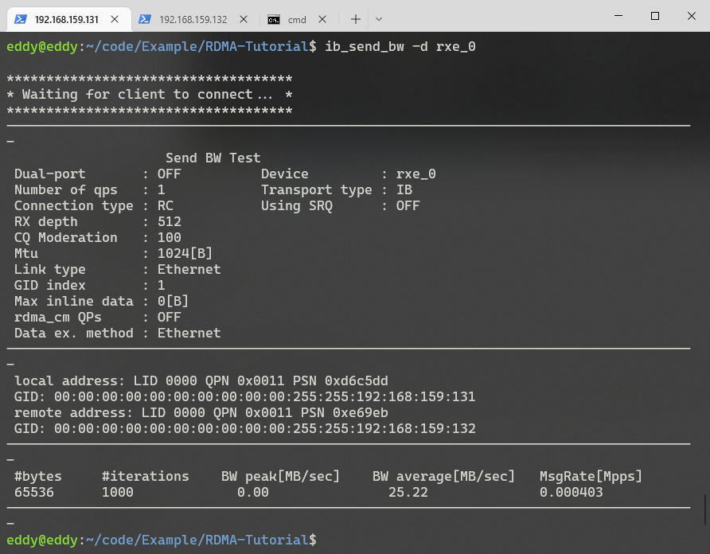
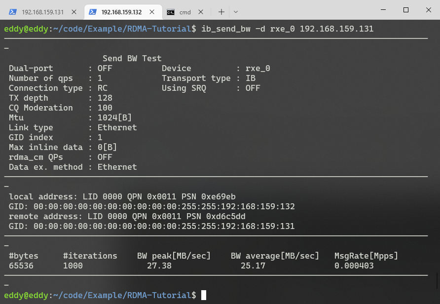
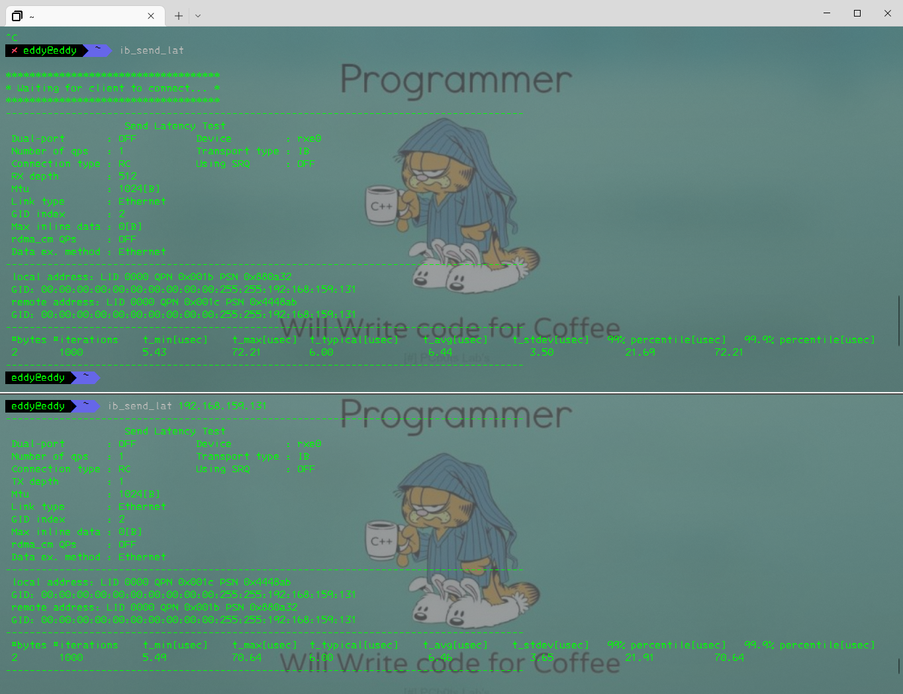

# preftest测试

perftest是一组基于uverbs编写的测试程序，是RDMA性能相关的micro-benchmark。可用于软硬件调优以及功能测试。


## 源码位置

[linux-rdma/perftest: Infiniband Verbs Performance Tests (github.com)](https://github.com/linux-rdma/perftest)

## 安装

直接安装preftest

```bash
sudo apt install perftest
```

```bash
Options:
  -a, --all  Run sizes from 2 till 2^23
  -b, --bidirectional  测量双向带宽（默认为单向）
  -c, --connection=  连接类型RC / XRC / UC / DC（默认RC）
  -d, --ib-dev=  使用IB设备（找到第一个默认设备）
  -D, --duration  在自定义的秒数内运行测试。
  -f, --margin  measure results within margins. (default=2sec)
  -F, --CPU-freq  即使已加载cpufreq_ondemand模块，并且cpu-freq不在最大值，也不会显示警告。
  -h, --help  Show this help screen.
  -i, --ib-port=  使用IB设备的端口<端口>（默认1）
  -I, --inline_size=  Max size of message to be sent in inline
  -l, --post_list= Post list of WQEs of size (instead of single post)
  -L, --hop_limit=  设置跳数限制值（对于IPv4 RawEth QP，为ttl）。值0-255（默认64）Set hop limit value (ttl for IPv4 RawEth QP). Values 0-255 (default 64)
  -m, --mtu=  MTU size : 256 - 4096 (default port mtu)
  -n, --iters=  交换次数（至少5次，默认为5000次）
  -N, --noPeak 取消峰值BW计算（默认情况下峰值不超过iters = 20000）
  -O, --dualport  在双端口模式下运行测试。（Run test in dual-port mode.）
  -p, --port=  Listen on/connect to port (default 18515)
  -q, --qp=  qp的数量（默认为1）
  -Q, --cq-mod  仅在<-cq-mod>完成后生成Cqe
  -R, --rdma_cm  Connect QPs with rdma_cm and run test on those QPs
  -s, --size=  （每个QP）交换消息的大小（默认为65536）
  -S, --sl=  SL (default 0)
  -t, --tx-depth=  发送队列（tx）的大小（默认为128）
  -T, --tos=  Set to RDMA-CM QPs. available only with -R flag. values 0-256 (default off)
  -u, --qp-timeout= QP超时，超时值为4 usec * 2 ^（超时），默认值为14
  -V, --version  显示版本号
  -w, --limit_bw=  设置验证器带宽限制(Set verifier limit for bandwidth)
  -x, --gid-index=  Test uses GID with GID index (Default : IB - no gid . ETH - 0)
  -y, --limit_msgrate=  Set verifier limit for Msg Rate
  -z, --com_rdma_cm  Communicate with rdma_cm module to exchange data - use regular QPs
 
      --cpu_util  在报告中显示CPU使用率，仅在持续时间模式下有效(Show CPU Utilization in report, valid only in Duration mode )
      --dlid  Set a Destination LID instead of getting it from the other side.
      --dont_xchg_versions  Do not exchange versions and MTU with other side 
      --force-link=  Force the link(s) to a specific type: IB or Ethernet.
      --ipv6  Use IPv6 GID. Default is IPv4
      --mmap=file  Use an mmap'd file as the buffer for testing P2P transfers.
      --mmap-offset=  Use an mmap'd file as the buffer for testing P2P transfers.
      --mr_per_qp  Create memory region for each qp.
      --odp  Use On Demand Paging instead of Memory Registration.
      --output=   设置详细度输出级别：带宽，message_rate，延迟 Set verbosity output level: bandwidth , message_rate, latency 
 Latency measurement is Average calculation 
      --perform_warm_up Perform some iterations before start measuring in order to warming-up memory cache, valid in Atomic, Read and Write BW tests
      --pkey_index= PKey index to use for QP
      --report-both  Report RX & TX results separately on Bidirectinal BW tests
      --report_gbits  Report Max/Average BW of test in Gbit/sec (instead of MB/sec)
        Note: MB=2^20 byte, while Gb=10^9 bits. Use these formulas for conversion:
        Factor=10^9/(20^2*8)=119.2; MB=Gb_result * factor; Gb=MB_result / factor
      --report-per-port  Report BW data on both ports when running Dualport and Duration mode
      --reversed  Reverse traffic direction - Server send to client
      --run_infinitely  永久运行测试，每隔秒打印结果
      --retry_count=  Set retry count value in rdma_cm mode
      --tclass=  Set the Traffic Class in GRH (if GRH is in use)
      --use_exp  Use Experimental verbs in data path. Default is OFF.
      --use_hugepages  Use Hugepages instead of contig, memalign allocations.
      --use_res_domain  Use shared resource domain
      --verb_type=  Set verb type: normal, accl. Default is normal.
      --wait_destroy=  Wait before destroying allocated resources (QP/CQ/PD/MR..)
 
 Rate Limiter:
      --burst_size= Set the amount of messages to send in a burst when using rate limiter
      --typical_pkt_size= Set the size of packet to send in a burst. Only supports PP rate limiter
      --rate_limit= Set the maximum rate of sent packages. default unit is [Gbps]. use --rate_units to change that.
      --rate_units= [Mgp] Set the units for rate limit to MBps (M), Gbps (g) or pps (p). default is Gbps (g).
        Note (1): pps not supported with HW limit.
        Note (2): When using PP rate_units is forced to Kbps.
      --rate_limit_type= [HW/SW/PP] Limit the QP's by HW, PP or by SW. Disabled by default. When rate_limit is not specified HW limit is Default.
        Note: in Latency under load test SW rate limit is forced
      --use_ooo  Use out of order data placement
```


## Send带宽测试

服务器端

```bash
ib_send_bw -d rxe_0
```



客户端

```bash
ib_send_bw -d rxe_0 <server_ip>
```



ib_send_bw是用来测试RDMA Send操作的带宽的程序（infiniband_send*bandwidth），其中*<server_ip>表示服务器端的IP，根据自己虚拟机对应关系填写。

可以看到BW peak为测试的峰值带宽信息。

```bash
 #bytes     #iterations    BW peak[MB/sec]    BW average[MB/sec]   MsgRate[Mpps]
 MSG大小     迭代次数         峰值速率             平均速率               包转发率
```

## Send延迟测试

服务器端

```bash
ib_send_lat -d rxe_0
```

客户端

```bash
ib_send_lat -d rxe_0 <server_ip>
```



ib_send_lat是用来测试RDMA Send操作的延迟的程序（infiniband_send*bandwidth），其中*<server_ip>表示服务器端的IP，根据自己虚拟机对应关系填写。

```bash
 #bytes #iterations    t_min[usec]    t_max[usec]  t_typical[usec]    t_avg[usec]    t_stdev[usec]   99% percentile[usec]   99.9% percentile[usec]
  MSG大小  迭代次数        延迟最小值      延迟最大值     典型值               
```

更改MTU大小

```bash
sudo ifconfig ens33 mtu 4200
```

将网卡端口MTU设置为1500，active_mtu将更改为1024

将网卡端口MTU设置为2200，active_mtu将更改为2048

将网卡端口MTU设置为4200，active_mtu将更改为4096

或指定配置项

```bash
ib_send_bw -R -d rxe0 -i 1 -a -s 1M -m 512
```

```bash
ib_send_bw -R -d rxe0 -i 1 192.168.159.131 -a -s 1M -m 512
```

设置QP数量

```bash
ib_send_bw -R -d rxe0 -i 1 -a -s 1M -m 512 -q 2
```

```bash
ib_send_bw -R -d rxe0 -i 1 192.168.159.131 -a -s 1M -m 512 -q 2
```


# 参考

[linux-rdma/perftest: Infiniband Verbs Performance Tests (github.com)](https://github.com/linux-rdma/perftest)

[在25G以太网环境下使用Perftest对RoCEv2性能进行测试 | 生命不息 折腾不止 (sysu.tech)](http://blog.sysu.tech/Benchmark/在25G以太网环境下使用Perftest对RoCEv2性能进行测试/)

[RDMA测试工具perftest简介 - 墨天轮 (modb.pro)](https://www.modb.pro/db/485278)

[监视并排除 IB 设备故障 - Oracle Solaris 管理：设备和文件系统](https://docs.oracle.com/cd/E26926_01/html/E25884/gjwwf.html)Oracle IB相关命令

[【RDMA】RDMA通信测试工具|perftest_rdma测试_bandaoyu的博客-CSDN博客](https://blog.csdn.net/bandaoyu/article/details/115798045)
