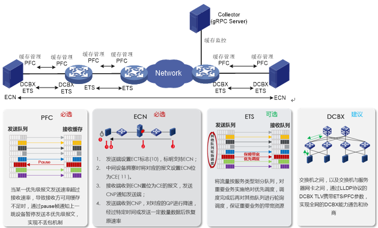
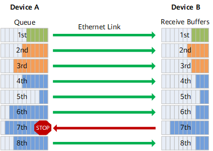
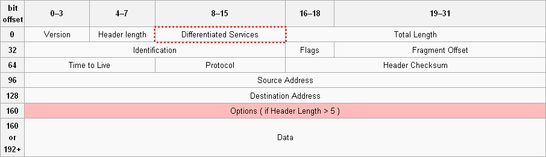
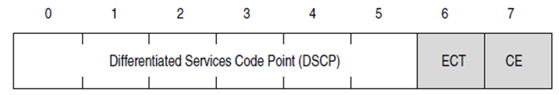
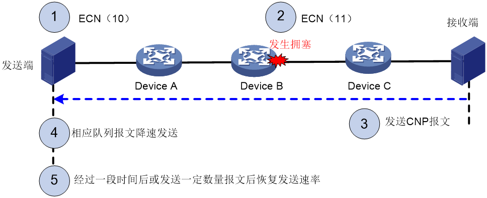

# 网络拥塞管理（PFC、ECN）

RDMA 对于网络丢包异常敏感，丢包引起的大量重传（Go-back-N）会导致吞吐性能急剧下降，而RoCE v2是一种基于无连接的UDP协议，缺乏完善的丢包保护机制。构建无损以太网数据中心RoCE在RoCE网络中，我们需要构建无损以太网用于保证数据中心网络传输过程中不丢包。构建无损以太网需支持以下关键特性：

RoCE融合InfiniBand的低时延与以太网的简单和向后兼容，实现零丢包、低时延、大带宽。

智能无损网络一方面通过流量控制技术和拥塞控制技术来提升网络整体的吞吐量，降低网络时延，另一方面通过智能无损存储网络等技术实现网络和应用系统融合优化。

构建无损以太网示意图

> 图片引用自[无损网络数据中心应用概述_通信世界网 (cww.net.cn)](http://www.cww.net.cn/article?id=461985)

流控发展：FC（整个链路流控）-->PFC（基于优先级流控）-->PFC+ECN（流控发生前避免拥塞）/PFC+ETS（分配带宽）+ECN；

## PFC原理

PFC 是构建无损以太网的必选手段之一，能够逐跳提供基于优先级的流量控制。设备在进行报文转发时，根据报文的优先级进入对应映射关系的队列中进行调度转发。当某一优先级报文发送速率超过接收速率，导致接收方可用数据缓冲空间不足时，设备通过PFC PAUSE帧反馈给上一跳设备，上一跳设备收到PAUSE帧报文后停止发送本优先级报文，直到再收到PFC XON帧或经过一定的老化时间后才能恢复流量发送。通过使用PFC功能，使得某种类型的流量拥塞不会影响其他类型流量的正常转发，从而达到同一链路上不同类型的报文互不影响。

智能无损网络基于PFC机制提供了智能化拥塞控制技术，可以解决传统以太网络拥塞丢包、时延大的约束，为RoCEv2分布式应用提供“无丢包、低时延、高吞吐”的网络环境，满足分布式应用的高性能需求。

`PFC`（Priority-based Flow Control，基于优先级的流量控制）也称为 `Per Priority Pause` 或 `CBFC`（Class Based Flow Control），是对 Pause 机制的一种增强。当前以太 Pause 机制（IEEE 802.3 Annex 31B）也能达到无丢包的要求，原理如下：当下游设备发现接收能力小于上游设备的发送能力时，会主动发 Pause 帧给上游设备，要求暂停流量的发送，等待一定时间后再继续发送数据。但是以太 Pause 机制的流量暂停是针对整个接口，即在出现拥塞时会将链路上所有的流量都暂停。

而 `PFC` 允许在一条以太网链路上创建8个虚拟通道，并为每条虚拟通道指定一个优先等级，允许单独暂停和重启其中任意一条虚拟通道，同时允许其它虚拟通道的流量无中断通过。这一方法使网络能够为单个虚拟链路创建无丢包类别的服务，使其能够与同一接口上的其它流量类型共存。

PFC工作机制

> 图片引用自[PFC优先级流量控制 - CloudEngine 12800, 12800E V200R005C10 配置指南-智能无损网络 - 华为 (huawei.com)](https://support.huawei.com/enterprise/zh/doc/EDOC1100075566/d1e17776)

如上图所示，DeviceA 发送接口分成了8个优先级队列，DeviceB 接收接口有8个接收缓存（buffer），两者一一对应（报文优先级和接口队列存在着一一对应的映射关系），形成了网络中 8 个虚拟化通道，缓存大小不同使得各队列有不同的数据缓存能力。

当 DeviceB 的接口上某个接收缓存产生拥塞时，即某个设备的队列缓存消耗较快，超过一定阈值（可设定为端口队列缓存的 1/2、3/4 等比例），DeviceB 即向数据进入的方向（上游设备 DeviceA）发送反压信号“STOP”。

DeviceA 接收到反压信号，会根据反压信号指示停止发送对应优先级队列的报文，并将数据存储在本地接口缓存。如果 DeviceA 本地接口缓存消耗超过阈值，则继续向上游反压，如此一级级反压，直到网络终端设备，从而消除网络节点因拥塞造成的丢包。

PFC（Priority based Flow Control）是在交换机入口（ingress port）发起的拥塞管理机制。在通常无拥塞情况下，交换机的入口 buffer 不需要存储数据。当交换机出口（egress port）的 buffer 达到一定的阈值时，交换机的入口 buffer 开始积累，当入口 buffer 达到我们设定的阈值时，交换机入口开始主动的迫使它的上级端口降速。由于 PFC 是基于优先级的控制，所以这种反压可能导致同样优先级的应用都受到影响。如图7所示。

### PFC 协议

PFC 允许在每个优先级的基础上执行链路流量控制。 特别地，PFC 用于抑制在指定时间段内传输与一个或多个优先级相关的数据帧。 可以对链路上的某些优先级启用 PFC，而对其他优先级禁用 PFC。

#### PFC 帧格式

PFC帧格式

| 项                     | 描述                                                         |
| ---------------------- | ------------------------------------------------------------ |
| Destination address    | 目的MAC地址，取值固定为01-80-c2-00-00-01。                   |
| Source address         | 源MAC地址。                                                  |
| Ethertype              | 以太网帧类型，取值为8808。                                   |
| Control opcode         | 控制码，取值为0101。                                         |
| Priority enable vector | 反压使能向量。                                               |
| Time(0)～Time(7)       | 其中E(n)和优先级队列n对应，表示优先级队列n是否需要反压。当E(n)=1时，表示优先级队列n需要反压，反压时间为Time(n)；当E(n)=0时，则表示该优先级队列不需要反压。 |
| Pad                    | 预留。传输时为0。                                            |
| CRC                    | 循环冗余校验。                                               |

## ECN原理

ECN 是构建无损以太网的必选手段之一。ECN定义了一种基于 **IP层及传输层** 的流量控制及端到端拥塞通知机制。ECN功能 **利用IP报文头中的DS域来标记报文传输路径上的拥塞状态** 。支持该功能的终端设备可以通过报文内容判断出传输路径上发生了拥塞，从而调整报文的发送方式，避免拥塞加剧。

ECN（Explicit Congestion Notification） 是在交换机出口（egress port）发起的拥塞控制机制。当交换机的出口 buffer 达到我们设定的阈值时，交换机会改变数据包头中的 ECN 位来给数据打上 ECN 标签，当带 ECN 标签的数据到达接收端以后，接收端会生成 CNP（Congestion Notification Packet）并将它发送给发送端，CNP 包含了导致拥塞的 flow 或 QP 的信息，当接收端收到 CNP 后，会采取措施降低发送速度。可见 ECN 是基于TCP flow 或 RDMA QP 的拥塞控制机制，它只对导致拥塞的 fow 或 QP 起作用，不会影响到其他的应用。

IP 报文 DS 域位置信息

> 图片引用自[H3C无损网络最佳实践-6W100-新华三集团-H3C](http://www.h3c.com/cn/Service/Document_Software/Document_Center/Home/Public/00-Public/Configure/Practice/H3C-73/?CHID=621081#_Toc87964019)

ECN域位置信息

> 图片引用自[H3C无损网络最佳实践-6W100-新华三集团-H3C](http://www.h3c.com/cn/Service/Document_Software/Document_Center/Home/Public/00-Public/Configure/Practice/H3C-73/?CHID=621081#_Toc87964019)

ECN 功能对IP报文头中DS域的最后两个比特位（称为ECN域）进行了如下定义：

* 比特位6用于标识发送端设备是否支持ECN功能，称为ECT位（ECN-Capable Transport）；

* 比特位7用于标识报文在传输路径上是否经历过拥塞，称为CE位（Congestion Experienced）；

ECN 含义：

| ECT  | CE   | 含义      |
| ---- | ---- | --------- |
| 0    | 0    | 不支持ECN |
| 0    | 1    | 支持ECN   |
| 1    | 0    | 支持ECN   |
| 1    | 1    | 发送拥塞  |

在设备上开启 ECN 功能后，拥塞管理功能将按如下方式对报文进行处理：

* 如果队列长度小于下限，不丢弃报文，也不对 ECN 域进行识别和标记。
* 如果队列长度在上限和下限之间，当设备根据丢弃概率计算出需要丢弃某个报文时，将检查该报文的ECN域。如果ECN域显示该报文由支持ECN的终端发出，设备会将报文的ECT位和CE位都标记为1，然后转发该报文；如果ECN域显示报文传输路径中已经经历过拥塞（即ECT和CE位都为1），则设备直接转发该报文，不对ECN域进行重新标记；如果ECT位和CE位都为0，设备会将该报文丢弃。
* 如果队列长度超过上限，将队列中所有报文的ECN域都标记为11，当队列长度达到队列尾丢弃门限后,报文将被丢弃。

**注意**：在实际应用中，设备将 ECT 位为1、CE 位为0的报文，以及 ECT 位为0，CE 位为1的报文都识别为由支持 ECN 功能的终端发出的报文。

### ECN交互过程

* 发送端设置 ECN 域为 10，告知路径上的设备及接收端，发送端设备支持 ECN 功能。
* 中间设备发生拥塞并达到门限，拥塞设备将发生拥塞的报文 ECN 域设置为11，报文正常转发。
* 接收端收到 ECN 置位为 11 的报文，由传输层发送 CNP（Congestion Notification Packet，拥塞通知报文）通知发送端。
* 发送端收到 CNP 报文，对对应的优先级的队列进行降速处理。
*  经过一段可配置的时间或者发送一定数量数据，发送端恢复原来的速率。

ECN工作机制示意图

> 图片引用自[H3C无损网络最佳实践-6W100-新华三集团-H3C](http://www.h3c.com/cn/Service/Document_Software/Document_Center/Home/Public/00-Public/Configure/Practice/H3C-73/?CHID=621081#_Toc87964019)

总的来说，ECN 技术能够对于拥塞流量进行精确标记以便于精准降速，同时降速可做到**较为温和平稳**，但是本身**反应速度较慢**，因此当网络中存在比较高的微突发和剧烈的拥塞时，可能来不及降速已经出现了丢包，因此通常需要使能 Fast ECN、Fast CNP 等辅助技术。**PFC 技术则降速反应较快**，能够**迅速解除拥塞情况**，但由于其只能基于优先级进行降速，容易影响和拥塞无关的 Victim 流量且会造成大范围流量震荡，存在 HOL 和 PFC 死锁等问题，一般在网络配置中应尽量少的触发 PFC 机制，仅将其作为最后的保障手段。在此基础上，PFC 和 ECN 的水线设置同样需要根据具体场景进行确定。以 ECN 为例，当拥塞较少且较为轻微时，ECN 水线设置过低会导致更多的报文被标记，导致源端过度降速，吞吐指标劣化。而当突发和拥塞较为严重时，如果 ECN 水线设置过高，可能导致降速不及时而出现丢包或触发 PFC机制，同时队列深度较深，会使得时延指标劣化。

# 参考

[无损网络数据中心应用概述_通信世界网 (cww.net.cn)](http://www.cww.net.cn/article?id=461985)

[互联网技术详解 | 智能无损以太网助力分布式存储的部署与创新（三）-新华三集团-H3C](http://www.h3c.com/cn/d_202210/1711346_30008_0.htm)

[PFC优先级流量控制 - CloudEngine 12800, 12800E V200R005C10 配置指南-智能无损网络 - 华为 (huawei.com)](https://support.huawei.com/enterprise/zh/doc/EDOC1100075566/d1e17776)

[RDMA之无损网络_咸鱼弟的博客-CSDN博客_ecn qp](https://blog.csdn.net/u013253075/article/details/120331719)

[统一的以太无损网络测试技术白皮书v2.0-2020.11.19 - 道客巴巴 (doc88.com)](https://www.doc88.com/p-25829298673562.html)

[Priority Flow control (PFC)](https://youtu.be/-jFESrf7zDU?t=302) PFC time class含义讲解。

[【PFC】pfctest PFC测试工具_bandaoyu的博客-CSDN博客_%ce'pfcinstalltest'不能检索。](https://blog.csdn.net/bandaoyu/article/details/118095604)

[Priority Flow Control (PFC) - Onyx v3.9.1014 - NVIDIA Networking Docs](https://docs.nvidia.com/networking/pages/viewpage.action?pageId=34250153) 迈络思交换机PFC配置手册

[802.1Qbb-2011 - IEEE Standard for Local and metropolitan area networks--Media Access Control (MAC) Bridges and Virtual Bridged Local Area Networks--Amendment 17: Priority-based Flow Control | IEEE Standard | IEEE Xplore](https://ieeexplore.ieee.org/document/6032693) IEEE 802.1qbb 协议规范