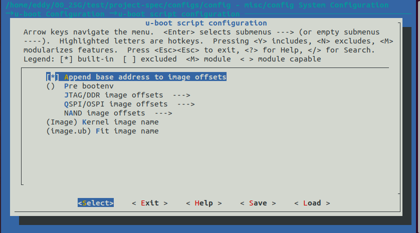
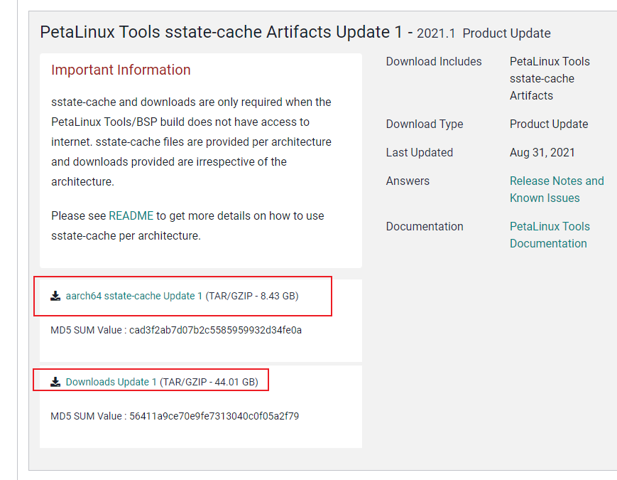
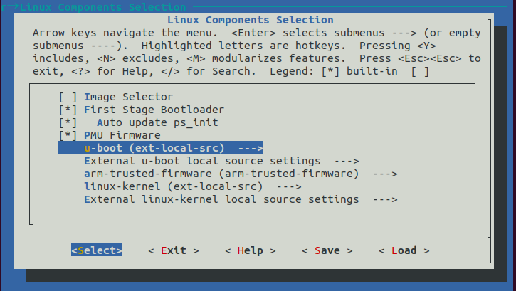
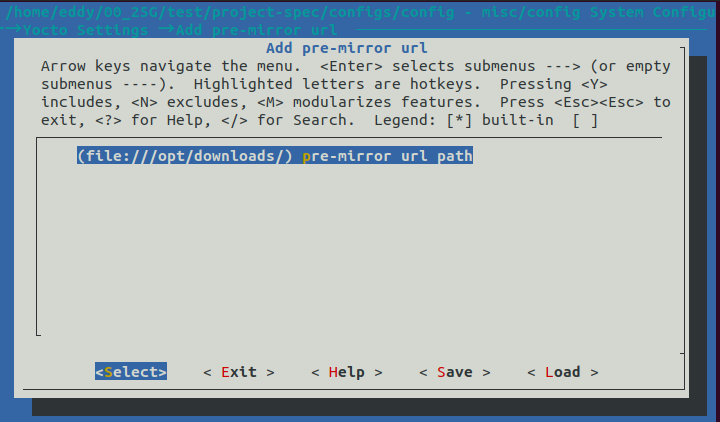
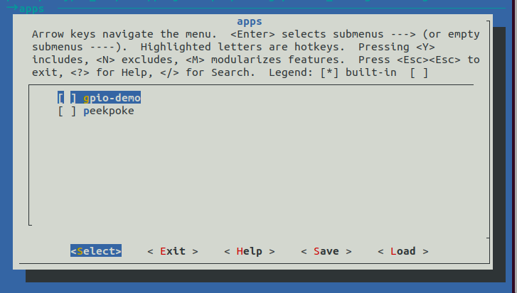

# 安装petalinux2022.2

1. 安装依赖包

```bash
sudo apt-get install iproute2 gawk python3 python build-essential gcc git make net-tools libncurses5-dev tftpd zlib1g-dev libssl-dev flex bison libselinux1 gnupg wget git-core diffstat chrpath socat xterm autoconf libtool tar unzip texinfo zlib1g-dev gcc-multilib automake zlib1g:i386 screen pax gzip cpio python3-pip python3-pexpect xz-utils debianutils iputils-ping python3-git python3-jinja2 libegl1-mesa libsdl1.2-dev pylint3 libtinfo5
```

2. 更改文件夹权限

```bash
sudo mkdir petalinux2022.2
sudo chmod 777 petalinux2022 ./
```

3. 下载`petalinux2022.2`安装包

地址：[Downloads (xilinx.com)](https://www.xilinx.com/support/download/index.html/content/xilinx/en/downloadNav/embedded-design-tools.html)

4. 更改默认shell🔥

```bash
bash
```

5. 安装

```bash
./petalinux-v2022.2-10141622-installer.run -d ./petalinux2022.2
```

安装过程需要同意许可信息，输入三次y。

# qemu启动

参考《ug1144-petalinux-tools-reference-guide.pdf》

## 1. 生成.BIN镜象

粘贴相应的`.bit`至`plnx-proj-root/images/linux/`

```bash
cd <plnx-proj-root>
petalinux-package --boot --format BIN --fsbl --u-boot --pmufw --fpga ./images/linux/design_1_wrapper.bit --force
```

## 2. 封装预构建镜像

```bash
petalinux-package --prebuilt --fpga ./images/linux/design_1_wrapper.bit --force
```

## 3. 启动qemu

```bash
petalinux-boot --qemu --prebuilt 3
```

注意：若使用`petalinux2021`启动qemu需要在xilinx官网下载某个版本的`.bsp`，将其中的`pmu_rom_qemu_sha3.elf` 拷贝到`<plnx-proj-root>/pre-built/linux/images`下。

```bash
eddy@eddy:~/00_25G/test$ petalinux-boot --qemu --prebuilt 3
[INFO] Sourcing buildtools
INFO: No DTB has been specified, use the default one "/home/eddy/00_25G/test/pre-built/linux/images/system.dtb".
INFO: No DTB has been specified, use the default one "/home/eddy/00_25G/test/pre-built/linux/images/system.dtb".
INFO: Starting microblaze QEMU
INFO: Starting the above QEMU command in the background
INFO:  qemu-system-microblazeel -M microblaze-fdt   -serial mon:stdio -serial /dev/null -display none -kernel /home/eddy/00_25G/test/pre-built/linux/images/pmu_rom_qemu_sha3.elf -device loader,file=/home/eddy/00_25G/test/pre-built/linux/images/pmufw.elf      -hw-dtb /home/eddy/00_25G/test/pre-built/linux/images/zynqmp-qemu-multiarch-pmu.dtb -machine-path /tmp/tmp.zRXyRZk5bx -device loader,addr=0xfd1a0074,data=0x1011003,data-len=4 -device loader,addr=0xfd1a007C,data=0x1010f03,data-len=4 
qemu-system-microblazeel: Failed to connect socket /tmp/tmp.zRXyRZk5bx/qemu-rport-_pmu@0: No such file or directory
qemu-system-microblazeel: info: QEMU waiting for connection on: disconnected:unix:/tmp/tmp.zRXyRZk5bx/qemu-rport-_pmu@0,server
INFO: TCP PORT is free 
INFO: Starting aarch64 QEMU
INFO:  qemu-system-aarch64 -M arm-generic-fdt   -serial /dev/null -serial mon:stdio -display none -device loader,file=/home/eddy/00_25G/test/pre-built/linux/images/bl31.elf,cpu-num=0 -device loader,file=/home/eddy/00_25G/test/pre-built/linux/images/rootfs.cpio.gz.u-boot,addr=0x04000000,force-raw -device loader,file=/home/eddy/00_25G/test/pre-built/linux/images/u-boot.elf -device loader,file=/home/eddy/00_25G/test/pre-built/linux/images/Image,addr=0x00200000,force-raw -device loader,file=/home/eddy/00_25G/test/pre-built/linux/images/system.dtb,addr=0x00100000,force-raw -device loader,file=/home/eddy/00_25G/test/pre-built/linux/images/boot.scr,addr=0x20000000,force-raw -gdb tcp::9000   -net nic,netdev=eth0 -netdev user,id=eth0,tftp=/tftpboot -net nic -net nic -net nic -net nic   -hw-dtb /home/eddy/00_25G/test/pre-built/linux/images/zynqmp-qemu-multiarch-arm.dtb -machine-path /tmp/tmp.zRXyRZk5bx -global xlnx,zynqmp-boot.cpu-num=0 -global xlnx,zynqmp-boot.use-pmufw=true   -m 4G
QEMU 5.1.0 monitor - type 'help' for more information
(qemu) qemu-system-aarch64: warning: hub port hub0port3 has no peer
qemu-system-aarch64: warning: hub 0 is not connected to host network
qemu-system-aarch64: warning: netdev hub0port3 has no peer
qemu-system-aarch64: warning: requested NIC (__org.qemu.net4, model unspecified) was not created (not supported by this machine?)
PMU Firmware 2021.1	Jun  6 2021   07:07:32
PMU_ROM Version: xpbr-v8.1.0-0
NOTICE:  ATF running on XCZUUNKN/QEMU v4/RTL0.0 at 0xfffea000
NOTICE:  BL31: v2.4(release):xlnx_rebase_v2.4_2021.1_update1
NOTICE:  BL31: Built : 08:27:07, Apr 28 2021

```


## 打包BSP

```bash
petalinux-package --bsp -p 2021-25-mcdma/ --hwsource eth_25g_2021-3-8/ -o 2021-25-mcdma.bsp --force
```

`psu_init` 是FSBL中的一个函数，用于初始化PS端

# petalinux qemu 调试linux内核

1. 启动`qemu`

   ```bash
   petalinux-boot --qemu --prebuilt 3
   ```

2. 进入`<plnx-proj-root>image/linux`文件夹

3. 进行`gdb`调试

   ```bash'
   petalinux-util --gdb vmlinux
   ```
   

[gdb 调试 Linux 内核网络源码（附视频） (wenfh2020.com)](https://wenfh2020.com/2021/05/19/gdb-kernel-networking/)

## 调试步骤[^6]

可参考《ug1144-petalinux-tools-reference-guide.pdf》 Debugging节 

1. 启动qemu

1. 执行gdb调试命令

```bash
petalinux-util --gdb vmlinux
```

# 创建`zynqMP`自定义工程[^1]

## 创建`.xsa`文件

使用`Vivado`创建工程并生成`xsa`文件

## 创建自定义工程

```bash
petalinux-create -t project --template zynqMP --name <name>
```

## 工程配置

```bash
$ cd <plnx-proj-root>
petalinux-config --get-hw-description <name>.xsa

petalinux-config
#默认配置

petalinux-config -c kernel
#配置内核

petalinux-config -c rootfs
#配置文件系统

petalinux-config -c u-boot
#配置u-boot
```

对构建的工程进行实际的配置

### 配置启动地址信息

进入`u-boot Configuration  --->` `u-boot script configuration  --->`根据启动方式以及各文件大小进行配置。



## 工程编译

```bash
cd <plnx-proj-root>
petalinux-build
#整个工程编译，编译后生成image.ub

petalinux-build -c kernel
#编译内核

petalinux-build -c rootfs
#编译文件系统

petalinux-build -c u-boot
#编译u-boot

petalinux-build -x distclean
#清空编译后产生的临时文件和下载的sstate cache文件

petalinux-build -x mrproper
#清空所有的临时文件，<PROJECT>/images/,  <PROJECT>/build/  and <PROJECT>/components/plnx_workspace/ directories


"petalinux-build -x package" 是 PetaLinux 工具的命令，它用于构建 PetaLinux 项目。PetaLinux 是一个用于嵌入式设备的 Linux 发行版，由 Xilinx 公司开发。PetaLinux 提供了一些工具和命令，用于构建、调试和定制 Linux 系统。其中 "petalinux-build" 就是用于构建 PetaLinux 项目的命令，而 "-x package" 则表示只构建指定的软件包。

#打包到image.ub

petalinux-build -c mymodule -x do_cleansstate
#清除用户模块
```

### 离线编译工程配置

下载离线包[Downloads (xilinx.com)](https://www.xilinx.com/support/download/index.html/content/xilinx/en/downloadNav/embedded-design-tools/archive.html)



下载上述两个压缩包。

当前环境为 petalinux2021.1 设备为`250soc` （xilinx ）

```bash
$ cd <plnx-proj-root>
petalinux-config --get-hw-description <name>.xsa
```

进入`Linux Components Selection`  ---> `u-boot（u-boot-xlinx）`以及`linux-kernel`均选择`ext-local-src`，配置离线编译包。




进入`Subsystem AUTO Hardware Settings  --->` `Serial Settings  --->` 将串口均选择为`psu_uart_1`


原因是根据`.xsa`生成的设备树中将`uart1`配到了设备的`serial0`。


若要使用`qemu`启动，此步骤可空过，若使用板子启动需要将这里的`INITRAMFS/INITRD Image name`更改为如下`petalinux-image-minimal`，若更改后使用qemu启动会出现[ERROR /dev](#dev)的错误。


配置离线包

进入`Yocto Settings  --->` `Add pre-mirror url   ---> ` 更改为下载的离线包的位置



注意：这里需要在最前面加上`file://`。

配置`sstate`：


其他配置可根据情况修改。推出前需保存。

注意：若中途需要远程下载相应的app或者包文件，需要是能开启`Enable Network sstate feeds`。防止编译报错。

若存在`app`或`packages`，需要进入文件系统配置中添加相应的选项。

```bash
petalinux-config -c rootfs
```



进入`build/conf`编辑`local.conf`


配置完成后若想加`app`或者`packages`，需要在`project-spec`对应的`mate-user`中添加自己的文件，或有现成的`mate-user`，直接将此文件夹进行替换即可。

配置完成后即可进行编译。

## 创建自定义模块

```bash
$ cd <plnx-proj-root>
petalinux-create -t modules --name <user-module-name> --enable

petalinux-create -t apps --template c --name myapp --enable
```


# JTAG烧写

## `.tcl`文件

```bash
#connect
fpga -no-revision-check -f design_1_wrapper.bit
after 2000
targets -set -filter {name =~ "PSU"} 
mask_write 0xFFCA0038 0x1C0 0x1C0
after 500
#Load and run PMUFW
targets -set -filter {name =~ "MicroBlaze PMU"} 
dow pmu-firmware-250soc-zynqmp.elf
con
after 500
#Reset A53, load and run FSBL
targets -set -filter {name =~ "PS8" || name =~ "PSU"}
mwr 0xffff0000 0x14000000;mask_write 0xFD1A0104 0x501 0x0	
targets -set -filter {name =~ "Cortex-A53 #0"} 
source psu_init.tcl
dow fsbl-250soc-zynqmp.elf
con 
#Give FSBL time to run
after 5000
stop
psu_ps_pl_isolation_removal; psu_ps_pl_reset_config
after 500
dow u-boot.elf 
after 500
dow arm-trusted-firmware.elf
after 500
con
after 2000
dow -data image.ub 0x8000000

```


# 常见问题

## `boot.src`文件

`boot.src` 文件是一个包含启动指令的文本文件，用于在 U-Boot 环境中设置启动选项和执行启动操作。该文件通常包含一些环境变量设置、内存和设备初始化、加载内核映像和设备树文件等操作。

`connfig`文件启动地址信息相关配置：

```bash
#
# JTAG/DDR image offsets
#
CONFIG_SUBSYSTEM_UBOOT_DEVICETREE_OFFSET=0x100000
CONFIG_SUBSYSTEM_UBOOT_KERNEL_OFFSET=0x200000
CONFIG_SUBSYSTEM_UBOOT_RAMDISK_IMAGE_OFFSET=0x4000000
CONFIG_SUBSYSTEM_UBOOT_FIT_IMAGE_OFFSET=0x10000000

#
# QSPI/OSPI image offsets
#
CONFIG_SUBSYSTEM_UBOOT_QSPI_KERNEL_OFFSET=0xF00000
CONFIG_SUBSYSTEM_UBOOT_QSPI_KERNEL_SIZE=0x1D00000
CONFIG_SUBSYSTEM_UBOOT_QSPI_RAMDISK_OFFSET=0x4000000
CONFIG_SUBSYSTEM_UBOOT_QSPI_RAMDISK_SIZE=0x4000000
CONFIG_SUBSYSTEM_UBOOT_QSPI_FIT_IMAGE_OFFSET=0xF40000
CONFIG_SUBSYSTEM_UBOOT_QSPI_FIT_IMAGE_SIZE=0x6400000

#
# NAND image offsets
#
CONFIG_SUBSYSTEM_UBOOT_NAND_KERNEL_OFFSET=0x4100000
CONFIG_SUBSYSTEM_UBOOT_NAND_KERNEL_SIZE=0x3200000
CONFIG_SUBSYSTEM_UBOOT_NAND_RAMDISK_OFFSET=0x7800000
CONFIG_SUBSYSTEM_UBOOT_NAND_RAMDISK_SIZE=0x3200000
CONFIG_SUBSYSTEM_UBOOT_NAND_FIT_IMAGE_OFFSET=0x4180000
CONFIG_SUBSYSTEM_UBOOT_NAND_FIT_IMAGE_SIZE=0x6400000
CONFIG_SUBSYSTEM_UBOOT_KERNEL_IMAGE="Image"
CONFIG_SUBSYSTEM_UBOOT_FIT_IMAGE="image.ub"
# CONFIG_SUBSYSTEM_UBOOT_EXT_DTB is not set
```


```bash
'V\8i+M\9B\9E\F0\00\00	\E2\00\00\00\00\00\00\00\00\85w\9Cr\00Boot script\00\00\00\00\00\00\00\00\00\00\00\00\00\00\00\00\00\00\00\00\00\00\00	\DA\00\00\00\00# This is a boot script for U-Boot
# Generate boot.scr:
# mkimage -c none -A arm -T script -d boot.cmd.default boot.scr
#
################


for boot_target in ${boot_targets};
do
	echo "Trying to load boot images from ${boot_target}"
	if test "${boot_target}" = "jtag" ; then
		booti 0x00200000 0x04000000 0x00100000
	fi
	if test "${boot_target}" = "mmc0" || test "${boot_target}" = "mmc1" ; then
		if test -e ${devtype} ${devnum}:${distro_bootpart} /uEnv.txt; then
			fatload ${devtype} ${devnum}:${distro_bootpart} 0x00200000 uEnv.txt;
			echo "Importing environment(uEnv.txt) from ${boot_target}..."
			env import -t 0x00200000 $filesize
			if test -n $uenvcmd; then
				echo "Running uenvcmd ...";
				run uenvcmd;
			fi
		fi
		if test -e ${devtype} ${devnum}:${distro_bootpart} /image.ub; then
			fatload ${devtype} ${devnum}:${distro_bootpart} 0x10000000 image.ub;
			bootm 0x10000000;
                fi
		if test -e ${devtype} ${devnum}:${distro_bootpart} /Image; then
			fatload ${devtype} ${devnum}:${distro_bootpart} 0x00200000 Image;;
		fi
		if test -e ${devtype} ${devnum}:${distro_bootpart} /system.dtb; then
			fatload ${devtype} ${devnum}:${distro_bootpart} 0x00100000 system.dtb;
		fi
		if test -e ${devtype} ${devnum}:${distro_bootpart} /ramdisk.cpio.gz.u-boot && test "${skip_tinyramdisk}" != "yes"; then
			fatload ${devtype} ${devnum}:${distro_bootpart} 0x04000000 ramdisk.cpio.gz.u-boot;
			booti 0x00200000 0x04000000 0x00100000
		fi
		if test -e ${devtype} ${devnum}:${distro_bootpart} /rootfs.cpio.gz.u-boot && test "${skip_ramdisk}" != "yes"; then
			fatload ${devtype} ${devnum}:${distro_bootpart} 0x04000000 rootfs.cpio.gz.u-boot;
			booti 0x00200000 0x04000000 0x00100000
		fi
		booti 0x00200000 - 0x00100000
	fi
	if test "${boot_target}" = "xspi0" || test "${boot_target}" = "qspi" || test "${boot_target}" = "qspi0"; then
		sf probe 0 0 0;
		sf read 0x10000000 0xF40000 0x6400000
		bootm 0x10000000;
		echo "Booting using Fit image failed"

		sf read 0x00200000 0xF00000 0x1D00000
		sf read 0x04000000 0x4000000 0x4000000
		booti 0x00200000 0x04000000 0x00100000;
		echo "Booting using Separate images failed"
	fi
	if test "${boot_target}" = "nand" || test "${boot_target}" = "nand0"; then
		nand info;
		nand read 0x10000000 0x4180000 0x6400000
		bootm 0x10000000;
		echo "Booting using Fit image failed"

		nand read 0x00200000 0x4100000 0x3200000
		nand read 0x04000000 0x7800000 0x3200000
		booti 0x00200000 0x04000000 0x00100000;
		echo "Booting using Separate images failed"
	fi
done
```


## petalinux 2022.2编译工程，显示bitbake版本不兼容[^2]

```bash
$PETALINUX/components/yocto/buildtools/sysroots/x86_64-petalinux-linux/usr/bin/python3 ./components/yocto/layers/core/scripts/contrib/convert-overrides.py ./project-spec/meta-user/
```

错误[^5]

```bash
[   52.763091] alloc_netdev: Unable to allocate device with zero queues
[   52.793075] xilinx_axienet: probe of a0010000.ethernet failed with error -12
```


```bash
25g-3-6$ petalinux-config --get-hw-description eth25g_wrapper.xsa 
[INFO] Sourcing buildtools
INFO: Getting hardware description...
INFO: Renaming eth25g_wrapper.xsa to system.xsa
[INFO] Generating Kconfig for project
ERROR: Failed to generate /home/pdc/00-petalinux-workspace/25g-3-6/build/misc/config/Kconfig.syshw
ERROR: Failed to Kconfig project
ERROR: Failed to generate System hardware Kconfig file.
```

解决方法

```bash
sudo apt-get install libtinfo5
```

## ERROR /dev <a name="dev"/>

```bash
ERROR: There's no '/dev' on rootfs
```

[ERROR: There's no '/dev' on rootfs (xilinx.com)](https://support.xilinx.com/s/question/0D52E00006hprw1SAA/error-theres-no-dev-on-rootfs?language=en_US)

```bash
petalinux-config -> Image packaging configuration -> INITRAMFS/INITRD Image name -> petalinux-image-minimal
```

## 指定源码路径

```bash
set substitute-path <当前搜索路径> <指的搜索路径>
set substitute-path /usr/src/kernel /opt/linux-xlnx-xilinx-v2021.1
```

## 打包`BOOT.BIN`出现`Section image.ub.0 offset of 0x242C0 overlaps with prior section end address of 242C0C0`

```bash
***** Xilinx Bootgen v2021.1
  **** Build date : May 28 2021-21:36:22
    ** Copyright 1986-2021 Xilinx, Inc. All Rights Reserved.

[ERROR]  : Section image.ub.0 offset of 0x242C0 overlaps with prior section end address of 242C0C0
ERROR: Fail to create BOOT image
```

指定`kernel`的`offset`地址:

```bash
petalinux-package --boot --format BIN --kernel --offset 0x0242d000 --fsbl --u-boot --pmufw --fpga ./images/linux/design_1_wrapper.bit --force
```

## `qspi`启动后无法自动跳转至`kernel`

```bash
#flash读取至ddr    目的地址   kernel源地址   长度
$zynqMP:sf read 0x80000000 0x0242d000 0x2800000

$zynqMP:booti 0x80000000
```

## fit image


在 Petalinux 配置中，QSPI/OSPI FIT 映像是指在 QSPI/OSPI NOR Flash 上存储的 FIT 映像。FIT 映像是一种灵活的引导映像格式，可以包含多个镜像文件（如内核、设备树、文件系统等），并且可以根据需要进行配置。

根据上述文件在uboot阶段可以使用以下代码启动`kernel`

```bash
$zynqMP:sf read 0x10000000 0xF40000 0x6400000
$zynqMP:bootm 0x10000000
```

# 如何修改设备树[^3]

## 基于自动生成的设备树，添加或修改节点

通过修改`./project-spec/meta-user/recipes-bsp/device-tree/files/system-user.dtsi`，来实现对之前已经定义的设备树节点中的属性进行变更，也可以添加没有自动生成的设备树节点。

设备树语法可参考 《devicetree-specification.pdf》[^4]

设备树更改完成后需要执行以下命令

```bash
petalinux-build -c device-tree -x cleansstate
生成pl.dtsi
petalinux-config -c device-tree
petalinux-build -c device-tree
```

## 设备树反编译

```bash
$ cd <plnx-proj-root>/images/linux/
../../build/tmp/sysroots-components/x86_64/dtc-native/usr/bin/dtc -I dtb -O dts -o system.dts system.dtb
```


# 手册

PG332 ERNIC 手册

PG203 CMAC 手册

PG210 25G AXI Ethernet 手册

PG021 AXI-DMA手册

PG288 MCDMA手册

UG1085-Zynq-Ultrascale-trm 手册 250 SoC芯片手册

[Zynq UltraScale+ Devices Register Reference (xilinx.com)](https://www.xilinx.com/htmldocs/registers/ug1087/ug1087-zynq-ultrascale-registers.html) ug1085-Zynq-Ultrascale寄存器手册

UG1144 Petalinux Tools手册


错误

```bash
RROR: perftest-1.0-r0 do_compile: oe_runmake failed
ERROR: perftest-1.0-r0 do_compile: Execution of '/home/dpu/zjzhe/250soc_ernic/build/tmp/work/cortexa72-cortexa53-xilinx-linux/perftest/1.0-r0/temp/run.do_compile.180753' failed with exit code 1:
make  all-am
make[1]: Entering directory '/home/dpu/zjzhe/250soc_ernic/build/tmp/work/cortexa72-cortexa53-xilinx-linux/perftest/1.0-r0/git'
make[1]: *** No rule to make target '../../../umm/1.0-r0/libumm.so', needed by 'libperftest.a'.  Stop.

```

解决方法

```bash
dpu@dpu-PC:~/zjzhe/250soc_ernic/build/tmp/work/cortexa72-cortexa53-xilinx-linux/perftest/1.0-r0/git$ find ..// -name "libumm*"
..//recipe-sysroot/usr/lib/libumm.so.1.0
..//recipe-sysroot/usr/lib/libumm.so.1
..//recipe-sysroot/usr/lib/libumm.so
dpu@dpu-PC:~/zjzhe/250soc_ernic/build/tmp/work/cortexa72-cortexa53-xilinx-linux/perftest/1.0-r0$ ln -s ./recipe-sysroot/usr/lib/libumm.so ../../umm/1.0-r0/libumm.so

```


# 参考

[^1]:[PetaLinux - Public Docs - Trenz Electronic Wiki (trenz-electronic.de)](https://wiki.trenz-electronic.de/display/PD/PetaLinux) petalinux工程创建等使用

[^2]:[PetaLinux Yocto Tips - Xilinx Wiki - Confluence (atlassian.net)](https://xilinx-wiki.atlassian.net/wiki/spaces/A/pages/18842475/PetaLinux+Yocto+Tips) Yocto相关使用
[^3]:[Xilinx Petalinux工程设备树介绍](https://support.xilinx.com/s/article/1197597?language=zh_CN)
[^4]:[Releases · devicetree-org/devicetree-specification (github.com)](https://github.com/devicetree-org/devicetree-specification/releases?page=2)

[中断（一）：让 Linux 接收来自 PL 的自定义中断信号 (zynqnotes.com)](http://www.zynqnotes.com/pl-ps-interrupt) zynqMP PL2PS、PS2PL设备树中断配置

[^5]:[Linux AXI Ethernet driver - Xilinx Wiki - Confluence (atlassian.net)](https://xilinx-wiki.atlassian.net/wiki/spaces/A/pages/18842485/Linux+AXI+Ethernet+driver) Xlinx-AXI-Ethernet-driver相关说明

[^6]:[petalinux调试内核_StarLish0715的博客-CSDN博客](https://blog.csdn.net/baidu_37503452/article/details/80106440) 

[主页 • 文档门户 (xilinx.com)](https://docs.xilinx.com/) Xlinx 文档下载

[Xilinx/u-boot-xlnx: The official Xilinx u-boot repository (github.com)](https://github.com/Xilinx/u-boot-xlnx) xlinx维护的uboot

[Xilinx/linux-xlnx: The official Linux kernel from Xilinx (github.com)](https://github.com/Xilinx/linux-xlnx) xlinx维护的linux

[Petalinux2020.2 开发ZYNQ的AXI DMA - 知乎 (zhihu.com)](https://zhuanlan.zhihu.com/p/478422063) petalinux创建modules

[PetaLinux常用命令汇总 - schips - 博客园 (cnblogs.com)](https://www.cnblogs.com/schips/p/xilinx-petalinux-common-commands.html)

[ petalinux-package qspi启动镜像的问题_uimage_offset_边城1987的博客-CSDN博客](https://blog.csdn.net/u011529140/article/details/70800460)

[petalinux-package --boot --add --offset doesn't work as before (xilinx.com)](https://support.xilinx.com/s/question/0D52E00006hpeRTSAY/petalinuxpackage-boot-add-offset-doesnt-work-as-before?language=en_US)
