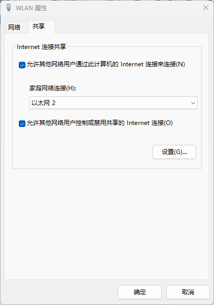
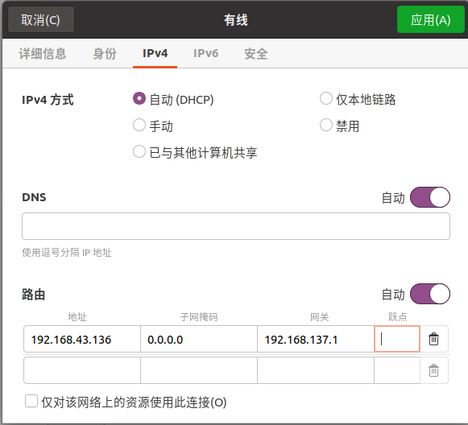

# Ubuntu常见问题解决方法

## Ubuntu只显示本地环回无法连接宿主机

```bash
# 先停止服务
sudo service network-manager stop
# 删除文件
sudo rm /var/lib/NetworkManager/NetworkManager.state
# 修改文件
sudo vim /etc/NetworkManager/NetworkManager.conf 把false改成true　
#重启服务器
sudo service network-manager start
```

## Ubuntu不显示网络连接

```bash
sudo nmcli networking off
sudo nmcli networking on
sudo service network-manager restart
```

## ubuntu网络显示未托管

1、修改`/etc/NetworkManager/NetworkManager.conf`，将`managed=false`改为`managed=true`;

2、修改`/usr/lib/NetworkManager/conf.d/10-globally-managed-devices.conf`，在行末加上`,except:type:ethernet`;

3、重启`NetworkManager` 执行`sudo restart NetworkManager`。

## Ubuntu安装VM-Tools

```bash
sudo apt-get install open-vm-tools
sudo apt-get install open-vm-tools-desktop
```

## Ubuntu一键切换到简体中文

[TheWhiteDog9487/ubuntu-language-onekey-zh_cn: 一键切换Ubuntu系统的终端语言到简体中文 (github.com)](https://github.com/TheWhiteDog9487/ubuntu-language-onekey-zh_cn)

## 查看Ubuntu版本

```bash
$ lsb_release
```

## Ubuntu切CPU性能

```bash
sudo apt install cpufrequtils
cpufreq-info
sudo cpufreq-set -g performance
cat /sys/devices/system/cpu/cpu0/cpufreq/scaling_cur_freq
```

## Ubuntu-Server安装图形界面

```bash
sudo apt install lightdm
sudo service lightdm start
```

## SFTP传输文件

常用命令

```bash
 SFTP命令汇总
                  cd 路径                        更改到远程目录的路径
                  lcd 路径                       更改到本地目录的路径
                  chgrp group path               将文件path的组更改为group
                  chmod mode path                将文件path的权限更改为mode
                  chown owner path               将文件path的属主更改为owner
                  exit                           退出 sftp
                  help                           显示这个帮助文本
                  get 远程路径                   下载文件
                  ln existingpath linkpath       符号链接远程文件
                  ls [选项] [路径]               显示远程目录列表
                  lls [选项] [路径]              显示本地目录列表
                  mkdir 路径                     创建远程目录
                  lmkdir 路径                    创建本地目录
                  mv oldpath newpath             移动远程文件
                  open [用户@]主机[:端口]        连接到远程主机
                  put 本地路径                   上传文件
                  pwd                            显示远程工作目录
                  lpwd                           打印本地工作目录
                  quit                           退出 sftp
                  rmdir 路径                     移除远程目录
                  lrmdir 路径                    移除本地目录
                  rm 路径                        删除远程文件
                  lrm 路径                       删除本地文件
                  symlink existingpath linkpath  符号链接远程文件
                  version                        显示协议版本
```


### Windows SFTP连接Linux

```bash
C:\User\eddy> sftp root@192.168.159.131
root@192.168.159.131's password:
Connected to 192.168.159.131.
sftp> 
```

### 下载Linux端文件夹test至本地F盘test目录下

```bash
sftp> get -r /home/test F:/test
```

### 上载本都端文件至Linux home目录下

```bash
sftp> put -r F:/msdia80.dll /home/
```

## 配置静态IP地址

```bash
$ sudo vi /etc/netplan/00-installer-config.yaml
```

键入

```bash
network:
  version: 2
  renderer: networkd
  ethernets:
    ens33:
     dhcp4: false
     addresses: [192.168.1.2/24]	#ip地址
     gateway4: 192.168.1.1			#网关
     nameservers:
       addresses: [114.114.114.114]
```

启动服务

```bash
sudo netplan apply
```

## 单网口多ip

参考[](https://blog.csdn.net/xiamofusheng/article/details/107605172)

```bash
sudo ifconfig ens3f0np0:0 11.5.225.111 up
sudo ifconfig ens6f1np1 10.5.226.111
```


## 更改网口名称为eth0

```bash
$ sudo vim /etc/default/grub
```

增加以下信息

```bash
GRUB_CMDLINE_LINUX="net.ifnames=0 biosdevname=0"
```


更新grub

```bash
$ sudo update-grub
```


## Ubuntu安装中文`man`手册

```bash
1.sudo apt-get update # 更新你的下载源目录，此步骤可省略。
2.sudo apt-get install manpages-zh # 系统会自动下载并安装
3.vi ~/.bashrc # 编辑家目录下的bash配置文件
4.在最后一行输入：alias cman='man -M /usr/share/man/zh_CN' # 将中文的man命令重命名为cman命令，之后保存并退出编辑
5.source ~/.bashrc # 重新运行.bashrc文件
```

# Ubuntu20.04安装Perf工具

```bash
sudo apt install linux-tools-common
sudo apt install linux-tools-5.13.0-40-generic
sudo apt install linux-cloud-tools-5.13.0-40-generic
```

# Unknown symbol ib_register_device

安装 `ib_core.ko`

```bash
sudo apt-get install build-essential libelf-dev cmake
sudo apt-get install libibverbs1 libibverbs-dev librdmacm1 librdmacm-dev rdmacm-utils ibverbs-utils
sudo modprobe ib_core
sudo modprobe rdma_ucm
```

# 命令行打印export指定的变量值

```bash
printenv
```

# Ubuntu设置默认启动内核

以启动第四内核为例：

```bash
sudo vim /etc/default/grub
```

修改`/etc/default/grub`文件的`GRUB_DEFAULT`的值为`"1>4"`，注意此处需要双引号，且等号前后不能有空格。


其中的`1`表示菜单的选项1（菜单从0开始）


`4`表示二级菜单的选中的待默认启动的内核版本。


更改完成之后执行

```bash
sudo update-grub
```

# Ubuntu启动显示**grub resource>**

## 1、先输入ls回车，查看显示的内容

```bash
(hd0) (hd0,msdos14) (hd0,msdos13) (hd0,msdos12)…
```

## 2、然后找出哪个盘安装了系统

```bash
ls (hd0,msdos2)//boot/grub
ls (hd0,msdos1)/boot/grub
```

尝试所有的，直到返回内容不再是error: unknown filesystem.为止。

## 3、找到了系统所在分区

输入ls (hd0,msdos13)/boot/grub后出现了 i386-pc等一些文件或文件夹

## 4、设置路径

然后依次输入如下内容：

```bash
set		#查看当前配置
set root=(hd0,msdos13)
set prefix=(hd0,msdos13)/boot/grub
insmod normal
```

## 5. 执行normal

```bash
normal
```

# UDP丢包大，修改接收缓存方法

```bash
sysctl -w net.core.rmem_max=20097152
sysctl -w net.core.wmem_max=20097152
sysctl -w net.core.wmem_default=20097152
sysctl -w net.core.rmem_default=20097152
sysctl -p
```

# 配置固定ip

## 方法1

命令行执行

```bash
nmcli con show

nmcli con modify Wired\ connection\ 3  con-name eth1
nmcli con modify eth1 ipv4.addresses 192.168.9.11/24
nmcli con modify eth1 ipv4.gateway 192.168.9.1
nmcli con modify eth1 ipv4.method manual
nmcli con down ethl
nmcli con up eth1
```

## 方法2

```bash
cd /etc/sysconfig/network-scripts/
mkdir ifcfg-enp1s0f1

vim ifcfg-enp1s0f1


#键入
TYPE=Ethernet
BOOTPROTO=static
ONBOOT=yes
IPADDR=192.168.3.100
NETMASK=255.255.255.0
GATEWAY=192.168.3.1

source /etc/sysconfig/network-scripts/ipcfg-eth0
```

# Ubuntu安装vscode

```bash
sudo apt update
sudo apt install software-properties-common apt-transport-https wget
wget -q https://packages.microsoft.com/keys/microsoft.asc -O- | sudo apt-key add -
sudo add-apt-repository "deb [arch=amd64] https://packages.microsoft.com/repos/vscode stable main"
sudo apt install code
```

# Ubuntu查看硬盘序列号

```bash
sudo fdisk -l	#列出全部硬盘
lsblk -n --nodeps -o name,serial /dev/nvme0n1	# 查看序列号
```

# Windows给Ubuntu通过网线共享网络

## Windows设置

## 步骤1

将本地的被共享的以太网口IP设置为自动获取

## 步骤2

网络更改适配器设置中



允许其他网络用户通过此计算机的Internet连接来连接。

## Ubuntu设置

将被共享网络的Ubuntu电脑的网络配置为`自动获取IP地址`、修改DNS为`8.8.8.8`、修改路由地址为`共享网络电脑中共享网络的IP地址`、修改子网掩码为`0.0.0.0`、修改网关为`192.168.137.1`此时即可共享Wifi至Ubuntu电脑。



# 参考

[Ubuntu网络 — Cloud Atlas 0.1 文档 (cloud-atlas.readthedocs.io)](https://cloud-atlas.readthedocs.io/zh_CN/latest/linux/ubuntu_linux/network/index.html)

[开机启动遇到grub rescue（最快的方法）-CSDN博客](https://blog.csdn.net/shuaigezhou123/article/details/85400781)

[Ubuntu开机出现grub rescue模式修复方法-CSDN博客](https://blog.csdn.net/wangtingyao1990/article/details/52368699)

[Ubuntu 开机出现 grub rescue> 终端模式修复方法_尘封の冰河的技术博客_51CTO博客](https://blog.51cto.com/u_3516606/1334505)
