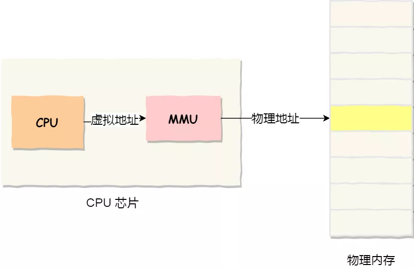
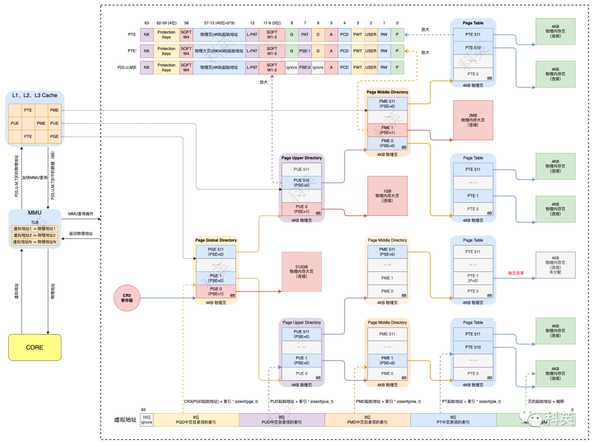

# Linux内存管理

## 虚拟内存

计算机系统中的物理内存是有限的资源，即使对于支持内存热插拔的系统，可以安装的内存量也存在硬性限制。物理内存不一定是连续的；它可以作为一组不同的地址范围进行访问。此外，不同的CPU架构，甚至同一架构的不同实现对于如何定义这些地址范围都有不同的看法。

所有这些使得直接处理物理内存变得相当复杂，为了避免这种复杂性，开发了虚拟内存的概念。

虚拟内存从应用程序软件中抽象出物理内存的细节，允许仅在物理内存中保留所需的信息（按需分页），并提供一种用于保护和受控进程之间数据共享的机制。

对于虚拟内存，每次内存访问都使用虚拟地址。当 CPU 解码从系统内存读取（或写入）系统内存的指令时，它将该指令中编码的虚拟地址转换为内存控制器可以理解的物理地址。

两个基本概念：

- 程序所使用的内存地址叫做**虚拟内存地址**（*Virtual Memory Address*）
- 实际存在硬件里面的空间地址叫**物理内存地址**（*Physical Memory Address*）。

操作系统引入了虚拟内存，进程持有的虚拟地址会通过 CPU 芯片中的内存管理单元（MMU）的映射关系，来转换变成物理地址，然后再通过物理地址访问内存，如下图所示：

物理系统内存分为页框或页。每个页面的大小是特定于体系结构的。某些架构允许从多个支持的值中选择页面大小；此选择是在内核构建时通过设置适当的内核配置选项来执行的。

每个物理内存页可以映射为一个或多个虚拟页。这些映射由页表描述，页表允许将程序使用的虚拟地址转换为物理内存地址。页表是分层组织的。

层次结构最低层的表包含软件使用的实际页面的物理地址。较高级别的表包含属于较低级别的页的物理地址。指向顶级页表的指针驻留在寄存器中。当CPU执行地址转换时，它使用该寄存器来访问顶层页表。虚拟地址的高位用于索引顶级页表中的条目。然后，该条目用于访问层次结构中的下一个级别，并将虚拟地址的下一位作为该级别页表的索引。虚拟地址中的最低位定义实际页内的偏移量。

### Huge Pages

地址转换需要多次内存访问，并且内存访问相对于 CPU 速度来说较慢。为了避免在地址转换上花费宝贵的处理器周期，CPU 维护一个称为转换后备缓冲区（或 TLB）的此类转换的缓存。通常，TLB 是相当稀缺的资源，具有大内存工作集的应用程序会因 TLB 未命中而遭受性能影响。

许多现代 CPU 架构允许通过页表中的较高级别直接映射内存页。例如，在x86上，可以使用第二级和第三级页表中的条目来映射2M甚至1G页面。在 Linux 中，这样的页面被称为巨大页面。大页的使用大大减轻了TLB的压力，提高了TLB的命中率，从而提高了系统的整体性能。

## 页表

用来将虚拟地址空间映射到物理地址空间的数据结构称为**页表**

四级页表结构

> [Linux 四级页表结构 (qq.com)](https://mp.weixin.qq.com/s/L-HFuoW_LDxJe8a_vyAA4Q)
