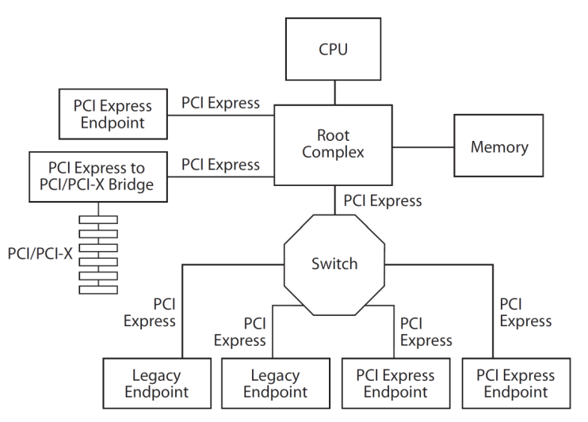
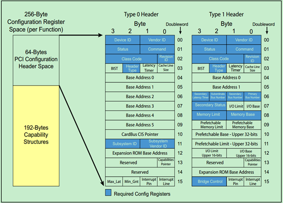
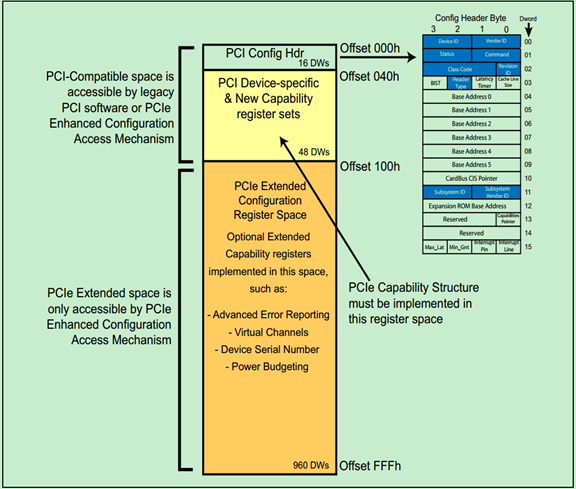

# PCIe基础

**PCI Express**，简称**PCI-E**，官方简称**PCIe**，是计算机总线的一个重要分支，它沿用既有的PCI编程概念及信号标准，并且构建了更加高速的串行通信系统标准。目前这一标准由[PCI-SIG](https://zh.wikipedia.org/wiki/PCI-SIG)组织制定和维护。

PCIe Type 0配置空间（RC与EP设备）

PCIe Type 1 配置空间（网桥设备）

兼容PCI配置空间

[PCI Device Classes (ucw.cz)](http://pci-ids.ucw.cz/read/PD) 可用于查询设备类型

## 内核PCI相关配置函数

# 参考

[PCI Express - 维基百科，自由的百科全书 (wikipedia.org)](https://zh.wikipedia.org/wiki/PCI_Express)

[PCIE 之linux驱动分析 - 知乎 (zhihu.com)](https://zhuanlan.zhihu.com/p/399102423)

[PCIe学习笔记之pcie结构和配置空间_pcie class code_Hober_yao的博客-CSDN博客](https://blog.csdn.net/yhb1047818384/article/details/106676528)

[PCIe扫盲系列博文连载目录篇（第二阶段）-Felix-电子技术应用-AET-中国科技核心期刊-最丰富的电子设计资源平台 (chinaaet.com)](http://blog.chinaaet.com/justlxy/p/5100053328)

[PCIe扫盲系列博文连载目录篇（第一阶段）-Felix-电子技术应用-AET-中国科技核心期刊-最丰富的电子设计资源平台 (chinaaet.com)](http://blog.chinaaet.com/justlxy/p/5100053251)
