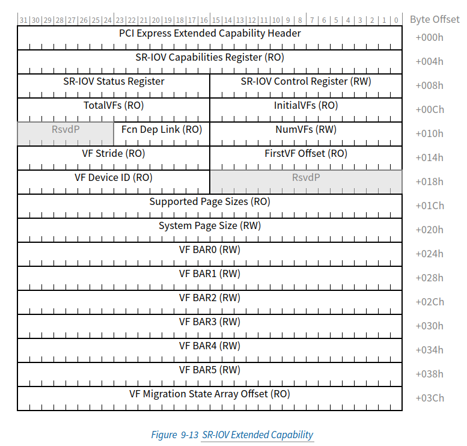

# SR-IOV&MR-IOV

## SR-IOV


## SR-IOV Capability结构

这里定义的 SR-IOV Extended Capability 是 PCIe 扩展能力，必须在每个支持 SR-IOV 的 PF 中实现。该能力用于描述和控制 PF 的 SR-IOV Capabilities。



> 《PCI Express® Base Specification Revision 5.0.pdf》9.3.3 SR-IOV Extended Capability p1121

### SR-IOV Extended Capability Header (Offset 00h)

| bit   | 描述                                                         | 属性 |
| ----- | ------------------------------------------------------------ | ---- |
| 15:0  | **PCI Express Extended Capability ID**：该字段是 PCI-SIG 定义的 ID 号，指示扩展功能的性质和格式。<br/>SR-IOV 扩展能力的扩展能力 ID 是 0010h。 | RO   |
| 19:16 | **Capability Version**：该字段是一个 PCI-SIG 定义的版本号，它指示存在的 Capability 结构的版本。<br/>对于此版本的规范，必须为 1h。 | RO   |
| 31:20 | **Next Capability Offset**：该字段包含到下一个 PCI Express Capability 结构的偏移量，如果 Capabilities 的链表中不存在其他项，则为 000h。<br/>对于在配置空间中实现的扩展功能，此偏移量是相对于 PCI 兼容配置空间的开头的，因此必须始终为 000h（用于终止功能列表）或大于 0FFh。 | RO   |

再Linux内核中获取下一个`PCIe Extended Capability`的宏为

`include/uapi/linux/pci_regs.h#L698`

```c
#define PCI_EXT_CAP_NEXT(header)	((header >> 20) & 0xffc)
```

### SR-IOV Capabilities Register (Offset 04h)

| bit   | 描述                                                         | 属性       |
| ----- | ------------------------------------------------------------ | ---------- |
| 0     | **VF Migration Capable**：如果设置，PF 是 Migration Capable 并且在 Migration Capable MR-PCIM 下运行。 | RO         |
| 1     | **ARI Capable Hierarchy Preserved**<br/>PCI Express 端点：如果设置，ARI Capable Hierarchy 位将在某些电源状态转换中保留。<br/>RCiEP：不适用 - 强烈建议将该位硬连线到 0b。 | RO         |
| 2     | **VF 10-Bit Tag Requester Supported**：如果设置，所有 VF 必须支持 10-Bit Tag Requester 功能。 如果清除，则 VF 不得支持 10 位标记请求器功能。<br/>如果 PF 的设备功能 2 寄存器中的 10 位标签请求者支持位为清除，则该位必须为清除。 | HwInit[^1] |
| 31:21 | **VF Migration Interrupt Message Number**：指示用于迁移中断的 MSI/MSI-X 向量。<br/>如果 VF Migration Capable 为 Clear，则此字段中的值未定义 | RO         |

[^1]:硬件初始化。

### SR-IOV Control Register (Offset 08h)

| bit  | 描述                                                         | 属性     |
| ---- | ------------------------------------------------------------ | -------- |
| 0    | **VF Enable**：启用/禁用 VF。 默认值为 0b。                  | RW       |
| 1    | **VF Migration Enable**：启用/禁用 VF 迁移支持。 默认值为 0b。 | RW or RO |
| 2    | **VF Migration Interrupt Enable**：启用/禁用 VF 迁移状态更改中断。 默认值为 0b | RW       |
| 3    | **VF MSE**：为虚拟功能启用内存空间。 默认值为 0b。           | RW       |
| 4    | **ARI Capable Hierarchy**：<br/>PCI Express Endpoint：<br/>该位必须在设备的最低编号 PF 中为 RW，并在所有其他 PF 中硬连线到 0b。<br/>如果此位的值为 1b，则允许 Device 将 VF 定位到捕获的总线编号的功能编号 8 到 255 中。 否则，设备必须像非 ARI 设备一样定位 VF。<br/>该位不受任何 PF 或 VF 的 FLR 影响。<br/>默认值为 0b。<br/>RCiEP：<br/>不适用 - 该位必须硬连线到 0b。<br/>在 Root Complex 中，始终允许将 VF 分配给 First VF Offset 和 VF Stride 规则允许的任何功能编号（参见《PCI Express® Base Specification Revision 5.0.pdf》第 9.3.3.9 节和第 9.3.3.10 节）。 | RW or RO |
| 5    | **VF 10-Bit Tag Requester Enable**：如果设置，所有 VF 必须为它们生成的所有非发布请求使用 10-Bit 标签。 如果清除，则 VF 不得将 10 位标记用于它们生成的非发布请求。 （参见《PCI Express® Base Specification Revision 5.0.pdf》第 9.3.3.2.3 节）。<br/>如果软件在任何 VF 具有未完成的非发布请求时更改该位的值，则结果未定义。<br/>如果 SR-IOV Capabilities 寄存器中的 VF 10-Bit Tag Requester Supported 位为 Clear，则允许将该位硬接线为 0b。<br/>默认值为 0b。 | RW or RO |

### SR-IOV Status Register (Offset 0Ah)

| bit  | 描述                                                         | 属性 |
| ---- | ------------------------------------------------------------ | ---- |
| 0    | **VF Migration Status**：表示 MR-PCIM 已发出 VF 迁移入或迁移出请求。<br/>为了确定事件的原因，软件可以扫描 VF 状态阵列。 默认值为 0b。 | RW1C |

### InitialVFs (Offset 0Ch)

**向 SR-PCIM 指示最初与 PF 关联的 VF 的数量**。

InitialVFs 的最小值为 0。

对于在Single-Root模式下运行的设备，此字段为 HwInit，并且必须包含与 TotalVFs 相同的值。

对于在Multi-Root模式下运行的设备，当 VF Enable 为 Clear 时，该字段的值可能会被 MR-PCIM 更改。

如果 VF Migration Enable 被设置，VF Enable 被清除然后设置，InitialVFs 的值可能会改变。 这是必要的，因为某些 VF 可能已迁移到其他 PF，并且可能不再可用于此 PF。

### TotalVFs (Offset 0Eh)

**TotalVFs 指示可以与 PF 关联的 VF 的最大数量**。

TotalVFs 的最小值为 0。

对于在Single-Root模式下运行的设备，此字段为 HwInit，并且必须包含与 InitialVFs 相同的值。

对于在Multi-Root模式下运行的设备，该字段的值可能会被 MR-PCIM 更改。

### NumVFs (Offset 10h)

**NumVFs 控制可见的 VF 的数量**。 SR-PCIM 将 NumVFs 设置为创建 VF 过程的一部分。 在两个 NumVF 都设置为有效值并设置 VF 启用后，此 VF 数量应在 PCI Express 结构中可见。 可见 VF 具有为其保留的功能编号，但可能不存在。 如果 VF 存在，它应响应以它们为目标的 PCI Express 事务，并应遵循本规范定义的所有规则。 如果存在以下任一情况，则存在 VF：

* VF Migration Capable 为Clear，并且VF 数小于或等于TotalVFs。
* VF Migration Capable 已设置且关联的 VF 处于 Active.Available 或 Dormant.MigrateIn 状态
  （见《PCI Express® Base Specification Revision 5.0.pdf》第 9.2.4 节）

如果将NumVFs 设置为大于TotalVFS的值，则结果将不确定。
NumVFs 只能在 VF Enable 为 Clear 时写入。 如果在设置 VF Enable 时写入 NumVFs，则结果为
不明确的。

NumVFs 的初始值不确定。

### Function Dependency Link (Offset 12h)

设备的编程模型可能在功能集之间具有特定于厂商的依赖性。 Function Dependency Link 字段用于描述这些依赖关系。

该字段描述了 PF 之间的依赖关系。 VF 依赖关系与其关联的 PF 的依赖关系相同。

如果一个 PF 独立于设备的其他 PF，则该字段应包含其自己的功能编号。

如果一个 PF 依赖于设备的其他 PF，则该字段应包含同一功能依赖列表中下一个 PF 的功能编号。 函数依赖列表中的最后一个 PF 应包含函数依赖列表中第一个 PF 的函数编号。

如果 PF<sub>p</sub> 和 PF<sub>q</sub> 在同一个函数依赖列表中，那么任何分配给 VF<sub>p,n</sub> 的 SI 也应该分配给 VF<sub>q,n</sub>。

> 示例：见《PCI Express® Base Specification Revision 5.0.pdf》9.3.3.8 Function Dependency Link (Offset 12h)

### First VF Offset (Offset 14h)

First VF Offset 是一个常量，它定义了与**第一个VF的Configuration Space相对于PF Configuration Space的偏移量**。 第一个 VF 的 16 位路由 ID 是通过将此字段的内容添加到包含此字段的 PF 的路由 ID 来计算的，忽略任何进位，使用无符号的 16 位算法。
VF 不应位于数字上小于其相关 PF 的总线编号上。
当最低编号的 PF 的 ARI Capable Hierarchy 值改变或当这个 PF 的 NumVFs 值改变时，这个字段的值可能会改变。
注意：如果 NumVFs 为 0，则 First VF Offset 未使用。如果 NumVFs 大于 0，则 First VF Offset 不得为零。

例如，如果First VF Offset为256，则第一个VF Configuration Space的起始地址为PF Configuration Space的起始地址加上256字节，第二个VF Configuration Space的起始地址为PF Configuration Space的起始地址加上2 * 256字节，以此类推。

### VF Stride (Offset 16h)

VF Stride 为相邻VF Configuration Space之间的偏移量，以字节为单位。 下一个 VF 的 16 位路由 ID 是通过将此字段的内容添加到当前 VF 的路由 ID，忽略任何进位，使用无符号 16 位算法计算的。
当最低编号的 PF 的 ARI Capable Hierarchy 值改变或当这个 PF 的 NumVFs 值改变时，这个字段的值可能会改变。
注意：如果 NumVFs 为 0 或 1，则 VF Stride 未使用。如果 NumVFs 大于 1，则 VF Stride 不得为零。

例如，如果stride为256，则相邻VF Configuration Space的偏移量为256字节，也就是说，第一个VF Configuration Space的起始地址为X，第二个VF Configuration Space的起始地址为X + 256字节，第三个VF Configuration Space的起始地址为X + 2 * 256字节，以此类推。

### VF Device ID (Offset 1Ah)

该字段包含应该为每个 VF 呈现给 SI 的Device ID。

VF Device ID 可能与 PF Device ID 不同。 VF Device ID 必须由供应商管理。 供应商必须确保所选的 VF Device ID 不会导致使用不兼容的设备驱动程序。

### Supported Page Sizes (Offset 1Ch)

该字段指示 PF 支持的页面大小。 如果位 n 被设置，这个 PF 支持 2<sup>n +12</sup> 的页面大小。 例如，如果位 0 被设置，则 PF 支持 4-KB 页面大小。 PF 需要支持 4-KB、8-KB、64-KB、256-KB、1-MB 和 4-MB 页面大小。 所有其他页面大小都是可选的。
页面大小描述了 VF BAR 资源的最小对齐要求。

### System Page Size (Offset 20h)

该字段定义了系统将用于映射 VF 内存地址的page大小。 软件必须将 System Page Size 的值设置为 Supported Page Sizes 字段中设置的page大小之一。 与支持的page大小一样，如果在系统page大小中设置了位 n，则与此 PF 关联的 VF 需要支持 2<sup>n+12</sup> 的page大小。 例如，如果位 1 被设置，则系统使用 8 KB 的page大小。 如果System Page Size为零，则结果未定义。 如果在 System Page Size 中设置了一位以上，则结果是不确定的。 如果在Supported Page Sizes中未设置,而在System Page Size中设置了该bit，则结果未定义。

设置System Page Size时，此 PF 关联的 VF需要与System Page Size边界上的所有 BAR 资源对齐。 每个 VF BARn 或 VF BARn 对应在System Page Size边界上对齐。 定义非零地址空间的每个 VF BARn 或 VF BARn 对的大小应被调整为消耗System Page Size字节的整数倍。 在 VF 中需要page大小对齐的所有数据结构都应在System Page Size边界上对齐。

写入 System Page Size 时，VF Enable 必须为零。 如果在设置VF Enable时写入System Page Size，则结果未定义。

默认值为 0000 0001h（即 4 KB）。

### VF BAR0 (Offset 24h), VF BAR1 (Offset 28h), VF BAR2 (Offset 2Ch), VF BAR3 (Offset 30h), VF BAR4 (Offset 34h), VF BAR5 (Offset 38h)

这些字段必须定义 VF 的Base Address Registers(BAR)。 这些字段的行为与正常的 PCI BAR 相同。 它们可以通过写全 1 并读回 BAR 的内容来调整大小，符合定义 BAR 类型字段的低位。

### VF Migration State Array Offset (Offset 3Ch)

如果 VF Migration Capable 设置并且 TotalVFs 不为零，则该寄存器应包含一个指向VF Migration State Array的 PF BAR 相关指针。 如果VF Migration Capable清除，则该寄存器为 RO 0。

#### Linux内核SR-IOV Capability结构体

`/drivers/pci/pci.h`

```c

/* Single Root I/O Virtualization */
struct pci_sriov {
	int		pos;		/* Capability position */
	int		nres;		/* Number of resources */
	u32		cap;		/* SR-IOV Capabilities */
	u16		ctrl;		/* SR-IOV Control */
	u16		total_VFs;	/* Total VFs associated with the PF */
	u16		initial_VFs;	/* Initial VFs associated with the PF */
	u16		num_VFs;	/* Number of VFs available */
	u16		offset;		/* First VF Routing ID offset */
	u16		stride;		/* Following VF stride */
	u16		vf_device;	/* VF device ID */
	u32		pgsz;		/* Page size for BAR alignment */
	u8		link;		/* Function Dependency Link */
	u8		max_VF_buses;	/* Max buses consumed by VFs */
	u16		driver_max_VFs;	/* Max num VFs driver supports */
	struct pci_dev	*dev;		/* Lowest numbered PF */
	struct pci_dev	*self;		/* This PF */
	u32		class;		/* VF device */
	u8		hdr_type;	/* VF header type */
	u16		subsystem_vendor; /* VF subsystem vendor */
	u16		subsystem_device; /* VF subsystem device */
	resource_size_t	barsz[PCI_SRIOV_NUM_BARS];	/* VF BAR size */
	bool		drivers_autoprobe; /* Auto probing of VFs by driver */
};

```


## MR-IOV


# 参考

[SR-IOV（一）](https://www.pcietech.com/413.html/)

[PCIe技术网](https://www.pcietech.com/page/2/)