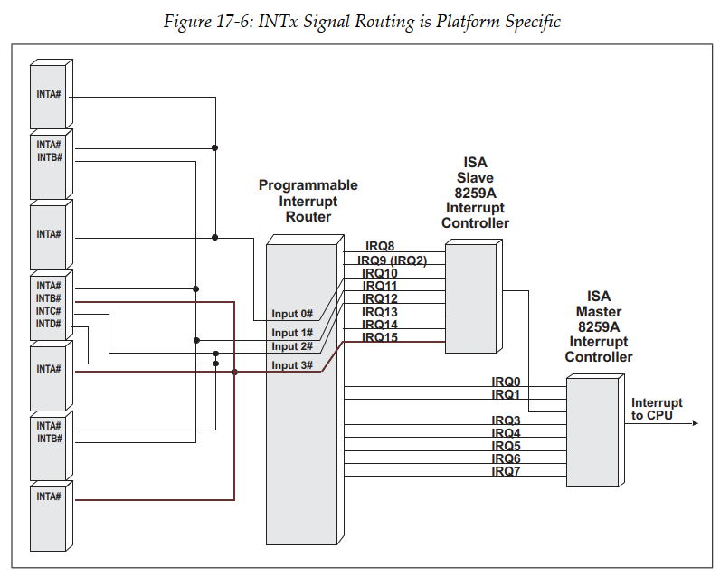
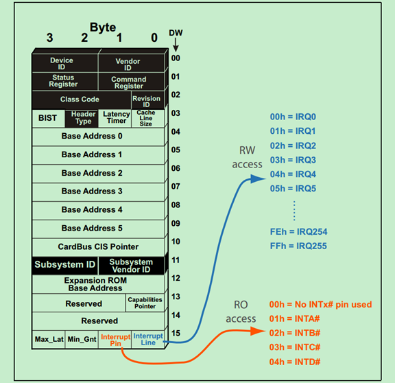
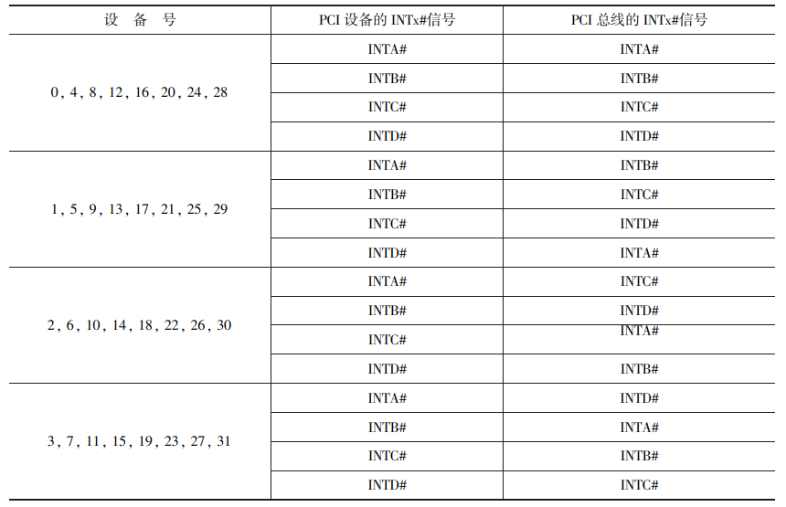
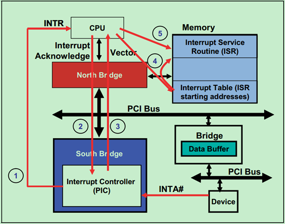
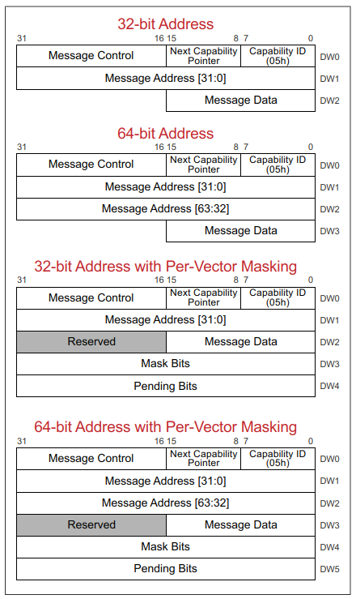
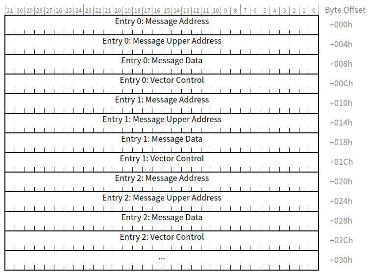

# PCI中断

## INTx中断

PCI总线使用 **INTA#**、**INTB#**、**INTC#**和**INTD#**信号向处理器发出中断请求。这些中断请求信号为 **低电平有效**，并与处理器的中断控制器连接。在PCI体系结构中，这些中断信号属于边带信号（Sideband Signals），PCI总线规范并没有明确规定在一个处理器系统中如何使用这些信号，因为这些信号对于PCI总线是可选信号。所谓边带信号是指这些信号在PCI总线中是可选信号，而且只能在一个处理器系统的内部使用，并不能离开这个处理器环境。

> 《PCI Express Technology 3.0.pdf》17 Interrupt Support p803

> 《PCI Express Technology 3.0.pdf》17 Interrupt Support p801

### PCI INTx中断流程

1. 首先，PCI设备通过INTx边带信号产生中断请求，经过中断控制器（Interrupt Controller，PIC）后，转换为INTR信号，并直接发送至CPU；
2. CPU收到INTR信号置位后，意识到了中断请求的发生，但是此时并不知道是什么中断请求。于是通过一个特殊的指令来查询中断请求信息，该过程一般被称为中断应答（Interrupt Acknowledge）；
3. 该特殊指令被发送至PIC后，PIC会返回一个8bits的中断向量（Interrupt Vector）值给CPU。该中断向量值与其发送的INTR请求是对应的；
4. CPU收到来自PIC的中断向量值后，会去其Memory中的中断向量表（Interrupt Table）中查找对应的中断服务程序（Interrupt Service Routines，ISR）在Memory的位置；
5. 然后CPU读取ISR程序，进而处理该中断。

INTx单核中断流程

## MSI中断

### MSI限制

1. MSI相关寄存器放置于配置空间中，从 Message Control 寄存器 multiple message Capble 字段可以看出 MSI 最多支持 32 个中断向量，且必须是 2N，也就是说如果一个 function 需要3个中断向量，必须申请4个才可以满足。

2. MSI要求中断控制器分配给该function的中断向量号必须连续。

MSI Capability 结构共有四种组成方式， 分别是 32 和 64 位的 Message 结构， 32 位和 64 位带中断 Masking 的结构。 MSI 报文可以使用 32 位地址或者 64 位地址， 而且可以使用Masking 机制使能或者禁止某个中断源。

PCI 规范中使用 Capability 机制来描述设备是否支持 MSI (Message Signaled Interrupts)，中断机制最多只能支持 32 个中断请求，而且要求中断向量连续；

### MSI Capability 结构

Capability ID 字段为 05h，描述当前设备支持 MSI，此时 Capability 的格式为：

MSI Capability Structure Variations

#### Capability ID

* Capability ID 字段记载 MSI Capability 结构的 ID 号， 其值为 0x05。 在 PCIe 设备中， 每
  一个 Capability 结构都有唯一的 ID 号。

#### Next Pointer

* Next Pointer 字段存放下一个 Capability 结构的地址。

#### Message Control

* Message Control 字段。 该字段存放当前 PCIe 设备使用 MSI 机制进行中断请求的状态与控制信息

Message Control

| Bits  | 定义                                                         | 描述                                                         | 属性  |
| ----- | ------------------------------------------------------------ | ------------------------------------------------------------ | ----- |
| 0     | MSI Enable                    | 该位可读写， 是 MSI 中断机制的使能位。 该位为 1 而且 MSI⁃X Enable 位为 0时， 当前 PCIe 设备可以使用 MSI 中断机制， 此时 Legacy 中断机制被禁止。 一个 PCIe 设备的 MSI Enable 和 MSI⁃X Enable 位都被禁止时， 将使用 INTx 中断消息报文发出/结束中断请求。[^1] | RW    |
| 1:3   | Multiple Message Capable                                     | 该字段对系统软件只读， **表示当前 PCIe 设备可以使用几个中断向量号**， 在不同的 PCIe 设备中该字段的值不同。  请求的向量的数量必须与2的幂对齐 (如果函数需要3个向量，则通过将该字段初始化为010b来请求4个向量) ，编码定义为: **000b** 1中断向量; **001b** 2中断向量; **010b** 4中断向量; **011b** 8中断向量; **100b** 16中断向量; **101b** 32中断向量; **110b** Reserved; **111b** Reserved; | RO    |
| 4:6   | Multiple Message Enable                                      | 软件写入此字段以**指示分配的向量的数量** (等于或小于请求的向量的数量)。分配的向量的数量与2的幂对齐。如果函数请求四个向量 (由能够编码为010b的多个消息指示)，则系统软件可以通过向该字段分别写入010b、001b或000b来分配四个、两个或一个向量。当设置了MSI Enable (启用) 时，将为函数分配至少1个向量。编码定义为: **000b** 1中断向量; **001b** 2中断向量; **010b** 4中断向量; **011b** 8中断向量; **100b** 16中断向量; **101b** 32中断向量; **110b** Reserved; **111b** Reserved; | RW    |
| 7     | 64-bit Address Capable | 该位为 1 时， 表示支持 64 位地址结构； 如果为 0， 表示只能支持带 32 位地址结构。 该位对系统软件只读， 在 PCIe 设备初始化时设置； | RO    |
| 8     | Per-vector Masking Capable                                   | 该位为 1 时， 表示支持带中断 Masking 的结构； 如果为 0， 表示不支持带中断 Masking 的结构。 该位对系统软件只读， 在 PCIe 设备初始化时设置；如果功能是 SR-IOV 设备内的PF或VF，则必须设置此位； | RO    |
| 9     | Extended Message Data Capable                                | 如果设置，则该 Function 能够提供扩展消息数据。如果清除，则该函数不支持提供扩展消息数据。 | RO    |
| 10    | Extended Message Data Enable                                 | 如果设置，则启用该功能以提供扩展消息数据。 如果清除，则不启用该功能以提供扩展消息数据。 该位的默认值为0b。 如果 Extended Message Data Capable 位是1b，则该位必须是可读写的；否则它必须是硬连线到0b。 | RW/RO |
| 11:15 |                                                              | 保留位。 系统软件读取该字段时将返回全零， 对此字段写无意义； |       |

[^1]:此时 PCI 设备配置空间 Command 寄存器的 “ Interrupt Disable” 位为 1

#### Message Address

* 当 [MSI Enable](#MSI Enable) 位有效时， 该字段存放 MSI 存储器写事务的目的地址的低 32 位。 该字段的 31∶ 2 字段有效， 系统软件可以对该字段进行读写操作； 该字段的第 1～0 位为 0。

Message Address

#### Message Upper Address

* 如果 [64 bit Address Capable](#64 bit Address Capable) 位有效， 该字段存放 MSI 存储器写事务的目的地址的高 32 位。

Message Upper Address

#### Message Data

* 当 [MSI Enable](#MSI Enable) 位有效时， 该字段存放 MSI 报文使用的数据。 该字段保存的数值与处理器系统相关， 在 PCIe 设备进行初始化时， 处理器将初始化该字段， 而且不同的处理器填写该字段的规则并不相同。 如果 Multiple Message Enable 字段不为 0b000 时 （ 即该设备支持多个中断请求时） ， PCIe 设备可以通过改变 Message Data 字段的低位数据发送不同的中断请求。

Message Data

#### Mask Bits

* PCIe 总线规定当一个设备使用 MSI 中断机制时， 最多可以使用 32 个中断向量， 从而一个设备最多可以发送 32 种中断请求。 Mask Bits 字段由 32 位组成，其中每一位对应一种中断请求。 当相应位为 1 时表示对应的中断请求被屏蔽， 为 0 时表示允许该中断请求。 系统软件可读写该字段， 系统初始化时该字段为全 0， 表示允许所有中断请求。 该字段和 Pending Bits 字段对于 MSI 中断机制是可选字段， 但是PCIe 总线规范强烈建议所有 PCIe 设备支持这两个字段。

Mask Bits

#### Pending Bits

* 该字段对于系统软件是只读位， PCIe 设备内部逻辑可以改变该字段的值。 该字段由 32 位组成， 并与 PCIe 设备使用的 MSI 中断一一对应。 该字段需要与 Mask Bits 字段联合使用。
* 当 Mask Bits 字段的相应位为 1 时， 如果 PCIe 设备需要发送对应的中断请求， Pending Bits 字段的对应位将被 PCIe 设备的内部逻辑置 1， 此时 PCIe 设备并不会使用 MSI 报文向中断控制器提交中断请求； 当系统软件将 Mask Bits 字段的相应位从 1 改写为 0 时， PCIe 设备将发送 MSI 报文向处理器提交中断请求， 同时将 Pending Bit 字段的对应位清零。 在设备驱动程序的开发中， 有时需要联合使用 Mask Bits 和 Pending Bits 字段防止处理器丢弃中断请求

## MSI-X中断

### MSI⁃X Capability 结构

MSI⁃X Capability 中断机制与 MSI Capability 的中断机制类似。 PCIe 总线引出 MSI⁃X 机制的主要目的是为了扩展 PCIe 设备使用中断向量的个数， 同时解决 MSI 中断机制要求使用中断向量号连续所带来的问题。与 MSI 中断机制相比， MSI⁃X 机制更为合理。首先 MSI⁃X 可以支持更多的中断请求， 但这并不是引入 MSI⁃X 中断机制最重要的原因。 因为对于多数 PCIe 设备， 32 种中断请求已经足够了。 而引入 MSI⁃X 中断机制的主要原因是，使用该机制不需要中断控制器分配给该设备的中断向量号连续。

MSI⁃X Capability

#### Capability ID

* Capability ID 字段记载 MSI⁃X Capability 结构的 ID 号， 其值为 0x11。 在 PCIe 设备中，每个 Capability 都有唯一的 ID 号。

#### Next Pointer

* Next Pointer 字段存放下一个 Capability 结构的地址。

#### Message Control

* Message Control 字段， 该字段存放当前 PCIe 设备使用 MSI⁃X 机制进行中断请求的状态与控制信息。

| Bits  | 定义          | 描述                                                         | 属性 |
| ----- | ------------- | ------------------------------------------------------------ | ---- |
| 10:0  | Table Size    | MSI⁃X 中断机制使用 MSI⁃X Table 存放 Message Address 字段和 Message Data 字段。 该字段用来存放 MSI⁃X Table 的大小， 该字段对系统软件只读，系统软件读取该字段以确定被编码为 N-1 的 MSI-X  Table大小 N。例如，返回值 000 0000 0011b 表示表大小为4。每个entry对应一个中断向量。从 table size 可看出一个 func 对多支持 211 个 MXI-X 中断。 | RO   |
| 13:11 | Resved        | 读时总是返回0，写操作没有效果。                              | RO   |
| 14    | Function Mask | 该位可读写， 是中断请求的全局 Mask 位， 复位值为 0。 如果该位为 1， 该设备所有的中断请求都将被屏蔽； 如果该位为 0， 则由 Per Vector Mask 位决定是否屏蔽相应的中断请求。 Per Vector Mask 位在 MSI⁃X Table 中定义 | RW   |
| 15    | MSI-X Enable  | 该位可读写， 是 MSI⁃X 中断机制的使能位， 复位值为 0， 表示不使能 MSI⁃X 中断机制。该位为 1 且 MSI Enable 位为 0 时， 当前 PCIe 设备使用 MSI⁃X 中断机制， 此时 INTx 和 MSI 中断机制被禁止。 | RW   |

#### Table Offset/Table BIR

Table Offset/Table BIR

| Bits | 定义         | 描述                                                         | 属性 |
| ---- | ------------ | ------------------------------------------------------------ | ---- |
| 2:0  | Table BIR    | 该字段存放 MSI⁃X Table 所在的位置， PCIe 总线规范规定 MSI⁃X Table 存放在设备的 BAR 空间中。 该字段表示设备使用 BAR0 ～ 5 寄存器中的哪个空间存放 MSI⁃X table。 该字段由三位组成，其中 0b000 ～ 0b101 与 BAR0～ 5 空间一一对应。 | RO   |
| 31:3 | Table Offset | 该字段存放 MSI⁃X Table 在相应 BAR 空间中的偏移。             | RO   |

#### PBA Offset/PBA BIR

PBA Offset/PBA BIR

| Bits | 定义       | 描述                                                         | 属性 |
| ---- | ---------- | ------------------------------------------------------------ | ---- |
| 2:0  | PBA BIR    | 该字段表示 Pending Table 存放在 PCIe 设备的哪个 BAR 空间中，0 表示 BAR0 空间， 1 表示 BAR1 空间， 依此类推。 在通常情况下，Pending Table 和 MSI⁃X Table 存放在 PCIe 设备的同一个 BAR 空间中。 | RO   |
| 31:3 | PBA Offset | 该字段存放 Pending Table 在相应 BAR 空间中的偏移。           |      |

### MSI-X Table 结构

与 MSI Capability 寄存器相比， MSI⁃X Capability 寄存器使用一个数组存放 Message Address 字段和 Message Data 字段， 而不是将这两个字段放入 Capability 寄存器中， 这个数组称为 MSI⁃X Table。 从而当 PCIe 设备使用 MSI⁃X 机制时， 每一个中断请求可以使用独立的 Message Address 字段和 Message Data 字段。

由下图可知， MSI⁃X Table 由多个 Entry 组成， 其中每个 Entry 与一个中断请求对应。 每个 Entry 中有四个参数：

MSI-X Table

#### Message Address

Message Address

| Bits | 定义            | 描述                                                         | 属性     |
| ---- | --------------- | ------------------------------------------------------------ | -------- |
| 1:0  | Reserved        | 为了正确的DWORD对齐，软件必须始终将零写入这两个位；此字段的默认值为00b。PCIe 设备可以根据需要将这个字段设为只读， 或者可读写 | RO or RW |
| 31:2 | Message Address | 当 MSI⁃X Enable 位有效时， 该字段存放 MSI⁃X 存储器写事务的目的地址的低 32 位。 |          |

#### Message Upper Address

该字段可读写， 存放 MSI⁃X 存储器写事务的目的地址的高 32 位。

Message Upper Address

#### Message Data

该字段可读写， 存放 MSI⁃X 报文使用的数据。 其定义与处理器系统使用的中断控制器和 PCIe 设备相关。

Message Data

#### Vector Control

Vector Control

| Bits  | 定义     | 描述                                                         | 属性           |
| ----- | -------- | ------------------------------------------------------------ | -------------- |
| 0     | Mask Bit | 当该位为 1 时， PCIe 设备不能使用该 Entry 提交中断请求； 为 0 时可以提交中断请求。然而，用相同向量编程的任何其他 MSI-X 表将仍然能够发送等效消息，除非它们也被屏蔽。 | RW             |
| 15:1  | Reserved | 默认情况下，这些位的值必须为0。                              | RW or Reserved |
| 23:16 | ST Lower | 如果该功能实现 TPH Requester Extended Capability 结构，并且ST表位置指示值10b，则该字段包含操纵标签的低8位，并且必须是读写的。 | RW             |
| 31:24 | ST Upper | 如果该函数实现 TPH Requester Extended Capability 结构，并且ST表位置指示值为10b，并且设置了扩展TPH请求者支持位，则该字段包含转向标签的高8位，并且必须是读写的。 否则软件必须保留这些保留位的值； | RW             |

#### MSI-X PBA Table

在 Pending Table 中， 一个 Entry 由 64 位组成， 其中每一位与 MSI⁃X Table 中的一个 Entry 对应， 即 Pending Table 中的每一个 Entry 与 MSI⁃X Table 的 64 个 Entry 对应。

与 MSI 机制类似， Pending 位需要与 Per Vector Mask 位配置使用。当 Per Vector Mask 位为 1 时， PCIe 设备不能立即发送 MSI⁃X 中断请求， 而是将对应的Pending 位置 1； 当系统软件将 Per Vector Mask 位清零时， PCIe 设备需要提交 MSI⁃X 中断请求， 同时将 Pending 位清零。

MSI-X PBA Table

#### MSI/MSI-X对比

|                  | MSI             | MSI-X                |
| ---------------- | --------------- | -------------------- |
| 中断向量数       | 32              | 2048                 |
| 中断号约束       | 必须连续        | 可以随意分配         |
| 中断信息存放位置 | capbility寄存器 | MSI-X Table(bar空间) |

### MSI/MSI-X操作流程

#### 扫描设备

扫描设备，读取 Capability，确定是否含有MSI Capability、是否含有MSI-X Capability。

#### 配置设备

一个设备，可能都支持INTx、MSI、MSI-X，这3中方式只能选择一种。

MSI配置

* 系统软件读取MSI Capability，确定设备想申请多少个中断。
* 系统软件确定能分配多少个中断给这个设备，并把"地址/数据"写入MSI Capability。
* 如果MSI Capability支持中断使能的话，还需要系统软件设置MSI Capability来使能中断。[^2]

[^2]:注意：如果支持多个MSI中断，PCI设备发出中断时，写的是同一个地址，但是数据的低位可以发生变化。比如支持4个MSI中断时，通过数据的bit1、bit0来表示是哪个中断。

MSI-X配置

* MSI-X机制中，中断相关的更多信息保存在设备的内存空间。所以要使用MSI-X中断，要先配置设备、分配内存空间。
* 系统软件读取MSI-X Capability，确定设备需要多少个中断。
* 系统软件确定能分配多少个中断给这个设备，并把多个"地址/数据"写入MSI-X Table。[^3]

[^3]:注意：PCI设备要发出MSI-X中断时，它会往"地址"写入"数据"，这些"地址/数据"一旦配置后是不会变化的。MSI机制中，数据可以变化，MSI-X机制中数据不可以变化。

* 使能中断：设置总开关、MSI-X Table中某个中断的开关。[^4]

[^4]:注意：MSI-X Table中，每一项都可以保存一个"地址/数据"，Table中"地址/数据"可以相同，也就是说：PCI设备发出的中断可以是同一个。

#### 设备发出中断

PCI设备发出MSI中断、MSI-X中断时，都是发起"数据写"传输，就是往指定地址写入指定数据。

PCI控制器接收到数据后，就会触发CPU中断。

#### 中断函数

系统软件执行中断处理函数。
