# PCIe基础知识（配置空间）

**PCI Express**，简称**PCI-E**，官方简称**PCIe**，是计算机总线的一个重要分支，它沿用既有的PCI编程概念及信号标准，并且构建了更加高速的串行通信系统标准。目前这一标准由[PCI-SIG](https://zh.wikipedia.org/wiki/PCI-SIG)组织制定和维护。

PCIe的两个端点通过双link全双工传输，一个link负责发送，一个link负责接收，两个link组成一个Lane，一个PCIe传输链路上可以由多个Lane组成，可以支持1、2、4、8、16个Lane。


## 拓扑

PCIe采用树拓扑，PCI总线从0开始，不超过256（但一般不会一层一层挂太多）。Device不超过32，Function不超过8，其体系结构中一般由Root Complex、Switch、EndPoint等类型的PCIe设备组成。

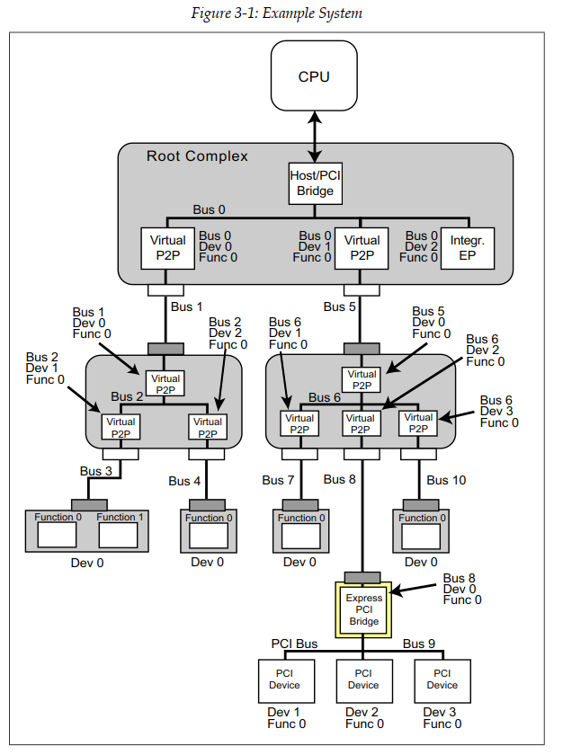

> 《PCI Express Technology 3.0.pdf》Chapter 3: Configuration Overview p87

### BDF

 PCIe总线中的每一个功能都有一个唯一的标识符与之对应。这个标识符就是BDF（Bus，Device，Function）

### BUS

总线号，最多可以通过配置软件分配<font color=red>**256**</font >个总线号。初始总线号，总线0，通常由硬件分配给Root Complex。总线0由一个集成了端点的虚拟PCI总线和一个硬编码的设备号和功能号的虚拟PCI-to-PCI桥(P2P)组成。每个P2P网桥创建一个新的总线，附加的PCle设备可以连接到该总线。每个总线必须被分配一个唯一的总线号。配置软件通过搜索从总线0、设备0、功能0开始的桥，开始分配总线号，当发现网桥时，软件会给新总线分配一个唯一且大于网桥所在总线号的总线号。一旦新总线被分配了一个总线号，软件就开始在继续扫描当前总线上的更多的桥之前寻找新总线上的桥。

### Device

设备号，PCle允许在单个PCI总线上最多<font color=red>**32**</font >个设备号，然而，PCle的点对点特性意味着只有单个设备可以直接连接到PCle链路，并且该设备总是以device 0结束。RC和Switch有虚拟PCI总线，它允许多个设备“连接”到总线上。每个设备必须实现Function 0，并且可能包含多达8个Function 的集合。当包含两个或多个Function时，设备称为多功能设备。

### Function

功能号，如前所述，功能被包含到每个Device中，最多包含<font color=red>**8**</font >个功能号。这些功能可能包括硬盘接口、显示控制器、以太网控制器、USB控制器等。具有多个功能的设备不需要按顺序实现。例如，设备可能实现Function0、2和7。因此，当软件检测多功能设备时，必须检查每一个可能的功能，以了解哪些功能是存在的。每个Function也有自己的配置地址空间，用于设置关联的资源。

## PCIx系统框图


## PCIe设备分类

### Root Complex（RC）

其中**`Root Complex`**（简称RC）：根设备，也称根节点，通常集成在主机处理器或芯片组中，它是整个PCIe总线的起点，主要负责分析和生成PCIe消息，管理PCIe拓扑结构中的所有设备。


RC接收来自CPU的IO命令，生成对应的PCIe消息，接受来自设备的TLP消息，解析数据并传送到CPU和存储器。RC的主要功能有：

* **初始化和枚举**：在系统启动时对所有连接的PCI/PCIe设备进行初始化和枚举，分配资源（如内存空间、Bar信息、中断号信息等）

* **事务发起**：RC可以作为请求者（Requester），发起对Endpoint设备的读写操作。
* **事务完成**：RC作为完成者（Completer），处理来自Endpoint设备的完成信息。
* **配置管理**：RC负责配置PCIe拓扑中的所有设备，包括配置BAR（Base Address Register）等配置寄存器。
* **错误处理**：RC负责处理PCIe总线上的错误消息和事件。

### Endpoint（EP）

**PCIe Endponit**（简称EP）：是PCIe拓扑结构中的终端设备，位于PCIe树结构的末端，称为叶节点。 例如，网卡、NVMe卡和显卡都是PCIe ep设备。访问地址空间>=4G Memory，支持32bit和64bit，无法产生I/O请求。EP设备的主要功能如下：

* **事务响应**：EP作为目标设备（Target），响应来自RC或者其他Endpoint的事务请求，执行读写操作。
* **中断生成**：EP设备可以产生中断，通知RC或者其他设备有事件发生。
* **配置响应**：EP响应RC的配置请求，提供设备的配置信息。

事务

### Switch

PCIe Switch是一种更高级的设备，用于扩展PCIe总线的连接能力，允许多个设备通过单个PCIe端口连接到主机系统。 与PCI并行总线不同，PCIe总线采用快速差分总线和端到端连接方式，因此每个PCIe链路两端只能连接一个设备。 如果需要装载更多的PCIe设备，则必须使用Switch适配器。 在Linux系统上看不到Switch。 在软件级别，可以看到交换机的上行端口(Upstream Port，靠近RC的一侧)和下行端口(Downstream Port )。switch设备的主要功能如下：

* **连接多个设备**：允许多个设备通过单个PCIe总线连接到主机，从而扩展系统的连接性。
* **数据交换**：在多个设备之间传输数据，允许设备之间直接通信而无需主机处理器。
* **动态分配**：支持动态分配带宽和资源，根据需要调整设备之间的通信速率和优先级。
* **NTB技术**：支持NTB（Non-Transparent Bridge）技术，允许两个或者多个系统之间直接通信。
* **支持Peer to Peer通信**：支持点对点通信，设备之间可以直接进行数据交换而无需通过主机。
* **虚拟化支持**：支持多跟IO虚拟化（MRIOV）和单根IO虚拟化（SRIOV），实现资源的灵活分配和管理。

[SR-IOV vs MR-IOV](http://www.ssdfans.com/?p=3904)

[PCIe Switch全解析：一文让你秒懂！](https://www.webzonl.com/cms/700.html)

### Bridge

Bridge是一种连接不同总线的设备，用于扩展PCIe拓扑结构。它通常用于连接不同类型的PCIe链路，例如将PCIe总线连接到传统的PCI或PCI-X总线。Bridge的主要功能包括：

- **连接不同链路**：允许不同类型的PCI设备连接在一起。
- **数据传输**：在不同的PCI总线之间传输数据，确保数据的一致性和完整性。
- **地址转换**：进行地址转换，确保数据包正确路由到目标设备。
- **配置管理**：支持配置空间访问，允许操作系统和驱动程序配置Bridge设备。

# 配置空间

PCI Express (PCIe) Type 0 设备的前 256 个字节分为两部分：**前 64 个字节是标准配置空间头部**（Header），用于描述设备的基本信息和功能；**后 192 个字节PCI Express Capbility结构**，用于描述设备的扩展能力和配置。

早期的PCI时期，系统为每个PCI设备分配的内存大小仅有256个Bytes。到后来的PCIE时期，随着设备性能增强，PCIE设备的配置空间扩展至4K个Bytes。在这里需要注意：PCIE一共支持256条Bus，32个Dev，8个Fun。因此在满负载的情况下，共需内存大小 = 4k * 256 *32*8  = 256M，这个256M的内存空间是为PCIE设备准备的空间系统不可用。


> 《PCI Express_ Base Specification Revision 4.0 Version 0.3 ( PDFDrive ).pdf》p567

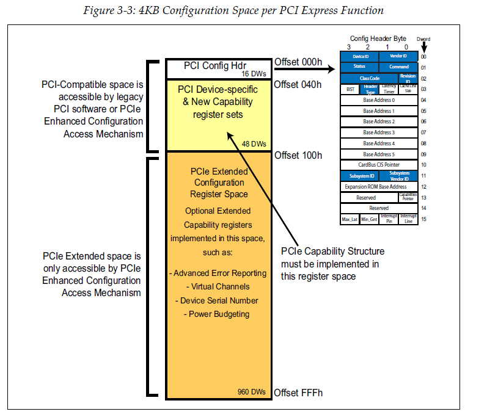

> 《PCI Express Technology 3.0.pdf》p90

## 访问方式

### I/O访问

PCIe定义了两个IO端口寄存器用来访问设备的配置空间。

* CONFIG_ADDRESS(0xCF8)：地址寄存器；


* CONFIG_DATA(0xCFC)：数据寄存器。

写入数据到配置空间：

* 地址寄存器写入BDF和Register；
* 数据寄存器写入数据，完成写入数据到配置空间。

从配置空间读取数据：

* 地址寄存器写入BDF号和Register；
* 从数据寄存器读取数据，完成读取。

Linux下查看IO端口地址：

```bash
grep conf /proc/ioports
```

### MMIO访问

IO端口访问的之能够访问256（2^6）字节的配置空间，PCIe的配置空间扩展至4K，IO端口的方法无法访问到扩展配置空间，所以定义了一段MMIO空间用来方位配置空间，大小为256M（256*256*4096）。

内核中可使用以下方法查看空间地址范围

```bash
grep MMCONFIG -i /proc/iomem
```

读写方式：直接进行地址读写即可。

读写配置空间：

读取：

```bash
lspci -xxxs <bdf number>
```

读取和写入：

```bash
setpci --dumpregs #读取
setpci -s <bdf number> VENDOR_ID #读取vendor ID
setpci -s <bdf number> COMMAND=0x0140 #写入
```

## 设备分类

在 PCI Express (PCIe) 中，设备被分为两种类型：Type 0 设备和 Type 1 设备。Type 0 设备和 Type 1 设备的区别在于它们的配置空间结构不同。

### Type 0

**Type 0** 设备是指普通的 PCIe 设备（RC和EP）。Type 0 设备的配置空间只包含一个配置空间头部，用于描述设备的基本信息，如 Vendor ID、Device ID、Class Code、Subclass Code 等等。Type 0 设备可以有多个 BAR（Base Address Registers），用于描述设备的地址空间信息。

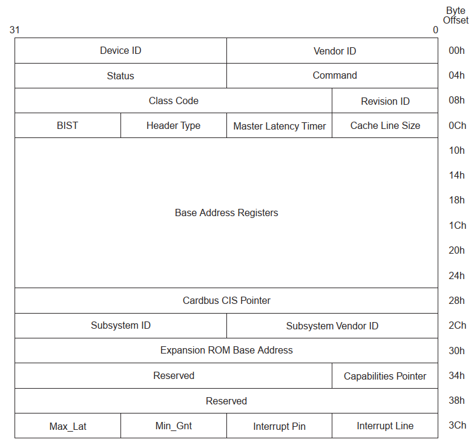

<center>PCIe Type 0配置空间（RC与EP设备）</center>

> 《PCI Express_ Base Specification Revision 4.0 Version 0.3 ( PDFDrive ).pdf》7.5.2 p585

### Type 1

**Type 1** 设备是指 PCIe-to-PCI/PCI-X Bridge，它们可以将一个 PCIe 总线转换成一个或多个 PCI 总线，从而使 PCIe 总线上的 PCIe 设备可以与 PCI 总线上的 PCI 设备进行通信。Type 1 设备的配置空间包含一个配置空间头部和一个或多个 PCI-to-PCI Bridge (P2P) 或 CardBus Bridge (CB) 头部。Type 1 设备的每个 PCI-to-PCI Bridge (P2P) 或 CardBus Bridge (CB) 头部描述一个转换的 PCI 总线。Type 1 设备还有多个 BAR，其中每个 BAR 描述一个转换的 PCI 总线上的地址空间。

通过配置空间的`Header Type`来区分设备类型，具体如下：

* 00h：PCI Agent
* 01h：PCI Bridge
* 02h：Cardbus Bridge


<center>PCIe Type 1 配置空间（网桥设备）</center>

> 《PCI Express_ Base Specification Revision 4.0 Version 0.3 ( PDFDrive ).pdf》7.5.3 p587

# 标准配置空间头（0x00h~0x3Fh）

##  Type 0/1 Common Configuration Space

**标准配置空间头部包含了设备的基本信息和功能**，如设备的 Vendor ID、Device ID、Class Code、BAR (Base Address Register)、中断信息等。这些信息通常用于操作系统和设备驱动程序识别和配置设备，例如确定设备的驱动程序、分配资源、设置中断等等。标准配置空间头部的长度为 64 个字节，是固定的，不能被扩展。

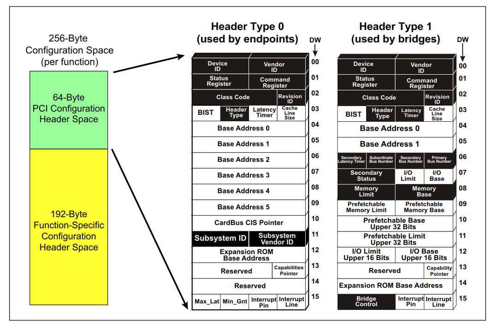

<center>标准配置空间头</center>

> 《PCI Express Technology 3.0.pdf》Software Compatibility Characteristics p50

### Vendor ID Register (Offset 00h)

### <span id = "Device ID">Device ID Register (Offset 02h)</span>

Vendor ID、Device ID这两个寄存器的值由 [PCI-SIG](https://pcisig.com/) 分配， 只读，并且 `0xFFFF` 是无效值，将在读取对不存在设备的配置空间寄存器的访问时返回。 其中 Vendor ID 代表 PCI 设备的生产厂商， 而 Device ID 代表这个厂商所生产的具体设备。 

### <span id = "Command Register">Command Register(Offset 04h)</span>

该寄存器为 PCI 设备的命令寄存器， 在初始化时， 其值为 0， 此时这个 PCI 设备除了能够接收配置请求总线事务之外， 不能接收任何存储器或者 I / O 请求。 系统软件需要合理设置该寄存器之后， 才能访问该设备的存储器或者 I / O 空间。 

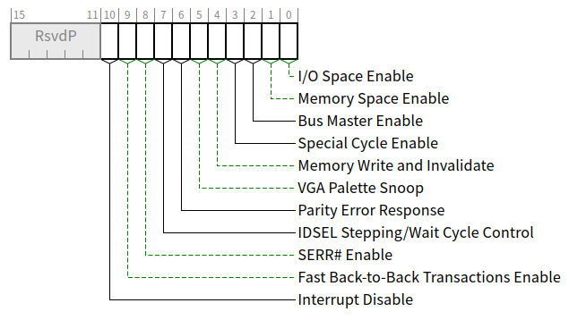

| Bits  | 定义                                  | 描述                                                         | 属性 |
| ----- | ------------------------------------- | ------------------------------------------------------------ | ---- |
| 0     | I/O Space Enable                      | 该位表示 PCI 设备是否响应 I/O 请求， 为 1 时响应， 为 0 时不响应。 如果 PCI 设备支持I/O 地址空间， 系统软件会将该位置 1，复位值为 0。<br/>如果 Func 不支持 I/O 空间访问，则允许该位硬连线到0b。 | RW   |
| 1     | Memory Space Enable                   | 该位表示 PCI 设备是否响应 Memory 请求， 为 1 时响应， 为 0 时不响应。 如果 PCI 设备支持 Memory 地址空间， 系统软件会将该位置 1。 复位值为 0。对于具有 Type 1 类型配置空间头的 Func ，该位控制对在其主侧上接收的存储器空间访问的响应。<br/>如果 Func 不支持存储器空间访问，则允许该位硬连线到0b。 | RW   |
| 2     | Bus Master Enable                     | 该位表示 PCI 设备是否可以作为主设备， 为 1 时 PCI 设备可以作为主设备， 为 0 时不能。 复位值为 0。<br/>**具有 Type 0 配置空间标头的Func:**<br/>当该位被置位时，允许该函数发出 Memory 或 I/O 请求。<br/>当该位被清除时，不允许该函数发出任何 Memory 或 I/O 请求。<br/>**请注意**，由于MSI/MSI-X中断消息是带内内存写入，因此设置总线主<br/>启用位到 0b 也会禁用 MSI/MSI-X 中断消息。<br/>除 Memory 或 I/O 请求之外的请求不受该位控制。<br/>该位的默认值为0b。<br/>如果 Func 不生成 Memory 或 I/O 请求，则该位硬连线到0b。<br/>**具有 Type 1 配置空间标头的Func:**<br/>该位控制上游方向上的端口对 Memory 或 I/O 请求的转发。<br/>当该位是0b时，在根端口或交换机端口的下游侧接收的 Memory 或 I/O 请求必须被处理为不支持的请求 (UR)，并且对于非发布的请求，必须返回具有UR完成状态的完成。该位不影响上游或下游方向的完成转发。<br/>除 Memory 或 I/O 请求之外的请求的转发不受该位控制。<br/>该位的默认值为0b。 | RW   |
| 3     | Special Cycle Enable                  | 该位表示 PCI 设备是否响应 Special 总线事务， 为 1 时响应， 为 0 时不响应。 PCI 设备可以使用 Special 总线事务， 将一些信息广播发送到多个目标设备， Specail 总线事务不能穿越 PCI 桥。 如果一个 PCI 设备需要将 Special 总线事务发送到 PCI 桥之下的总线时， 必须使用 Type 01h 配置周期。 PCI桥可以将 Type 01h 配置周期转换为 Special 周期， 该位的复位值为 0。 | RO   |
| 4     | Memory Write and Invalidate           | 该位表示 PCI 设备是否支持 Memory Write and Invalidate 总线事务， 为 1时支持， 为 0 时不支持。 许多低端的 PCI 设备不支持这种总线事务。 该位对 PCIe 设备无意义。 | RO   |
| 5     | VGA Palette Snoop                     | 其功能不适用于PCI Express，该位必须硬连线到 0b。             | RO   |
| 6     | Parity Error Response                 | 复位值为 0。 该位为 1， 而且 PCI 设备在传送过程中出现奇偶校验错误时， PCI 设备将 PERR#信号设置为 1； 该位为 0 时， 即便出现奇偶检验错误， PCI 设备也仅会将 Status 寄存器的 [Detected Parity Error](Detected Parity Error) 位置 1。 | RW   |
| 7     | IDSEL Stepping/Wait Cycle Control     | 其功能不适用于PCI Express，并且该位必须硬连线到0b。          | RO   |
| 8     | SERR# Enable                          | 复位值为 0。 该位为 1， 而且 PCI 设备出现错误时， 将使用 SERR#信号， 将这个错误信息发送给 HOST 主桥， 为 0 时， 不能使用 SERR#信号。 | RW   |
| 9     | Fast Back-to-Back Transactions Enable | 该位为 1 时， PCI 设备使用 Fast Back⁃to⁃Back （ 快速背靠背） 总线周期， 这种周期是一种提高传送效率的方法。 但并不是所有的 PCI 设备都支持 Fast Back⁃to⁃Back 传送周期。 该位的复位值为 0。<br/>其功能不适用于PCI Express，该位必须硬连线到0b。 | RO   |
| 10    | Interrupt Disable                     | 复位值为 0。 该位为 1 时， PCI 设备不能通过 INTx 信号向 HOST 主桥提交中断请求， 为 0 时可以使用 INTx 信号提交中断请求。 当 PCI 设备使用 MSI 中断方式提交中断请求时， 该位将被置为 1。 | RW   |
| 15:11 | Reserved                              | Reserved                                                     | -    |

### Status Register (Offset 0x06h)

该寄存器保存设备状态，绝大多数位为只读；

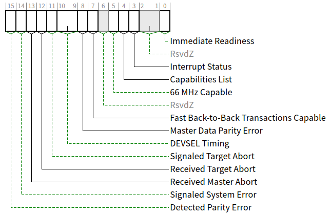

| Bits | 定义                                   | 描述                                                         | 属性 |
| ---- | -------------------------------------- | ------------------------------------------------------------ | ---- |
| 3    | Interrupt Status                       | 该位为 1 且 Command 寄存器的 Interrupt Disable 位为 0 时， 表示 PCI 设备已经使用 INTx 信号向处理器提交了中断请求。 在多数 PCI 设备中的 BAR 空间， 存在自定义的中断状态寄存器， 因此设备驱动程序很少使用该位判断 PCI 设备是否提交了中断请求。 | RO   |
| 4    | Capabilities List                      | 该位为 1 时 Capability Pointer 寄存器中的值有效。            | RO   |
| 5    | 66 MHz Capable                         | 66MHz Capability 位， 该位只读。 为 1 时表示此设备支持 66 MHz 的 PCI 总线。 | RO   |
| 7    | Fast Back-to-Back Transactions Capable | 该位为 1 表示此设备支持快速背靠背总线周期。                  | RO   |
| 8    | Master Data Parity Error               | PCI 总线的 PERR#信号有效时将置该位为 1； 当 PCI 总线出现数据传送错误时置此位为 1； 当 Command 寄存器的 Parity Error Response 位为 1 时， 此位为 1。 | RW1C |
| 10:9 | DEVSEL Timing                          | 该字段为 0b00 时表示 PCI 设备为快速设备； 为 0b01 时表示 PCI 设备为中速设备；为 0b10 时表示 PCI 设备为慢速设备。快速设备要求 PCI 总线主设备置 FRAME# 信号有效的一个时钟周期后，置 DEVSEL#信号有效； 中速设备要求 PCI 总线主设备置 FRAME #信号有效的两个时钟周期后， 置 DEVSEL# 信号有效； 慢速设备要求 PCI 总线主设备置 FRAME# 信号有效的三个时钟周期后， 置 DEVSEL# 信号有效。 | RO   |
| 11   | Signaled Target Abort                  | 该位由 PCI 目标设备设置， 当目标设备使用目标设备夭折 （ Target Abort） 时序， 结束当前总线周期时， PCI 设备将置该位为 1。 | RW1C |
| 12   | Received Target Abort                  | 该位由 PCI 主设备设置， 当发生目标设备夭折时序时， 该位被置为 1。 | RW1C |
| 13   | Received Master Abort                  | 该位由 PCI 主设备设置， 当发生主设备夭折时序， 该位被置为 1。 当以上几个 Abort 位有效时， 表示 PCI 总线的数据传送通路出现了较为严重的问题。 | RW1C |
| 14   | Signaled System Error                  | 当设备置 SERR# 信号有效时， 该位被置 1。                     | RW1C |
| 15   | Detected Parity Error                  | 当设备发现奇偶校验错时， 该位被置 1。                        | RW1C |

### Revision ID Register (Offset 08h)

Revision ID 寄存器记载PCI设备的版本号。该寄存器可以被认为是 [Device ID](#Device ID) 寄存器的扩展。

### Class Code Register (Offset 09h)

Class Code寄存器通常用来表示该设备类型。分为3个区域：基类、子类和编程接口。用于确定该功能的基本功能和功能更为明确的子类，以及在某些情况下的寄存器专用编程接口。具体的定义在 [PCI-SIG](https://zh.wikipedia.org/wiki/PCI-SIG) 发布的《PCI Code and ID Assignment Specification Revision 1.11.pdf》文件中。


| Bits  | 定义                  | 描述             | 属性 |
| ----- | --------------------- | ---------------- | ---- |
| 7:0   | Programming Interface | 定义基类中的子类 | RO   |
| 15:8  | Sub-Class Code        | 定义基类中的子类 | RO   |
| 23:16 | Base Class Code       | 定义该功能的基类 | RO   |

### Cache Line Size Register (Offset 0Ch)

该寄存器记录 HOST 处理器使用的 Cache 行长度。在PCI总线中和Cache相关的总线事务，如存储器写并无效和Cache多行读等总线事务需要使用这个寄存器。值得注意的是，该寄存器由系统软件设置，但是在PCI设备的运行过程中，只有其硬件逻辑才会使用该寄存器，比如PCI设备的硬件逻辑需要得知处理器系统Cache行的大小，才能进行存储器写并无效总线事务，单行读和多行读总线事务。

如果PCI设备不支持与Cache相关的总线事务，系统软件可以不设置该寄存器，此时该寄存器为初始值0x00。对于PCIe设备，该寄存器的值无意义，因为PCIe设备在进行数据传送时，在其报文中含有一次数据传送的大小，PCIe总线控制器可以使用这个“大小”，判断数据区域与Cache行的对应关系。

### Latency Timer Register (Offset 0Dh)

在PCI总线中，多个设备共享同一条总线带宽。该寄存器用来控制PCI设备占用PCI总线的时间，当PCI设备获得总线使用权，并使能 Frame# 信号后，Latency Timer 寄存器将递减，当该寄存器归零后，该设备将使用超时机制停止对当前总线的使用。

如果当前总线事务为 Memeory Write and Invalidate 时，需要保证对一个完整Cache行的操作结束后才能停止当前总线事务。对于多数PCI设备而言，该寄存器的值为32或者64，以保证一次突发传送的基本单位为一个Cache行。

PCIe设备不需要使用该寄存器，该寄存器的值必须为0。因为PCIe总线的仲裁方法与PCI总线不同，使用的连接方法也与PCI总线不同。

### Header Type Register (Offset 0Eh)

系统软件需要使用该寄存器区分不同类型的PCI配置空间，该寄存器的初始化必须与PCI设备的实际情况对应，而且必须为一个合法值。


| Bits | 定义                  | 描述                                                         | 属性 |
| ---- | --------------------- | ------------------------------------------------------------ | ---- |
| 6:0  | Header Layout         | 表示当前配置空间的类型，为0表示该设备使用PCI Agent设备的配置空间，普通PCI设备都使用这种配置头；为1表示使用PCI桥的配置空间，PCI桥使用这种配置头；为2表示使用Cardbus桥片的配置空间。 | RO   |
| 7    | Multi-Function Device | 为1表示当前PCI设备是多功能设备，为0表示为单功能设备。        | RO   |

### BIST Register (Offset 0Fh)

该寄存器用于BIST的控制和状态。不支持BIST的 Function 必须将寄存器硬连线到00h。
BIST被调用的 Function 不能阻止 PCI Express 链路的正常操作。

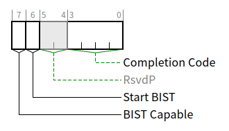

| Bits | 定义            | 描述                                                         | 属性   |
| ---- | --------------- | ------------------------------------------------------------ | ------ |
| 3:0  | Completion Code | 此字段对最近测试的状态进行编码。值0000b表示 Func 已通过测试。非零值表示 Func 测试失败。功能特定的故障代码可以被编码在非零值中。此字段的值仅在设置了 BIST 功能且清除了 Start BIST 时才有意义。该字段的默认值为0000b。如果BIST可用，则此字段必须硬连线到0000b。 | RO     |
| 6    | Start BIST      | 如果设置了 BIST 能力，则设置此位以调用 BIST。BIST 完成时，该 Func 重置该位。如果该位在设置后2秒未清除（BIST未完成），则允许软件使设备失效。将此位写入0b没有任何效果。<br/>如果BIST未设置，则此位必须硬接线至0b。 | RW/RO  |
| 7    | BIST Capable    | 当设置时，此位表示 Func 支持BIST。清除时，函数不支持BIST。   | HWInit |

### Capabilities Pointer (Offset 34h)

该寄存器用于指向由该 Func 实现的能力的链表。由于需要所有 PCI Express 功能来实现 PCI 功率管理能力和 PCI Express 能力结构，因此这些结构必须被包括在链表中的某处; 该寄存器可以指向这些能力结构中的任一个或者指向由该功能实现的可选能力结构。**底部两位被保留并且必须被设置为 00b**。在使用该寄存器作为配置空间中指向新功能的链表的第一条目的指针之前，软件必须屏蔽这些位。具体使用实例见[PCI Capabilities List](#Capabilities List)。

### Interrupt Line Register (Offset 3Ch)

中断线寄存器传送中断线路由信息。寄存器是可读/可写的，并且必须由使用中断引脚的任何 Func 来实现 。该寄存器中的值由系统软件编程，并且是系统架构特定的。Func 本身不使用此值; 而是设备驱动程序和操作系统使用此寄存器中的值。

### Interrupt Pin Register (Offset 3Dh)

中断引脚寄存器是一个只读寄存器，用于标识函数使用的传统中断消息。有效值为01h、02h、03h和04h，分别映射到INTA、INTB、INTC和INTD的传统中断消息。值为00h表示该 Func 不使用传统中断消息。值05h至FFh被保留。

PCI Express 为单个功能设备定义了一个传统中断消息，为多功能设备定义了多达四个传统中断消息。对于单功能装置，仅可使用INTA。

多功能设备上的任何功能都可以使用任何INTx消息。如果设备实现单个传统中断消息，则它必须是INTA; 如果它实现两个传统中断消息，则它们必须是INTA和INTB; 等等。对于多功能设备，所有功能可以使用相同的INTx消息，或者每个功能可以具有其自己的 (最多四个功能) 或其任何组合。单个函数永远不能对多个INTx消息生成中断请求。


## Type 0 配置空间标头

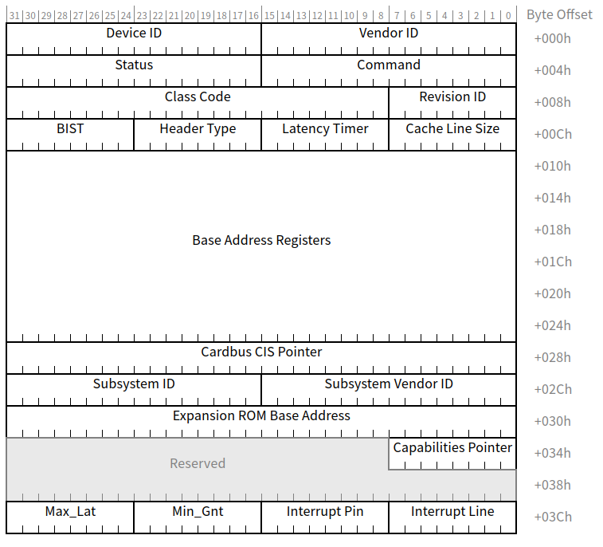

### Type 0 Base Address Registers (Offset 0x10h~0x27h)

如下图所示：Type0 Header最多有6个BAR，而Type1 Header最多有两个BAR。这就意味着，对于Endpoint来说，最多可以拥有6个不同的地址空间。但是实际应用中基本上不会用到6个，通常1~3个BAR比较常见。

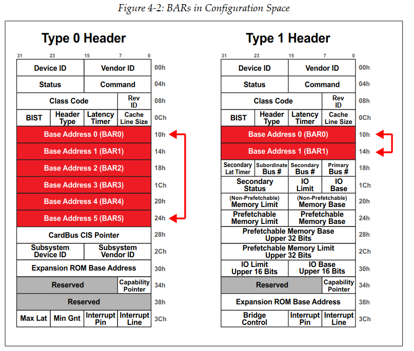

> 《PCI Express Technology 3.0.pdf》Base Address Registers (BARs) p127

若某个设备的BAR没有被全部使用，则对应的BAR应被硬件全部设置为0，并且告知软件这些BAR是不可操作的。一旦BAR的值确定了（Have been programmed），其指定范围内的当前设备中的内部寄存器（或内部存储空间）就可以被访问了。当该设备确认某一个请求（Request）中的地址在自己的BAR的范围内，便会接受这请求。

#### 32位Non‐Prefetchable Memory地址空间请求

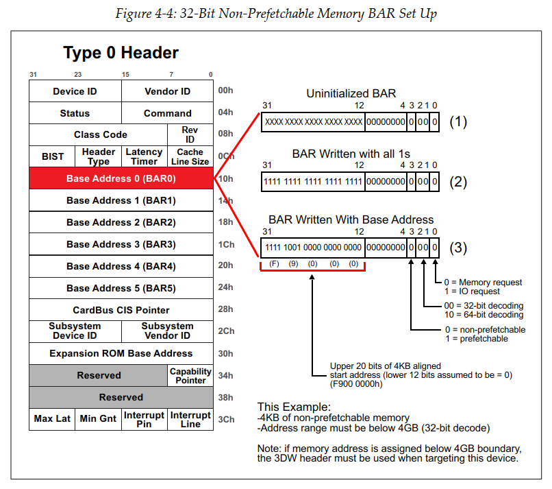

> 《PCI Express Technology 3.0.pdf》 BAR Example 1: 32-bit Memory Address Space Request p128

设置一个BAR的基础步骤

32位不可预取（Non‐Prefetchable）地址空间BAR配置步骤：

1. PCIe设备上电，BAR处于未初始化状态，系统读取BAR0得到数据，硬件设备已经将低位bit固定为一个数值，来指示需要的memory的大小和类型，但是高位bit（可写可读的）则仍然是用X来表示，这代表它们的值还未知。系统软件将会首先把每个BAR都通过配置写操作来将可写入的bit写为全1（当然，被固定的低位bit不会受到配置写操作的影响）
2. 对BAR0写入全1后的状态如上图的（2），这个操作确定了可写的最低位，这个最低位指示了请求的地址空间的大小，再上图中，最低位为12，则请求的BAR地址空间为2^12大小。低4位表明了该存储空间的一些属性（IO映射还是内存映射，32bit地址还是64bit地址，能否预取？有些寄存器只要一读，数据就会清掉，因此，对这样的空间，是不能预读的，因为预读会改变原来的值）

3. 最后一步就是系统软件根据这些信息为BAR 0分配一个地址，将分配的空间的基地址写入到BAR0。

至此，对BAR0的配置就完成了。一旦软件启用了命令寄存器（Command register，偏移地址04h）中的内存地址译码（memory address decoding），那么这个设备就会接受所有地址在F900_0000h-F900_0FFFh（4KB大小）范围内的memory请求。

<center>对BAR0写入全 1 后读取 BAR 的结果</center>

| BAR Bits | 含义                                                         |
| -------- | ------------------------------------------------------------ |
| 0        | 读取为0b，表示一个内存请求, 读取位1b，表示一个IO请求。       |
| 2:1      | 读为00b，指示目标仅支持解码32位地址。                        |
| 3        | 读取为0b，表示该请求是用于非可预取内存的（意味着读取具有副作用）；NP-MMIO。 |
| 11:4     | 读取为全0，表示请求的大小（这些位是硬编码为0的）。           |
| 31:12    | 读取为全1，因为软件尚未使用起始地址编程BAR的上位位。由于第12位是可写的最低有效位，请求的内存大小为2^12 = 4KB。 |

#### 64位Prefetchable Memory地址空间

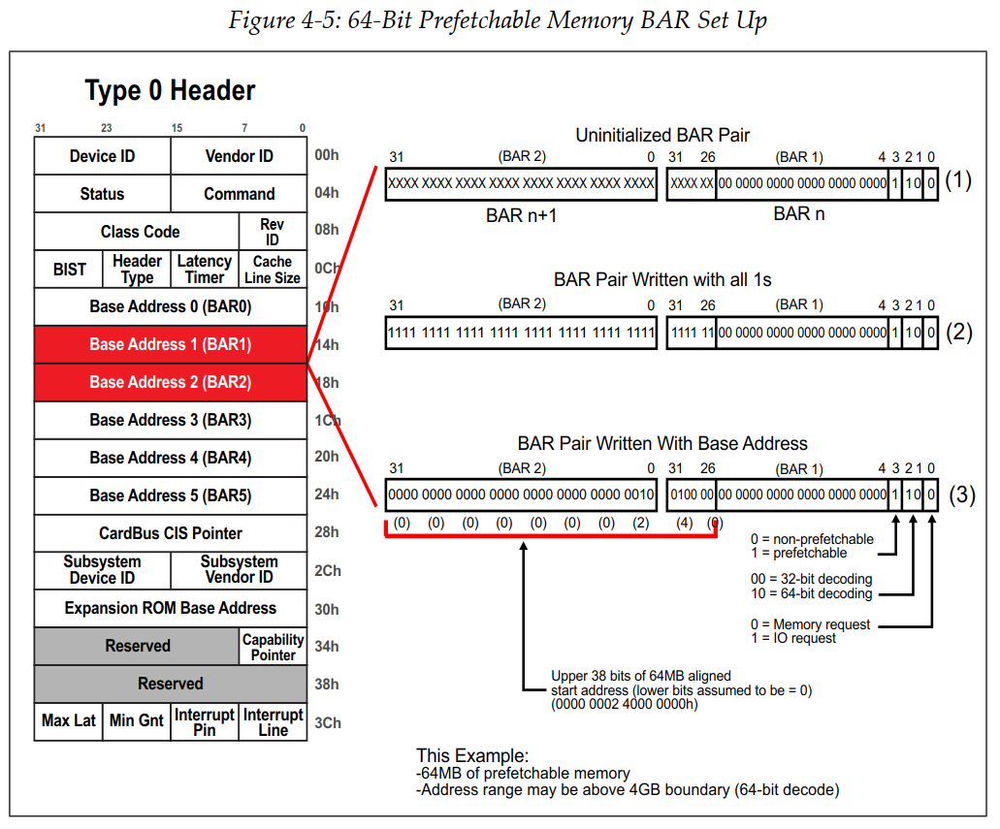

> 《PCI Express Technology 3.0.pdf》 BAR Example 2: 64-bit Memory Address Space Request p132

上图为请求64MB可预取内存（ prefetchable memory）地址空间BAR寄存器的配置过程。在配置超过32位地址空间时，采用两个连续的BAR寄存器来表示。

64位可预取（Non‐Prefetchable）地址空间BAR配置步骤：

1. 上电初始化状态，可看出硬件已将低32位BAR1的低位bit固定为了一个数值，用来指示需要的memory的大小和属性，低32位BAR1的高bit和高32位BAR2的所有bit均为未知值。
2. 系统软件对两个BAR写入全1后，两BAR寄存器的值如上图（2）所示，可根据写入后所有位的值得知请求的BAR空间的大小为2^26。
3. 系统软件根据PCIe设备所需求的空间的大小，在系统内存中申请一段空间。图中的（3）中展示了软件将在系统内存中分配的地址写入BAR寄存器后的结果。如图所示，高32位BAR的bit1置1，低位BAR的bit30置1，表示给PCIe设备分配的系统内存地址空间为2_4000_0000h。

至此，对BAR Pair（BAR 1和BAR 2）的配置就已经完成了。一旦软件启用了命令寄存器（Command register，偏移地址04h）中的内存地址译码，那么这个设备就会接受所有地址在2_4000_0000h-2_4300_0000h（64MB大小）这个范围内的memory请求。

<center>对BAR1、BAR2写入全1后</center>

| BAR  | BAR Bits | 含义                                                         |
| ---- | -------- | ------------------------------------------------------------ |
| 低   | 0        | 读为0b，表示当前请求为Memory请求。                           |
| 低   | 2:1      | 读为10b，表示支持64位地址解析，并且下一个顺序BAR包含地址信息的高32位。 |
| 低   | 3        | 读为1b，表示请求时针对可预取内存；P-MMIO                     |
| 低   | 25：4    | 读为全0，表示请求的内存大小。                                |
| 低   | 31：26   | 读取为全1，因为软件还未将配置的内存地址写入BAR。此处还表示内存地址空间请求的大小为2^26=64MB。 |
| 高   | 31：0    | 读取为全1，这些位将在系统软件写入分配的内存地址的高32位而改变。 |

#### IO地址空间请求

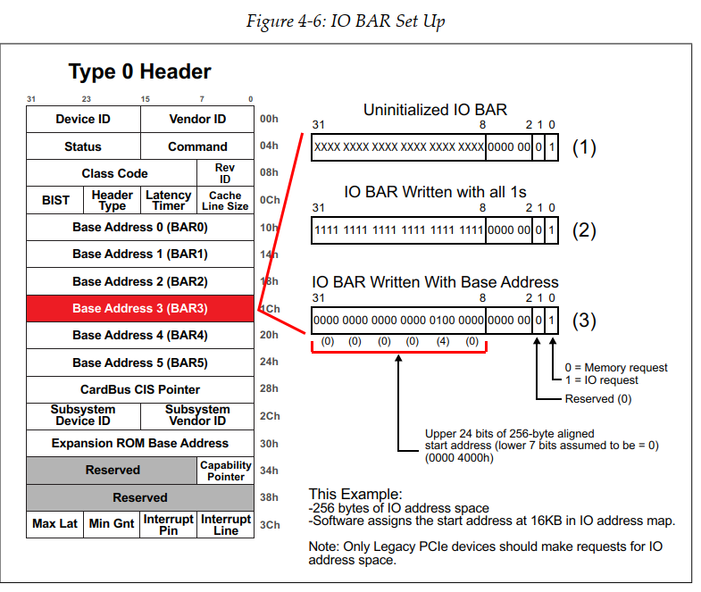

>  《PCI Express Technology 3.0.pdf》 BAR Example 3: IO Address Space Request p133

在前面的两个Memory空间配置的基础上，当前的设备还需要请求IO空间，上图为配置请求IO空间的步骤。

32位IO地址空间的配置步骤：

1. 上电初始化，硬件将BAR3的低几位bit根据设备需要的属性配置为相应的值，如图中（1）所示。之后系统软件对BAR3写入全1。
2. 在系统软件对BAR3写入全1后，根据写之后寄存器的值评估请求的地址空间的大小和属性，如图中（2）所示。
3. 读取BAR3的内容之后，软件知道需要申请256byte大小的IO地址空间，在进行分配之后，将申请的空间的起始地址写入BAR3，如图中（3）所示。

至此，对BAR3的IO空间的配置已完成，一旦软件启用了命令寄存器（Command register，偏移地址04h）中的IO地址译码，那么这个设备就会接受并响应所有地址在4000h-40FFh（256Byte大小）这个范围内的IO事务。

<center>BAR3写入全1之后读取的结果</center>

| BAR Bits | 含义                                                         |
| -------- | ------------------------------------------------------------ |
| 0        | 读取为1b，表示IO请求。                                       |
| 1        | 保留。                                                       |
| 7:2      | 读为0b，表示请求的大小                                       |
| 31:8     | 读为全1，当软件写入分配的系统内存地址空间值后改变，由于最低位为8，所以IO请求的大小为2^8=64MB |

### Cardbus CIS Pointer Register (Offset 28h)

该寄存器最初在 [PC-Card]([https://en.wikipedia.org/wiki/PC_Card) 中描述。其功能不适用于PCI Express。它必须是只读和硬连线到0000 0000h。

### Subsystem Vendor ID Register/Subsystem ID Register (Offset 2Ch/2Eh)

Subsystem Vendor ID 和 Subsystem ID 寄存器用于唯一地标识 pciexpress组件所在的适配器或子系统。它们为供应商提供了一种机制，即使组件上可能具有相同的 PCI Express 组件 (因此具有相同的供应商ID和设备ID)，也可以将其产品彼此区分开来。

### <span id = "Expansion ROM">Expansion ROM Base Address Register (Offset 30h)</span>

某些功能，尤其是用于附加卡的功能，需要本地 EPROMs 来扩展 ROM。该寄存器被定义为处理该扩展ROM的基地址和大小信息。


| Bits  | 定义                             | 描述                                                         | 属性       |
| ----- | -------------------------------- | ------------------------------------------------------------ | ---------- |
| 0     | Expansion ROM Enable             | 该位控制该 Func 是否通过扩展 ROM 基地址寄存器接受对其扩展ROM的访问。 | RO/RW      |
| 3:1   | Expansion ROM Validation Status  | 扩展ROM验证是可选的。当该字段为非零时，它指示扩展ROM内容的硬件验证的状态。 | HwInit/ROS |
| 7:4   | Expansion ROM Validation Details | 包含与扩展ROM验证相关的可选的、特定于实现的详细信息。        | HwInit/ROS |
| 31:11 | Expansion ROM Base Address       | 包含扩展ROM的起始存储器地址的高位21位。扩展ROM基地址寄存器的低11位被软件屏蔽 (设置为零) 以形成32位地址。 | RW/RO      |

### Min_Gnt Register/Max_Lat Register (Offset 3Eh/3Fh)

这些寄存器不适用于PCI Express。它们必须是只读的，并且硬连线到00h。

## Type 1 配置空间标头

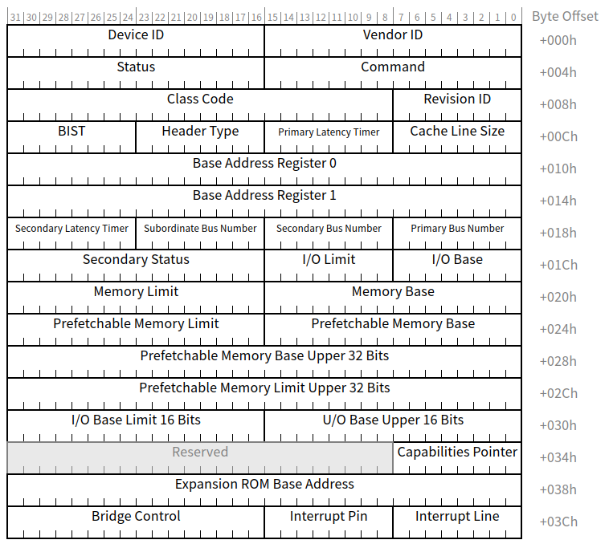

### Type 1 Base Address Registers (Offset 10h-14h)

Type 1 配置空间报头内可用的 BAR 的数量与 Type 0 配置空间报头内可用的 BAR 的定义相同，具体使用的BAR 的数量不同。

### Primary Bus Number Register (Offset 18h)

除非另有说明，此寄存器不被PCI Express功能使用，但必须实现为读写，并且默认值必须为00h，以便与传统软件兼容。

### Secondary Bus Number Register (Offset 19h)

**次级总线号寄存器用于记录桥的次级接口所连接的PCI总线段的总线号**。配置软件对此寄存器中的值进行编程。网桥使用该寄存器来确定何时以及如何对在其主接口上观察到的ID路由TLP进行响应，特别是在执行某种转换之后的某些情况下，何时将TLP转发到其辅助接口。该寄存器必须实现为读/写，并且默认值必须为00h。

### Subordinate Bus Number Register (Offset 1Ah)

**从属总线号寄存器用于记录桥后面 (或从属) 的最高编号PCI总线段的总线号**。配置软件对此寄存器中的值进行编程。网桥使用该寄存器来确定何时以及如何响应在其主接口上观察到的ID路由TLP，特别是何时将TLP转发到其辅助接口。该寄存器必须实现为读写，并且默认值必须为00h。

### Secondary Latency Timer (Offset 1Bh)

此寄存器不适用于PCI Express。它必须是只读的，并且硬连线到00h。

### <span id = "I/O Base/I/O Limit Registers">I/O Base/I/O Limit Registers(Offset 1Ch/1Dh)</span>

I/O基址和I/O限制寄存器是可选的，它们定义了一个地址范围，桥接器使用该地址范围来确定何时将I/O事务从一个接口转发到另一个接口。

如果桥接器不实现I/O地址范围，则I/O基址和I/O限制寄存器都必须实现为只读寄存器，在读取时返回零。如果桥接器支持I/O地址范围，则这些寄存器必须由配置软件初始化，因此不指定默认状态。

如果桥实现I/O地址范围，则I/O基址和I/O限制寄存器的高4位都是可写的，并且对应于地址位address [15:12]。出于地址解码的目的，桥假定I/O基地址 (未在I/O基址寄存器中实现) 的低12地址位address [11:0] 为零。类似地，桥接器假定I/O限制地址 (未在I/O限制寄存器中实现) 的低12地址位address [11:0] 是FFFh。因此，所定义的I/O地址范围的底部将与4 KB边界对齐，并且所定义的I/O地址范围的顶部将比4 KB边界小1。

如果桥接器的次级侧上没有I/O地址，则I/O限制寄存器可以被编程为比I/O基址寄存器小的值。在这种情况下，桥接器将不将任何I/O事务从主总线转发到副总线，而将所有I/O事务从副总线转发到主总线。

I/O Base和I/O Limit寄存器的低四位都是只读的，包含相同的值，并根据下表对桥接器的I/O寻址能力进行编码。

| Bits 3:0 | I/O Addressing Capability |
| -------- | ------------------------- |
| 0h       | 16-bit I/O addressing     |
| 1h       | 32-bit I/O addressing     |
| 2h-Fh    | 保留                      |

如果I/O基址和I/O限制寄存器的低四位的值为0000b，则桥接器仅支持16位I/O寻址 (为了ISA兼容性)，并且出于地址解码的目的，桥接器假定高16位地址位，I/O基址和I/O限制地址 (未在I/O基址和I/O限制寄存器中实现) 的地址 [31:16] 为零。注意，桥必须仍然执行I/O地址的全32位解码 (即，检查地址 [31:16] 是否0000h)。在这种情况下，桥支持的I/O地址范围将限制为I/O空间的前64 KB (0000 0000h到0000 FFFFh)。

如果I/O基址和I/O限制寄存器的低四位的值为0001b，则桥支持32位I/O地址解码，I/O基址上16位和I/O限制上16位保持上16位，分别对应于32位I/O基址和I/O极限地址的地址 [31:16]。在这种情况下，允许系统配置软件在4 GB I/O空间中的任何位置定位桥接器支持的I/O地址范围。请注意，当桥支持32位I/O寻址时，4 KB对齐和粒度限制仍然适用。

### Secondary Status Register (Offset 1Eh)

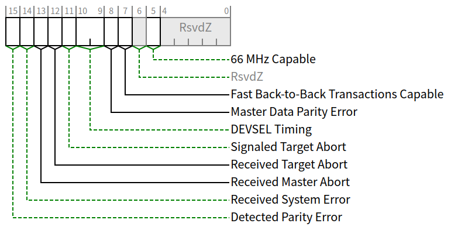

| Bits | 定义                                   | 描述                                                         | 属性 |
| ---- | -------------------------------------- | ------------------------------------------------------------ | ---- |
| 5    | 66 MHz Capable                         | 其功能不适用于PCI Express，并且该位必须硬连线到0b。          | RO   |
| 7    | Fast Back-to-Back Transactions Capable | 其功能不适用于PCI Express，并且该位必须硬连线到0b            | RO   |
| 8    | Master Data Parity Error               | 如果设置了桥控制寄存器中的奇偶错误响应使能位，并且出现以下两种情况之一，则该位由具有类型1配置空间标头的函数设置:<br/>• 端口接收到上游的中毒完成<br/>• 端口向下游传输中毒请求<br/>• 如果奇偶错误响应使能位被清除，则从不设置该位。<br/>该位的默认值为0b。 | RW1C |
| 9:10 | DEVSEL Timing                          | 其功能不适用于PCI Express，并且字段必须硬连线到00b。         | RO   |
| 11   | Signaled Target Abort                  | 当 Type 1 配置空间报头 Func 的次级侧 (对于由 Type 1 报头 Func 本身完成的请求) 完成作为完成者中止错误的发布或非发布请求时，该位被设置。<br/>该位的默认值为0b。 | RW1C |
| 12   | Received Target Abort                  | 当用于 Type 1 配置空间报头功能的次级侧 (用于由 Type 1 报头功能本身发起的请求) 接收到具有完成器中止完成状态的完成时，该位被设置。<br/>该位的默认值为0b。 | RW1C |
| 13   | Received Master Abort                  | 当用于 Type 1 配置空间报头功能 (用于由 Type 1 报头功能本身发起的请求) 的次级侧接收到具有不支持的请求完成状态的完成时，该位被设置。<br/>该位的默认值为0b。 | RW1C |
| 14   | Received System Error                  | 当用于 Type 1 配置空间报头功能的次级侧接收到 ERR_FATAL 或 ERR_NONFATAL 消息时，该位被设置。<br/>该位的默认值为0b。 | RW1C |
| 15   | Detected Parity Error                  | 当有错误的TLP由其次级侧接收时，该位由具有 Type 1 配置空间报头的函数设置，而不管桥控制寄存器中的奇偶错误响应使能位的状态。<br/>该位的默认值为0b。 | RW1C |

### Memory Base Register/Memory Limit Register(Offset 20h/22h)

内存基址和内存限制寄存器定义了一个内存映射地址范围，网桥使用该地址范围来确定何时将内存事务从一个接口转发到另一个接口。

存储器基址寄存器和存储器限制寄存器两者的高12位是可读/可写的，并且对应于32位地址的高12位[31:20]。为了地址解码的目的，桥假定存储器基地址 (未在存储器基址寄存器中实现) 的低20位地址 [19:0] 为零。类似地，桥假定存储器限制地址 (未在存储器限制寄存器中实现) 的低20地址 [19:0] 是 0xfffffh。因此，所定义的存储器地址范围的底部将与1MB边界对齐，并且所定义的存储器地址范围的顶部将比1 MB边界小1，该寄存器的低 4 位必须为 0。

如果在桥的次级侧上没有存储器映射的地址空间，则存储器限制寄存器必须被编程为小于存储器基址寄存器的值。

如果没有可预取存储器空间，并且在桥的次级侧上没有存储器映射空间，则桥将不把任何存储器事务从初级总线转发到次级总线，并且将把所有存储器事务从次级总线转发到初级总线。内存基址和内存限制寄存器的底部四位都是只读的，并且在读取时返回零。这些寄存器必须由配置软件初始化，因此未指定默认状态。

#### 32位Non‐Prefetchable Memory地址空间请求


> 《PCI Express Technology 3.0.pdf》 Figure 4‐9: Example Non‐Prefetchable Memory Base/Limit Register Values p199

不可预取存储器范围仅支持 32 位地址。因此，只有一个寄存器用于基址，一个寄存器用于界限。

如上图所示，一个请求4KB不可预取内存（Non-Prefetchable Memory）地址空间BAR寄存器的配置过程。由于Type 1 标头中的内存基址/限制寄存器只能用于指定地址位 20 及以上（[31:20]）。较低的 20 个地址位 [19:0] 是隐含的。因此，可以使用内存基址/限制寄存器指定的最小地址范围是 1MB。

| Register                        | Value | 描述                                                         |
| ------------------------------- | ----- | ------------------------------------------------------------ |
| (Non‐Prefetchable) Memory Base  | F900h | 该寄存器的高 12 位保存 32 位基址的高 12 位（位 [31:20]）。基址的低 20 位隐含为全 0，这意味着基址始终与 1MB 边界对齐。该寄存器的低 4 位必须为 0。 |
| (Non‐Prefetchable) Memory Limit | F900h | 该寄存器的高 12 位保存 32 位 LIMIT 地址的高 12 位（位 [31:20]）。限制地址的低 20 位均隐含为 F。该寄存器的低 4 位必须为 0。 |

在上述示例中请求并被授予了 4KB 的 NP-MMIO (F900_0000h - F900_0FFFh)。但是由于所定义的存储器地址范围的底部将与1MB边界对齐，及最小只能分配1MB。这意味着 1020KB (F900_1000h - F90F_FFFFh) 的内存地址空间被浪费了，所以会产生一定的地址浪费。该地址空间无法分配给其他端点，试图将浪费的地址空间（F900_1000h至F90F_FFFFh）分配给另一个端点，会导致路由冲突。因为switch仍然会将访问这些地址的数据包转发到原始端点，而原始端点只解码前4KB，其他访问可能无响应或导致错误。

### <span id = "Prefetchable Memory Base">Prefetchable Memory Base/Prefetchable Memory Limit Registers (Offset 24h/26h)</span>

可预取内存基址和可预取内存限制寄存器必须指示支持64位地址。可预取存储器基址和可预取存储器限制寄存器是可选的。它们定义了可预取的存储器地址范围，桥使用该地址范围来确定何时将存储器事务从一个接口转发到另一个接口。

如果桥不实现可预取存储器地址范围，则可预取存储器基址和可预取存储器限制寄存器都必须实现为只读寄存器，其在读取时返回零。如果桥实现可预取存储器地址范围，则这两个寄存器必须实现为读/写寄存器。如果桥接器支持可预取存储器地址范围，则这些寄存器必须由配置软件初始化，因此不指定默认状态。

如果桥实现可预取的存储器地址范围，则**寄存器的高12位是读/写的**，并且对应于32位地址的高12位[31:20]。出于地址解码的目的，桥假定可预取存储器基地址 (未在可预取存储器基址寄存器中实现) 的低20个地址位，地址 [19:0] 为零。类似地，桥假定可预取存储器限制地址 (未在可预取存储器限制寄存器中实现) 的低20位 [19:0] 是 0xfffffh。因此，所定义的可预取存储器地址范围的底部将与1MB 边界对齐，并且所定义的存储器地址范围的顶部将比1MB边界小1。

如果在桥的次级侧上没有可预取存储器，则必须将可预取存储器限制寄存器编程为比可预取存储器基址寄存器更小的值。如果网桥的辅助端没有可预取的内存，并且没有内存映射的地址空间，然后桥不将任何存储器事务从主总线转发到副总线，而是将所有存储器事务从副总线转发到主总线。

可预取内存基址寄存器和可预取内存限制寄存器的**底部4位都是只读的**，包含相同的值，并对桥是否支持64位地址进行编码。**如果这四位的值为0h，则桥接器仅支持32位地址**。**如果这四位具有值01h，则桥支持64位地址**，并且可预取基高32位和可预取极限高32位寄存器分别保持64-bit可预取基地址和极限地址的其余部分。保留所有其他编码。

### Prefetchable Base Upper 32 Bits/Prefetchable Limit Upper 32 Bits Registers (Offset 28h/2Ch)

可预取基址上限32位和可预取极限上限32位寄存器是 [Prefetchable Memory Base](#Prefetchable Memory Base) 和 [Prefetchable Memory Limit Registers](#Prefetchable Memory Base) 的可选扩展。

如果可预取存储器基址和可预取存储器极限寄存器指示支持32位寻址，则可预取基址高32位和可预取极限高32位寄存器都被实现为在读取时返回零的只读寄存器。如果可预取存储器基址和可预取存储器极限寄存器指示支持64位寻址，则可预取基址高32位和可预取极限高32位寄存器被实现为读/写寄存器。如果这些寄存器被实现为读/写寄存器，则它们必须由配置软件初始化，因此不指定默认状态。

如果支持64位可预取内存地址范围，则可预取基数上限32位和可预取上限32位寄存器指定上限32位，对应于地址 [63:32]，指定可预取内存地址范围的64位基地址和限制地址。

#### 64位Prefetchable Memory地址空间请求

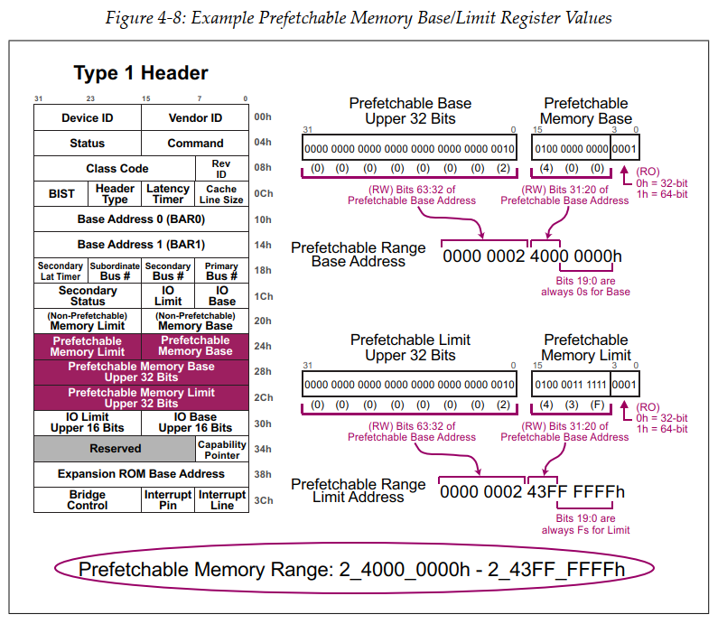

>  《PCI Express Technology 3.0.pdf》 Figure 4‐9: Example Non‐Prefetchable Memory Base/Limit Register Values p196

如上图所示，一个请求64MB可预取内存（ Prefetchable Memory）地址空间BAR寄存器的配置过程。由于Type 1 标头中的内存基址/限制寄存器只能用于指定地址位 20 及以上（[31:20]）。较低的 20 个地址位 [19:0] 是隐含的。因此，可以使用内存基址/限制寄存器指定的最小地址范围是 1MB。

| Register                                | Value     | 描述                                                         |
| --------------------------------------- | --------- | ------------------------------------------------------------ |
| Prefetchable Memory Base                | 4001h     | 该寄存器的高 12 位保存 32 位基址的高 12 位（位 [31:20]）。基址的低 20 位隐含为全 0，这意味着基址始终与 1MB 边界对齐。该寄存器的低 4 位指示桥接器是否支持 64 位地址解码器，这意味着使用上基址/限制寄存器。 |
| Prefetchable Memory Limit               | 43F1h     | 该寄存器的高 12 位保存 32 位 LIMIT 地址的高 12 位（位 [31:20]）。限制地址的低 20 位均隐含为 F。该寄存器的低 4 位与基址寄存器的低 4 位具有相同的含义。 |
| Prefetchable Memory Base Upper 32 Bits  | 00000002h | 保存可预取存储器的 64 位基址的高 32 位。                     |
| Prefetchable Memory Limit Upper 32 Bits | 00000002h | 保存可预取存储器的 64 位 LIMIT 地址的高 32 位。              |

### I/O Base Upper 16 Bits/I/O Limit Upper 16 Bits Registers (Offset 30h/32h)

I/O基本上限16位和I/O限制上限16位寄存器是对 [I/O Base](#I/O Base/I/O Limit Registers) 和 [I/O Limit](#I/O Base/I/O Limit Registers) 寄存器的可选扩展。如果 [I/O Base](#I/O Base/I/O Limit Registers) 和 [I/O Limit](#I/O Base/I/O Limit Registers) 寄存器指示支持16位I/O地址解码，则 I/O Base 上16位和 I/O Limit 上16位寄存器被实现为只读寄存器，其在读取时返回零。

如果 I/O Base 和 I/O Limit 寄存器指示支持32位I/O寻址，则 I/O Base 上16位和 I/O Limit 上16位寄存器必须由配置软件初始化，因此不指定默认状态。

如果支持32位I/O地址解码，则 I/O Base 上16位和I/O限制上16位寄存器分别指定32位基址和限制地址的上16位，对应于地址 [31:16]。指定I/O地址范围。

#### 32位IO地址空间请求


 《PCI Express Technology 3.0.pdf》 Figure 4‐9: Example Non‐Prefetchable Memory Base/Limit Register Values p201

如上图所示，一个请求 256B IO地址空间BAR寄存器的配置过程。由于Type 1 标头中的I/O Base/I/O Limit寄存器只能用于指定地址位12及以上（[15:12]）。较低的 12个地址位 [11:0] 是隐含的。因此，可以使用内存基址/限制寄存器指定的最小地址范围是 4KB。由于桥中只能指定 IO 地址范围的 [15:12] 位，这意味着系统中最多可以有 16 (2<sup>4</sup>) 个不同的 IO 地址范围。

| Register               | Value | 描述                                                         |
| ---------------------- | ----- | ------------------------------------------------------------ |
| IO Base                | 40h   | 该寄存器的高 4 位保存 16 位基址的高 4 位（位 [15:12]）。基址的低 12 位隐含为全 0，这意味着基址始终与 4KB 边界对齐。该寄存器的低 4 位指示桥是否支持 32 位 IO 地址解码器，这意味着使用上限基址/限制寄存器。 |
| IO Limit               | 40h   | 该寄存器的高 4 位保存 16 位 LIMIT 地址的高 4 位（位 [15:12]）。限制地址的低 12 位均隐含为 F。该寄存器的低 4 位与基址寄存器的低 4 位具有相同的含义。 |
| IO Base Upper 16 Bits  | 0000h | 保存IO Base基地址的高16位。                                  |
| IO Limit Upper 16 Bits | 0000h | 保存IO Limit地址的高16位。                                   |

### Expansion ROM Base Address Register (Offset 38h)

该寄存器在 [Expansion ROM Base Address Register](#Expansion ROM) 定义。然而，寄存器在 Type 1 配置空间报头内的偏移不同于 Type 0 配置空间报头内的偏移。

### Bridge Control Register (Offset 3Eh)

桥控制寄存器提供对 [命令寄存器](#Command Register) 的扩展，该扩展特定于具有 Type 1 配置空间报头的功能。桥控制寄存器为辅助接口提供许多与主接口的命令寄存器所提供的相同的控制。有一些位会影响网桥的两个接口的操作。

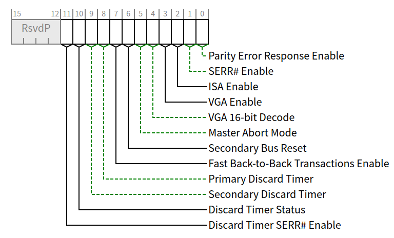

| Bits | 定义                                  | 描述                                                         | 属性 |
| ---- | ------------------------------------- | ------------------------------------------------------------ | ---- |
| 0    | Parity Error Response Enable          | 该位控制在辅助状态寄存器中的主数据奇偶校验错误位中的错误 TLP 的记录。<br/>该位的默认值为0b。 | RW   |
| 1    | SERR# Enable                          | 该位控制从次要到主要的 ERR_COR、ERR_NONFATAL 和ERR_FATAL 的转发。<br/>该位的默认值为0b | RW   |
| 2    | ISA Enable                            | 修改网桥对ISA I/O地址的响应。这仅适用于由I/O基址和I/O限制寄存器启用且位于I/O地址空间的前64 KB (0000 0000h到0000 FFFFh) 中的I/O地址。如果设置了该位，则桥将阻止寻址每个 1KB 块中的最后768个字节的I/O事务的从主到次的任何转发。在相反的方向上 (次要到主要)，如果I/O事务寻址每个 1KB 块中的最后768个字节，则它们将被转发。<br/>**0b**   将I/O基址和I/O限制寄存器定义的地址范围内的所有I/O地址向下游转发；<br/>**1b**   转发由I/O基础和I/O定义的地址范围内的上游ISA I/O地址限制前64 KB PCI I/O 地址空间中的寄存器 (每个1 KB块的前768个字节<br/>该位的默认值为0b。 | RW   |
| 3    | VGA Enable                            | 修改网桥对VGA兼容地址的响应。如果设置了VGA使能位，则网桥将肯定地解码并将主接口上的以下访问转发到副接口 (相反，阻止将这些地址从副接口转发到主接口):<br/>• 内存访问范围为000A 0000h至000B FFFFh<br/>• I/O地址空间的前64 KB中的I/O地址 (地址 [31:16] 是0000h)，其中地址 [9:0] 在3B0h到3BBh和3C0h到3DFh的范围内 (包括由VGA 16位解码的设置确定的ISA地址别名)<br/><br/>如果设置了VGA使能位，则这些访问的转发独立于由I/O基址和极限寄存器、存储器基址和极限寄存器以及桥的可预取存储器基址和极限寄存器定义的I/O地址范围和存储器地址范围。(当设置VGA使能位时，这些访问的转发也独立于ISA使能位 (在桥控制寄存器中) 的设置。这些访问的转发由命令寄存器中的I/O空间使能位和存储器空间使能位限定。)<br/><br/>**0b**   不要将VGA兼容的内存和I/O地址从主接口转发到辅助接口 (上面定义的地址)，除非已按定义的I/O和内存地址范围启用了转发;<br/>**1b**   将VGA兼容的内存和I/O地址 (上面定义的地址) 从主接口转发到辅助接口 (如果设置了I/O空间启用位和内存空间启用位)，与I/O和内存地址范围无关，也与ISA启用位无关。<br/>允许不支持VGA的函数将该位硬连线到0b。<br/>该位的默认值为0b。 | RW   |
| 4    | VGA 16-bit Decode                     | 该位仅在该寄存器的位3 (VGA使能) 也被设置的情况下具有意义，从而使能VGA I/O解码并由桥接器转发。<br/>该位使系统配置软件能够在10位和16位I/O地址解码之间进行选择，以用于从主寄存器转发到辅助寄存器的所有VGA I/O寄存器访问。<br/>**0b**   对VGA I/O访问执行10位地址解码<br/>**1b**   对VGA I/O访问执行16位地址解码<br/>允许不支持VGA的函数将该位硬连线到0b。<br/>该位的默认值为0b。 | RW   |
| 5    | Master Abort Mode                     | 其功能不适用于PCI Express，并且该位必须硬连线到0b。          | RW   |
| 6    | Secondary Bus Reset                   | 设置此位会触发相应 PCI Express 端口上的热重置。<br/>软件必须确保最小复位持续时间 (T<sub>rst</sub>)。除非使用就绪通知机制 或在相关功能的状态寄存器中设置了立即就绪位，否则软件和系统必须遵守首次访问后重置定时要求。<br/>除非需要更新端口状态，否则不得更改端口配置寄存器。<br/>该位的默认值为0b。 | RO   |
| 7    | Fast Back-to-Back Transactions Enable | 其功能不适用于PCI Express，并且该位必须硬连线到0b。          | RW   |
| 8    | Primary Discard Timer                 | 其功能不适用于PCI Express，并且该位必须硬连线到0b。          | RO   |
| 9    | Secondary Discard Timer               | 其功能不适用于PCI Express，并且该位必须硬连线到0b。          | RO   |
| 10   | Discard Timer Status                  | 其功能不适用于PCI Express，并且该位必须硬连线到0b。          | RO   |
| 11   | Discard Timer SERR# Enable            | 其功能不适用于PCI Express，并且该位必须硬连线到0b。          | RO   |

# 标准PCI Express Capbility结构（0x40h~0xFFh）

PCI-X 和PCIe 总线规范要求其设备必须支持Capabilities 结构。在PCI 总线的基本配置空间中，包含一个Capabilities Pointer 寄存器，该寄存器存放Capabilities 结构链表的头指针。在一个PCIe 设备中，可能含有多个Capability 结构，这些寄存器组成一个链表。

而PCIe的Capabilities List也分为两个部分：PCI兼容部分 [PCI Capabilities List](#Capabilities List) 和PCIe扩展部分 [Extended Capabilities List](#ExtenCapabilites)。

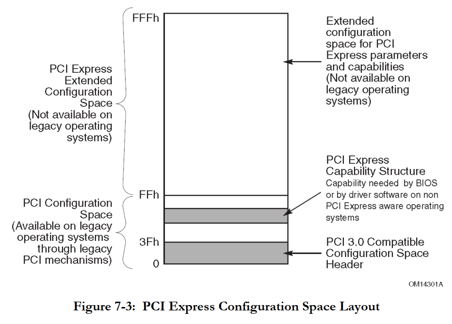

存不存在这个链表可以通过PCI Status Register的bit4（Capabilities List）指示，当其为1表示存在；否则不存在；0x34h指示第一个Capabilities的指针；


> 《PCI Express® Base Specification Revision 5.0.pdf》7.5.3 PCI Express Capability Structure p719

## <span id = "Capabilities List">PCI Capabilities List</span>

其中每一个Capability 结构都有唯一的ID 号，每一个Capability 寄存器都有一个指针，这个指针指向下一个Capability 结构，从而组成一个单向链表结构，这个链表的最后一个Capability 结构的指针为0。链表开始的指针地址为0x34处的1byte数值，寻址过程如下:

### 寻址过程

1. 查询是否支持Capability，查看标准配置空间的0x06h（Status Register）的bit4。

2. 若支持，标准配置头空间的0x34h（Capabilities Pointer）寄存器存放的值为存放第一个Capability结构的指针，根据指针查找到第一个Capability结构。
3. 每个Capability包括第一个`8bit的ID域`、第二个`8bit的指针`以及其他一些寄存器来执行相关Capabilites，ID由 PCI SIG分配，指针指向下一个Capability的位置（当其值为0x00h时表示链表结束）。

例子：

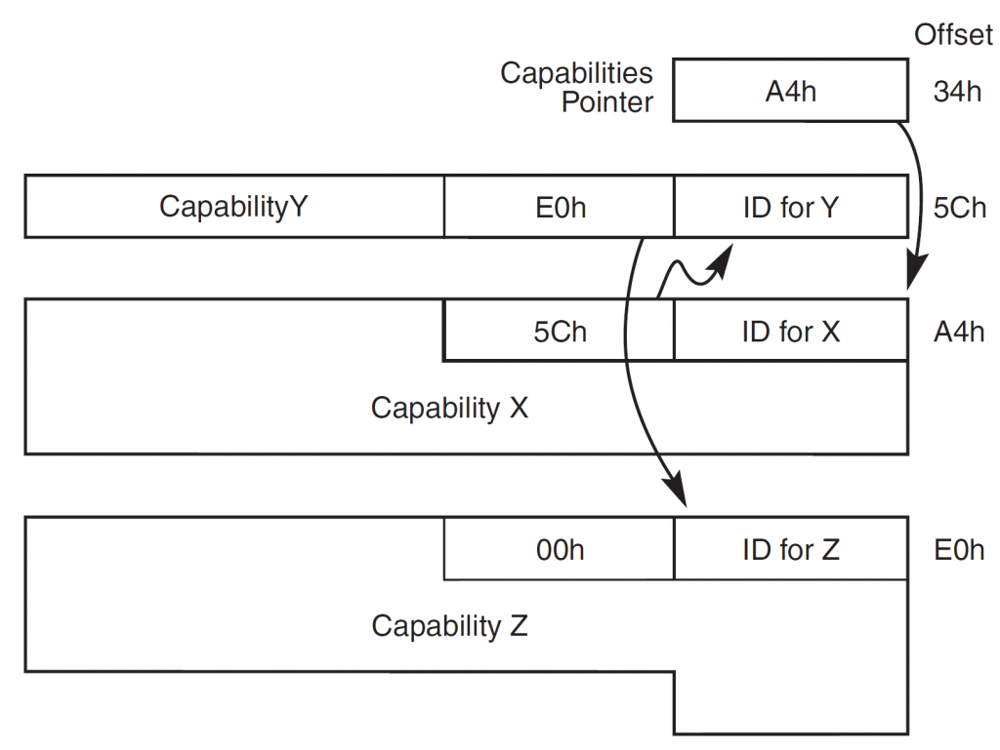

上面的例子给出：当标准配置头空间的0x06h寄存器的bit4为1时，0x34h寄存器存放的值为0xA4h，即第一个Capability结构的位置为0xA4h，第二个Capability结构的位置为0x5Ch，第三个Capability结构的位置为0xE0h，之后Capability结构链表结束。

在命令行中可使用以下命令查看PCI设备的配置空间值：

```bash
lspci -vvvxxxx -s <id>
```

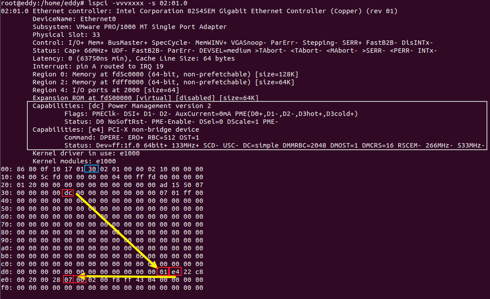

在上图中0x06h为0x30h，bit4为1，则Capability结构有效，查看0x34寄存器为0xdc，即指向配置空间的0xdc，查找0xdc之后可知Capability ID为0x01，则此处的Capability结构用于PCI电源管理。下一个的Capability的结构地址为0xe4，查找0xe4，此时Capability ID为0x07，表示为PCI-X相关，下一个Capability结构指针的值为0x00，则链表结束。

### Capbility IDs

| ID     | Capability                                                   |
| ------ | ------------------------------------------------------------ |
| 00h    | 保留                                                         |
| 01h    | PCI Power Management InterfacePCI（电源管理接口）：此功能结构提供了标准接口，以控制设备功能中的电源管理功能。_PCI Bus Power Management Interface Specification_ 已完整记录。 |
| 02h    | AGP：此功能结构标识能够使用加速图形端口功能的控制器。完整的文档可以在 _Accelerated Graphics Port Interface Specification_ 查看。 |
| 03h    | VPD：此功能结构标识支持重要产品数据的设备功能。此功能的完整文档可以在_PCI Local Bus Specification_ 中查看 |
| 04h    | Slot Identification：此功能结构标识提供外部扩展功能的桥梁。有关此功能的完整文档可以_PCI-to-PCI Bridge Architecture Specification_找到。 |
| 05h    | Message Signaled Interrupts（MSI）：此功能结构标识了可以执行消息信号中断传递的设备功能。此功能的完整文档可以在_PCI Local Bus Specification_找到。 |
| 06h    | CompactPCI Hot Swap：此功能结构提供了一个标准接口，用于控制和感测设备中的状态，该设备支持热插拔插入和提取CompactPCI系统。此功能记录在_CompactPCI Hot Swap Specification PICMG 2.1, R1.0_中，可在http://www.picmg.org获得。 |
| 07h    | PCI-X：有关详细信息，请参阅_PCI-X Protocol Addendum to the PCI Local Bus Specification_协议附录。 |
| 08h    | HyperTransport：此功能结构为实现HyperTransport技术链路的设备提供控制和状态。有关详细信息，请参阅_HyperTransport I/O Link Specification_，网址为http://www.hypertransport.org. |
| 09h    | Vendor Specific（厂商特定）：该Capability结构允许设备厂商使用Capability机制来公开特定于厂商的寄存器。在Capability结构中，紧随下一个指针后面的字节被定义为长度字段。该长度字段提供了Capability结构中字节数的数量（包括Capability ID和下一个指针字节）。Capability结构中剩余的所有字节都是特定于厂商的。 |
| 0Ah    | Debug port （调试端口）                                      |
| 0Bh    | CompactPCI central resource control（CompactPCI中央资源控制）：此能力的定义可以在_PICMG 2.13_规范中找到（[http://www.picmg.com](http://www.picmg.com)) |
| 0Ch    | PCI Hot-Plug：此功能ID表示相关设备符合标准热插拔控制器型号。 |
| 0Dh    | PCI Bridge Subsystem Vendor ID（PCI桥子系统供应商ID）        |
| 0Eh    | AGP 8x                                                       |
| 0Fh    | Secure Device（安全设备）                                    |
| 10h    | PCI Express                                                  |
| 11h    | MSI-X：此功能标识标识基本MSI功能的可选扩展                   |
| 12h    | Serial ATA Data/Index Configuration                          |
| 13h    | Advanced Features (AF) （高级功能(AF)）：此功能的完整文档可在_Advanced Capabilities for Conventional PCI ECN_中找到 |
| 14h    | Enhanced Allocation（增强型分配）                            |
| Others | 保留                                                         |

> 《PCI Code and ID Assignment Specification Revision 1.11》2. Capability IDs p22

### Linux内核中对Capility IDs的定义

`/include/uapi/linux/pci_regs.h`

```c

/* Capability lists */

#define PCI_CAP_LIST_ID		0	/* Capability ID */
#define  PCI_CAP_ID_PM		0x01	/* Power Management */
#define  PCI_CAP_ID_AGP		0x02	/* Accelerated Graphics Port */
#define  PCI_CAP_ID_VPD		0x03	/* Vital Product Data */
#define  PCI_CAP_ID_SLOTID	0x04	/* Slot Identification */
#define  PCI_CAP_ID_MSI		0x05	/* Message Signalled Interrupts */
#define  PCI_CAP_ID_CHSWP	0x06	/* CompactPCI HotSwap */
#define  PCI_CAP_ID_PCIX	0x07	/* PCI-X */
#define  PCI_CAP_ID_HT		0x08	/* HyperTransport */
#define  PCI_CAP_ID_VNDR	0x09	/* Vendor-Specific */
#define  PCI_CAP_ID_DBG		0x0A	/* Debug port */
#define  PCI_CAP_ID_CCRC	0x0B	/* CompactPCI Central Resource Control */
#define  PCI_CAP_ID_SHPC	0x0C	/* PCI Standard Hot-Plug Controller */
#define  PCI_CAP_ID_SSVID	0x0D	/* Bridge subsystem vendor/device ID */
#define  PCI_CAP_ID_AGP3	0x0E	/* AGP Target PCI-PCI bridge */
#define  PCI_CAP_ID_SECDEV	0x0F	/* Secure Device */
#define  PCI_CAP_ID_EXP		0x10	/* PCI Express */
#define  PCI_CAP_ID_MSIX	0x11	/* MSI-X */
#define  PCI_CAP_ID_SATA	0x12	/* SATA Data/Index Conf. */
#define  PCI_CAP_ID_AF		0x13	/* PCI Advanced Features */
#define  PCI_CAP_ID_EA		0x14	/* PCI Enhanced Allocation */
#define  PCI_CAP_ID_MAX		PCI_CAP_ID_EA
#define PCI_CAP_LIST_NEXT	1	/* Next capability in the list */
#define PCI_CAP_FLAGS		2	/* Capability defined flags (16 bits) */
#define PCI_CAP_SIZEOF		4
```

## PCIe Extended Capabilities List

见 [扩展配置空间](#ExtenCapabilites)

### Extended Capabilities IDs

| ID    | Extended Capability                                          |
| ----- | ------------------------------------------------------------ |
| 0000h | NULL Capability：除了扩展能力头中的寄存器外，该能力不包含其他寄存器。 |
| 0001h | Advanced Error Reporting (AER) ：（高级错误报告 (AER)）      |
| 0002h | Virtual Channel (VC)（虚拟通道 (VC)）： 在设备中不存在 MFVC 扩展上限结构时使用 |
| 0003h | Device Serial Number（设备序列号）                           |
| 0004h | Power Budgeting                                              |
| 0005h | Root Complex Link Declaration                                |
| 0006h | Root Complex Internal Link Control                           |
| 0007h | Root Complex Event Collector Endpoint Association            |
| 0008h | Multi-Function Virtual Channel (MFVC)（多功能虚拟通道 (MFVC)） |
| 0009h | Virtual Channel (VC)（虚拟通道 (VC) ）：在设备中存在 MFVC 扩展上限结构时使用 |
| 000Ah | Root Complex Register Block (RCRB) Header                    |
| 000Bh | Vendor-Specific Extended Capability (VSEC) （厂商特定扩展功能 (VSEC)） |
| 000Ch | Configuration Access Correlation (CAC)（配置访问关联 (CAC) ）：由 PCI Express ECN 的可信配置空间 (TCS) 定义，不再受支持 |
| 000Dh | Access Control Services (ACS) （访问控制服务 (ACS)）         |
| 000Eh | Alternative Routing-ID Interpretation (ARI) （替代路由 ID 解释 (ARI)） |
| 000Fh | Address Translation Services (ATS) （地址转换服务 (ATS)）    |
| 0010h | Single Root I/O Virtualization (SR-IOV) （单根 I/O 虚拟化 (SR-IOV)） |
| 0011h | Multi-Root I/O Virtualization (MR-IOV)（多根 I/O 虚拟化 (MR-IOV) ）：在多根 I/O 虚拟化和共享规范中定义 |
| 0012h | Multicast                                                    |
| 0013h | Page Request Interface (PRI) （页面请求接口 (PRI)）          |
| 0014h | Reserved for AMD                                             |
| 0015h | Resizable BAR（可调整大小的 BAR）                            |
| 0016h | Dynamic Power Allocation (DPA) （动态功率分配 (DPA)）        |
| 0017h | TPH Requester                                                |
| 0018h | Latency Tolerance Reporting (LTR)（延迟容忍报告 (LTR)）      |
| 0019h | Secondary PCI Express（二级 PCI Express）                    |
| 001Ah | Protocol Multiplexing (PMUX) （协议复用 (PMUX)）             |
| 001Bh | Process Address Space ID (PASID) （进程地址空间 ID (PASID)） |
| 001Ch | LN Requester (LNR)                                           |
| 001Dh | Downstream Port Containment (DPC)                            |
| 001Eh | L1 PM Substates                                              |
| 001Fh | Precision Time Measurement (PTM) （精密时间测量 (PTM)）      |
| 0020h | PCI Express over M-PHY (M-PCIe)                              |
| 0021h | FRS Queueing                                                 |
| 0022h | Readiness Time Reporting                                     |
| 0023h | Designated Vendor-Specific Extended Capability（指定供应商特定的扩展功能） |
| 0024h | VF Resizable BAR                                             |
| 0025h | Data Link Feature                                            |
| 0026h | Physical Layer 16.0 GT/s                                     |
| 0027h | Lane Margining at the Receiver                               |
| 0028h | Hierarchy ID                                                 |
| 0029h | Native PCIe Enclosure Management (NPEM)                      |
| 002Ah | Physical Layer 32.0 GT/s                                     |
| 002Bh | Alternate Protocol                                           |
| 002Ch | System Firmware Intermediary (SFI)                           |
| other | 保留                                                         |

> 《PCI Code and ID Assignment Specification Revision 1.11.pdf》3. Extended Capability IDs p24

### Linux内核中对Extended Capility IDs的定义

`/include/uapi/linux/pci_regs.h`

```c
#define PCI_EXT_CAP_ID_ERR	0x01	/* Advanced Error Reporting */
#define PCI_EXT_CAP_ID_VC	0x02	/* Virtual Channel Capability */
#define PCI_EXT_CAP_ID_DSN	0x03	/* Device Serial Number */
#define PCI_EXT_CAP_ID_PWR	0x04	/* Power Budgeting */
#define PCI_EXT_CAP_ID_RCLD	0x05	/* Root Complex Link Declaration */
#define PCI_EXT_CAP_ID_RCILC	0x06	/* Root Complex Internal Link Control */
#define PCI_EXT_CAP_ID_RCEC	0x07	/* Root Complex Event Collector */
#define PCI_EXT_CAP_ID_MFVC	0x08	/* Multi-Function VC Capability */
#define PCI_EXT_CAP_ID_VC9	0x09	/* same as _VC */
#define PCI_EXT_CAP_ID_RCRB	0x0A	/* Root Complex RB? */
#define PCI_EXT_CAP_ID_VNDR	0x0B	/* Vendor-Specific */
#define PCI_EXT_CAP_ID_CAC	0x0C	/* Config Access - obsolete */
#define PCI_EXT_CAP_ID_ACS	0x0D	/* Access Control Services */
#define PCI_EXT_CAP_ID_ARI	0x0E	/* Alternate Routing ID */
#define PCI_EXT_CAP_ID_ATS	0x0F	/* Address Translation Services */
#define PCI_EXT_CAP_ID_SRIOV	0x10	/* Single Root I/O Virtualization */
#define PCI_EXT_CAP_ID_MRIOV	0x11	/* Multi Root I/O Virtualization */
#define PCI_EXT_CAP_ID_MCAST	0x12	/* Multicast */
#define PCI_EXT_CAP_ID_PRI	0x13	/* Page Request Interface */
#define PCI_EXT_CAP_ID_AMD_XXX	0x14	/* Reserved for AMD */
#define PCI_EXT_CAP_ID_REBAR	0x15	/* Resizable BAR */
#define PCI_EXT_CAP_ID_DPA	0x16	/* Dynamic Power Allocation */
#define PCI_EXT_CAP_ID_TPH	0x17	/* TPH Requester */
#define PCI_EXT_CAP_ID_LTR	0x18	/* Latency Tolerance Reporting */
#define PCI_EXT_CAP_ID_SECPCI	0x19	/* Secondary PCIe Capability */
#define PCI_EXT_CAP_ID_PMUX	0x1A	/* Protocol Multiplexing */
#define PCI_EXT_CAP_ID_PASID	0x1B	/* Process Address Space ID */
#define PCI_EXT_CAP_ID_DPC	0x1D	/* Downstream Port Containment */
#define PCI_EXT_CAP_ID_L1SS	0x1E	/* L1 PM Substates */
#define PCI_EXT_CAP_ID_PTM	0x1F	/* Precision Time Measurement */
#define PCI_EXT_CAP_ID_DVSEC	0x23	/* Designated Vendor-Specific */
#define PCI_EXT_CAP_ID_DLF	0x25	/* Data Link Feature */
#define PCI_EXT_CAP_ID_PL_16GT	0x26	/* Physical Layer 16.0 GT/s */
#define PCI_EXT_CAP_ID_MAX	PCI_EXT_CAP_ID_PL_16GT
```

# 扩展配置空间（0x100h~0x3FFh）<a name="ExtenCapabilites"/>

**扩展配置空间则是用来描述设备的扩展能力和配置的**。PCIe 设备可以实现许多扩展功能，例如 MSI (Message Signaled Interrupt)、MSI-X (Message Signaled Interrupts eXtended)、SR-IOV (Single Root I/O Virtualization)、AER (Advanced Error Reporting)、L1 Substate Power Management等等，这些能力需要使用扩展配置空间进行描述和配置。扩展配置空间的地址范围为 0x100 到 0x3FF，长度为 256 个字节。扩展配置空间中的每个字节都可以被读取和写入，用于描述设备的各种扩展能力和配置。PCIe 规范定义了许多不同的扩展能力结构体，如 PCIe Capability、MSI Capability、MSI-X Capability、SR-IOV Capability 等等，这些结构体包含了各种字段和寄存器，用于描述设备的扩展能力和配置。

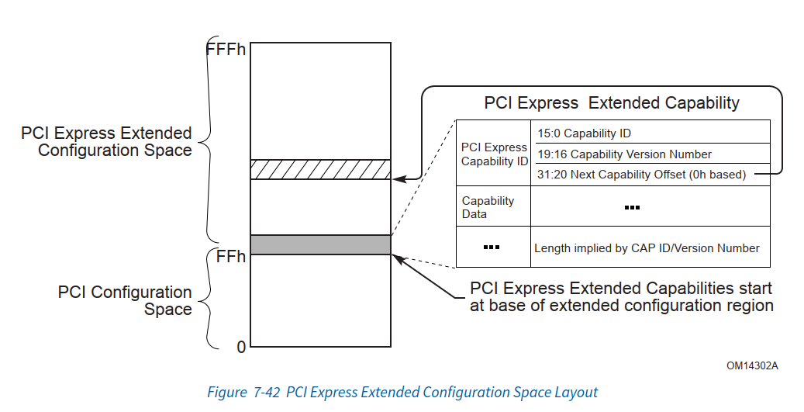

> 《PCI Express® Base Specification Revision 5.0.pdf》7.6 PCI Express Extended Capabilities p772

> **Extended Configuration Space**
> Refer to Figure 3‐3 on page 90 during this discussion. When PCIe was introduced, there was not enough room in the original 256‐byte configuration region to contain all the new capability structures needed. So the size of configuration space was expanded from 256 bytes per function to 4KB, called the Extended Configuration Space. The 960‐dword Extended Configuration area is only accessible using the Enhanced configuration mechanism and is therefore not visible to legacy PCI software. It contains additional optional Extended Capability registers for PCIe such as those listed in Figure 3‐3 (not a complete list).
>
> 《PCI Express Technology 3.0.pdf》Extended Configuration Space p89

> 在此讨论过程中，请参见第90页上的图3-3。**当PCIe出现时，原始256字节配置区域中没有足够的空间来容纳所需的所有新能力结构**。因此，配置空间的大小从每个功能的256字节扩展到4KB，称为扩展配置空间。960个双字节的扩展配置区域只能使用增强型配置机制进行访问，因此对于传统的PCI软件来说是不可见的。它包含了PCIe的其他可选扩展能力寄存器，如图3-3中列出的寄存器（不完整列表）。


> 《PCI Express Technology 3.0.pdf》Extended Configuration Space p90

例子：[PCIE-Capability能力集协议解释_逆风水手的博客-CSDN博客](https://blog.csdn.net/qq_21688871/article/details/130621768)

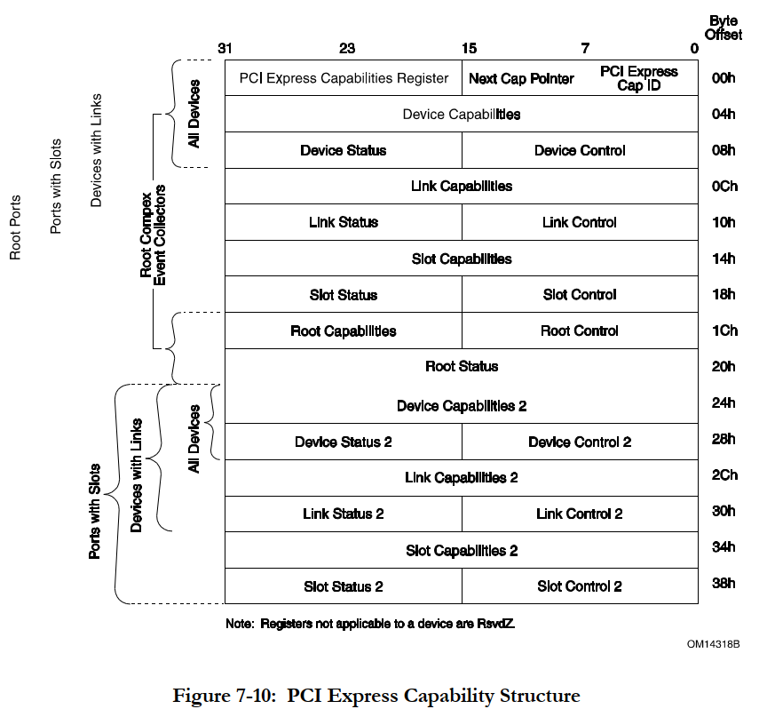

> 《PCI Express_ Base Specification Revision 4.0 Version 0.3 ( PDFDrive ) .pdf》 7.8. PCI Express Capability Structure p595

## MSI Capability结构

《PCI Express® Base Specification Revision 5.0.pdf》7.7.1 p773

《PCI Express Technology 3.0.pdf》Chapter 17: Interrupt Support->The MSI CApability Structure p812

MSI Capability 结构共有四种组成方式， 分别是 32 和 64 位的 Message 结构， 32 位和 64位带中断 Masking 的结构。 MSI 报文可以使用 32 位地址或者 64 位地址， 而且可以使用Masking 机制使能或者禁止某个中断源。


> 《PCI Express Technology 3.0.pdf》Chapter 17: Interrupt Support->The MSI CApability Structure p813

具体寄存器描述参见《PCI Express Technology 3.0.pdf》p814 、《PCI Express® Base Specification Revision 5.0.pdf》7.7.1 MSI Capability Structures p775、《PCI Express体系结构导读 (王齐) 》10.1

### Capability ID 字段（offset 00h）

记载 MSI Capability 结构的 ID 号， 其值为 0x05。 

### Next Pointer 字段（offset 01h）

存放下一个 Capability 结构的地址。

### Message Control 字段（offset 02h）

该字段存放当前 PCIe 设备使用 MSI 机制进行中断请求的状态与控制信息。

### Message Address 字段（offset 04h）

当 MSI Enable 位有效时， 该字段存放 MSI 存储器写事务的目的地址的低 32 位。 该字段的 31∶ 2 字段有效， 系统软件可以对该字段进行读写操作； 该字段的第 1 ～ 0 位为 0。

### Message Upper Address 字段（offset 08h）

如果 64 bit Address Capable 位有效， 该字段存放 MSI 存储器写事务的目的地址的高 32 位。

### Message Data 字段（offset 08h or 0Ch）

该字段可读写。 当 MSI Enable 位有效时， 该字段存放 MSI 报文使用的数据。 该字段保存的数值与处理器系统相关， 在 PCIe 设备进行初始化时， 处理器将初始化该字段， 而且不同的处理器填写该字段的规则并不相同。 如果 Multiple Message Enable 字段不为 0b000 时 （ 即该设备支持多个中断请求时） ， PCIe 设备可以通过改变 Message Data 字段的低位数据发送不同的中断请求。

### Mask Bits 字段（offset 0Ch or 10h）

PCIe 总线规定当一个设备使用 MSI 中断机制时， 最多可以使用 32 个中断向量， 从而一个设备最多可以发送 32 种中断请求。 Mask Bits 字段由 32 位组成，其中每一位对应一种中断请求。 当相应位为 1 时表示对应的中断请求被屏蔽， 为 0 时表示允许该中断请求。 系统软件可读写该字段， 系统初始化时该字段为全 0， 表示允许所有中断请求。 该字段和 Pending Bits 字段对于 MSI 中断机制是可选字段， 但是PCIe 总线规范强烈建议所有 PCIe 设备支持这两个字段。

### Pending Bits 字段（offset 10h or 14h）

该字段对于系统软件是只读位， PCIe 设备内部逻辑可以改变该字段的值。 该字段由 32 位组成， 并与 PCIe 设备使用的 MSI 中断一一对应。 该字段需要与 Mask Bits 字段联合使用。

当 Mask Bits 字段的相应位为 1 时， 如果 PCIe 设备需要发送对应的中断请求， Pending Bits 字段的对应位将被 PCIe 设备的内部逻辑置 1， 此时 PCIe 设备并不会使用 MSI 报文向中断控制器提交中断请求； 当系统软件将 Mask Bits 字段的相应位从 1 改写为 0 时， PCIe 设备将发送 MSI 报文向处理器提交中断请求， 同时将 Pending Bit 字段的对应位清零。 在设备驱动程序的开发中， 有时需要联合使用 Mask Bits 和 Pending Bits 字段防止处理器丢弃中断请求 。

## MSI-X Capability结构

PCIE的MSI-X相关信息存在两个地方，一个是PCIE Capability中，存放MSI-X基本信息，主要包含MSI-X Table所在BAR地址相关信息（访问的MSI-X Table关键），另外一个是MSI-X Table，存放在bar空间中，标识中断的msg addr及对应的msg data(即中断vector)。


> 《PCI Express® Base Specification Revision 5.0.pdf》7.7.2 MSI-X Capability and Table Structure p781

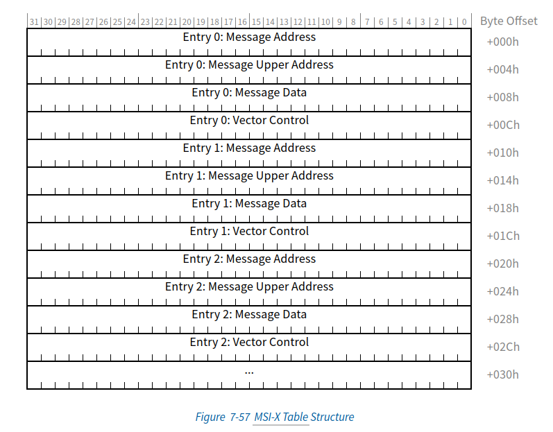

> 《PCI Express® Base Specification Revision 5.0.pdf》7.7.2 MSI-X Capability and Table Structure p782

## SR-IOV Capability结构

这里定义的 SR-IOV Extended Capability 是 PCIe 扩展能力，必须在每个支持 SR-IOV 的 PF 中实现。该能力用于描述和控制 PF 的 SR-IOV Capabilities。


> 《PCI Express® Base Specification Revision 5.0.pdf》9.3.3 SR-IOV Extended Capability p1121

寄存器位段描述参见《Single Root IO Virtualization and Sharing Specification Revision 1.0.pdf》3.3. SR-IOV Extended Capability或《PCI Express® Base Specification Revision 5.0.pdf》9.3.3 SR-IOV Extended Capability

### SR-IOV Extended Capability Header (Offset 00h)

| bit   | 描述                                                         | 属性 |
| ----- | ------------------------------------------------------------ | ---- |
| 15:0  | **PCI Express Extended Capability ID**：该字段是 PCI-SIG 定义的 ID 号，指示扩展功能的性质和格式。<br/>SR-IOV 扩展能力的扩展能力 ID 是 0010h。 | RO   |
| 19:16 | **Capability Version**：该字段是一个 PCI-SIG 定义的版本号，它指示存在的 Capability 结构的版本。<br/>对于此版本的规范，必须为 1h。 | RO   |
| 31:20 | **Next Capability Offset**：该字段包含到下一个 PCI Express Capability 结构的偏移量，如果 Capabilities 的链表中不存在其他项，则为 000h。<br/>对于在配置空间中实现的扩展功能，此偏移量是相对于 PCI 兼容配置空间的开头的，因此必须始终为 000h（用于终止功能列表）或大于 0FFh。 | RO   |

再Linux内核中获取下一个`PCIe Extended Capability`的宏为

`include/uapi/linux/pci_regs.h#L698`

```c
#define PCI_EXT_CAP_NEXT(header)	((header >> 20) & 0xffc)
```

### SR-IOV Capabilities Register (Offset 04h)

| bit   | 描述                                                         | 属性       |
| ----- | ------------------------------------------------------------ | ---------- |
| 0     | **VF Migration Capable**：如果设置，PF 是 Migration Capable 并且在 Migration Capable MR-PCIM 下运行。 | RO         |
| 1     | **ARI Capable Hierarchy Preserved**<br/>PCI Express 端点：如果设置，ARI Capable Hierarchy 位将在某些电源状态转换中保留。<br/>RCiEP：不适用 - 强烈建议将该位硬连线到 0b。 | RO         |
| 2     | **VF 10-Bit Tag Requester Supported**：如果设置，所有 VF 必须支持 10-Bit Tag Requester 功能。 如果清除，则 VF 不得支持 10 位标记请求器功能。<br/>如果 PF 的设备功能 2 寄存器中的 10 位标签请求者支持位为清除，则该位必须为清除。 | HwInit[^1] |
| 31:21 | **VF Migration Interrupt Message Number**：指示用于迁移中断的 MSI/MSI-X 向量。<br/>如果 VF Migration Capable 为 Clear，则此字段中的值未定义 | RO         |

[^1]:硬件初始化。

### SR-IOV Control Register (Offset 08h)

| bit  | 描述                                                         | 属性     |
| ---- | ------------------------------------------------------------ | -------- |
| 0    | **VF Enable**：启用/禁用 VF。 默认值为 0b。                  | RW       |
| 1    | **VF Migration Enable**：启用/禁用 VF 迁移支持。 默认值为 0b。 | RW or RO |
| 2    | **VF Migration Interrupt Enable**：启用/禁用 VF 迁移状态更改中断。 默认值为 0b | RW       |
| 3    | **VF MSE**：为虚拟功能启用内存空间。 默认值为 0b。           | RW       |
| 4    | **ARI Capable Hierarchy**：<br/>PCI Express Endpoint：<br/>该位必须在设备的最低编号 PF 中为 RW，并在所有其他 PF 中硬连线到 0b。<br/>如果此位的值为 1b，则允许 Device 将 VF 定位到捕获的总线编号的功能编号 8 到 255 中。 否则，设备必须像非 ARI 设备一样定位 VF。<br/>该位不受任何 PF 或 VF 的 FLR 影响。<br/>默认值为 0b。<br/>RCiEP：<br/>不适用 - 该位必须硬连线到 0b。<br/>在 Root Complex 中，始终允许将 VF 分配给 First VF Offset 和 VF Stride 规则允许的任何功能编号（参见《PCI Express® Base Specification Revision 5.0.pdf》第 9.3.3.9 节和第 9.3.3.10 节）。 | RW or RO |
| 5    | **VF 10-Bit Tag Requester Enable**：如果设置，所有 VF 必须为它们生成的所有非发布请求使用 10-Bit 标签。 如果清除，则 VF 不得将 10 位标记用于它们生成的非发布请求。 （参见《PCI Express® Base Specification Revision 5.0.pdf》第 9.3.3.2.3 节）。<br/>如果软件在任何 VF 具有未完成的非发布请求时更改该位的值，则结果未定义。<br/>如果 SR-IOV Capabilities 寄存器中的 VF 10-Bit Tag Requester Supported 位为 Clear，则允许将该位硬接线为 0b。<br/>默认值为 0b。 | RW or RO |

### SR-IOV Status Register (Offset 0Ah)

| bit  | 描述                                                         | 属性 |
| ---- | ------------------------------------------------------------ | ---- |
| 0    | **VF Migration Status**：表示 MR-PCIM 已发出 VF 迁移入或迁移出请求。<br/>为了确定事件的原因，软件可以扫描 VF 状态阵列。 默认值为 0b。 | RW1C |

### InitialVFs (Offset 0Ch)

**向 SR-PCIM 指示最初与 PF 关联的 VF 的数量**。

InitialVFs 的最小值为 0。

对于在Single-Root模式下运行的设备，此字段为 HwInit，并且必须包含与 TotalVFs 相同的值。

对于在Multi-Root模式下运行的设备，当 VF Enable 为 Clear 时，该字段的值可能会被 MR-PCIM 更改。

如果 VF Migration Enable 被设置，VF Enable 被清除然后设置，InitialVFs 的值可能会改变。 这是必要的，因为某些 VF 可能已迁移到其他 PF，并且可能不再可用于此 PF。

### TotalVFs (Offset 0Eh)

**TotalVFs 指示可以与 PF 关联的 VF 的最大数量**。

TotalVFs 的最小值为 0。

对于在Single-Root模式下运行的设备，此字段为 HwInit，并且必须包含与 InitialVFs 相同的值。

对于在Multi-Root模式下运行的设备，该字段的值可能会被 MR-PCIM 更改。

### NumVFs (Offset 10h)

**NumVFs 控制可见的 VF 的数量**。 SR-PCIM 将 NumVFs 设置为创建 VF 过程的一部分。 在两个 NumVF 都设置为有效值并设置 VF 启用后，此 VF 数量应在 PCI Express 结构中可见。 可见 VF 具有为其保留的功能编号，但可能不存在。 如果 VF 存在，它应响应以它们为目标的 PCI Express 事务，并应遵循本规范定义的所有规则。 如果存在以下任一情况，则存在 VF：

* VF Migration Capable 为Clear，并且VF 数小于或等于TotalVFs。
* VF Migration Capable 已设置且关联的 VF 处于 Active.Available 或 Dormant.MigrateIn 状态
  （见《PCI Express® Base Specification Revision 5.0.pdf》第 9.2.4 节）

如果将NumVFs 设置为大于TotalVFS的值，则结果将不确定。
NumVFs 只能在 VF Enable 为 Clear 时写入。 如果在设置 VF Enable 时写入 NumVFs，则结果为
不明确的。

NumVFs 的初始值不确定。

### Function Dependency Link (Offset 12h)

设备的编程模型可能在功能集之间具有特定于厂商的依赖性。 Function Dependency Link 字段用于描述这些依赖关系。

该字段描述了 PF 之间的依赖关系。 VF 依赖关系与其关联的 PF 的依赖关系相同。

如果一个 PF 独立于设备的其他 PF，则该字段应包含其自己的功能编号。

如果一个 PF 依赖于设备的其他 PF，则该字段应包含同一功能依赖列表中下一个 PF 的功能编号。 函数依赖列表中的最后一个 PF 应包含函数依赖列表中第一个 PF 的函数编号。

如果 PF<sub>p</sub> 和 PF<sub>q</sub> 在同一个函数依赖列表中，那么任何分配给 VF<sub>p,n</sub> 的 SI 也应该分配给 VF<sub>q,n</sub>。

> 示例：见《PCI Express® Base Specification Revision 5.0.pdf》9.3.3.8 Function Dependency Link (Offset 12h)

### First VF Offset (Offset 14h)

First VF Offset 是一个常量，它定义了与**第一个VF的Configuration Space相对于PF Configuration Space的偏移量**。 第一个 VF 的 16 位路由 ID 是通过将此字段的内容添加到包含此字段的 PF 的路由 ID 来计算的，忽略任何进位，使用无符号的 16 位算法。
VF 不应位于数字上小于其相关 PF 的总线编号上。
当最低编号的 PF 的 ARI Capable Hierarchy 值改变或当这个 PF 的 NumVFs 值改变时，这个字段的值可能会改变。
注意：如果 NumVFs 为 0，则 First VF Offset 未使用。如果 NumVFs 大于 0，则 First VF Offset 不得为零。

例如，如果First VF Offset为256，则第一个VF Configuration Space的起始地址为PF Configuration Space的起始地址加上256字节，第二个VF Configuration Space的起始地址为PF Configuration Space的起始地址加上2 * 256字节，以此类推。

### VF Stride (Offset 16h)

VF Stride 为相邻VF Configuration Space之间的偏移量，以字节为单位。 下一个 VF 的 16 位路由 ID 是通过将此字段的内容添加到当前 VF 的路由 ID，忽略任何进位，使用无符号 16 位算法计算的。
当最低编号的 PF 的 ARI Capable Hierarchy 值改变或当这个 PF 的 NumVFs 值改变时，这个字段的值可能会改变。
注意：如果 NumVFs 为 0 或 1，则 VF Stride 未使用。如果 NumVFs 大于 1，则 VF Stride 不得为零。

例如，如果stride为256，则相邻VF Configuration Space的偏移量为256字节，也就是说，第一个VF Configuration Space的起始地址为X，第二个VF Configuration Space的起始地址为X + 256字节，第三个VF Configuration Space的起始地址为X + 2 * 256字节，以此类推。

### VF Device ID (Offset 1Ah)

该字段包含应该为每个 VF 呈现给 SI 的Device ID。

VF Device ID 可能与 PF Device ID 不同。 VF Device ID 必须由供应商管理。 供应商必须确保所选的 VF Device ID 不会导致使用不兼容的设备驱动程序。

### Supported Page Sizes (Offset 1Ch)

该字段指示 PF 支持的页面大小。 如果位 n 被设置，这个 PF 支持 2<sup>n +12</sup> 的页面大小。 例如，如果位 0 被设置，则 PF 支持 4-KB 页面大小。 PF 需要支持 4-KB、8-KB、64-KB、256-KB、1-MB 和 4-MB 页面大小。 所有其他页面大小都是可选的。
页面大小描述了 VF BAR 资源的最小对齐要求。

### System Page Size (Offset 20h)

该字段定义了系统将用于映射 VF 内存地址的page大小。 软件必须将 System Page Size 的值设置为 Supported Page Sizes 字段中设置的page大小之一。 与支持的page大小一样，如果在系统page大小中设置了位 n，则与此 PF 关联的 VF 需要支持 2<sup>n+12</sup> 的page大小。 例如，如果位 1 被设置，则系统使用 8 KB 的page大小。 如果System Page Size为零，则结果未定义。 如果在 System Page Size 中设置了一位以上，则结果是不确定的。 如果在Supported Page Sizes中未设置,而在System Page Size中设置了该bit，则结果未定义。

设置System Page Size时，此 PF 关联的 VF需要与System Page Size边界上的所有 BAR 资源对齐。 每个 VF BARn 或 VF BARn 对应在System Page Size边界上对齐。 定义非零地址空间的每个 VF BARn 或 VF BARn 对的大小应被调整为消耗System Page Size字节的整数倍。 在 VF 中需要page大小对齐的所有数据结构都应在System Page Size边界上对齐。

写入 System Page Size 时，VF Enable 必须为零。 如果在设置VF Enable时写入System Page Size，则结果未定义。

默认值为 0000 0001h（即 4 KB）。

### VF BAR0 (Offset 24h), VF BAR1 (Offset 28h), VF BAR2 (Offset 2Ch), VF BAR3 (Offset 30h), VF BAR4 (Offset 34h), VF BAR5 (Offset 38h)

这些字段必须定义 VF 的Base Address Registers(BAR)。 这些字段的行为与正常的 PCI BAR 相同。 它们可以通过写全 1 并读回 BAR 的内容来调整大小，符合定义 BAR 类型字段的低位。

### VF Migration State Array Offset (Offset 3Ch)

如果 VF Migration Capable 设置并且 TotalVFs 不为零，则该寄存器应包含一个指向VF Migration State Array的 PF BAR 相关指针。 如果VF Migration Capable清除，则该寄存器为 RO 0。

#### Linux内核SR-IOV Capability结构体

`/drivers/pci/pci.h`

```c

/* Single Root I/O Virtualization */
struct pci_sriov {
	int		pos;		/* Capability position */
	int		nres;		/* Number of resources */
	u32		cap;		/* SR-IOV Capabilities */
	u16		ctrl;		/* SR-IOV Control */
	u16		total_VFs;	/* Total VFs associated with the PF */
	u16		initial_VFs;	/* Initial VFs associated with the PF */
	u16		num_VFs;	/* Number of VFs available */
	u16		offset;		/* First VF Routing ID offset */
	u16		stride;		/* Following VF stride */
	u16		vf_device;	/* VF device ID */
	u32		pgsz;		/* Page size for BAR alignment */
	u8		link;		/* Function Dependency Link */
	u8		max_VF_buses;	/* Max buses consumed by VFs */
	u16		driver_max_VFs;	/* Max num VFs driver supports */
	struct pci_dev	*dev;		/* Lowest numbered PF */
	struct pci_dev	*self;		/* This PF */
	u32		class;		/* VF device */
	u8		hdr_type;	/* VF header type */
	u16		subsystem_vendor; /* VF subsystem vendor */
	u16		subsystem_device; /* VF subsystem device */
	resource_size_t	barsz[PCI_SRIOV_NUM_BARS];	/* VF BAR size */
	bool		drivers_autoprobe; /* Auto probing of VFs by driver */
};

```

## PCIe相较于PCI的更改

### PCI配置空间的更改

| 表头类型    | 寄存器(编码器)                        | 比特位置 | 差异                                                         |
| ----------- | ------------------------------------- | -------- | ------------------------------------------------------------ |
| All Headers | Command Register (0x04)               | 3        | Special Cycle Enable：不适用于PCIe。硬连线到0。              |
| All Headers | Command Register (0x04)               | 4        | Memory Write and Invalidate: 不适用于PCIe。硬连线至0。       |
| All Headers | Command Register (0x04)               | 5        | VGA Palette Snoop: 不适用于PCIe。硬连线为0。                 |
| All Headers | Command Register (0x04)               | 7        | IDSEL Stepping/Wait Cycle Control: 不适用于PCIe。硬连线到0。 |
| All Headers | Command Register (0x04)               | 9        | Fast Back-to-Back Transactions Enable: 不适用于PCIe。硬连线至0。 |
| All Headers | Status Register (0x06)                | 4        | Capabilities List: 需要所有PCIe设备来实现能力结构。硬连线到1。 |
| All Headers | Status Register (0x06)                | 5        | 66 MHz Capable: 不适用于PCIe。硬连线到0。                    |
| All Headers | Status Register (0x06)                | 7        | Fast Back-to-Back Transactions Capable: 不适用于PCIe。硬连线至0。 |
| All Headers | Status Register (0x06)                | 10:9     | DEVSEL Timing: 不适用于PCIe。硬连线为0。                     |
| All Headers | Cache Line Size Register (0x0C)       | All Bits | 仅用于遗留用途。                                             |
| All Headers | Master Latency Timer Register (0x0D)  | All Bits | 不适用于PCIe。硬连线至0。                                    |
| Type 0      | Base Address Registers (0x10:0x24)    | All Bits | PCIe端点设备必须在范围不包含具有读取副作用的内存或内存不允许写入合并的情况下设置该BAR的可预取位。 非遗留端点设备必须支持64位寻址。 请求的最小内存地址范围为BAR 128字节。 |
| Type 0      | Min_Gnt/Max_Lat Registers (0x3E:0x3F) | All Bits | 不适用于PCIe。硬连线为0。                                    |
| Type 1      | Base Address Registers (0x10:0x24)    | All Bits | PCIe端点设备必须在范围不包含具有读取副作用的内存或内存不允许写入合并的情况下设置BAR的可预取位。 非遗留端点设备必须支持64位寻址。 请求的最小内存地址范围为BAR 128字节。 |
| Type 1      | Primary Bus Number (0x18)             | All Bits | 仅为遗留目的实现。                                           |
| Type 1      | Secondary Latency Timer (0x1B)        | All Bits | 不适用于PCIe。硬连线为0。                                    |
| Type 1      | Secondary Status Register (0x1E)      | 5        | 支持66 MHz：不适用于PCIe。硬连线到0。                        |
| Type 1      | Secondary Status Register (0x1E)      | 7        | Fast Back-to-Back Transactions Capable: 不适用于PCIe。硬连线为0。 |
| Type 1      | Secondary Status Register (0x1E)      | 10:9     | DEVSEL Timing: 不适用于PCIe。硬连线到0。                     |
| Type 1      | Prefetchable Memory Base/Limit (0x24) | All Bits | 必须表示支持64位地址。                                       |
| Type 1      | Bridge Control Register (0x3E)        | 5        | Master Abort Mode: 不适用于PCIe。硬连线为0。                 |
| Type 1      | Bridge Control Register (0x3E)        | 7        | Fast Back-to-Back Transactions Enable: 不适用于PCIe。硬连线至0。 |
| Type 1      | Bridge Control Register (0x3E)        | 8        | Primary Discard Timer: 不适用于PCIe。硬连线到0。             |
| Type 1      | Bridge Control Register (0x3E)        | 9        | Secondary Discard Timer: 不适用于PCIe。硬连线为0。           |
| Type 1      | Bridge Control Register (0x3E)        | 10       | Discard Timer Status: 不适用于PCIe。硬连线至0。              |
| Type 1      | Bridge Control Register (0x3E)        | 11       | Discard Timer SERR# Enable: 不适用于PCIe。硬连线到0。        |

### 扩展PCI总线编号

PCI的旧版本（如“PCI Conventional”）最多限制为256个PCI总线段。 PCI Express通过引入“PCI Segment Groups”扩展了这一点，其中系统(理论上)可以具有多达65536个PCI段组，每个组具有256PCI总线段，从而允许单个计算机最多具有2个24(16777216)个PCI总线段。

PCI段组被编号，并且在大多数系统中只有一个PCI段组 (PCI段组编号为0)。 传统PCI配置空间访问机制#1（为了向后兼容而仍然存在）没有“PCI段组”字段，因此只能用于访问PCI段组号为0的PCI配置空间。 必须使用增强配置机制访问其他PCI段组中任何设备的PCI配置空间。

### 增强配置机制

增强的配置机制利用内存映射的地址空间范围来访问PCI配置空间。 简而言之，内存地址决定了被访问的段组，总线，设备，功能和寄存器。 在x86和x64平台上，每个内存区域的地址由ACPI“MCFG”表确定。 此ACPI表的格式为：

| 偏移 | 长度 | 描述                                   |
| ---- | ---- | -------------------------------------- |
| 0    | 4    | 表签名（“MCFG”）                       |
| 4    | 4    | 表长，单位为字节                       |
| 8    | 1    | Revision (1)                           |
| 9    | 1    | 校验和 (表中所有字节的总和 & 0xFF = 0) |
| 10   | 6    | OEM ID（与其他ACPI表格的含义相同）     |
| 16   | 8    | OEM表ID(厂家型号ID)                    |
| 24   | 4    | OEM改版 (与其他ACPI表意义相同)         |
| 28   | 4    | 创建者ID（与其他ACPI表的含义相同）     |
| 32   | 4    | 创建者修订版(含义与其他ACPI表相同)     |
| 36   | 8    | Reserved                               |

配置空间基址分配结构遵循以下格式

| **偏移**  | **长度** |          |          |                               |
| --------- | -------- | -------- | -------- | ----------------------------- |
|           |          | **偏移** | **长度** | **描述**                      |
| 44+(16*n) | 16       | 0        | 8        | 增强配置机制的基址            |
| 44+(16*n) | 16       | 8        | 2        | PCI网段组号                   |
| 44+(16*n) | 16       | 10       | 1        | 启动此主机桥解码的PCI总线号   |
| 44+(16*n) | 16       | 11       | 1        | 结束此主机网桥解码的PCI总线号 |
| 44+(16*n) | 16       | 12       | 4        | 预留                          |

对于非x86系统，方法各不相同，但是通常系统为自己提供在运行时解析的设备树。

要访问设备PCI配置空间内的特定寄存器，必须使用设备的PCI段组和总线来确定要使用哪个内存映射PCI配置空间区域，并获取该内存映射区域的起始物理地址和起始总线号。 获得该内存映射区域的正确起始物理地址和起始总线编号后，你可以使用以下公式来确定函数的PCI配置空间的(4096字节)区域的位置： `Physical_Address = MMIO_Starting_Physical_Address + ((Bus - MMIO_Starting_Bus) << 20 | Device << 15 | Function << 12)`.

请注意，确定 “此函数的PCI配置空间的物理地址” 作为PCI枚举的一部分可能是一个好主意，并将此物理地址与用于管理PCI设备和驱动程序的任何其他信息一起存储 （例如，在设备信息的“设备管理器”层次结构树中）。

还要注意的是，对于绝对最大值(具有65536个PCI段组和每个段组256个总线段)，内存映射的PCI配置空间范围消耗的物理地址空间量将是(最多)16TiB(或244字节)； 并且ACPI的 “MCFG” 表 (在理论上) 可以略大于256 MiB (每个PCI段组内的每个单独PCI总线的16字节条目加上36字节表头)。

访问空间内的特定设备可以如下所示： `(((bus * 256) + (slot * 8) + func) * 4096) + offs` (每个设备描述符为4096字节或4k长整型)， 因此，前者可以解释为以下类型的数组： `((pcie_ecam[bus][slot][func] * 4096) + offs)`.

查找设备可以与PCI相同，不同之处在于内核访问内存区域而不是使用CPU I/O。

> [PCI Express](http://osdev.foofun.cn/index.php?title=PCI_Express)

## 内核获取扩展结构

```c
/**
 * pci_find_ext_capability - Find an extended capability
 * @dev: PCI device to query
 * @cap: capability code
 *
 * Returns the address of the requested extended capability structure
 * within the device's PCI configuration space or 0 if the device does
 * not support it.  Possible values for @cap include:
 *
 *  %PCI_EXT_CAP_ID_ERR		Advanced Error Reporting
 *  %PCI_EXT_CAP_ID_VC		Virtual Channel
 *  %PCI_EXT_CAP_ID_DSN		Device Serial Number
 *  %PCI_EXT_CAP_ID_PWR		Power Budgeting
 */
u16 pci_find_ext_capability(struct pci_dev *dev, int cap)
{
	return pci_find_next_ext_capability(dev, 0, cap);
}
EXPORT_SYMBOL_GPL(pci_find_ext_capability);


/**
 * pci_find_next_ext_capability - Find an extended capability
 * @dev: PCI device to query
 * @start: address at which to start looking (0 to start at beginning of list)
 * @cap: capability code
 *
 * Returns the address of the next matching extended capability structure
 * within the device's PCI configuration space or 0 if the device does
 * not support it.  Some capabilities can occur several times, e.g., the
 * vendor-specific capability, and this provides a way to find them all.
 */
u16 pci_find_next_ext_capability(struct pci_dev *dev, u16 start, int cap)
{
	u32 header;
	int ttl;
	u16 pos = PCI_CFG_SPACE_SIZE;

	/* minimum 8 bytes per capability */
	ttl = (PCI_CFG_SPACE_EXP_SIZE - PCI_CFG_SPACE_SIZE) / 8;

	if (dev->cfg_size <= PCI_CFG_SPACE_SIZE)
		return 0;

	if (start)
		pos = start;

	if (pci_read_config_dword(dev, pos, &header) != PCIBIOS_SUCCESSFUL)
		return 0;

	/*
	 * If we have no capabilities, this is indicated by cap ID,
	 * cap version and next pointer all being 0.
	 */
	if (header == 0)
		return 0;

	while (ttl-- > 0) {
		if (PCI_EXT_CAP_ID(header) == cap && pos != start)
			return pos;

        /* 读取指向下一个扩展结构的指针 */
		pos = PCI_EXT_CAP_NEXT(header);
		if (pos < PCI_CFG_SPACE_SIZE)
			break;

		if (pci_read_config_dword(dev, pos, &header) != PCIBIOS_SUCCESSFUL)
			break;
	}

	return 0;
}
EXPORT_SYMBOL_GPL(pci_find_next_ext_capability);

```


# 兼容PCI协议

PCIe总线 是 PCI总线 的升级版，因此 PCIe 设备的配置空间需要兼容 PCI 协议，以确保与老式 PCI 设备的兼容性和互操作性。

1. PCIe兼容PCI配置空间格式：

PCIe 设备的配置空间必须使用与 PCI 相同的格式，包括配置空间头部和配置空间寄存器。

2. 兼容PCI配置空间寄存器

PCIe 设备的配置空间寄存器必须包括与 PCI 相同的寄存器，包括 `Vendor ID`、`Device ID`、`Class Code`、`Subclass Code`、`Header Type`、`Base Address Registers` 等。这些寄存器在 PCIe 设备中的定义必须与 PCI 相同，以确保与 PCI 设备的兼容性和互操作性。

3. 兼容PCI配置空间头部

PCIe 设备的配置空间头部必须兼容 PCI 头部格式，包括 `Header Type`、`Cache Line Size`、`Latency Timer`、`Interrupt Pin`、`Interrupt Line` 等字段。PCIe 设备必须使用 Type 0 或 Type 1 头部格式，并根据需要使用 `PCI-to-PCI Bridge (P2P)` 或 `CardBus Bridge (CB) `头部格式。

4. 兼容PCI配置空间的访问方式

PCIe 设备的配置空间必须使用与 PCI 相同的访问方法，包括使用 I/O 空间或内存空间访问配置空间。PCIe 设备的配置空间访问必须遵循 PCI 总线协议的要求和规范，以确保与 PCI 设备的兼容性和互操作性。

[PCI Device Classes (ucw.cz)](http://pci-ids.ucw.cz/read/PD) 可用于查询设备类型。

## Memory & I/O地址空间

在PCIe总线中，可以访问PCIe设备的两种类型的地址空间，分别为`Memory`空间和`I/O`空间，`Memory`空间是一种物理地址空间，可用于访问系统内存，在PCIe总线中，`Memory`空间通常用于访问设备的配置寄存器和DMA缓冲区。`I/O`空间是一种虚拟地址空间，用于访问设备的寄存器和控制器。以进行数据传输和控制操作。

PCIe 总线将 `Memory` 地址空间和 `I/O` 地址空间分别映射到总线地址空间中的不同区域。`Memory`地址空间通常映射到系统内存地址空间中的一部分，由操作系统和设备驱动程序来管理和分配。`I/O` 地址空间则映射到总线地址空间中的一段固定区域，通常为 64KB 的大小。设备可以访问 `I/O` 地址空间中的寄存器和控制器。

在设备驱动程序中，可以使用 `inb()`、`outb()`、`inw()`、`outw()`、`inl()`、`outl()` 等函数来读取和写入 `I/O` 空间中的数据。这些函数分别用于读取和写入单字节、双字节和四字节数据，可以根据具体需求来选择适当的函数。需要注意的是，访问 I/O 空间时需要使用 `ioread*()` 和 `iowrite*()` 等内核函数来确保访问的正确性和安全性。

## sysfs下的PCIe

在Linux系统中，PCIe设备可以通过sysfs文件系统进行管理和配置。sysfs是一个虚拟文件系统，它将系统中的设备和内核对象表示为文件和目录，可以通过文件和目录的操作来管理和配置它们。

对于PCIe设备，sysfs提供了以下目录和文件：

```bash
/sys/bus/pci/devices/0000:02:01.0$ ls
acpi_index                d3cold_allowed   firmware_node  modalias     remove        resource2         subsystem_vendor
ari_enabled               device           irq            msi_bus      rescan        resource4         uevent
broken_parity_status      dma_mask_bits    label          net          reset         revision          vendor
class                     driver           link           numa_node    reset_method  rom
config                    driver_override  local_cpulist  power        resource      subsystem
consistent_dma_mask_bits  enable           local_cpus     power_state  resource0     subsystem_device
```

- class：文件，表示设备的设备类别。
- config：文件，表示设备的配置寄存器。
- consistent_dma_mask_bits：文件，表示设备的DMA地址空间是否连续。
- device：符号链接，指向设备的设备目录。
- dma_mask_bits：文件，表示设备的DMA地址位数。
- driver：符号链接，指向设备所使用的驱动程序。
- enable：文件，表示设备是否启用。
- firmware_node：符号链接，表示设备的固件节点。
- irq：文件，包含设备的中断信息。
- msi_bus：文件，包含设备的MSI（Message Signaled Interrupt）信息。
- net: 目录，包含设备的网络信息。
- power：目录，包含设备的电源管理信息。
- power_state：文件，表示设备的电源状态。
- remove：文件，表示设备是否可以被卸载。
- rescan：文件，表示设备是否需要重新扫描。
- resource：文件，包含设备的资源信息。
- resource0：文件，表示设备的第一个资源。
- resource2：文件，表示设备的第二个资源。
- resource4：文件，表示设备的第三个资源。
- revision：文件，表示设备的版本号。
- subsystem：目录，包含设备的子系统信息。
- subsystem_device：文件，表示设备的子系统设备号。
- subsystem_vendor：文件，表示设备的子系统供应商ID。
- uevent：文件，表示设备的uevent信息。
- vendor：文件，表示设备的供应商ID。

### resource

```bash
/sys/bus/pci/devices/0000:02:01.0$ cat resource
0x00000000fd5c0000 0x00000000fd5dffff 0x0000000000140204
0x0000000000000000 0x0000000000000000 0x0000000000000000
0x00000000fdff0000 0x00000000fdffffff 0x0000000000140204
0x0000000000000000 0x0000000000000000 0x0000000000000000
0x0000000000002000 0x000000000000203f 0x0000000000040101
0x0000000000000000 0x0000000000000000 0x0000000000000000
0x00000000fd500000 0x00000000fd50ffff 0x0000000000046200
0x0000000000000000 0x0000000000000000 0x0000000000000000
0x0000000000000000 0x0000000000000000 0x0000000000000000
0x0000000000000000 0x0000000000000000 0x0000000000000000
0x0000000000000000 0x0000000000000000 0x0000000000000000
0x0000000000000000 0x0000000000000000 0x0000000000000000
0x0000000000000000 0x0000000000000000 0x0000000000000000
```

上述资源信息每三个表示一个元组，其中第一个表示资源的起始地址（物理地址），第二个表示资源的结束地址，第三个表示资源的标志属性。


# 参考

[PCI Wiki](https://wiki.osdev.org/PCI)

[PCI Express - 维基百科，自由的百科全书 (wikipedia.org)](https://zh.wikipedia.org/wiki/PCI_Express)

[PCI configuration space](https://en.wikipedia.org/wiki/PCI_configuration_space)

[PCIE 之linux驱动分析 - 知乎 (zhihu.com)](https://zhuanlan.zhihu.com/p/399102423)

[深入PCI与PCIe之二：软件篇 - 知乎 (zhihu.com)](https://zhuanlan.zhihu.com/p/26244141)

[PCIe学习笔记之pcie结构和配置空间_pcie class code_Hober_yao的博客-CSDN博客](https://blog.csdn.net/yhb1047818384/article/details/106676528)

[PCIe扫盲系列博文连载目录篇（第二阶段）-Felix-电子技术应用-AET-中国科技核心期刊-最丰富的电子设计资源平台 (chinaaet.com)](http://blog.chinaaet.com/justlxy/p/5100053328)

[PCIe扫盲系列博文连载目录篇（第一阶段）-Felix-电子技术应用-AET-中国科技核心期刊-最丰富的电子设计资源平台 (chinaaet.com)](http://blog.chinaaet.com/justlxy/p/5100053251)

[lspci命令详解_一口Linux的博客-CSDN博客](https://blog.csdn.net/daocaokafei/article/details/114482560)

《PCI Exporess体系结构导读（王齐）》

[PCIe学习笔记之MSI/MSI-x中断及代码分析_pci_alloc_irq_vectors_Hober_yao的博客-CSDN博客](https://blog.csdn.net/yhb1047818384/article/details/106676560)

《PCI Express Technology 3.0.pdf》

[ 老男孩读PCIe介绍系列_Ha-Ha-Interesting的博客-CSDN博客](https://blog.csdn.net/BjarneCpp/article/details/112433384)

[《PCI Express Technology 3.0》译文合集 - 知乎 (zhihu.com)](https://zhuanlan.zhihu.com/p/600796941)

[ljgibbslf/Chinese-Translation-of-PCI-Express-Technology- at c2085cd98ef27de801b358b62baf881f1d93a31b (github.com)](https://github.com/ljgibbslf/Chinese-Translation-of-PCI-Express-Technology-/tree/c2085cd98ef27de801b358b62baf881f1d93a31b) 《PCI Express Technology 3.0.pdf》中文翻译

[PCI Express Capability Structure_pcie capability结构-CSDN博客](https://blog.csdn.net/china_seaman/article/details/125537236) PCI Express Capability Structure

《PCI Express_ Base Specification Revision 4.0 Version 0.3 ( PDFDrive ).pdf》

《PCI Express® Base Specification Revision 5.0.pdf》

[(PCIE) Peripheral Component Interconnect [Express] – Stephen Marz (utk.edu)](https://marz.utk.edu/my-courses/cosc562/pcie/)

[PCIE-Capability能力集协议解释_逆风水手的博客-CSDN博客](https://blog.csdn.net/qq_21688871/article/details/130621768)

[PCIe的capability扩展空间字段解释_逆风水手的博客-CSDN博客](https://blog.csdn.net/qq_21688871/article/details/130659343?utm_medium=distribute.pc_relevant.none-task-blog-2~default~baidujs_baidulandingword~default-4-130659343-blog-125373209.235^v36^pc_relevant_default_base3&spm=1001.2101.3001.4242.3&utm_relevant_index=7)

[PCI Express 系列连载篇（二十四）MSI和MSI-X中断机制 I-腾讯云开发者社区-腾讯云 (tencent.com)](https://cloud.tencent.com/developer/article/1766752)

《Single Root IO Virtualization and Sharing Specification Revision 1.0.pdf》

[PCIe_BGONE的博客-CSDN博客](https://blog.csdn.net/bgone/category_9450900.html) PCIe相关文章。

[【PCIe 5.0 - 100】SR-IOV【1】_pcie sr-iov_BGONE的博客-CSDN博客](https://blog.csdn.net/BGONE/article/details/122113532) 《PCI Express® Base Specification Revision 5.0.pdf》PCIe Single Root I/O Virtualization and Sharing翻译

《RichardSolomon_PCI_Express.pdf》 SR-IOV PF、VF配置空间例子。

[PCIe技术网](https://www.pcietech.com/page/2/)

[《PCI-to-PCI Bridge Architecture Specification.pdf》](https://0x04.net/~mwk/doc/pci/PCI-to-PCI%20Bridge%20Architecture%20Specification.pdf) PCI桥规范文档
