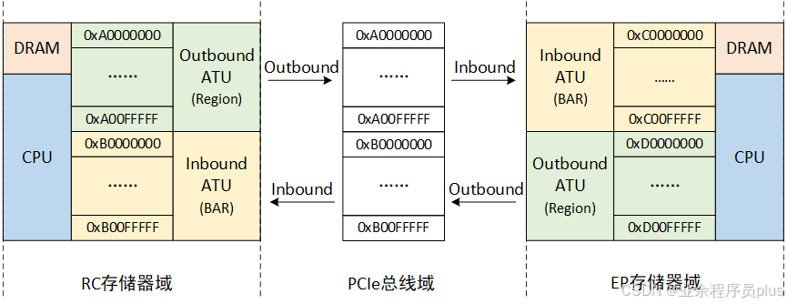

# 存储域和总线域访问流程

## 跨域访问

通常情况下，存储器域指的是CPU能直接访问的地址空间，包括了CPU寄存器、DRAM、PCIe控制器和PCIe窗口地址空间。PCIe总线域指由PCIe设备所能直接访问的地址空间组成，包括PCIe桥设备和PCIe Swtich，若由多条PCIe总线，则对应多个PCIe总线域。

* **Outbound**: 存储器域访问PCIe总线域称为Outbound传输，从RC或EP的角度看，也可以称为发送。

* **Inbound**: PCIe总线域访问存储器域称为Inbound传输，从RC或EP的角度看，也可以称为接收。
* **Outbound ATU（address translation unit）**: Outbound地址转换单元，负责将存储器域地址转换成PCIe总线域地址。
* **Inbound ATU（address translation unit）**: Inbound地址转换单元，负责将PCIe总线域地址转换成存储器域地址。

如上图所示，为一个简单的RC、EP之间相互访问的例子，简言之：

* **RC发起的访问EP的读写操作均需通过访问RC本地地址 0xA0000000~0xA00FFFFF 完成。**
* **EP发起的访问RC的读写操作均需通过访问EP本地地址 0xD0000000~0xD00FFFFF 完成。**

### RC存储域访问EP存储域

RC存储域访问EP存储域会经历Outbound和Inbound传输。在访问之间RC配置Outbound映射，EP配置Inbound映射。具体过程如下：

* RC存储域发出访问地址，若命中Outbound Region地址段0xA0000000-0xA00FFFFF，则RC会响应这个访问请求。
* RC存储域Outbound ATU将访问地址转换成PCIe域总线地址，转换后的地址必须在PCIe总线地址段0xA0000000-0xB00FFFFF内，然后将请求发送到PCIe总线上（该请求会被封装成一个TLP事务包）。
* 该请求经过基于地址的PCIe总线路由，发送到了访问目标EP存储域。
* EP存储域Inbound ATU将该请求的PCIe总线域地址转换成EP存储器域地址，转换后的地址必须在EP存储域地址段0xC0000000-0xC00FFFFF内。
* EP开始响应该请求，执行读或者写任务。

### EP存储域访问RC存储域

EP存储域访问RC存储域会经历Inbound和Outbound传输（EP访问RC通常使用DMA）。在访问之前，RC配置Inbound映射，EP配置Outbound映射。具体过程如下：

* EP存储域发出访问地址，若命中Outbound Region地址段0xD0000000-0xD00FFFFF，则EP会响应这个访问请求。
* EP存储域Outbound ATU将访问地址转换成PCIe域总线地址，然后将请求发送到PCIe总线上。
* 该请求经过基于地址的PCIe总线路由，发送到了访问目标RC存储域。
* RC存储域Inbound ATU将该请求的PCIe总线域地址转换成RC存储器域地址，转换后的地址必须在RC存储域地址段0xB0000000-0xB00FFFFF内。
* RC开始响应该请求，执行读或者写任务。

# 参考

[PCIe总线-存储器域和PCIe总线域访问流程分析（二）](https://blog.csdn.net/u011037593/article/details/137697527)

[pcie inbound、outbound及EP、RC间的互相訪问](https://blog.csdn.net/vc66vcc/article/details/103525878)

[从CPU角度理解PCIe续集](http://www.ssdfans.com/?p=106756)