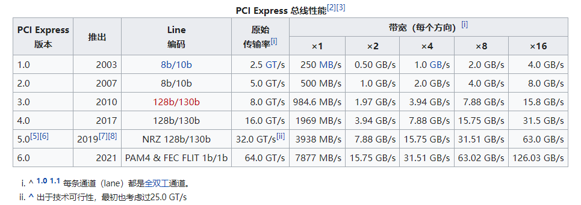
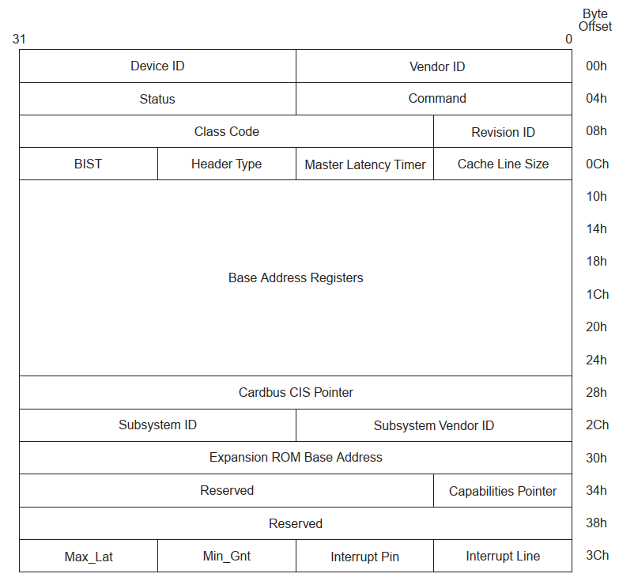
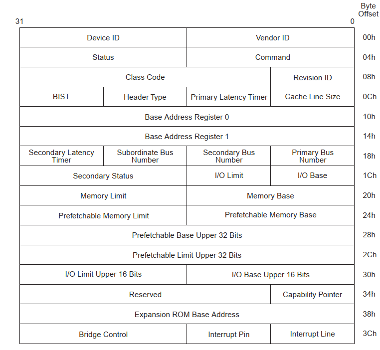

# PCIe基础

**PCI Express**，简称**PCI-E**，官方简称**PCIe**，是计算机总线的一个重要分支，它沿用既有的PCI编程概念及信号标准，并且构建了更加高速的串行通信系统标准。目前这一标准由[PCI-SIG](https://zh.wikipedia.org/wiki/PCI-SIG)组织制定和维护。



## 拓扑


> 《PCI Express Technology 3.0.pdf》Chapter 3: Configuration Overview p87

## PCIx系统框图


# 配置空间

PCI Express (PCIe) Type 0 设备的前 256 个字节分为两部分：**前 64 个字节是标准配置空间头部**（Header），用于描述设备的基本信息和功能；**后 192 个字节PCI Express Capbility结构**，用于描述设备的扩展能力和配置。

在 PCI Express (PCIe) 中，设备被分为两种类型：Type 0 设备和 Type 1 设备。Type 0 设备和 Type 1 设备的区别在于它们的配置空间结构不同。

## 设备分类

### Type 0

**Type 0** 设备是指普通的 PCIe 设备（RC和EP）。Type 0 设备的配置空间只包含一个配置空间头部，用于描述设备的基本信息，如 Vendor ID、Device ID、Class Code、Subclass Code 等等。Type 0 设备可以有多个 BAR（Base Address Registers），用于描述设备的地址空间信息。



<center>PCIe Type 0配置空间（RC与EP设备）</center>

> 《PCI Express_ Base Specification Revision 4.0 Version 0.3 ( PDFDrive ).pdf》7.5.2 p585

### Type 1

**Type 1** 设备是指 PCIe-to-PCI/PCI-X Bridge，它们可以将一个 PCIe 总线转换成一个或多个 PCI 总线，从而使 PCIe 总线上的 PCIe 设备可以与 PCI 总线上的 PCI 设备进行通信。Type 1 设备的配置空间包含一个配置空间头部和一个或多个 PCI-to-PCI Bridge (P2P) 或 CardBus Bridge (CB) 头部。Type 1 设备的每个 PCI-to-PCI Bridge (P2P) 或 CardBus Bridge (CB) 头部描述一个转换的 PCI 总线。Type 1 设备还有多个 BAR，其中每个 BAR 描述一个转换的 PCI 总线上的地址空间。

通过配置空间的`Header Type`来区分设备类型，具体如下：

* 00h：PCI Agent
* 01h：PCI Bridge
* 02h：Cardbus Bridge



<center>PCIe Type 1 配置空间（网桥设备）</center>

> 《PCI Express_ Base Specification Revision 4.0 Version 0.3 ( PDFDrive ).pdf》7.5.3 p587

# 标准配置空间头（0x00h~0x3Fh）

**标准配置空间头部包含了设备的基本信息和功能**，如设备的 Vendor ID、Device ID、Class Code、BAR (Base Address Register)、中断信息等。这些信息通常用于操作系统和设备驱动程序识别和配置设备，例如确定设备的驱动程序、分配资源、设置中断等等。标准配置空间头部的长度为 64 个字节，是固定的，不能被扩展。


<center>标准配置空间头</center>

> 《PCI Express Technology 3.0.pdf》Software Compatibility Characteristics p50

## Status Register (Offset 0x06h)


## Base Address Registers (Offset 0x10h~0x27h)

如下图所示：Type0 Header最多有6个BAR，而Type1 Header最多有两个BAR。这就意味着，对于Endpoint来说，最多可以拥有6个不同的地址空间。但是实际应用中基本上不会用到6个，通常1~3个BAR比较常见。


> 《PCI Express Technology 3.0.pdf》Base Address Registers (BARs) p127

若某个设备的BAR没有被全部使用，则对应的BAR应被硬件全部设置为0，并且告知软件这些BAR是不可操作的。一旦BAR的值确定了（Have been programmed），其指定范围内的当前设备中的内部寄存器（或内部存储空间）就可以被访问了。当该设备确认某一个请求（Request）中的地址在自己的BAR的范围内，便会接受这请求。


### 32位Non‐Prefetchable Memory地址空间请求


> 《PCI Express Technology 3.0.pdf》 BAR Example 1: 32-bit Memory Address Space Request p128

设置一个BAR的基础步骤

32位不可预取（Non‐Prefetchable）地址空间BAR配置步骤：

1. PCIe设备上电，BAR处于未初始化状态，系统读取BAR0得到数据，硬件设备已经将低位bit固定为一个数值，来指示需要的memory的大小和类型，但是高位bit（可写可读的）则仍然是用X来表示，这代表它们的值还未知。系统软件将会首先把每个BAR都通过配置写操作来将可写入的bit写为全1（当然，被固定的低位bit不会受到配置写操作的影响）
2. 对BAR0写入全1后的状态如上图的（2），这个操作确定了可写的最低位，这个最低位指示了请求的地址空间的大小，再上图中，最低位为12，则请求的BAR地址空间为2^12大小。低4位表明了该存储空间的一些属性（IO映射还是内存映射，32bit地址还是64bit地址，能否预取？有些寄存器只要一读，数据就会清掉，因此，对这样的空间，是不能预读的，因为预读会改变原来的值）

3. 最后一步就是系统软件根据这些信息为BAR 0分配一个地址，将分配的空间的基地址写入到BAR0。

至此，对BAR0的配置就完成了。一旦软件启用了命令寄存器（Command register，偏移地址04h）中的内存地址译码（memory address decoding），那么这个设备就会接受所有地址在F900_0000h-F900_0FFFh（4KB大小）范围内的memory请求。

<center>对BAR0写入全 1 后读取 BAR 的结果</center>

| BAR Bits | 含义                                                         |
| -------- | ------------------------------------------------------------ |
| 0        | 读取为0b，表示一个内存请求, 读取位1b，表示一个IO请求。       |
| 2:1      | 读为00b，指示目标仅支持解码32位地址。                        |
| 3        | 读取为0b，表示该请求是用于非可预取内存的（意味着读取具有副作用）；NP-MMIO。 |
| 11:4     | 读取为全0，表示请求的大小（这些位是硬编码为0的）。           |
| 31:12    | 读取为全1，因为软件尚未使用起始地址编程BAR的上位位。由于第12位是可写的最低有效位，请求的内存大小为2^12 = 4KB。 |

### 64位 Prefetchable Memory地址空间


> 《PCI Express Technology 3.0.pdf》 BAR Example 2: 64-bit Memory Address Space Request p132

上图为请求64MB可预取内存（ prefetchable memory）地址空间BAR寄存器的配置过程。在配置超过32位地址空间时，采用两个连续的BAR寄存器来表示。

64位可预取（Non‐Prefetchable）地址空间BAR配置步骤：

1. 上电初始化状态，可看出硬件已将低32位BAR1的低位bit固定为了一个数值，用来指示需要的memory的大小和属性，低32位BAR1的高bit和高32位BAR2的所有bit均为未知值。
2. 系统软件对两个BAR写入全1后，两BAR寄存器的值如上图（2）所示，可根据写入后所有位的值得知请求的BAR空间的大小为2^26。
3. 系统软件根据PCIe设备所需求的空间的大小，在系统内存中申请一段空间。图中的（3）中展示了软件将在系统内存中分配的地址写入BAR寄存器后的结果。如图所示，高32位BAR的bit1置1，低位BAR的bit30置1，表示给PCIe设备分配的系统内存地址空间为2_4000_0000h。

至此，对BAR Pair（BAR 1和BAR 2）的配置就已经完成了。一旦软件启用了命令寄存器（Command register，偏移地址04h）中的内存地址译码，那么这个设备就会接受所有地址在2_4000_0000h-2_4300_0000h（64MB大小）这个范围内的memory请求。

<center>对BAR1、BAR2写入全1后</center>

| BAR  | BAR Bits | 含义                                                         |
| ---- | -------- | ------------------------------------------------------------ |
| 低   | 0        | 读为0b，表示当前请求为Memory请求。                           |
| 低   | 2:1      | 读为10b，表示支持64位地址解析，并且下一个顺序BAR包含地址信息的高32位。 |
| 低   | 3        | 读为1b，表示请求时针对可预取内存；P-MMIO                     |
| 低   | 25：4    | 读为全0，表示请求的内存大小。                                |
| 低   | 31：26   | 读取为全1，因为软件还未将配置的内存地址写入BAR。此处还表示内存地址空间请求的大小为2^26=64MB。 |
| 高   | 31：0    | 读取为全1，这些位将在系统软件写入分配的内存地址的高32位而改变。 |

### IO地址空间请求


>  《PCI Express Technology 3.0.pdf》 BAR Example 3: IO Address Space Request p133

在前面的两个Memory空间配置的基础上，当前的设备还需要请求IO空间，上图为配置请求IO空间的步骤。

32位IO地址空间的配置步骤：

1. 上电初始化，硬件将BAR3的低几位bit根据设备需要的属性配置为相应的值，如图中（1）所示。之后系统软件对BAR3写入全1。
2. 在系统软件对BAR3写入全1后，根据写之后寄存器的值评估请求的地址空间的大小和属性，如图中（2）所示。
3. 读取BAR3的内容之后，软件知道需要申请256byte大小的IO地址空间，在进行分配之后，将申请的空间的起始地址写入BAR3，如图中（3）所示。

至此，对BAR3的IO空间的配置已完成，一旦软件启用了命令寄存器（Command register，偏移地址04h）中的IO地址译码，那么这个设备就会接受并响应所有地址在4000h-40FFh（256Byte大小）这个范围内的IO事务。

<center>BAR3写入全1之后读取的结果</center>

| BAR Bits | 含义                                                         |
| -------- | ------------------------------------------------------------ |
| 0        | 读取为1b，表示IO请求。                                       |
| 1        | 保留。                                                       |
| 7:2      | 读为0b，表示请求的大小                                       |
| 31:8     | 读为全1，当软件写入分配的系统内存地址空间值后改变，由于最低位为8，所以IO请求的大小为2^8=64MB |

# 标准PCI Express Capbility结构（0x40h~0xFFh）

PCI-X 和PCIe 总线规范要求其设备必须支持Capabilities 结构。在PCI 总线的基本配置空间中，包含一个Capabilities Pointer 寄存器，该寄存器存放Capabilities 结构链表的头指针。在一个PCIe 设备中，可能含有多个Capability 结构，这些寄存器组成一个链表。

而PCIe的Capabilities List也分为两个部分：PCI兼容部分 [PCI Capabilities List](#Capabilities List) 和PCIe扩展部分 [Extended Capabilities List](#ExtenCapabilites)。


存不存在这个链表可以通过PCI Status Register的bit4（Capabilities List）指示，当其为1表示存在；否则不存在；0x34h指示第一个Capabilities的指针；


> 《PCI Express® Base Specification Revision 5.0.pdf》7.5.3 PCI Express Capability Structure p719

## PCI Capabilities List<a name="Capabilities List"/>

其中每一个Capability 结构都有唯一的ID 号，每一个Capability 寄存器都有一个指针，这个指针指向下一个Capability 结构，从而组成一个单向链表结构，这个链表的最后一个Capability 结构的指针为0。链表开始的指针地址为0x34处的1byte数值，寻址过程如下:

### 寻址过程

1. 查询是否支持Capability，查看标准配置空间的0x06h（tatus Register）的bit4。

2. 若支持，标准配置头空间的0x34h（Capabilities Pointer）寄存器存放的值为存放第一个Capability结构的指针，根据指针查找到第一个Capability结构。
3. 每个Capability包括第一个`8bit的ID域`、第二个`8bit的指针`以及其他一些寄存器来执行相关Capabilites，ID由 PCI SIG分配，指针指向下一个Capability的位置（当其值为0x00h时表示链表结束）。

例子：


上面的例子给出：当标准配置头空间的0x06h寄存器的bit4为1时，0x34h寄存器存放的值为0xA4h，即第一个Capability结构的位置为0xA4h，第二个Capability结构的位置为0x5Ch，第三个Capability结构的位置为0xE0h，之后Capability结构链表结束。

在命令行中可使用以下命令查看PCI设备的配置空间值：

```bash
lspci -vvvxxxx -s <id>
```


在上图中0x06h为0x30h，bit4为1，则Capability结构有效，查看0x34寄存器为0xdc，即指向配置空间的0xdc，查找0xdc之后可知Capability ID为0x01，则此处的Capability结构用于PCI电源管理。下一个的Capability的结构地址为0xe4，查找0xe4，此时Capability ID为0x07，表示为PCI-X相关，下一个Capability结构指针的值为0x00，则链表结束。

### Capbility IDs

| ID     | Capability                                                   |
| ------ | ------------------------------------------------------------ |
| 00h    | 保留                                                         |
| 01h    | PCI电源管理接口：此功能结构提供了标准接口，以控制设备功能中的电源管理功能。_PCI Bus Power Management Interface Specification_ 已完整记录。 |
| 02h    | AGP：此功能结构标识能够使用加速图形端口功能的控制器。完整的文档可以在 _Accelerated Graphics Port Interface Specification_ 查看。 |
| 03h    | VPD：此功能结构标识支持重要产品数据的设备功能。此功能的完整文档可以在_PCI Local Bus Specification_ 中查看 |
| 04h    | 插槽标识(slot identification)：此功能结构标识提供外部扩展功能的桥梁。有关此功能的完整文档可以_PCI-to-PCI Bridge Architecture Specification_找到。 |
| 05h    | 消息信号中断：此功能结构标识了可以执行消息信号中断传递的设备功能。此功能的完整文档可以在_PCI Local Bus Specification_找到。 |
| 06h    | CompactPCI热插拔：此功能结构提供了一个标准接口，用于控制和感测设备中的状态，该设备支持热插拔插入和提取CompactPCI系统。此功能记录在_CompactPCI Hot Swap Specification PICMG 2.1, R1.0_中，可在http://www.picmg.org获得。 |
| 07h    | PCI-X：有关详细信息，请参阅_PCI-X Protocol Addendum to the PCI Local Bus Specification_协议附录。 |
| 08h    | HyperTransport：此功能结构为实现HyperTransport技术链路的设备提供控制和状态。有关详细信息，请参阅_HyperTransport I/O Link Specification_，网址为http://www.hypertransport.org. |
| 09h    | 厂商特定(Vendor Specific)：该Capability结构允许设备厂商使用Capability机制来公开特定于厂商的寄存器。在Capability结构中，紧随下一个指针后面的字节被定义为长度字段。该长度字段提供了Capability结构中字节数的数量（包括Capability ID和下一个指针字节）。Capability结构中剩余的所有字节都是特定于厂商的。 |
| 0Ah    | 调试端口（Debug port ）                                      |
| 0Bh    | CompactPCI中央资源控制(CompactPCI central resource control)：此能力的定义可以在_PICMG 2.13_规范中找到（[http://www.picmg.com](http://www.picmg.com)) |
| 0Ch    | PCI热插拔：此功能ID表示相关设备符合标准热插拔控制器型号。    |
| 0Dh    | PCI桥子系统供应商ID                                          |
| 0Eh    | AGP 8x                                                       |
| 0Fh    | 安全设备                                                     |
| 10h    | PCI Express                                                  |
| 11h    | MSI-X：此功能标识标识基本MSI功能的可选扩展                   |
| 12h    | 串行（Serial）ATA数据/索引配置                               |
| 13h    | 高级功能(AF)：此功能的完整文档可在_Advanced Capabilities for Conventional PCI ECN_中找到 |
| 14h    | 增强型分配                                                   |
| Others | 保留                                                         |

> 《PCI Code and ID Assignment Specification Revision 1.11》2. Capability IDs p22

Linux内核中对Capility IDs的定义：

`/include/uapi/linux/pci_regs.h`

```c

/* Capability lists */

#define PCI_CAP_LIST_ID		0	/* Capability ID */
#define  PCI_CAP_ID_PM		0x01	/* Power Management */
#define  PCI_CAP_ID_AGP		0x02	/* Accelerated Graphics Port */
#define  PCI_CAP_ID_VPD		0x03	/* Vital Product Data */
#define  PCI_CAP_ID_SLOTID	0x04	/* Slot Identification */
#define  PCI_CAP_ID_MSI		0x05	/* Message Signalled Interrupts */
#define  PCI_CAP_ID_CHSWP	0x06	/* CompactPCI HotSwap */
#define  PCI_CAP_ID_PCIX	0x07	/* PCI-X */
#define  PCI_CAP_ID_HT		0x08	/* HyperTransport */
#define  PCI_CAP_ID_VNDR	0x09	/* Vendor-Specific */
#define  PCI_CAP_ID_DBG		0x0A	/* Debug port */
#define  PCI_CAP_ID_CCRC	0x0B	/* CompactPCI Central Resource Control */
#define  PCI_CAP_ID_SHPC	0x0C	/* PCI Standard Hot-Plug Controller */
#define  PCI_CAP_ID_SSVID	0x0D	/* Bridge subsystem vendor/device ID */
#define  PCI_CAP_ID_AGP3	0x0E	/* AGP Target PCI-PCI bridge */
#define  PCI_CAP_ID_SECDEV	0x0F	/* Secure Device */
#define  PCI_CAP_ID_EXP		0x10	/* PCI Express */
#define  PCI_CAP_ID_MSIX	0x11	/* MSI-X */
#define  PCI_CAP_ID_SATA	0x12	/* SATA Data/Index Conf. */
#define  PCI_CAP_ID_AF		0x13	/* PCI Advanced Features */
#define  PCI_CAP_ID_EA		0x14	/* PCI Enhanced Allocation */
#define  PCI_CAP_ID_MAX		PCI_CAP_ID_EA
#define PCI_CAP_LIST_NEXT	1	/* Next capability in the list */
#define PCI_CAP_FLAGS		2	/* Capability defined flags (16 bits) */
#define PCI_CAP_SIZEOF		4

```

## PCIe Extended Capabilities List

见 [扩展配置空间](#ExtenCapabilites)

Extended Capabilities IDs

| ID    | Extended Capability                                          |
| ----- | ------------------------------------------------------------ |
| 0000h | NULL Capability——除了扩展能力头中的寄存器外，该能力不包含其他寄存器。 |
| 0001h | 高级错误报告 (AER)                                           |
| 0002h | 虚拟通道 (VC) – 在设备中不存在 MFVC 扩展上限结构时使用       |
| 0003h | 设备序列号                                                   |
| 0004h | Power Budgeting                                              |
| 0005h | Root Complex Link Declaration                                |
| 0006h | RC 内部链接控制                                              |
| 0007h | Root Complex Event Collector Endpoint Association            |
| 0008h | 多功能虚拟通道 (MFVC)                                        |
| 0009h | 虚拟通道 (VC) – 在设备中存在 MFVC 扩展上限结构时使用         |
| 000Ah | Root Complex Register Block (RCRB) Header                    |
| 000Bh | 厂商特定扩展功能 (VSEC)                                      |
| 000Ch | 配置访问关联 (CAC) – 由 PCI Express ECN 的可信配置空间 (TCS) 定义，不再受支持 |
| 000Dh | 访问控制服务 (ACS)                                           |
| 000Eh | 替代路由 ID 解释 (ARI)                                       |
| 000Fh | 地址转换服务 (ATS)                                           |
| 0010h | 单根 I/O 虚拟化 (SR-IOV)                                     |
| 0011h | 多根 I/O 虚拟化 (MR-IOV) – 在多根 I/O 虚拟化和共享规范中定义 |
| 0012h | Multicast                                                    |
|       |                                                              |
|       |                                                              |
|       |                                                              |
|       |                                                              |
|       |                                                              |
|       |                                                              |
|       |                                                              |
|       |                                                              |
|       |                                                              |
|       |                                                              |


# 扩展配置空间（0x100h~0x3FFh）<a name="ExtenCapabilites"/>

**扩展配置空间则是用来描述设备的扩展能力和配置的**。PCIe 设备可以实现许多扩展功能，例如 MSI (Message Signaled Interrupt)、MSI-X (Message Signaled Interrupts eXtended)、SR-IOV (Single Root I/O Virtualization)、AER (Advanced Error Reporting)、L1 Substate Power Management等等，这些能力需要使用扩展配置空间进行描述和配置。扩展配置空间的地址范围为 0x100 到 0x3FF，长度为 256 个字节。扩展配置空间中的每个字节都可以被读取和写入，用于描述设备的各种扩展能力和配置。PCIe 规范定义了许多不同的扩展能力结构体，如 PCIe Capability、MSI Capability、MSI-X Capability、SR-IOV Capability 等等，这些结构体包含了各种字段和寄存器，用于描述设备的扩展能力和配置。


> 《PCI Express® Base Specification Revision 5.0.pdf》7.6 PCI Express Extended Capabilities p772

> **Extended Configuration Space**
> Refer to Figure 3‐3 on page 90 during this discussion. When PCIe was introduced, there was not enough room in the original 256‐byte configuration region to contain all the new capability structures needed. So the size of configuration space was expanded from 256 bytes per function to 4KB, called the Extended Configuration Space. The 960‐dword Extended Configuration area is only accessible using the Enhanced configuration mechanism and is therefore not visible to legacy PCI software. It contains additional optional Extended Capability registers for PCIe such as those listed in Figure 3‐3 (not a complete list).
>
> 《PCI Express Technology 3.0.pdf》Extended Configuration Space p89

> 在此讨论过程中，请参见第90页上的图3-3。**当PCIe出现时，原始256字节配置区域中没有足够的空间来容纳所需的所有新能力结构**。因此，配置空间的大小从每个功能的256字节扩展到4KB，称为扩展配置空间。960个双字节的扩展配置区域只能使用增强型配置机制进行访问，因此对于传统的PCI软件来说是不可见的。它包含了PCIe的其他可选扩展能力寄存器，如图3-3中列出的寄存器（不完整列表）。


> 《PCI Express Technology 3.0.pdf》Extended Configuration Space p90

例子：[PCIE-Capability能力集协议解释_逆风水手的博客-CSDN博客](https://blog.csdn.net/qq_21688871/article/details/130621768)

## MSI Capability结构

《PCI Express® Base Specification Revision 5.0.pdf》7.7.1 p773

《PCI Express Technology 3.0.pdf》Chapter 17: Interrupt Support->The MSI CApability Structure p812

MSI Capability 结构共有四种组成方式， 分别是 32 和 64 位的 Message 结构， 32 位和 64位带中断 Masking 的结构。 MSI 报文可以使用 32 位地址或者 64 位地址， 而且可以使用Masking 机制使能或者禁止某个中断源。


> 《PCI Express Technology 3.0.pdf》Chapter 17: Interrupt Support->The MSI CApability Structure p813

具体寄存器描述参见《PCI Express Technology 3.0.pdf》p814 、《PCI Express® Base Specification Revision 5.0.pdf》7.7.1 MSI Capability Structures p775、《PCI Express体系结构导读 (王齐) 》10.1

### Capability ID 字段（offset 00h）

记载 MSI Capability 结构的 ID 号， 其值为 0x05。 

### Next Pointer 字段（offset 01h）

存放下一个 Capability 结构的地址。

### Message Control 字段（offset 02h）

该字段存放当前 PCIe 设备使用 MSI 机制进行中断请求的状态与控制信息。

### Message Address 字段（offset 04h）

当 MSI Enable 位有效时， 该字段存放 MSI 存储器写事务的目的地址的低 32 位。 该字段的 31∶ 2 字段有效， 系统软件可以对该字段进行读写操作； 该字段的第 1 ～ 0 位为 0。

### Message Upper Address 字段（offset 08h）

如果 64 bit Address Capable 位有效， 该字段存放 MSI 存储器写事务的目的地址的高 32 位。

### Message Data 字段（offset 08h or 0Ch）

该字段可读写。 当 MSI Enable 位有效时， 该字段存放 MSI 报文使用的数据。 该字段保存的数值与处理器系统相关， 在 PCIe 设备进行初始化时， 处理器将初始化该字段， 而且不同的处理器填写该字段的规则并不相同。 如果 Multiple Message Enable 字段不为 0b000 时 （ 即该设备支持多个中断请求时） ， PCIe 设备可以通过改变 Message Data 字段的低位数据发送不同的中断请求。

### Mask Bits 字段（offset 0Ch or 10h）

PCIe 总线规定当一个设备使用 MSI 中断机制时， 最多可以使用 32 个中断向量， 从而一个设备最多可以发送 32 种中断请求。 Mask Bits 字段由 32 位组成，其中每一位对应一种中断请求。 当相应位为 1 时表示对应的中断请求被屏蔽， 为 0 时表示允许该中断请求。 系统软件可读写该字段， 系统初始化时该字段为全 0， 表示允许所有中断请求。 该字段和 Pending Bits 字段对于 MSI 中断机制是可选字段， 但是PCIe 总线规范强烈建议所有 PCIe 设备支持这两个字段。

### Pending Bits 字段（offset 10h or 14h）

该字段对于系统软件是只读位， PCIe 设备内部逻辑可以改变该字段的值。 该字段由 32 位组成， 并与 PCIe 设备使用的 MSI 中断一一对应。 该字段需要与 Mask Bits 字段联合使用。

当 Mask Bits 字段的相应位为 1 时， 如果 PCIe 设备需要发送对应的中断请求， Pending Bits 字段的对应位将被 PCIe 设备的内部逻辑置 1， 此时 PCIe 设备并不会使用 MSI 报文向中断控制器提交中断请求； 当系统软件将 Mask Bits 字段的相应位从 1 改写为 0 时， PCIe 设备将发送 MSI 报文向处理器提交中断请求， 同时将 Pending Bit 字段的对应位清零。 在设备驱动程序的开发中， 有时需要联合使用 Mask Bits 和 Pending Bits 字段防止处理器丢弃中断请求 。

## MSI-X Capability结构

PCIE的MSI-X相关信息存在两个地方，一个是PCIE Capability中，存放MSI-X基本信息，主要包含MSI-X Table所在BAR地址相关信息（访问的MSI-X Table关键），另外一个是MSI-X Table，存放在bar空间中，标识中断的msg addr及对应的msg data(即中断vector)。


> 《PCI Express® Base Specification Revision 5.0.pdf》7.7.2 MSI-X Capability and Table Structure p781


> 《PCI Express® Base Specification Revision 5.0.pdf》7.7.2 MSI-X Capability and Table Structure p782

## SR-IOV Capability结构


> 《Single Root IO Virtualization and Sharing Specification Revision 1.0.pdf》3.3. SR-IOV Extended Capability p36

寄存器位段描述参见《Single Root IO Virtualization and Sharing Specification Revision 1.0.pdf》3.3. SR-IOV Extended Capability或《PCI Express® Base Specification Revision 5.0.pdf》9.3.3 SR-IOV Extended Capability

# PCI中断

## INTx中断


> 《PCI Express Technology 3.0.pdf》17 Interrupt Support p803


> 《PCI Express Technology 3.0.pdf》17 Interrupt Support p801


## MSI中断


## MSI-X中断


# 兼容PCI协议

PCIe总线 是 PCI总线 的升级版，因此 PCIe 设备的配置空间需要兼容 PCI 协议，以确保与老式 PCI 设备的兼容性和互操作性。

1. PCIe兼容PCI配置空间格式：

PCIe 设备的配置空间必须使用与 PCI 相同的格式，包括配置空间头部和配置空间寄存器。

2. 兼容PCI配置空间寄存器

PCIe 设备的配置空间寄存器必须包括与 PCI 相同的寄存器，包括 `Vendor ID`、`Device ID`、`Class Code`、`Subclass Code`、`Header Type`、`Base Address Registers` 等。这些寄存器在 PCIe 设备中的定义必须与 PCI 相同，以确保与 PCI 设备的兼容性和互操作性。

3. 兼容PCI配置空间头部

PCIe 设备的配置空间头部必须兼容 PCI 头部格式，包括 `Header Type`、`Cache Line Size`、`Latency Timer`、`Interrupt Pin`、`Interrupt Line` 等字段。PCIe 设备必须使用 Type 0 或 Type 1 头部格式，并根据需要使用 `PCI-to-PCI Bridge (P2P)` 或 `CardBus Bridge (CB) `头部格式。

4. 兼容PCI配置空间的访问方式

PCIe 设备的配置空间必须使用与 PCI 相同的访问方法，包括使用 I/O 空间或内存空间访问配置空间。PCIe 设备的配置空间访问必须遵循 PCI 总线协议的要求和规范，以确保与 PCI 设备的兼容性和互操作性。

[PCI Device Classes (ucw.cz)](http://pci-ids.ucw.cz/read/PD) 可用于查询设备类型。

## Memory & I/O地址空间

在PCIe总线中，可以访问PCIe设备的两种类型的地址空间，分别为`Memory`空间和`I/O`空间，`Memory`空间是一种物理地址空间，可用于访问系统内存，在PCIe总线中，`Memory`空间通常用于访问设备的配置寄存器和DMA缓冲区。`I/O`空间是一种虚拟地址空间，用于访问设备的寄存器和控制器。以进行数据传输和控制操作。

PCIe 总线将 `Memory` 地址空间和 `I/O` 地址空间分别映射到总线地址空间中的不同区域。`Memory`地址空间通常映射到系统内存地址空间中的一部分，由操作系统和设备驱动程序来管理和分配。`I/O` 地址空间则映射到总线地址空间中的一段固定区域，通常为 64KB 的大小。设备可以访问 `I/O` 地址空间中的寄存器和控制器。

在设备驱动程序中，可以使用 `inb()`、`outb()`、`inw()`、`outw()`、`inl()`、`outl()` 等函数来读取和写入 `I/O` 空间中的数据。这些函数分别用于读取和写入单字节、双字节和四字节数据，可以根据具体需求来选择适当的函数。需要注意的是，访问 I/O 空间时需要使用 `ioread*()` 和 `iowrite*()` 等内核函数来确保访问的正确性和安全性。

## sysfs下的PCIe

在Linux系统中，PCIe设备可以通过sysfs文件系统进行管理和配置。sysfs是一个虚拟文件系统，它将系统中的设备和内核对象表示为文件和目录，可以通过文件和目录的操作来管理和配置它们。

对于PCIe设备，sysfs提供了以下目录和文件：

```bash
/sys/bus/pci/devices/0000:02:01.0$ ls
acpi_index                d3cold_allowed   firmware_node  modalias     remove        resource2         subsystem_vendor
ari_enabled               device           irq            msi_bus      rescan        resource4         uevent
broken_parity_status      dma_mask_bits    label          net          reset         revision          vendor
class                     driver           link           numa_node    reset_method  rom
config                    driver_override  local_cpulist  power        resource      subsystem
consistent_dma_mask_bits  enable           local_cpus     power_state  resource0     subsystem_device
```

- class：文件，表示设备的设备类别。
- config：文件，表示设备的配置寄存器。
- consistent_dma_mask_bits：文件，表示设备的DMA地址空间是否连续。
- device：符号链接，指向设备的设备目录。
- dma_mask_bits：文件，表示设备的DMA地址位数。
- driver：符号链接，指向设备所使用的驱动程序。
- enable：文件，表示设备是否启用。
- firmware_node：符号链接，表示设备的固件节点。
- irq：文件，包含设备的中断信息。
- msi_bus：文件，包含设备的MSI（Message Signaled Interrupt）信息。
- net: 目录，包含设备的网络信息。
- power：目录，包含设备的电源管理信息。
- power_state：文件，表示设备的电源状态。
- remove：文件，表示设备是否可以被卸载。
- rescan：文件，表示设备是否需要重新扫描。
- resource：文件，包含设备的资源信息。
- resource0：文件，表示设备的第一个资源。
- resource2：文件，表示设备的第二个资源。
- resource4：文件，表示设备的第三个资源。
- revision：文件，表示设备的版本号。
- subsystem：目录，包含设备的子系统信息。
- subsystem_device：文件，表示设备的子系统设备号。
- subsystem_vendor：文件，表示设备的子系统供应商ID。
- uevent：文件，表示设备的uevent信息。
- vendor：文件，表示设备的供应商ID。

### resource

```bash
/sys/bus/pci/devices/0000:02:01.0$ cat resource
0x00000000fd5c0000 0x00000000fd5dffff 0x0000000000140204
0x0000000000000000 0x0000000000000000 0x0000000000000000
0x00000000fdff0000 0x00000000fdffffff 0x0000000000140204
0x0000000000000000 0x0000000000000000 0x0000000000000000
0x0000000000002000 0x000000000000203f 0x0000000000040101
0x0000000000000000 0x0000000000000000 0x0000000000000000
0x00000000fd500000 0x00000000fd50ffff 0x0000000000046200
0x0000000000000000 0x0000000000000000 0x0000000000000000
0x0000000000000000 0x0000000000000000 0x0000000000000000
0x0000000000000000 0x0000000000000000 0x0000000000000000
0x0000000000000000 0x0000000000000000 0x0000000000000000
0x0000000000000000 0x0000000000000000 0x0000000000000000
0x0000000000000000 0x0000000000000000 0x0000000000000000
```

上述资源信息每三个表示一个元组，其中第一个表示资源的起始地址（物理地址），第二个表示资源的结束地址，第三个表示资源的标志属性。

# 参考

[PCI Express - 维基百科，自由的百科全书 (wikipedia.org)](https://zh.wikipedia.org/wiki/PCI_Express)

[PCIE 之linux驱动分析 - 知乎 (zhihu.com)](https://zhuanlan.zhihu.com/p/399102423)

[深入PCI与PCIe之二：软件篇 - 知乎 (zhihu.com)](https://zhuanlan.zhihu.com/p/26244141)

[PCIe学习笔记之pcie结构和配置空间_pcie class code_Hober_yao的博客-CSDN博客](https://blog.csdn.net/yhb1047818384/article/details/106676528)

[PCIe扫盲系列博文连载目录篇（第二阶段）-Felix-电子技术应用-AET-中国科技核心期刊-最丰富的电子设计资源平台 (chinaaet.com)](http://blog.chinaaet.com/justlxy/p/5100053328)

[PCIe扫盲系列博文连载目录篇（第一阶段）-Felix-电子技术应用-AET-中国科技核心期刊-最丰富的电子设计资源平台 (chinaaet.com)](http://blog.chinaaet.com/justlxy/p/5100053251)

[lspci命令详解_一口Linux的博客-CSDN博客](https://blog.csdn.net/daocaokafei/article/details/114482560)

《PCI Exporess体系结构导读（王齐）》

[PCIe学习笔记之MSI/MSI-x中断及代码分析_pci_alloc_irq_vectors_Hober_yao的博客-CSDN博客](https://blog.csdn.net/yhb1047818384/article/details/106676560)

《PCI Express Technology 3.0.pdf》

[ 老男孩读PCIe介绍系列_Ha-Ha-Interesting的博客-CSDN博客](https://blog.csdn.net/BjarneCpp/article/details/112433384)

[《PCI Express Technology 3.0》译文合集 - 知乎 (zhihu.com)](https://zhuanlan.zhihu.com/p/600796941)

[ljgibbslf/Chinese-Translation-of-PCI-Express-Technology- at c2085cd98ef27de801b358b62baf881f1d93a31b (github.com)](https://github.com/ljgibbslf/Chinese-Translation-of-PCI-Express-Technology-/tree/c2085cd98ef27de801b358b62baf881f1d93a31b) 《PCI Express Technology 3.0.pdf》中文翻译

[PCI Express Capability Structure_pcie capability结构-CSDN博客](https://blog.csdn.net/china_seaman/article/details/125537236) PCI Express Capability Structure

《PCI Express_ Base Specification Revision 4.0 Version 0.3 ( PDFDrive ).pdf》

[(PCIE) Peripheral Component Interconnect [Express] – Stephen Marz (utk.edu)](https://marz.utk.edu/my-courses/cosc562/pcie/)

[PCIE-Capability能力集协议解释_逆风水手的博客-CSDN博客](https://blog.csdn.net/qq_21688871/article/details/130621768)

[PCIe的capability扩展空间字段解释_逆风水手的博客-CSDN博客](https://blog.csdn.net/qq_21688871/article/details/130659343?utm_medium=distribute.pc_relevant.none-task-blog-2~default~baidujs_baidulandingword~default-4-130659343-blog-125373209.235^v36^pc_relevant_default_base3&spm=1001.2101.3001.4242.3&utm_relevant_index=7)

[PCI Express 系列连载篇（二十四）MSI和MSI-X中断机制 I-腾讯云开发者社区-腾讯云 (tencent.com)](https://cloud.tencent.com/developer/article/1766752)

《Single Root IO Virtualization and Sharing Specification Revision 1.0.pdf》
