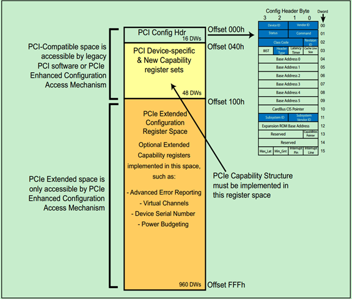

# PCIe基础

**PCI Express**，简称**PCI-E**，官方简称**PCIe**，是计算机总线的一个重要分支，它沿用既有的PCI编程概念及信号标准，并且构建了更加高速的串行通信系统标准。目前这一标准由[PCI-SIG](https://zh.wikipedia.org/wiki/PCI-SIG)组织制定和维护。


## 拓扑


## PCIx系统框图


## 配置空间

在 PCI Express (PCIe) 中，设备被分为两种类型：Type 0 设备和 Type 1 设备。Type 0 设备和 Type 1 设备的区别在于它们的配置空间结构不同。

Type 0 设备是指普通的 PCIe 设备（RC和EP）。Type 0 设备的配置空间只包含一个配置空间头部，用于描述设备的基本信息，如 Vendor ID、Device ID、Class Code、Subclass Code 等等。Type 0 设备可以有多个 BAR（Base Address Registers），用于描述设备的地址空间信息。

Type 1 设备是指 PCIe-to-PCI/PCI-X Bridge，它们可以将一个 PCIe 总线转换成一个或多个 PCI 总线，从而使 PCIe 总线上的 PCIe 设备可以与 PCI 总线上的 PCI 设备进行通信。Type 1 设备的配置空间包含一个配置空间头部和一个或多个 PCI-to-PCI Bridge (P2P) 或 CardBus Bridge (CB) 头部。Type 1 设备的每个 PCI-to-PCI Bridge (P2P) 或 CardBus Bridge (CB) 头部描述一个转换的 PCI 总线。Type 1 设备还有多个 BAR，其中每个 BAR 描述一个转换的 PCI 总线上的地址空间。

通过配置空间的`Header Type`来区分设备类型，具体如下：

* 00h：PCI Agent
* 01h：PCI Bridge
* 02h：Cardbus Bridge


<center>PCIe Type 0配置空间（RC与EP设备）</center>


<center>PCIe Type 1 配置空间（网桥设备）</center>

### 寄存器

## PCI中断

### INTx中断


### MSI中断


### MSI-X中断


## 兼容PCI协议

PCIe总线 是 PCI总线 的升级版，因此 PCIe 设备的配置空间需要兼容 PCI 协议，以确保与老式 PCI 设备的兼容性和互操作性。

1. PCIe兼容PCI配置空间格式：

PCIe 设备的配置空间必须使用与 PCI 相同的格式，包括配置空间头部和配置空间寄存器。

2. 兼容PCI配置空间寄存器

PCIe 设备的配置空间寄存器必须包括与 PCI 相同的寄存器，包括 `Vendor ID`、`Device ID`、`Class Code`、`Subclass Code`、`Header Type`、`Base Address Registers` 等。这些寄存器在 PCIe 设备中的定义必须与 PCI 相同，以确保与 PCI 设备的兼容性和互操作性。

3. 兼容PCI配置空间头部

PCIe 设备的配置空间头部必须兼容 PCI 头部格式，包括 `Header Type`、`Cache Line Size`、`Latency Timer`、`Interrupt Pin`、`Interrupt Line` 等字段。PCIe 设备必须使用 Type 0 或 Type 1 头部格式，并根据需要使用 `PCI-to-PCI Bridge (P2P)` 或 `CardBus Bridge (CB) `头部格式。

4. 兼容PCI配置空间的访问方式

PCIe 设备的配置空间必须使用与 PCI 相同的访问方法，包括使用 I/O 空间或内存空间访问配置空间。PCIe 设备的配置空间访问必须遵循 PCI 总线协议的要求和规范，以确保与 PCI 设备的兼容性和互操作性。


<center>兼容PCI配置空间</center>



[PCI Device Classes (ucw.cz)](http://pci-ids.ucw.cz/read/PD) 可用于查询设备类型。

## Memory & I/O地址空间

在PCIe总线中，可以访问PCIe设备的两种类型的地址空间，分别为`Memory`空间和`I/O`空间，`Memory`空间是一种物理地址空间，可用于访问系统内存，在PCIe总线中，`Memory`空间通常用于访问设备的配置寄存器和DMA缓冲区。`I/O`空间是一种虚拟地址空间，用于访问设备的寄存器和控制器。以进行数据传输和控制操作。

PCIe 总线将 `Memory` 地址空间和 `I/O` 地址空间分别映射到总线地址空间中的不同区域。`Memory`地址空间通常映射到系统内存地址空间中的一部分，由操作系统和设备驱动程序来管理和分配。`I/O` 地址空间则映射到总线地址空间中的一段固定区域，通常为 64KB 的大小。设备可以访问 `I/O` 地址空间中的寄存器和控制器。

在设备驱动程序中，可以使用 `inb()`、`outb()`、`inw()`、`outw()`、`inl()`、`outl()` 等函数来读取和写入 `I/O` 空间中的数据。这些函数分别用于读取和写入单字节、双字节和四字节数据，可以根据具体需求来选择适当的函数。需要注意的是，访问 I/O 空间时需要使用 `ioread*()` 和 `iowrite*()` 等内核函数来确保访问的正确性和安全性。

## sysfs下的PCIe

在Linux系统中，PCIe设备可以通过sysfs文件系统进行管理和配置。sysfs是一个虚拟文件系统，它将系统中的设备和内核对象表示为文件和目录，可以通过文件和目录的操作来管理和配置它们。

对于PCIe设备，sysfs提供了以下目录和文件：

```bash
/sys/bus/pci/devices/0000:02:01.0$ ls
acpi_index                d3cold_allowed   firmware_node  modalias     remove        resource2         subsystem_vendor
ari_enabled               device           irq            msi_bus      rescan        resource4         uevent
broken_parity_status      dma_mask_bits    label          net          reset         revision          vendor
class                     driver           link           numa_node    reset_method  rom
config                    driver_override  local_cpulist  power        resource      subsystem
consistent_dma_mask_bits  enable           local_cpus     power_state  resource0     subsystem_device
```

- class：文件，表示设备的设备类别。
- config：文件，表示设备的配置寄存器。
- consistent_dma_mask_bits：文件，表示设备的DMA地址空间是否连续。
- device：符号链接，指向设备的设备目录。
- dma_mask_bits：文件，表示设备的DMA地址位数。
- driver：符号链接，指向设备所使用的驱动程序。
- enable：文件，表示设备是否启用。
- firmware_node：符号链接，表示设备的固件节点。
- irq：文件，包含设备的中断信息。
- msi_bus：文件，包含设备的MSI（Message Signaled Interrupt）信息。
- net: 目录，包含设备的网络信息。
- power：目录，包含设备的电源管理信息。
- power_state：文件，表示设备的电源状态。
- remove：文件，表示设备是否可以被卸载。
- rescan：文件，表示设备是否需要重新扫描。
- resource：文件，包含设备的资源信息。
- resource0：文件，表示设备的第一个资源。
- resource2：文件，表示设备的第二个资源。
- resource4：文件，表示设备的第三个资源。
- revision：文件，表示设备的版本号。
- subsystem：目录，包含设备的子系统信息。
- subsystem_device：文件，表示设备的子系统设备号。
- subsystem_vendor：文件，表示设备的子系统供应商ID。
- uevent：文件，表示设备的uevent信息。
- vendor：文件，表示设备的供应商ID。

### resource

```bash
/sys/bus/pci/devices/0000:02:01.0$ cat resource
0x00000000fd5c0000 0x00000000fd5dffff 0x0000000000140204
0x0000000000000000 0x0000000000000000 0x0000000000000000
0x00000000fdff0000 0x00000000fdffffff 0x0000000000140204
0x0000000000000000 0x0000000000000000 0x0000000000000000
0x0000000000002000 0x000000000000203f 0x0000000000040101
0x0000000000000000 0x0000000000000000 0x0000000000000000
0x00000000fd500000 0x00000000fd50ffff 0x0000000000046200
0x0000000000000000 0x0000000000000000 0x0000000000000000
0x0000000000000000 0x0000000000000000 0x0000000000000000
0x0000000000000000 0x0000000000000000 0x0000000000000000
0x0000000000000000 0x0000000000000000 0x0000000000000000
0x0000000000000000 0x0000000000000000 0x0000000000000000
0x0000000000000000 0x0000000000000000 0x0000000000000000
```

上述资源信息每三个表示一个元组，其中第一个表示资源的起始地址（物理地址），第二个表示资源的结束地址，第三个表示资源的标志属性。

# 参考

[PCI Express - 维基百科，自由的百科全书 (wikipedia.org)](https://zh.wikipedia.org/wiki/PCI_Express)

[PCIE 之linux驱动分析 - 知乎 (zhihu.com)](https://zhuanlan.zhihu.com/p/399102423)

[深入PCI与PCIe之二：软件篇 - 知乎 (zhihu.com)](https://zhuanlan.zhihu.com/p/26244141)

[PCIe学习笔记之pcie结构和配置空间_pcie class code_Hober_yao的博客-CSDN博客](https://blog.csdn.net/yhb1047818384/article/details/106676528)

[PCIe扫盲系列博文连载目录篇（第二阶段）-Felix-电子技术应用-AET-中国科技核心期刊-最丰富的电子设计资源平台 (chinaaet.com)](http://blog.chinaaet.com/justlxy/p/5100053328)

[PCIe扫盲系列博文连载目录篇（第一阶段）-Felix-电子技术应用-AET-中国科技核心期刊-最丰富的电子设计资源平台 (chinaaet.com)](http://blog.chinaaet.com/justlxy/p/5100053251)

[lspci命令详解_一口Linux的博客-CSDN博客](https://blog.csdn.net/daocaokafei/article/details/114482560)

《PCI Exporess体系结构导读（王齐）》

[PCIe学习笔记之MSI/MSI-x中断及代码分析_pci_alloc_irq_vectors_Hober_yao的博客-CSDN博客](https://blog.csdn.net/yhb1047818384/article/details/106676560)
