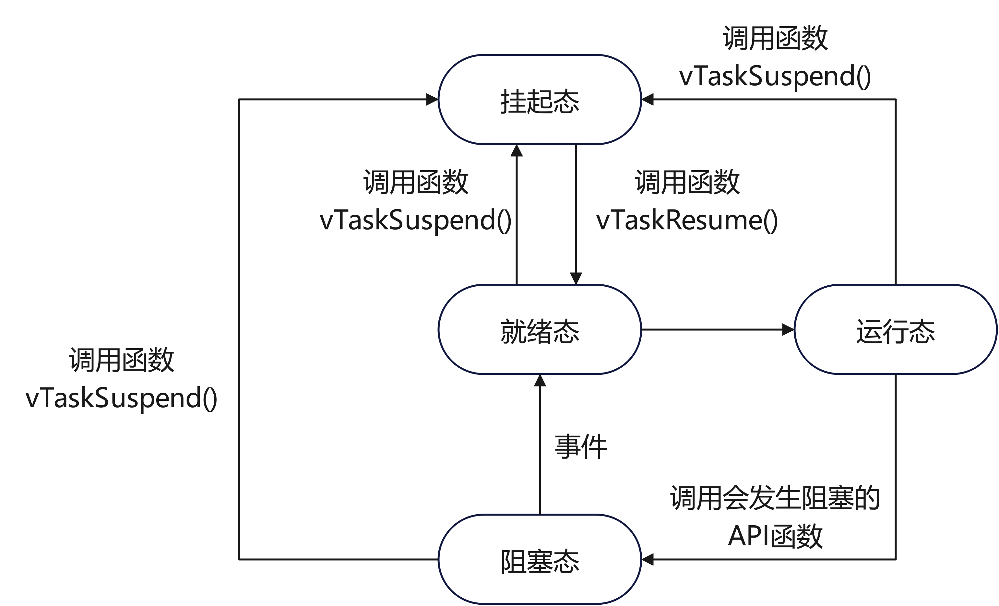

# FreeRTOS基础知识-任务

## 任务(Task)

在 FreeRTOS 中，任务是应用程序的基本执行单元。每个任务都有自己的任务控制块（Task Control Block，TCB），其中包含任务的所有信息，如任务状态、优先级、堆栈指针等。任务的创建和删除可以使用以下 API：

* xTaskCreate(): 创建一个新任务
* vTaskDelete(): 删除一个任务

任务实际就是一个无限循环且不带返回值的C函数。

### 任务状态

FreeRTOS存在4种任务状态：

* 运行态(Running)：任务正在运行，处理器内核数量决定了任务数量，stm32只能有一个任务处于运行态；
* 就绪态(Ready)：任务够随时执行，等待优先级任务执行完或等时间片；
* 阻塞态(Blocked)：任务在等待延时或外部事件；
* 挂起态(Suspended)：任务被“暂停”，调用vTaskSuspend()进入挂起状态，要用vTaskResume()才能解除进入就绪态；

除了运行态，其他三种任务状态都有对应的任务状态列表，pxReadyTaskLists[x],就绪列表，x表示任务优先级；pxDelayTaskList，阻塞列表；xSuspendedTaskList，挂起列表。

转换关系如下图，**只有就绪态可转变为运行态**：



### 任务优先级

FreeRTOS 中任务的最高优先级是通过 FreeRTOSConfig.h 文件中的 <font color=red>configMAX_PRIORITIES</font> 进行配置的，用户实际可以使用的优先级范围是 0 到 <font color=red>configMAX_PRIORITIES – 1</font>。比如我们配置此宏定义为 5，那么用户可以使用的优先级号是 0,1,2,3,4，不包含 5。

建议用户配置宏定义 configMAX_PRIORITIES 的最大值不要超过 32，即用户任务可以使用的优先级范围是0到31。

**用户配置任务的优先级数值越小，那么此任务的优先级越低，空闲任务的优先级是 0**（tskIDLE_PRIORITY）。

FreeRTOS 调度器可确保在就绪或运行状态下的任务始终比同样处于就绪状态下的更低优先级任务先获得处理器 (CPU) 时间。 换句话来说，处于运行状态的任务始终是能够运行的最高优先级任务。

处于相同优先级的任务数量不限。如果 configUSE_TIME_SLICING 未经定义，或者如果 configUSE_TIME_SLICING 设置为 1，则具有相同优先级的若干就绪状态任务将 通过时间切片轮询调度方案共享可用的处理时间。

### 相关函数

#### [xTaskCreate](https://stormwall.freertos.org/zh-cn-cmn-s/Documentation/02-Kernel/04-API-references/01-Task-creation/01-xTaskCreate)

xTaskCreate()函数用于创建一个新任务。原型如下

```c
BaseType_t xTaskCreate( TaskFunction_t pxTaskCode,
                            const char * const pcName,
                            const configSTACK_DEPTH_TYPE uxStackDepth,
                            void * const pvParameters,
                            UBaseType_t uxPriority,
                            TaskHandle_t * const pxCreatedTask )
```

参数说明：

* pvTaskCode：任务函数，即任务执行的代码。这个函数必须是 void 类型且没有返回值，并接受一个 void* 类型的参数。
* pcName：任务的名字，用于调试和跟踪，任务名称可以帮助识别任务，但在任务的实际执行中不起作用。
* uxStackDepth：任务的栈大小，指定任务所需的栈空间的深度。这个值的单位通常是以字（Word）为单位，而非字节（Byte），具体单位取决于硬件架构。
* pvParameters：传递给任务函数的参数，可以是任意类型的指针。如果不需要传递参数，可以设为 NULL。
* uxPriority：任务的优先级。优先级值越高，任务的优先级越高。FreeRTOS 允许配置优先级的最大值。
* pxCreatedTask：任务的句柄指针。创建成功后，pxCreatedTask 会指向新任务的句柄，可以用于之后操作该任务。如果不需要任务句柄，可以设为 NULL。

返回值：

* 成功时返回 pdPASS，失败时返回 errCOULD_NOT_ALLOCATE_REQUIRED_MEMORY。

示例：

```c
void vTaskFunction(void *pvParameters)
{
    for (;;)
    {
        // 任务的主要代码
    }
}

void main(void)
{
    xTaskCreate( vTaskFunction, "vTaskFunction", configMINIMAL_STACK_SIZE, NULL, 0, NULL );
    vTaskStartScheduler();  // 启动调度器
}

```

#### [vTaskDelete](https://stormwall.freertos.org/zh-cn-cmn-s/Documentation/02-Kernel/04-API-references/01-Task-creation/03-vTaskDelete)

vTaskDelete() 函数用于删除一个任务。原型如下：

```c
void vTaskDelete( TaskHandle_t xTaskToDelete )
```

参数说明：

* xTaskToDelete：要删除的任务的句柄。传递 NULL 表示删除调用 vTaskDelete 函数的任务。

使用 xTaskCreate() 和 vTaskDelete() 函数可以灵活地管理 FreeRTOS 中的任务生命周期，确保系统资源的有效使用。

示例：

```c
TaskHandle_t xHandle = NULL;
 
void vTaskFunction(void *pvParameters)
{
    for (;;)
    {
        // 任务的主要代码
        if ()
        {
            vTaskDelete(NULL);  // 删除当前任务
        }
    }
}
 
void main()
{
    xTaskCreate( vTaskFunction, "vTaskFunction", configMINIMAL_STACK_SIZE, NULL, 0, NULL );
    vTaskStartScheduler();  // 启动调度器
    // xHandle 可以用于其他地方删除该任务，如：vTaskDelete(xHandle);
}
```

### 任务运行情况

任务根据其运行情况，可以分为单次运行、周期运行、事件驱动运行三种模型，其中事件驱动模型可以最大限度提高 CPU 的使用效率，并且实时性好。

### 任务阻塞

在 FreeRTOS 中，有两种方式可以让任务进入阻塞状态：

* 阻塞在时间上：也就是执行任务的时间未到；
* 等待事件：也就是对应的事件还没有发生；


### 任务暂停

FreeRTOS 提供了让任务暂停（也称为“挂起”）执行、恢复执行的 API。

#### [vTaskSuspend](https://stormwall.freertos.org/zh-cn-cmn-s/Documentation/02-Kernel/04-API-references/02-Task-control/06-vTaskSuspend)

任务暂停的API

```c
void vTaskSuspend( TaskHandle_t xTaskToSuspend )
```

参数说明：

* xTaskToSuspend： 要挂起的任务的任务句柄，创建任务的时候会为每个任务分配一个任务句柄。如果使用函数 xTaskCreate()创建任务的话那么函数的参数，`pxCreatedTask` 就是此任务的任务句柄，如果使用函数`xTaskCreateStatic()`创建任务的话那么函数的返回值就是此任务的任务句柄。也可以通过函数 `xTaskGetHandle()`来根据任务名字来获取某个任务的任务句柄。注意！如果参数为NULL 的话表示挂起任务自己。

任务暂停后，调度器将不会赋予该任务CPU使用权，任务恢复后，调度器将根据该任务的优先级决定任务是否可以使用CPU而得到执行。任务恢复后，任务从暂停处继续向下执行。

### 任务恢复

#### [vTaskResume](https://stormwall.freertos.org/zh-cn-cmn-s/Documentation/02-Kernel/04-API-references/02-Task-control/07-vTaskResume)

任务恢复执行的API

```c
void vTaskResume( TaskHandle_t xTaskToResume )
```

当对一个任务调用 vTaskSuspend(）后，该任务将从执行处暂停执行。除非对该任务调用vTaskResume(）否则该任务无法恢复执行。

参数：

* xTaskToResume：待恢复任务的句柄。

<font color=red>注意</font>：对一个任务多次调用vTaskSuspend()暂停，仅需要在一处调用vTaskResume()即可恢复该任务。

#### [xTaskResumeFromISR](https://stormwall.freertos.org/zh-cn-cmn-s/Documentation/02-Kernel/04-API-references/02-Task-control/08-xTaskResumeFromISR)

此函数用于**在中断中恢复被挂起的任务**，若使用此函数，需要在 FreeRTOSConfig.h 文件中将宏 INCLUDE_xTaskResumeFromISR 配置为 1。**不论一个任务被函数 vTaskSuspend()挂起多少次**，只需要使用函数 vTakResumeFromISR()**恢复一次，就可以继续运行**。

```c
BaseType_t xTaskResumeFromISR( TaskHandle_t xTaskToResume )
```

参数：

* xTaskToResume：要恢复的任务句柄。

使用该函数需要判断返回值，根据返回值进行任务切换。函数 xTaskResumeFromISR()的返回值，如下所示：

| 返回值  | 描述                         |
| ------- | ---------------------------- |
| pdTRUE  | 任务恢复后需要进行任务切换   |
| pdFALSE | 任务恢复后不需要进行任务切换 |

<font color=red>**FreeRTOS官方**</font>：xTaskResumeFromISR()通常被视为危险函数，因为其操作未被锁定。因此，如果中断可能在任务被挂起之前到达，从而中断丢失，则绝对不应使用该函数来同步任务与中断。可使用信号量，或者最好是直达任务通知，来避免这种可能性。

### 任务挂起

被挂起的任务，进入 Suspend 状态，调度器在任务选择的时候，不再调度进入 Suspend 状态的任务，除非再次对此任务调用 Resume，重新进入 Ready 队列，接受调度器的调度；

#### [vTaskSuspend](https://stormwall.freertos.org/zh-cn-cmn-s/Documentation/02-Kernel/04-API-references/02-Task-control/06-vTaskSuspend)

```c
void vTaskSuspend( TaskHandle_t xTaskToSuspend )
```

参数：

* xTaskToSuspend：表示需要挂起的任务句柄。一个任务可以通过设置参数为NULL来挂起自己。


# 参考

[FreeRTOS --（7）任务管理之入门篇](https://blog.csdn.net/zhoutaopower/article/details/107019521)

[任务状态](https://freertos.org/zh-cn-cmn-s/Documentation/02-Kernel/02-Kernel-features/01-Tasks-and-co-routines/02-Task-states)

[RTOS 暂停任务-任务挂起与恢复](https://blog.csdn.net/wangyx1234/article/details/127273090?spm=1001.2014.3001.5502)

[野火-STM32MP1-FreeRTOS应用开发实战指南——基于STM32MP157开发板_任务管理](https://doc.embedfire.com/linux/stm32mp1/freertos/zh/latest/application/tasks_management.html)

[FreeRTOS 任务挂起和恢复API函数使用](https://www.cnblogs.com/bathwind/p/18109407)

