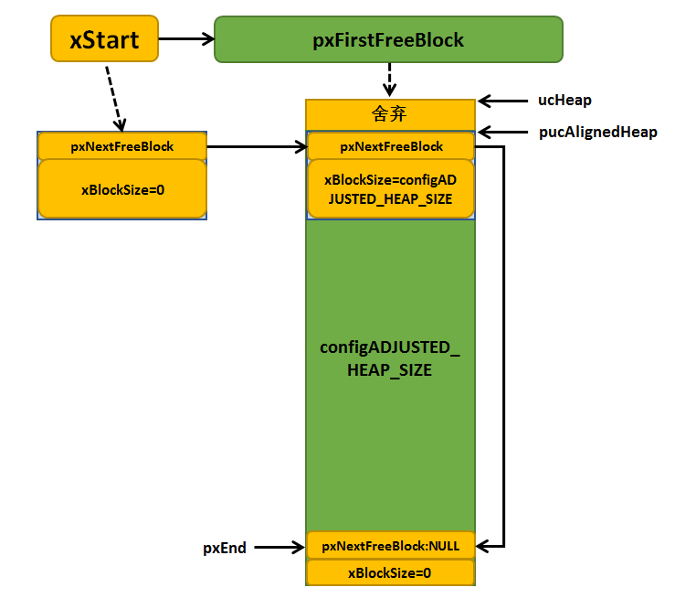
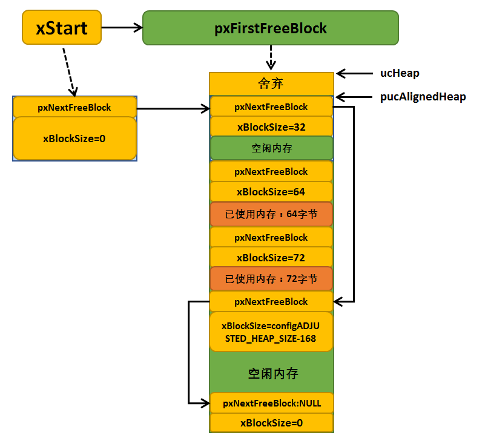
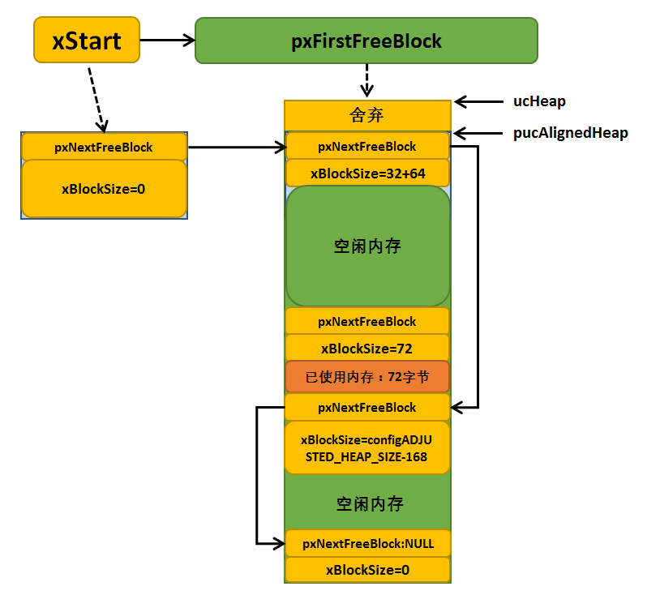
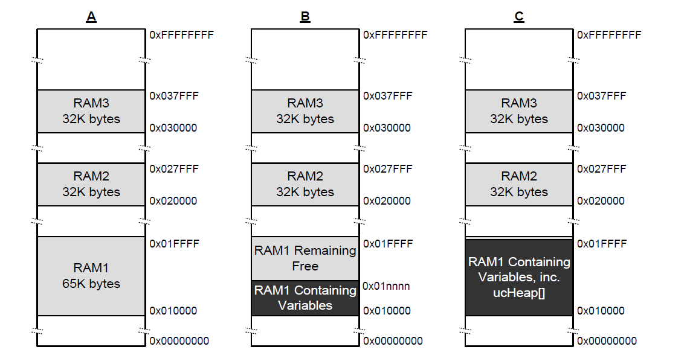
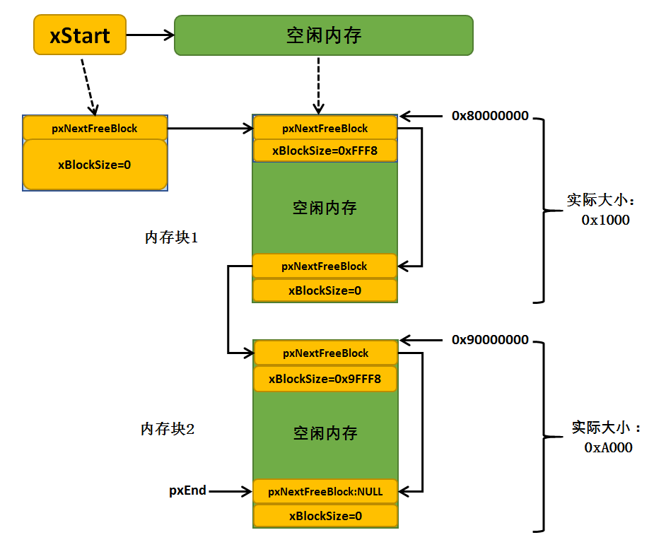

# FreeRTOS基础知识-内存管理

每次在创建任务、队列或其他 RTOS 对象时，RTOS 内核都需要 RAM。RAM 可采用以下分配方式：

- 在编译时静态分配。
- 由 RTOS API 对象创建函数从 RTOS 堆动态分配。

## 动态内存分配vs静态内存分配

在动态创建 RTOS 对象时，使用标准 C 库 `malloc()` 和 `free()` 函数并不始终恰当，原因如下：

- 它们在嵌入式系统中可能不可用。
- 它们占用了宝贵的代码空间。
- 它们通常不是线程安全的。
- 它们不是确定性的。
- 它们的执行时间不确定，无法保证实时性。
- 链接器配置复杂，可能覆盖其他变量的内存，增加调试难度。

出于这些原因，FreeRTOS会在其可移动层保留内存分配 API。可移动层位于实施核心 RTOS 功能的源文件外部，因此您可以针对正在开发的实时系统，提供特定于应用程序的适当实施。FreeRTOS 提供了多种内存分配算法（策略），但它们共享统一的上层接口（API），从而允许开发者根据实际需求选择最合适的内存管理策略。当 RTOS 内核需要 RAM 时，它会调用 `pvPortMalloc()`，而不是 `malloc()`()。在释放 RAM 时，RTOS 内核调用 `vPortFree()`，而不是 `free()`。

## FreeRTOS中的内存分配实现

FreeRTOS 下载包含五个内存分配实现示例，每个提供的实现都包含在单独的源文件中 (分别是 heap_1.c、 heap_2.c、heap_3.c、heap_4.c 和 heap_5.c)， 位于主 RTOS 源代码下载内容的 Source/Portable/MemMang 目录下。 每次一个项目中， 只应包含其中一个源文件。

* [heap_1](https://freertos.org/zh-cn-cmn-s/Documentation/02-Kernel/02-Kernel-features/09-Memory-management/01-Memory-management#heap_1c)：最简单，不允许释放内存。
* [heap_2](https://freertos.org/zh-cn-cmn-s/Documentation/02-Kernel/02-Kernel-features/09-Memory-management/01-Memory-management#heap_2c)：允许释放内存，但不会合并相邻的空闲块。
* [heap_3](https://freertos.org/zh-cn-cmn-s/Documentation/02-Kernel/02-Kernel-features/09-Memory-management/01-Memory-management#heap_3c)：简单包装了标准 malloc() 和 free()，以保证线程安全。
* [heap_4](https://freertos.org/zh-cn-cmn-s/Documentation/02-Kernel/02-Kernel-features/09-Memory-management/01-Memory-management#heap_4c)：合并相邻的空闲块以避免碎片化。包含绝对地址放置选项。
* [heap_5](https://freertos.org/zh-cn-cmn-s/Documentation/02-Kernel/02-Kernel-features/09-Memory-management/01-Memory-management#heap_5c)：如同 heap_4，能够跨越多个不相邻内存区域的堆。

<font color=red>注意</font>：

- heap_1 不太有用，因为 FreeRTOS 添加了[静态分配支持](https://freertos.org/Documentation/02-Kernel/02-Kernel-features/09-Memory-management/03-Static-vs-Dynamic-memory-allocation)。
- heap_2 现在被视为旧版，因为较新的 heap_4 实现是首选。

### heap_1


### heap_2


### heap_3


### heap_4

heap_4.c方案与heap_2.c方案一样都采用最佳匹配算法来实现动态的内存分配， 但是不一样的是heap_4.c方案还包含了一种合并算法，能把相邻的空闲的内存块合并成一个更大的块，这样可以减少内存碎片。 heap_4.c方案特别适用于移植层中可以直接使用pvPortMalloc()和vPortFree()函数来分配和释放内存的代码。

与第一种和第二种内存管理策略一样，内存堆仍然是一个大数组，定义为：

```c
static uint8_t ucHeap[ configTOTAL_HEAP_SIZE ];
```

内存分配时需要的总的堆空间由文件FreeRTOSConfig.h中的宏configTOTAL_HEAP_SIZE配置，单位为字。 通过调用函数xPortGetFreeHeapSize() 我们可以知道还剩下多少内存没有使用， 但是并不包括内存碎片。这样一来我们可以实时的调整和优化configTOTAL_HEAP_SIZE的大小。

特点：

* 支持动态申请和释放。
* 按地址升序，优先返回第一个满足size需求的空闲块。
* 链表管理，支持相邻空闲块拼接。
* 申请时间具有不确定性，因为检索空闲块需要检索链表，但是效率比标准C库中的malloc函数高得多。

heap_4.c方案的空闲内存块也是以单链表的形式连接起来的，BlockLink_t类型的局部静态变量xStart表示链表头， 但heap_4.c内存管理方案的链表尾部则保存在内存堆空间最后位置， 并使用BlockLink_t指针类型局部静态变量pxEnd指向这个区域 （而heap_2.c内存管理方案则使用BlockLink_t类型的静态变量xEnd表示链表尾）

heap_4.c内存管理方案的空闲块链表不是以内存块大小进行排序的，而是以内存块起始地址大小排序， 内存地址小的在前，地址大的在后，因为heap_4.c方案还有一个内存合并算法，在释放内存的时候， 假如相邻的两个空闲内存块在地址上是连续的，那么就可以合并为一个内存块，这也是为了适应合并算法而作的改变。

#### prvHeapInit()


```c
static void prvHeapInit( void )
{
BlockLink_t *pxFirstFreeBlock;
uint8_t *pucAlignedHeap;
size_t uxAddress;
size_t xTotalHeapSize = configTOTAL_HEAP_SIZE;

	/* 内存对齐操作 */
	uxAddress = ( size_t ) ucHeap;

	if( ( uxAddress & portBYTE_ALIGNMENT_MASK ) != 0 )
	{
		uxAddress += ( portBYTE_ALIGNMENT - 1 );
		uxAddress &= ~( ( size_t ) portBYTE_ALIGNMENT_MASK );
        /* 系统总内存大小 */
		xTotalHeapSize -= uxAddress - ( size_t ) ucHeap;
	}

	pucAlignedHeap = ( uint8_t * ) uxAddress;

    /* 初始化链表头部 */
	/* xStart is used to hold a pointer to the first item in the list of free
	blocks.  The void cast is used to prevent compiler warnings. */
	xStart.pxNextFreeBlock = ( void * ) pucAlignedHeap;
	xStart.xBlockSize = ( size_t ) 0;

    /* 初始化pxEnd，计算pxEnd的位置，它的值为内存尾部向前偏移一个
     BlockLink_t结构体大小，偏移出来的这个BlockLink_t就是pxEnd */
	/* pxEnd is used to mark the end of the list of free blocks and is inserted
	at the end of the heap space. */
	uxAddress = ( ( size_t ) pucAlignedHeap ) + xTotalHeapSize;
	uxAddress -= xHeapStructSize;
	uxAddress &= ~( ( size_t ) portBYTE_ALIGNMENT_MASK );
	pxEnd = ( void * ) uxAddress;
	pxEnd->xBlockSize = 0;
	pxEnd->pxNextFreeBlock = NULL;

    /* 将当前所有内存插入空闲内存块链表中。
     链表的尾部不是静态的，放在了内存的最后。 */
	/* To start with there is a single free block that is sized to take up the
	entire heap space, minus the space taken by pxEnd. */
	pxFirstFreeBlock = ( void * ) pucAlignedHeap;
	pxFirstFreeBlock->xBlockSize = uxAddress - ( size_t ) pxFirstFreeBlock;
	pxFirstFreeBlock->pxNextFreeBlock = pxEnd;

    /* 更新统计变量 xMinimumEverFreeBytesRemaining
    历史最小内存块 xFreeBytesRemaining系统未分配内存大小 */
	/* Only one block exists - and it covers the entire usable heap space. */
	xMinimumEverFreeBytesRemaining = pxFirstFreeBlock->xBlockSize;
	xFreeBytesRemaining = pxFirstFreeBlock->xBlockSize;

	/* 设置一个size_t类型大小的值的最高位为1，用于标记内存块是否空闲 */
	xBlockAllocatedBit = ( ( size_t ) 1 ) << ( ( sizeof( size_t ) * heapBITS_PER_BYTE ) - 1 );
}
```



<center>内存初始化完成示意图</center>

#### pvPortMalloc()

heap_4.c方案的内存申请函数与heap_2.c方案的内存申请函数大同小异， 同样是从链表头xStart开始遍历查找合适的内存块，如果某个空闲内存块的大小能容得下用户要申请的内存， 则将这块内存取出用户需要内存空间大小的部分返回给用户，剩下的内存块组成一个新的空闲块， 按照空闲内存块起始地址大小顺序插入到空闲块链表中，内存地址小的在前，内存地址大的在后。 在插入到空闲内存块链表的过程中，系统还会执行合并算法将地址相邻的内存块进行合并： 判断这个空闲内存块是相邻的空闲内存块合并成一个大内存块，如果可以则合并， 合并算法是heap_4.c内存管理方案和heap_2.c内存管理方案最大的不同之处，这样一来， 会导致的内存碎片就会大大减少，内存管理方案适用性就很强，能一样随机申请和释放内存的应用中， 灵活性得到大大的提高。

```c
void *pvPortMalloc( size_t xWantedSize )
{
BlockLink_t *pxBlock, *pxPreviousBlock, *pxNewBlockLink;
void *pvReturn = NULL;

	vTaskSuspendAll();
	{
		/* 第一次调用，先初始化堆，设置空闲列表 */
		if( pxEnd == NULL )
		{
			prvHeapInit();
		}
		else
		{
			mtCOVERAGE_TEST_MARKER();
		}

		/* 这里xWantedSize的大小有要求，需要最高位为0。
        因为后面BlockLink_t结构体中的xBlockSize的最高位需要使用
        这个成员的最高位被用来标识这个块是否空闲。因此要申请的块大小不能使用这个位 */
		if( ( xWantedSize & xBlockAllocatedBit ) == 0 )
		{
			/* 将需要分配的内存值做调整，加上链表结构需要占用的内存空间，
			xHeapStructSize表示链表结构体节点经过内存对齐后的的内存大小，空余内存的头部需要
            放置一个BlockLink_t 类型的节点进行管理，所以这里需要人为的扩充空间。 */
			if( xWantedSize > 0 )
			{
				xWantedSize += xHeapStructSize;

				/* 需要分配的内存大小与系统要求的内存对齐字节数不匹配，做内存对齐处理 */
				if( ( xWantedSize & portBYTE_ALIGNMENT_MASK ) != 0x00 )
				{
					/* Byte alignment required. */
					xWantedSize += ( portBYTE_ALIGNMENT - ( xWantedSize & portBYTE_ALIGNMENT_MASK ) );
					configASSERT( ( xWantedSize & portBYTE_ALIGNMENT_MASK ) == 0 );
				}
				else
				{
					mtCOVERAGE_TEST_MARKER();
				}
			}
			else
			{
				mtCOVERAGE_TEST_MARKER();
			}

            /* 空闲内存大小满足申请需求，进行内存分配处理 */
			if( ( xWantedSize > 0 ) && ( xWantedSize <= xFreeBytesRemaining ) )
			{
				/* 从空余内存链表的头部开始找，如果空余内存大小>xWantedSize
                就从这块内存中取出一部分内存返回，剩余的内存生成新的BlockLink_t结构插入链表 */
				pxPreviousBlock = &xStart;
				pxBlock = xStart.pxNextFreeBlock;
                
                /* 从链表头部开始查找大小符合的空余内存地址 */
				while( ( pxBlock->xBlockSize < xWantedSize ) && ( pxBlock->pxNextFreeBlock != NULL ) )
				{
					pxPreviousBlock = pxBlock;
					pxBlock = pxBlock->pxNextFreeBlock;
				}

				/*
                 如果搜索到链表尾xEnd，说明没有找到合适的空闲内存块，否则进行下一步处理
                 */
				if( pxBlock != pxEnd )
				{
					/* 此时已找到一个合适的内存块，这里返回的内存块地址是内存块 + 
                    内存块链表结构体空间偏移地址，原因是内存块头部需要加上空闲链表节点 */
					pvReturn = ( void * ) ( ( ( uint8_t * ) pxPreviousBlock->pxNextFreeBlock ) + xHeapStructSize );

					/* 将被使用的内存块从空闲内存块中移除 */
					pxPreviousBlock->pxNextFreeBlock = pxBlock->pxNextFreeBlock;

					/* If the block is larger than required it can be split into
					two. */
					if( ( pxBlock->xBlockSize - xWantedSize ) > heapMINIMUM_BLOCK_SIZE )
					{
						/* 取出分配的内存，将新的内存块的起始位置放置一个链表节点 */
						pxNewBlockLink = ( void * ) ( ( ( uint8_t * ) pxBlock ) + xWantedSize );
						configASSERT( ( ( ( size_t ) pxNewBlockLink ) & portBYTE_ALIGNMENT_MASK ) == 0 );

						/* 计算剩余内存大小，并且赋值给剩余内存链表节点中的xBlockSize
                        成员，方便下一次查找 */
						pxNewBlockLink->xBlockSize = pxBlock->xBlockSize - xWantedSize;
						pxBlock->xBlockSize = xWantedSize;

						/* 将被分割而产生的新的空间空间内存块添加到空闲链表中 */
						prvInsertBlockIntoFreeList( pxNewBlockLink );
					}
					else
					{
						mtCOVERAGE_TEST_MARKER();
					}

                    /* 更新剩余内存大小 */
					xFreeBytesRemaining -= pxBlock->xBlockSize;

                    /* 如果当前内存大小小于历史记录的最小内存大小，更新xMinimumEverFreeBytesRemaining大小 */
					if( xFreeBytesRemaining < xMinimumEverFreeBytesRemaining )
					{
						xMinimumEverFreeBytesRemaining = xFreeBytesRemaining;
					}
					else
					{
						mtCOVERAGE_TEST_MARKER();
					}

					/* xBlockSize的最高位被置1，标记当前内存已经被申请使用 */
					pxBlock->xBlockSize |= xBlockAllocatedBit;
					pxBlock->pxNextFreeBlock = NULL;
				}
				else
				{
					mtCOVERAGE_TEST_MARKER();
				}
			}
			else
			{
				mtCOVERAGE_TEST_MARKER();
			}
		}
		else
		{
			mtCOVERAGE_TEST_MARKER();
		}

		traceMALLOC( pvReturn, xWantedSize );
	}
	( void ) xTaskResumeAll();

	#if( configUSE_MALLOC_FAILED_HOOK == 1 )
	{
        /* 如果内存分配失败,调用钩子函数 */
		if( pvReturn == NULL )
		{
			extern void vApplicationMallocFailedHook( void );
			vApplicationMallocFailedHook();
		}
		else
		{
			mtCOVERAGE_TEST_MARKER();
		}
	}
	#endif

	configASSERT( ( ( ( size_t ) pvReturn ) & ( size_t ) portBYTE_ALIGNMENT_MASK ) == 0 );
	return pvReturn;
}
```

* **xFreeBytesRemaining**：表示当前系统未分配的内存堆大小；
* **xMinimumEverFreeBytesRemaining**：表示未分配内存堆空间历史最小的内存值。只有记录未分配内存堆的最小值， 才能知道最坏情况下内存堆的使用情况。
* **xBlockAllocatedBit**：这个变量在内存堆初始化的时候被初始化，初始化将它能表示的数值的最高位置1。 比如对于32位系统，这个变量被初始化为0x80000000（最高位为1）。 heap_4.c内存管理方案使用xBlockAllocatedBit来标识一个内存块是否已经被分配使用了（是否为空闲内存块）， 如果内存块已经被分配出去，则该内存块上的链表节点的成员变量xBlockSize会按位或上这个变量（即xBlockSize最高位置1）， 而在释放一个内存块时，则会把xBlockSize的最高位清零，表示内存块是空闲的。

#### vPortFree()

heap_4.c内存管理方案的内存释放函数vPortFree()也比较简单，根据传入要释放的内存块地址， 偏移之后找到链表节点，然后将这个内存块插入到空闲内存块链表中，在内存块插入过程中会执行合并算法， 这个我们已经在内存申请中讲过了（而且合并算法多用于释放内存中）。最后是将这个内存块标志为“空闲”（内 存块节点的xBlockSize成员变量最高位清0）、再更新未分配的内存堆大小即可。

```c
void vPortFree( void *pv )
{
uint8_t *puc = ( uint8_t * ) pv;
BlockLink_t *pxLink;

	if( pv != NULL )
	{
		/* 取出携带链表节点的地址 */
		puc -= xHeapStructSize;

		/* This casting is to keep the compiler from issuing warnings. */
		pxLink = ( void * ) puc;

		/* Check the block is actually allocated. */
		configASSERT( ( pxLink->xBlockSize & xBlockAllocatedBit ) != 0 );
		configASSERT( pxLink->pxNextFreeBlock == NULL );

        /* 内存块如果被使用则进行free处理 */
		if( ( pxLink->xBlockSize & xBlockAllocatedBit ) != 0 )
		{
			if( pxLink->pxNextFreeBlock == NULL )
			{
				/* 内存块标识设置为空闲 */
				pxLink->xBlockSize &= ~xBlockAllocatedBit;

				vTaskSuspendAll();
				{
					/* 更新系统空闲内存大小 */
					xFreeBytesRemaining += pxLink->xBlockSize;
					traceFREE( pv, pxLink->xBlockSize );
                    /* 将这个内存块插入到空闲块链表中,按照内存块地址大小顺序 */
					prvInsertBlockIntoFreeList( ( ( BlockLink_t * ) pxLink ) );
				}
				( void ) xTaskResumeAll();
			}
			else
			{
				mtCOVERAGE_TEST_MARKER();
			}
		}
		else
		{
			mtCOVERAGE_TEST_MARKER();
		}
	}
}
```



<center>内存申请</center>

上图为经过一段申请后的内存结构



<center>内存释放</center>

上图是经过释放并合并之后的内存块。

### heap_5

heap_5.c方案在实现动态内存分配时与heap4.c方案一样，采用最佳匹配算法和合并算法， 并且**允许内存堆跨越多个非连续的内存区，也就是允许在不连续的内存堆中实现内存分配**， 比如用户在片内RAM中定义一个内存堆，还可以在外部SDRAM再定义一个或多个内存堆，这些内存都归系统管理。

特点：

* 支持动态申请和释放。
* 按地址升序，优先返回第一个满足size需求的空闲块。
* 链表管理，支持相邻空闲块拼接。
* 支持内存堆跨越多个非连续的内存区。
* 申请时间具有不确定性，因为检索空闲块需要检索链表，但是效率比标准C库中的malloc函数高得多。

#### xHeapRegions

在FreeRTOS heap_5中，HeapRegion_t数组用于定义多个空闲内存区域，这些区域必须是未被其他变量占用的可用内存。每个区域由起始地址和大小定义，数组必须以 `{ NULL, 0 }` 终止。

```c
typedef struct HeapRegion  
{  
    /* Start address of a block of memory that will be part of the heap.*/  
    uint8_t *pucStartAddress;  /* 内存堆起始地址 */

    /* Size of the block of memory. */  
    size_t xSizeInBytes;  /* 内存块大小 */
} HeapRegion_t;  
```

<font color=red>注意</font>：

* 内存块要按照地址顺序放入到数组中，地址小的在前；
* 数组必须以使用一个NULL指针和0字节元素作为结束，以便让内存管理程序知道何时结束；



<center>芯片RAM物理地址分配</center>

按照如上物理地址，其对应的HeapRegion_t结构分配如下所示：

```c
const HeapRegion_t xHeapRegions[] =  
{  
    { ( uint8_t * ) 0x00010000UL, 0x10000 },  
    { ( uint8_t * ) 0x00020000UL, 0x08000 },  
    { ( uint8_t * ) 0x00030000UL, 0x08000 }, 
    { NULL, 0 } /* Terminates the array. */  
};  
```



<center>heap_5内存初始化完成</center>

### 其他接口函数

```c
/* 获取空闲内存大小 */
size_t xPortGetFreeHeapSize( void );

/* 获取到目前最小剩余空间，可以用来了解任务实际使用内存的情况，以对内存分配的大小进行调节 */
size_t xPortGetMinimumEverFreeHeapSize( void );

/* 内存分配失败钩子函数，可以在内部分配失败时进行一些操作，如打印信息等 */
void vApplicationMallocFailedHook( void );
```


# 参考

[FreeRTOS学习笔记＞内存管理](https://blog.csdn.net/qq_56044767/article/details/141532767)

[14. 内存管理](https://doc.embedfire.com/linux/stm32mp1/freertos/zh/latest/application/memory_management.html#)

[FreeRTOS 篇章之 heap 堆内存分配分析](https://arachnid.cc/freertos-heap/)

[FreeRTOS高级篇7---FreeRTOS内存管理分析](https://blog.csdn.net/zhzht19861011/article/details/51606068)

[FreeRTOS Heap Memory Management (1) - 内存分配介绍](https://www.cnblogs.com/yanpio/p/14817341.html)

[freertos内存管理](https://www.laumy.tech/1256.html/freertos%E5%86%85%E5%AD%98%E7%AE%A1%E7%90%86/)

[【freertos】008-内存管理及其实现细节 ](https://www.cnblogs.com/lizhuming/p/16297294.html)

[FreeRTOS 堆内存管理](https://www.freertos.org/zh-cn-cmn-s/Documentation/02-Kernel/02-Kernel-features/09-Memory-management/01-Memory-management)