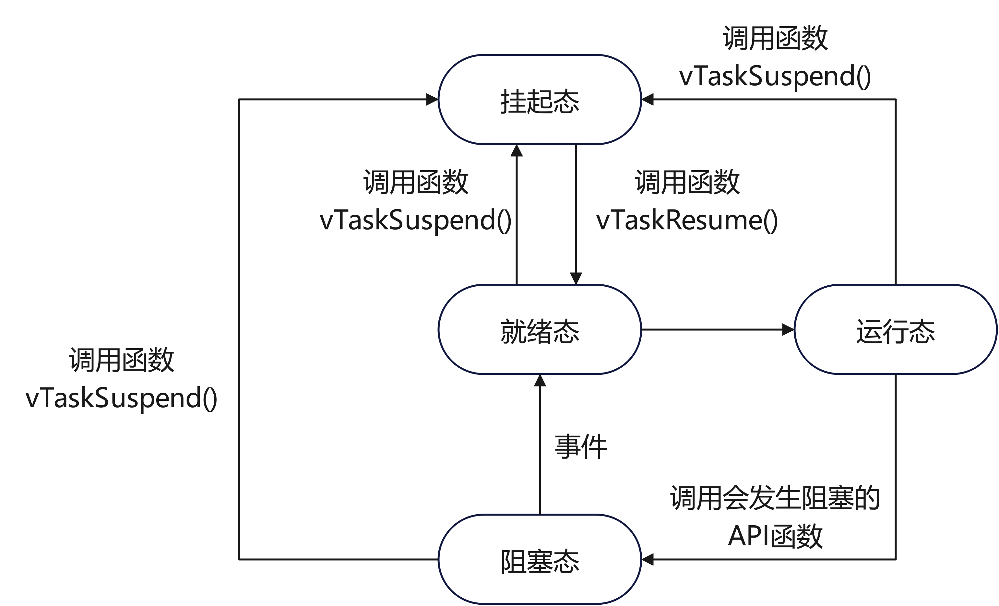

# FreeRTOS基础知识

FreeRTOS 内核是一个实时操作系统，支持各种架构。它的基础非常适合构建嵌入式微控制器应用程序。它提供了以下功能：

- 多任务计划程序。
- 多个内存分配选项（包括创建完全静态分配的系统的功能）。
- 任务间协调基元，包括任务通知、消息队列、多种信号灯类型以及流和消息缓冲区。
- 支持多核微控制器上的对称多处理 (SMP)。

FreeRTOS 内核设计为小型、简单且易于使用。典型的 RTOS 内核二进制映像大小为 4000 到 9000 字节。

## 基础概念

* **任务（Task）**：FreeRTOS 中的任务类似于标准操作系统中的线程。每个任务都有自己的独立执行路径，并且可以被调度器管理。
* **调度器（Scheduler）**：调度器负责管理任务的执行顺序。FreeRTOS 提供了优先级调度和时间片轮转调度两种机制。
* **队列（Queue）**：队列用于任务之间的数据传递。它支持多任务同时读写，并且可以根据优先级进行任务间的通信和同步。
* **信号量（Semaphore）**：信号量用于任务同步和资源管理。二值信号量和计数信号量是最常用的两种类型。
* **互斥量（Mutex）**：互斥量用于保护共享资源，防止多个任务同时访问导致数据不一致的问题。
* **定时器（Timer）**：定时器用于在特定时间间隔触发事件。FreeRTOS 提供软件定时器，用户可以灵活配置。
* **内存管理**：FreeRTOS 提供多种内存管理方案，包括静态分配、动态分配以及堆内存分配策略。

### 任务(Task)

在 FreeRTOS 中，任务是应用程序的基本执行单元。每个任务都有自己的任务控制块（Task Control Block，TCB），其中包含任务的所有信息，如任务状态、优先级、堆栈指针等。任务的创建和删除可以使用以下 API：

* xTaskCreate(): 创建一个新任务
* vTaskDelete(): 删除一个任务

任务实际就是一个无限循环且不带返回值的C函数。

#### 任务状态

FreeRTOS存在4种任务状态：

* 运行态(Running)：任务正在运行，处理器内核数量决定了任务数量，stm32只能有一个任务处于运行态；
* 就绪态(Ready)：任务够随时执行，等待优先级任务执行完或等时间片；
* 阻塞态(Blocked)：任务在等待延时或外部事件；
* 挂起态(Suspended)：任务被“暂停”，调用vTaskSuspend()进入挂起状态，要用vTaskResume()才能解除进入就绪态；

除了运行态，其他三种任务状态都有对应的任务状态列表，pxReadyTaskLists[x],就绪列表，x表示任务优先级；pxDelayTaskList，阻塞列表；xSuspendedTaskList，挂起列表。

转换关系如下图，**只有就绪态可转变为运行态**：



#### 任务优先级

FreeRTOS 中任务的最高优先级是通过 FreeRTOSConfig.h 文件中的 configMAX_PRIORITIES 进行配置的，用户实际可以使用的优先级范围是 0 到 configMAX_PRIORITIES – 1。比如我们配置此宏定义为 5，那么用户可以使用的优先级号是 0,1,2,3,4，不包含 5。

建议用户配置宏定义 configMAX_PRIORITIES 的最大值不要超过 32，即用户任务可以使用的优先级范围是0到31。

**用户配置任务的优先级数值越小，那么此任务的优先级越低，空闲任务的优先级是 0**（tskIDLE_PRIORITY）。

FreeRTOS 调度器可确保在就绪或运行状态下的任务始终比同样处于就绪状态下的更低优先级任务先获得处理器 (CPU) 时间。 换句话来说，处于运行状态的任务始终是能够运行的最高优先级任务。

处于相同优先级的任务数量不限。如果 configUSE_TIME_SLICING 未经定义，或者如果 configUSE_TIME_SLICING 设置为 1，则具有相同优先级的若干就绪状态任务将 通过时间切片轮询调度方案共享可用的处理时间。

#### 相关函数

##### xTaskCreate()

xTaskCreate()函数用于创建一个新任务。原型如下

```c
BaseType_t xTaskCreate( TaskFunction_t pxTaskCode,
                            const char * const pcName,
                            const configSTACK_DEPTH_TYPE uxStackDepth,
                            void * const pvParameters,
                            UBaseType_t uxPriority,
                            TaskHandle_t * const pxCreatedTask )
```

参数说明：

* pvTaskCode：任务函数，即任务执行的代码。这个函数必须是 void 类型且没有返回值，并接受一个 void* 类型的参数。
* pcName：任务的名字，用于调试和跟踪，任务名称可以帮助识别任务，但在任务的实际执行中不起作用。
* uxStackDepth：任务的栈大小，指定任务所需的栈空间的深度。这个值的单位通常是以字（Word）为单位，而非字节（Byte），具体单位取决于硬件架构。
* pvParameters：传递给任务函数的参数，可以是任意类型的指针。如果不需要传递参数，可以设为 NULL。
* uxPriority：任务的优先级。优先级值越高，任务的优先级越高。FreeRTOS 允许配置优先级的最大值。
* pxCreatedTask：任务的句柄指针。创建成功后，pxCreatedTask 会指向新任务的句柄，可以用于之后操作该任务。如果不需要任务句柄，可以设为 NULL。

返回值：

* 成功时返回 pdPASS，失败时返回 errCOULD_NOT_ALLOCATE_REQUIRED_MEMORY。

示例：

```c
void vTaskFunction(void *pvParameters)
{
    for (;;)
    {
        // 任务的主要代码
    }
}

void main(void)
{
    xTaskCreate( vTaskFunction, "vTaskFunction", configMINIMAL_STACK_SIZE, NULL, 0, NULL );
    vTaskStartScheduler();  // 启动调度器
}

```

##### vTaskDelete()

vTaskDelete() 函数用于删除一个任务。原型如下：

```c
void vTaskDelete( TaskHandle_t xTaskToDelete )
```

参数说明：

* xTaskToDelete：要删除的任务的句柄。传递 NULL 表示删除调用 vTaskDelete 函数的任务。

使用 xTaskCreate() 和 vTaskDelete() 函数可以灵活地管理 FreeRTOS 中的任务生命周期，确保系统资源的有效使用。

示例：

```c
TaskHandle_t xHandle = NULL;
 
void vTaskFunction(void *pvParameters)
{
    for (;;)
    {
        // 任务的主要代码
        if ()
        {
            vTaskDelete(NULL);  // 删除当前任务
        }
    }
}
 
void main()
{
    xTaskCreate( vTaskFunction, "vTaskFunction", configMINIMAL_STACK_SIZE, NULL, 0, NULL );
    vTaskStartScheduler();  // 启动调度器
    // xHandle 可以用于其他地方删除该任务，如：vTaskDelete(xHandle);
}
```

### 调度器(Scheduler)

#### 任务调度

FreeRTOS就是一款支持多任务运行的实时操作系统，具有时间片、抢占式和合作式三种调度方式。

* **合作式调度**，主要用在资源有限的设备上面，现在已经很少使用了。出于这个原因，后面的 FreeRTOS 版本中不会将合作式调度删除掉，但也不会再进行升级了。

* **抢占式调度**，每个任务都有不同的优先级，任务会一直运行直到被高优先级任务抢占或者遇到阻塞式的 API函数，比如 vTaskDelay。

* **时间片调度**，每个任务都有相同的优先级，任务会运行固定的时间片个数或者遇到阻塞式的 API 函数，比如vTaskDelay，才会执行同优先级任务之间的任务切换。

FreeRTOS 默认使用固定优先级的抢占式调度策略，对同等优先级的任务执行时间切片轮询调度，“轮询调度”是指具有相同优先级的任务轮流进入运行状态。

#### 相关函数

##### vTaskStartScheduler()

vTaskStartScheduler() 函数用于启动 FreeRTOS 的任务调度器。一旦调用此函数，调度器将开始运行，并选择最高优先级的就绪任务执行。这是 FreeRTOS 应用程序的一个重要步骤，通常在所有任务和其他 RTOS 资源创建之后调用。

原型如下：

```c
void vTaskStartScheduler( void )
```

vTaskStartScheduler() 函数没有参数，也没有返回值。

调用此函数后，FreeRTOS 将接管系统的主控权，并开始调度任务。通常，在调用 vTaskStartScheduler() 后，程序的执行将不会返回到调用它的点，因为调度器将不断运行，直到发生某些特定的情况（如调用 vTaskEndScheduler() 函数，或者系统进入低功耗模式）。

示例

```c
void vTaskFunction(void *pvParameters)
{
    for (;;)
    {
        // 任务的主要代码
    }
}
 
void main()
{
    xTaskCreate( vTaskFunction, "vTaskFunction", configMINIMAL_STACK_SIZE, NULL, 0, NULL );
    vTaskStartScheduler();  // 启动调度器
    for(;;);
}
```

函数vTaskStartScheduler()主要做了六件事情：

* **创建空闲任务**，根据是否支持静态内存管理，使用静态方式或者动态方式创建空闲任务。
* 创建定时器服务任务，创建定时器服务任务需要配置启用软件定时器，创建定时器服务任务，同样是根据是否配置支持静态内存管理，使用静态或者动态方式创建定时器服务任务。
* 关闭中断，使用portDISABLE_INTERRUPTS()关闭中断，这种方式只关闭受FreeRTOS管理的中断。关闭中断主要是为了防止SysTick中断在任务调度器开启之前或过程中，产生中断。FreeRTOS会在开始运行第一个任务时，重新打开中断。
* 初始化一些全局变量，并将任务调度器的运行标志设置为已运行。
* 初始化任务运行时间统计功能的时基定时器，任务运行时间统计功能需要一个硬件定时器提供高精度的计数，这个硬件定时器就在这里进行配置，如果配置不启用任务运行时间统计功能的，就无需进行这项硬件定时器的配置。
* 最后就是调用xPortStartScheduler()

# 参考

[RTOS 基础知识](https://www.freertos.org/zh-cn-cmn-s/Documentation/01-FreeRTOS-quick-start/01-Beginners-guide/01-RTOS-fundamentals)

[FreeRTOS学习笔记＞基础知识](https://blog.csdn.net/qq_56044767/article/details/141532579)

[FreeRTOS 调度（单核、AMP 和 SMP）](https://freertos.org/zh-cn-cmn-s/Documentation/02-Kernel/02-Kernel-features/01-Tasks-and-co-routines/04-Task-scheduling)

[FreeRTOS调度器启动过程分析](https://blog.csdn.net/qq_43460068/article/details/134723487)
