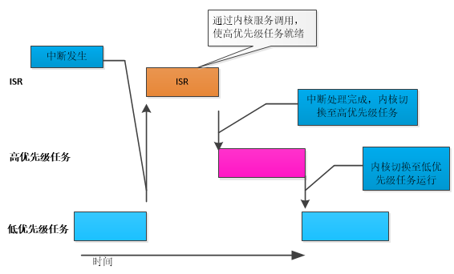
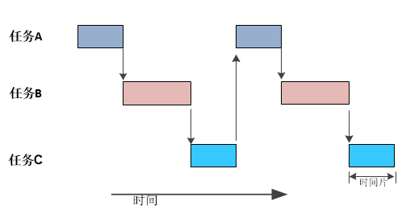

# RTOS基础知识

实时操作系统 (Real-Time Operating System,RTOS) 是一种体积小巧、确定性强的计算机操作系统。 RTOS 通常用于需要在严格时间限制内对外部事件做出反应的嵌入式系统，如医疗设备和汽车电子控制单元 (ECU)。 

实时可分为如下两类：

* **硬实时**：每个任务必须在规定时间内完成，绝对不能犯错（超时）。这通常应用于实时性极其重要的场合，如航空航天，核反应堆等。
* **软实时**：偶尔允许超时。比如90%的任务都能够按时完成，那也是OK的。

RTOS 通常比通用操作系统体积更小、重量更轻，因此 RTOS 非常适用于 内存、计算和功率受限的设备。

## 多任务处理

**内核**是操作系统的核心组件。Linux 等通用操作系统采用的内核 允许多个用户看似同时访问计算机的处理器。这些用户可以各自执行多个程序，看起来像是并发运行。

每个执行的程序由操作系统控制下的一个或多个**线程**实现。如果操作系统能够以这种方式执行多个线程，则称为**多任务处理**。

像 FreeRTOS 这样的小型 RTOS 通常将线程称为**任务**，因为它们不支持虚拟内存，因此进程和线程之间没有区别。

使用多任务操作系统的优势：

* 操作系统的多任务处理和任务间通信功能允许将复杂的应用程序 划分为一组更小且更易于管理的任务。
* 这种划分可以简化软件测试，确保团队分工明确，并促进代码复用。
* 复杂的时序和排序细节将由 RTOS 内核负责，从而减轻了应用程序代码的负担。

### 任务状态

RTOS 中的任务通常有以下几种状态：就绪状态、运行状态、阻塞状态和挂起状态。

**就绪状态**：表示任务已准备好执行，只等待被调度器选中。当一个任务被创建或者从阻塞状态恢复时，他会进入就绪状态。

**运行状态**：表示任务正在执行。在 RTOS 中，通常只有一个任务处于运行状态，其他任务处于就绪、阻塞或挂起状态。

**阻塞状态**：表示任务正在等待某个事件的发生，如等待一个信号量、等待一个消息队列中的消息等。当任务等待的事件发生时，它会从阻塞状态恢复到就绪状态。

**挂起状态**：表示任务被暂停执行，不会被调度器选中。挂起状态通常用于暂时停止一个任务的执行，以便进行调试、维护或其他操作。当任务需要恢复执行时，可以从挂起状态恢复到就绪状态。

## 多任务处理与并发

常规单核处理器一次只能执行一个任务，但多任务操作系统可以快速切换任务， 使所有任务**看起来**像是同时在执行。下图展示了 三个任务相对于时间的执行模式。任务名称用不同颜色标示，并写在左侧。时间从左向右移动， 彩色线条显示在特定时间执行的任务。上方展示了所感知的并发执行模式， 下方展示了实际的多任务执行模式。

## 调度

操作系统通常使用调度器来进行CPU的任务调度，调度器就是使用相关调度算法来决定当前需要执行的任务。

### 典型的任务调度机制

#### 抢占式调度

抢占式调度（Preemptive Scheduling），即总是期望优先级最高的任务获取CPU资源得到运行。每个任务都有不同的优先级，任务会一直运行直到被高优先级任务抢占或者遇到延时或者等待。

#### 时间片调度

时间片调度（Time Slice），是将处理器时间分成固定长度的时间片，每个任务在一个时间片内执行。即每个任务都拥有相同的优先级，任务会运行固定的时间片个数（除非任务主动延时或进入等待状态）。这种调度算法适用于多个任务具有相同优先级的情况，能够保证每个任务都有机会执行。

#### 协助式调度

协助式调度（Cooperative Scheduling，也称为合作式调度），只要一个任务不主动 yield 交出 CPU 使用权，它就会一直执行下去。目前基本不使用。

# 参考

[RTOS 基础知识](https://www.freertos.org/zh-cn-cmn-s/Documentation/01-FreeRTOS-quick-start/01-Beginners-guide/01-RTOS-fundamentals)

[RTOS 中的任务调度与三种任务模型](https://blog.csdn.net/wangyx1234/article/details/127253649)