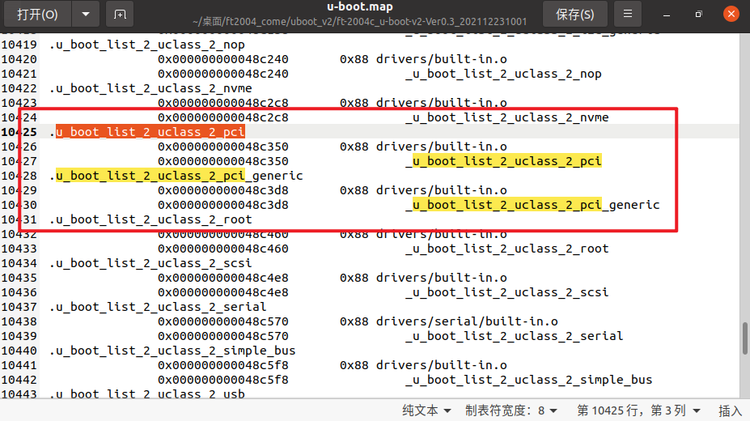
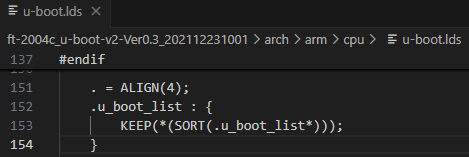
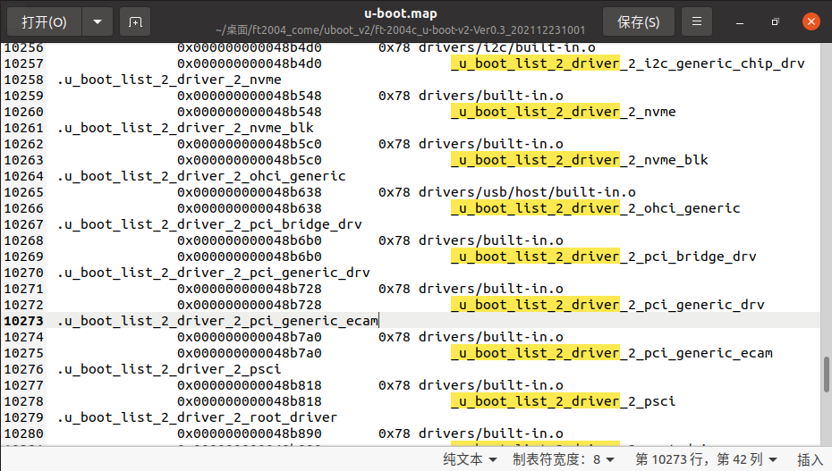

# dm驱动模型

在uboot中引入驱动模型（driver model）简称为DM，这种驱动模型为驱动的定义和访问接口提供了统一的方法，提高了驱动之间的兼容性以及访问的标准型，Uboot驱动模型和linux kernel的设备驱动模型相类似，但是又有所区别。

uboot driver model设计目标包括：

* 提供统一设备驱动框架，降低设备驱动的开发复杂度；
* 提供设备树视图；
* 支持设备组；
* 支持设备lazy init；
* 支持设备驱动沙盒测试；
* 较小的系统开销(内存和CPU)。

DM模型包含成员如下：

* uclass：uboot的驱动类，全局管理驱动程序；
* uclass_driver：uclass驱动类对应的driver。

* udevice：指设备对象，一个driver的实例；
* driver：udevice的驱动，硬件外设的driver；

## 驱动模型

### uclass

uclass对驱动进行了归类处理，他把具有相似操作的设备归到一个uclass下面，拥有相同的uclass ID，而不管它们的具体形式。

[uboot\include\dm\uclass.h](https://elixir.bootlin.com/u-boot/v2022.10/source/include/dm/uclass.h)

```c
/**
 * struct uclass - a U-Boot drive class, collecting together similar drivers
 *
 * A uclass provides an interface to a particular function, which is
 * implemented by one or more drivers. Every driver belongs to a uclass even
 * if it is the only driver in that uclass. An example uclass is GPIO, which
 * provides the ability to change read inputs, set and clear outputs, etc.
 * There may be drivers for on-chip SoC GPIO banks, I2C GPIO expanders and
 * PMIC IO lines, all made available in a unified way through the uclass.
 *
 * @priv: Private data for this uclass
 * @uc_drv: The driver for the uclass itself, not to be confused with a
 * 'struct driver'
 * @dev_head: List of devices in this uclass (devices are attached to their
 * uclass when their bind method is called)
 * @sibling_node: Next uclass in the linked list of uclasses
 */
struct uclass {
	void *priv;
	struct uclass_driver *uc_drv;
	struct list_head dev_head;
	struct list_head sibling_node;
};
```

* priv：私有成员；
* uc_drv：uclass类的驱动程序；
* dev_head：uclass中的设备链表头，设备调用bind方法时会将此设备加入到这个链表里；
* sibling_node：连接到gd->uclass_root 上。

uclass是uboot自动生成。并且不是所有uclass都会生成，有对应uclass driver并且有被udevice匹配到的uclass才会生成，所有生成的uclass都会被挂载gd->uclass_root链表上。

### uclass_driver

uclass_driver 就是`uclass`的驱动程序。其主要作用是：为`uclass`提供统一管理的接口

[uboot\include\dm\uclass.h](https://elixir.bootlin.com/u-boot/v2022.10/source/include/dm/uclass.h)

```c
/**
 * struct uclass_driver - Driver for the uclass
 *
 * A uclass_driver provides a consistent interface to a set of related
 * drivers.
 *
 * @name: Name of uclass driver
 * @id: ID number of this uclass
 * @post_bind: Called after a new device is bound to this uclass
 * @pre_unbind: Called before a device is unbound from this uclass
 * @pre_probe: Called before a new device is probed
 * @post_probe: Called after a new device is probed
 * @pre_remove: Called before a device is removed
 * @child_post_bind: Called after a child is bound to a device in this uclass
 * @child_pre_probe: Called before a child in this uclass is probed
 * @child_post_probe: Called after a child in this uclass is probed
 * @init: Called to set up the uclass
 * @destroy: Called to destroy the uclass
 * @priv_auto_alloc_size: If non-zero this is the size of the private data
 * to be allocated in the uclass's ->priv pointer. If zero, then the uclass
 * driver is responsible for allocating any data required.
 * @per_device_auto_alloc_size: Each device can hold private data owned
 * by the uclass. If required this will be automatically allocated if this
 * value is non-zero.
 * @per_device_platdata_auto_alloc_size: Each device can hold platform data
 * owned by the uclass as 'dev->uclass_platdata'. If the value is non-zero,
 * then this will be automatically allocated.
 * @per_child_auto_alloc_size: Each child device (of a parent in this
 * uclass) can hold parent data for the device/uclass. This value is only
 * used as a fallback if this member is 0 in the driver.
 * @per_child_platdata_auto_alloc_size: A bus likes to store information about
 * its children. If non-zero this is the size of this data, to be allocated
 * in the child device's parent_platdata pointer. This value is only used as
 * a fallback if this member is 0 in the driver.
 * @ops: Uclass operations, providing the consistent interface to devices
 * within the uclass.
 * @flags: Flags for this uclass (DM_UC_...)
 */
struct uclass_driver {
	const char *name;
	enum uclass_id id;
	int (*post_bind)(struct udevice *dev);
	int (*pre_unbind)(struct udevice *dev);
	int (*pre_probe)(struct udevice *dev);
	int (*post_probe)(struct udevice *dev);
	int (*pre_remove)(struct udevice *dev);
	int (*child_post_bind)(struct udevice *dev);
	int (*child_pre_probe)(struct udevice *dev);
	int (*child_post_probe)(struct udevice *dev);
	int (*init)(struct uclass *class);
	int (*destroy)(struct uclass *class);
	int priv_auto_alloc_size;
	int per_device_auto_alloc_size;
	int per_device_platdata_auto_alloc_size;
	int per_child_auto_alloc_size;
	int per_child_platdata_auto_alloc_size;
	const void *ops;
	uint32_t flags;
};

/* Declare a new uclass_driver */
#define UCLASS_DRIVER(__name)						\
	ll_entry_declare(struct uclass_driver, __name, uclass)
```

* name：uclass驱动的名称，用于标识该uclass，例如"pci"、"i2c"等。
* id：uclass的唯一ID，由enum uclass_id定义，用于在代码中识别uclass类型，在 `include/dm/uclass-id.h` 中定义。。
* post_bind：回调函数，当有新的设备绑定到这个uclass之后被调用。可以用于在绑定后执行一些初始化操作。
* pre_unbind：回调函数，在设备从uclass解绑之前被调用。可以用于清理资源。
* pre_probe：回调函数，在设备被**探测（probe）之前调用**。可以用于设置设备探测前的条件。
* post_probe：回调函数，**在设备探测成功后调用**。通常用于设备探测后的初始化工作，例如PCI uclass在post_probe中会扫描总线并添加设备。
* pre_remove：回调函数，在设备被移除之前调用。用于执行设备移除前的清理工作。
* child_post_bind：回调函数，当有子设备绑定到属于这个uclass的设备时被调用。用于处理子设备绑定后的操作。
* child_pre_probe：回调函数，在属于这个uclass的子设备被探测之前调用。
* child_post_probe：回调函数，在属于这个uclass的子设备被探测之后调用。
* init：回调函数，用于初始化uclass本身。在uclass被创建时调用。
* destroy：回调函数，用于销毁uclass，释放资源。
* priv_auto_alloc_size：如果非零，则自动分配该大小的内存作为uclass的私有数据（存储在uclass的priv指针中）。如果为零，则需要uclass驱动自行管理私有数据。
* per_device_auto_alloc_size：每个设备可以拥有属于uclass的私有数据。如果非零，则自动为每个设备分配该大小的内存，存储在设备的uclass_priv指针中。
* per_device_platdata_auto_alloc_size：每个设备可以拥有由uclass管理的平台数据（存储在dev->uclass_platdata中）。如果非零，则自动分配该大小的内存。
* per_child_auto_alloc_size：对于每个子设备（其父设备属于该uclass），可以为子设备分配父设备相关的数据。如果非零，则自动分配该大小的内存，存储在子设备的parent_priv指针中。如果驱动中该成员为0，则使用uclass的这个值作为回退。
* per_child_platdata_auto_alloc_size：类似于per_child_auto_alloc_size，但用于平台数据（存储在子设备的parent_platdata指针中）。同样，如果驱动中为0则使用uclass的值。
* ops：指向uclass操作函数集的指针，这些操作函数为uclass中的设备提供一致的接口。例如，一个串口uclass可能会提供putc和getc等操作。
* flags：uclass的标志位，用于控制uclass的行为。例如，DM_UC_FLAG_SEQ_ALIAS表示为设备分配序列号别名。

uclass_driver 是用UCLASS_DRIVER来定义，下面以pci的uclass_driver为例说明：

[uboot\drivers\pci\pci-uclass.c](https://elixir.bootlin.com/u-boot/v2025.07/source/drivers/pci/pci-uclass.c)

```c
UCLASS_DRIVER(pci) = {
	.id		= UCLASS_PCI,
	.name		= "pci",
	.flags		= DM_UC_FLAG_SEQ_ALIAS,
	.post_bind	= dm_scan_fdt_dev,
	.pre_probe	= pci_uclass_pre_probe,
	.post_probe	= pci_uclass_post_probe,
	.child_post_bind = pci_uclass_child_post_bind,
	.per_device_auto_alloc_size = sizeof(struct pci_controller),
	.per_child_platdata_auto_alloc_size =
			sizeof(struct pci_child_platdata),
};
```

当编译完成之后可在u-boot.map文件中查找到对应的 u_boot_list_2_uclass_2_pci 数据段存放位置如下：



<center>u_boot_list_2_uclass_2_pci</center>

### udevice

udevice是硬件设备的抽象，一个udevice 代表一个设备，uboot会从设备树中读取设备树节点信息，每个节点都生成一个udevice。也可以用宏U_BOOT_DEVICE来定义一个设备。

[uboot\include\dm\device.h](https://elixir.bootlin.com/u-boot/v2022.10/source/include/dm/device.h)

```c
/**
 * struct udevice - An instance of a driver
 *
 * This holds information about a device, which is a driver bound to a
 * particular port or peripheral (essentially a driver instance).
 *
 * A device will come into existence through a 'bind' call, either due to
 * a U_BOOT_DEVICE() macro (in which case platdata is non-NULL) or a node
 * in the device tree (in which case of_offset is >= 0). In the latter case
 * we translate the device tree information into platdata in a function
 * implemented by the driver ofdata_to_platdata method (called just before the
 * probe method if the device has a device tree node.
 *
 * All three of platdata, priv and uclass_priv can be allocated by the
 * driver, or you can use the auto_alloc_size members of struct driver and
 * struct uclass_driver to have driver model do this automatically.
 *
 * @driver: The driver used by this device
 * @name: Name of device, typically the FDT node name
 * @platdata: Configuration data for this device
 * @parent_platdata: The parent bus's configuration data for this device
 * @uclass_platdata: The uclass's configuration data for this device
 * @node: Reference to device tree node for this device
 * @driver_data: Driver data word for the entry that matched this device with
 *		its driver
 * @parent: Parent of this device, or NULL for the top level device
 * @priv: Private data for this device
 * @uclass: Pointer to uclass for this device
 * @uclass_priv: The uclass's private data for this device
 * @parent_priv: The parent's private data for this device
 * @uclass_node: Used by uclass to link its devices
 * @child_head: List of children of this device
 * @sibling_node: Next device in list of all devices
 * @flags: Flags for this device DM_FLAG_...
 * @req_seq: Requested sequence number for this device (-1 = any)
 * @seq: Allocated sequence number for this device (-1 = none). This is set up
 * when the device is probed and will be unique within the device's uclass.
 * @devres_head: List of memory allocations associated with this device.
 *		When CONFIG_DEVRES is enabled, devm_kmalloc() and friends will
 *		add to this list. Memory so-allocated will be freed
 *		automatically when the device is removed / unbound
 */
struct udevice {
	const struct driver *driver;
	const char *name;
	void *platdata;
	void *parent_platdata;
	void *uclass_platdata;
	ofnode node;
	ulong driver_data;
	struct udevice *parent;
	void *priv;
	struct uclass *uclass;
	void *uclass_priv;
	void *parent_priv;
	struct list_head uclass_node;
	struct list_head child_head;
	struct list_head sibling_node;
	uint32_t flags;
	int req_seq;
	int seq;
#ifdef CONFIG_DEVRES
	struct list_head devres_head;
#endif
};
```

* driver：指向此设备对应的驱动程序的指针。
* name：设备的名称标识，通常来自设备树节点名或平台数据，例如`serial@100000`。
* platdata：驱动私有数据，存放设备的配置信息，在设备与驱动匹配时设置。
* parent_platdata：提供给父设备使用的配置信息 。
* uclass_platdata：设备的uclass配置信息。
* node：设备的设备树节点索引。
* driver_data：驱动私有数据，通过该成员将设备和驱动进行匹配。
* parent：父设备指针，若为顶层设备则为NULL。
* priv：设备的私有数据。
* uclass：指向设备所属 uclass 的指针。
* uclass_priv：uclass 为设备存储的私有数据。
* parent_priv：父设备私有数据。
* uclass_node：用于将设备链接到所属 uclass 的设备链表中。
* child_head：此设备所有子设备的链表头。
* sibling_node：设备列表中的下一个设备。
* flags：控制设备行为的标志位，通常有DM_FLAG_ACTIVATED、DM_FLAG_BOUND等
* req_seq：设备请求的特定序列号（如设备树中指定），-1 表示不指定。
* seq：系统为设备分配的实际序列号，在同一 uclass 中唯一。
* devres_head：设备管理的资源链表头，用于自动资源管理，当CONFIG_DEVRES使能时，devm_kmalloc()申请的内存会添加到该列表中，以这种方式申请的内存，在设备removed或unbound时，会自动释放。

udevice设备可通过宏U_BOOT_DEVICE静态定义

### driver

特定udevice的驱动，硬件外设的driver，其作用是为特定类型的硬件设备提供统一的驱动接口和管理框架，实现设备驱动的标准化、自动化和可维护性。

[uboot\include\dm\device.h](https://elixir.bootlin.com/u-boot/v2022.10/source/include/dm/device.h)

```c
/**
 * struct driver - A driver for a feature or peripheral
 *
 * This holds methods for setting up a new device, and also removing it.
 * The device needs information to set itself up - this is provided either
 * by platdata or a device tree node (which we find by looking up
 * matching compatible strings with of_match).
 *
 * Drivers all belong to a uclass, representing a class of devices of the
 * same type. Common elements of the drivers can be implemented in the uclass,
 * or the uclass can provide a consistent interface to the drivers within
 * it.
 *
 * @name: Device name
 * @id: Identifies the uclass we belong to
 * @of_match: List of compatible strings to match, and any identifying data
 * for each.
 * @bind: Called to bind a device to its driver
 * @probe: Called to probe a device, i.e. activate it
 * @remove: Called to remove a device, i.e. de-activate it
 * @unbind: Called to unbind a device from its driver
 * @ofdata_to_platdata: Called before probe to decode device tree data
 * @child_post_bind: Called after a new child has been bound
 * @child_pre_probe: Called before a child device is probed. The device has
 * memory allocated but it has not yet been probed.
 * @child_post_remove: Called after a child device is removed. The device
 * has memory allocated but its device_remove() method has been called.
 * @priv_auto_alloc_size: If non-zero this is the size of the private data
 * to be allocated in the device's ->priv pointer. If zero, then the driver
 * is responsible for allocating any data required.
 * @platdata_auto_alloc_size: If non-zero this is the size of the
 * platform data to be allocated in the device's ->platdata pointer.
 * This is typically only useful for device-tree-aware drivers (those with
 * an of_match), since drivers which use platdata will have the data
 * provided in the U_BOOT_DEVICE() instantiation.
 * @per_child_auto_alloc_size: Each device can hold private data owned by
 * its parent. If required this will be automatically allocated if this
 * value is non-zero.
 * @per_child_platdata_auto_alloc_size: A bus likes to store information about
 * its children. If non-zero this is the size of this data, to be allocated
 * in the child's parent_platdata pointer.
 * @ops: Driver-specific operations. This is typically a list of function
 * pointers defined by the driver, to implement driver functions required by
 * the uclass.
 * @flags: driver flags - see DM_FLAGS_...
 */
struct driver {
	char *name;
	enum uclass_id id;
	const struct udevice_id *of_match;
	int (*bind)(struct udevice *dev);
	int (*probe)(struct udevice *dev);
	int (*remove)(struct udevice *dev);
	int (*unbind)(struct udevice *dev);
	int (*ofdata_to_platdata)(struct udevice *dev);
	int (*child_post_bind)(struct udevice *dev);
	int (*child_pre_probe)(struct udevice *dev);
	int (*child_post_remove)(struct udevice *dev);
	int priv_auto_alloc_size;
	int platdata_auto_alloc_size;
	int per_child_auto_alloc_size;
	int per_child_platdata_auto_alloc_size;
	const void *ops;	/* driver-specific operations */
	uint32_t flags;
};
```

* name：驱动程序的唯一名称标识，例如`pci_generic_drv`。
* id：指定此驱动程序属于哪个 uclass，例如`UCLASS_PCI`。
* of_match：要匹配的兼容字符串列表，以及每个字符串的标识数据。
* bind：当设备与驱动程序绑定时调用，用于将设备绑定到其驱动程序。
* probe：激活和初始化硬件设备的核心函数。
* remove：调用该函数来停用和移除一个设备。
* unbind：调用该函数来解除设备与驱动程序的绑定。
* ofdata_to_platdata：在probe之前调用该函数以解码设备树数据，将设备树节点数据转换为平台数据。
* child_post_bind：当子设备绑定到此驱动程序管理的设备后调用。
* child_pre_probe：在probe子设备之前调用。设备已经分配了内存，但还没有被probe到。
* child_post_remove：在子设备被移除后调用。设备已经分配了内存，但是它的device remove()方法已经被调用。
* priv_auto_alloc_size：如果非零，这是在设备的->priv指针中分配的私有数据的大小。如果为零，则驱动负责分配所需的数据。
* platdata_auto_alloc_size：如果非零，这是在设备的->platdata中分配的平台数据的大小。这通常只对设备树驱动有用(那些有of_match的驱动)，因为使用平台数据的驱动会在U_BOOT_DEVICE()实例化中提供数据。
* per_child_auto_alloc_size：每个设备都可以保存其父设备拥有的私有数据。如果这个值非零，这个将被自动分配。
* per_child_platdata_auto_alloc_size：bus存储关于它的子设备的信息。如果非零，该数值则是数据的大小，将分配在子进程的parent_platdata指针指向的区域中。
* ops：驱动特殊操作。这通常是一个由驱动定义的函数指针列表，用于实现类（uclass）所需要的驱动函数。
* flags：控制驱动程序行为的标志位，例如：`DM_FLAG_PRE_RELOC`；

driver一般使用U_BOOT_DRIVER宏定义。

## U_BOOT_DRIVER与U_BOOT_DEVICE

U_BOOT_DRIVER以及U_BOOT_DEVICE的声明如下：

[uboot\include\dm\device.h](https://elixir.bootlin.com/u-boot/v2022.10/source/include/dm/device.h)

[uboot\include\dm\platdata.h](https://elixir.bootlin.com/u-boot/v2022.10/source/include/dm/platdata.h)

[uboot\include\linker_lists.h](https://elixir.bootlin.com/u-boot/v2022.10/source/include/linker_lists.h)

```c
uboot\include\dm\device.h
/* Declare a new U-Boot driver */
#define U_BOOT_DRIVER(__name)						\
	ll_entry_declare(struct driver, __name, driver)

uboot\include\dm\platdata.h
/**
 * NOTE: Avoid using these except in extreme circumstances, where device tree
 * is not feasible (e.g. serial driver in SPL where <8KB of SRAM is
 * available). U-Boot's driver model uses device tree for configuration.
 */
#define U_BOOT_DEVICE(__name)						\
	ll_entry_declare(struct driver_info, __name, driver_info)
    
uboot\include\linker_lists.h
/**
 * ll_entry_declare() - Declare linker-generated array entry
 * @_type:	Data type of the entry
 * @_name:	Name of the entry
 * @_list:	name of the list. Should contain only characters allowed
 *		in a C variable name!
 *
 * This macro declares a variable that is placed into a linker-generated
 * array. This is a basic building block for more advanced use of linker-
 * generated arrays. The user is expected to build their own macro wrapper
 * around this one.
 *
 * A variable declared using this macro must be compile-time initialized.
 *
 * Special precaution must be made when using this macro:
 *
 * 1) The _type must not contain the "static" keyword, otherwise the
 *    entry is generated and can be iterated but is listed in the map
 *    file and cannot be retrieved by name.
 *
 * 2) In case a section is declared that contains some array elements AND
 *    a subsection of this section is declared and contains some elements,
 *    it is imperative that the elements are of the same type.
 *
 * 3) In case an outer section is declared that contains some array elements
 *    AND an inner subsection of this section is declared and contains some
 *    elements, then when traversing the outer section, even the elements of
 *    the inner sections are present in the array.
 *
 * Example:
 *
 * ::
 *
 *   ll_entry_declare(struct my_sub_cmd, my_sub_cmd, cmd_sub) = {
 *           .x = 3,
 *           .y = 4,
 *   };
 */
#define ll_entry_declare(_type, _name, _list)				\
	_type _u_boot_list_2_##_list##_2_##_name __aligned(4)		\
			__attribute__((unused,				\
			section(".u_boot_list_2_"#_list"_2_"#_name)))
```

最终的调用为ll_entry_declare宏，ll_entry_declare用于将声明的变量放置在链接器固定的位置中

uboot中U_BOOT_DRIVER(pci_bridge_drv)经过上述宏展开之后的形式如下所示：

```c
U_BOOT_DRIVER(pci_bridge_drv) = {
	.name		= "pci_bridge_drv",
	.id		= UCLASS_PCI,
	.of_match	= pci_bridge_ids,
	.ops		= &pci_bridge_ops,
};


ll_entry_declare(struct driver, pci_bridge_drv, driver)
	struct driver _u_boot_list_2_driver_2_pci_bridge_drv __aligned(4) __attribute__((unused, section(".u_boot_list_2_driver_2_pci_bridge_drv"))) = {
		.name		= "pci_bridge_drv",
		.id		= UCLASS_PCI,
		.of_match	= pci_bridge_ids,
		.ops		= &pci_bridge_ops,
	};
```

经过上述声明可得如下信息：

* 要求它们存放的时候4字节对齐，这通常是为了更方便的访问处理它们；
* 要求它们存放在一个各自独有的段里面。

在链接脚本arch/arm/cpu/u-boot.lds中有如下定义:



<center>u-boot.ldt</center>

所有以.u_boot_list开头的段都会在这里存放，KEEP关键字是为了保证所有的段多被加进来，不要被链接器自作聪明的把某些它认为没有的段舍弃;
用宏U_BOOT_DRIVER和U_BOOT_DEVICE声明的变量将被分配到自己一个特有的段下，在链接的时候被组织到一起,具体可以在uboot编译成功后生成的u-boot.map中查看到u_boot_list段的相关信息如下:



<center>u-boot.map</center>

## U-Boot DM的使能

要打开DM ，最后反映在几个配置信息上：

* CONFIG_DM=y，全局DM模型打开；
* CONFIG_DM_XXX=y，某个驱动的DM模型的打开；
* 可以通过Kconifg、Makefile来查看对应宏的使用情况。


# 参考

[uboot驱动模型(DM)分析(一)](https://www.cnblogs.com/gs1008612/p/8252845.html)

[Driver Model](https://docs.u-boot.org/en/latest/develop/driver-model/index.html#driver-model)

[U-Boot驱动模型DM](https://blog.csdn.net/heshuangzong/article/details/129959402)

[Uboot Driver Model](https://blog.csdn.net/weixin_41028621/article/details/90643550)

[uboot驱动模型(DM)分析(二)](https://www.cnblogs.com/gs1008612/p/8253213.html)

[u-boot 学习笔记：uclass 与 UCLASS_DRIVER 的理解](https://blog.csdn.net/tcjy1000/article/details/137735466)

[uboot驱动之udevice](https://blog.csdn.net/huhaoxuan2010/article/details/106528814)

[uboot 设备驱动模型 ](https://www.cnblogs.com/YYFaGe/p/16672483.html)

[u-boot的驱动模型分析](https://zhuanlan.zhihu.com/p/550611787)

[【uboot】uboot 2020.04 DM驱动模式 -- 架构分析](https://blog.csdn.net/ZHONGCAI0901/article/details/117781158)

[超详细【Uboot驱动开发】（三）Uboot驱动模型](https://zhuanlan.zhihu.com/p/460754843)
