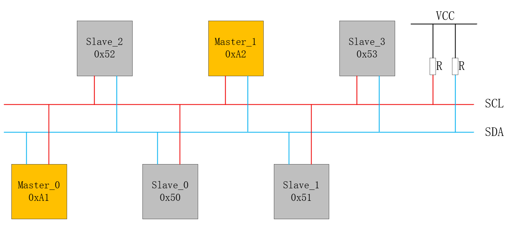
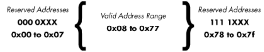

# i2c总线基础知识

## 基本概念

IIC又称i2c（Inter-Integrated Circuit），中文应该叫集成电路总线，它是一种串行通信总线，使用多主从架构，是由飞利浦公司在1980年代初设计的，方便了主板、嵌入式系统或手机与周边设备组件之间的通讯。由于其简单性，它被广泛用于微控制器与传感器阵列，显示器，IoT设备，EEPROM等之间的通信，i2c总线，分别由`SDA`(串行数据线)和`SCL`(串行时钟线)及上拉电阻组成，通信原理是通过对`SCL`和`SDA`线高低电平时序的控制，来产生i2c总线协议所需要的信号进行数据的传递。在总线空闲状态时，这两根线一般被上面所接的上拉电阻拉高，保持着高电平。

## i2c物理层

i2c一共只有两根线，一条是双向的串行数据线，一条是串行时钟线。

* `SCL`（Serial Clock Line）：时钟线，C代表时钟，用来控制总线数据收发时。
* `SDA`（Serial Data）：数据线，D代表Data也就是数据，用来传输总线上的数据

### 基本特征

* i2c总线仅需两条线即可分别是`SDA`(串行数据线)、`SCL`(串行时钟线)。
* 没有严格的波特率要求。
* 所有连接到总线上的i2c器件输出引脚都必须是漏极开漏(OD)或集电极开漏(OC)输出。
* 所有组件之间都存在简单的主/从关系，连接到总线的每个设备均可通过唯一的地址进行软件寻址。
* i2c是真正的多主设备总线，可提供仲裁和冲突检测。
* i2c总线是半双工总线，同一时间只可以单向通信。
* 传输速率可分为：
  * 标准模式：100Kbit/s
  * 快速模式：400Kbit/s
  * 高速模式：3.4Mbit/s
* 最大设备数无限制。
* 最大从机数理论上支持127。
* 上拉电阻一般在4.8k~10k之间。
*  I2C 总线上的主设备与从设备之间以字节(8位)为单位进行双向的数据传输。

## i2c协议层

### 起始&终止信号

- 起始信号：`SCL`为高电平期间，`SDA`从高到低。
- 终止信号：`SCL`为高电平期间，`SDA`从低到高

> 注意：
>
> * 正常传送数据期间，当`SCL`处于高电平时，`SDA`不能变化（在SCL为高电平旗舰SDA不能由高拉低或者由低拉高）；
> * 传输起始、终止时，当`SCL`处于高电平时，允许`SDA`变化，并且`SDA`的变化指示着数据传输的起始与终止。

**起始信号和终止信号都是由主机发送的**。在起始信号产生之后，总线就处于被占用的状态，在终止信号产生之后，总线就处于空闲状态。

### 数据位的有效性

i2c总线在进行**数据传送**时，**时钟信号为高电平期间**，**数据线上的数据必须保持稳定**；只有在时钟线上的信号为低电平期间，数据线上的高电平或低电平状态才允许变化。

### 字节的传送与应答

每当发送端（可能是从机，也可能是主机）**传输完一个字节的数据之后**，**发送端会等待**一段时间来**接收接收端的应答信号**。**接收端**通过**拉低`SDA`数据线**，给发送端发送一个应答信号，以提醒发送端：“我这边已经接收完成，数据可以继续传输”。接下来，发送端就可以继续发送数据了。

* 应答信号：主机SCL拉高，读取从机SDA的电平，为低电平表示产生应答。

>  注意：
>
> * 传输的起始与终止信号由主机发出！
>
> * 每个字节的应答信号由这个字节的接收端（可能是主机，也可能是从机）发出！

每一个数据段传输必须保证是8位长度；数据传送时，**先传送最高位(MSB)**，每一个**被传送的字节后面都必须跟一位应答位**（即一帧共有9位）。

主机发出起始信号后，传给从机的第一个字节（寻址字节）的过程图如下：

### 总线寻址

**主机在起始信号之后**，**紧接着就向总线上发送8位（1字节）数据**，用于**寻址**。这8位数据是在起始信号之后发送的第一个字节，这个字节后面的字节都是数据，不再是寻址，除非又重新来一个起始信号。

#### 保留地址

| 从机地址+R/W | 描述               |
| ------------ | ------------------ |
| 0000_0000    | 呼叫地址           |
| 0000_0001    | 起始字节           |
| 0000_001X    | CBUS地址           |
| 0000_010X    | 保留供不同总线格式 |
| 0000_011X    | 保留将来用         |
| 0000_1XXX    | HS模式主机码       |
| 1111_0XXXX   | 10位从机地址       |
| 1111_1XXXX   | 保留将来用         |

#### 7位地址寻址

有效的7bit地址范围

#### 10位地址寻址

**10位**寻址与**7位**寻址兼容，而且可以结合使用。

10位寻址采用了保留的`1111XXX`作为起始条件，或重复起始条件的后第一个字节的头7位。10位寻址不会影响已有的7位寻址，有7位和10位地址的器件都可以连接`IIC`总线的10位地址格式到相同的`IIC`总线。它们都能用于标准模式和高速模式系统。

10位从机地址由起始条件或重复起始条件后的头两个字节组成。

第一个字节的头7位是`11110XX`的组合，其中最后两位XX是10位地址的两个最高位（`MSB`）。第一个字节的第8位是`R/W`，决定传输的方向。第一个字节的最低位是“0”，表示主机将写信息到选中的从机，“1”表示主机将向从机读信息。如果R/W位是“0”，则第二字节是10位从机地址剩下的8位；如果`R/W`位是“1”，则下一个字节是从机发给主机的数据。

# 参考

[I2C总线 | I2C总线介绍](https://www.cnblogs.com/feige1314/p/17393725.html)

[[STM32学习]——一文搞懂I2C总线](https://blog.csdn.net/qq_43460068/article/details/122358142)

[IIC从地址之7位，8位和10位详解](https://blog.csdn.net/geju323/article/details/119787270)

[IIC（I2C）总线](https://jielahou.com/cpu/iic.html)

[IIC详解，包括原理、过程，最后一步步教你实现IIC](https://blog.csdn.net/shaguahaha/article/details/70766665)

[通信协议——IIC详解](https://www.cnblogs.com/Ethan-Code/p/16783114.html)

[UM10204](https://www.nxp.com/docs/en/user-guide/UM10204.pdf)