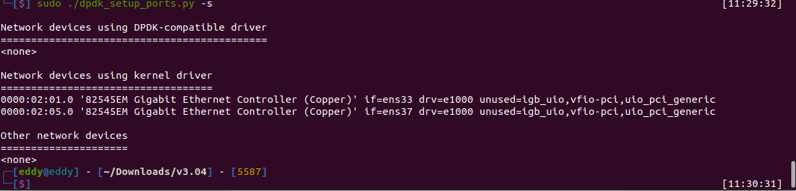
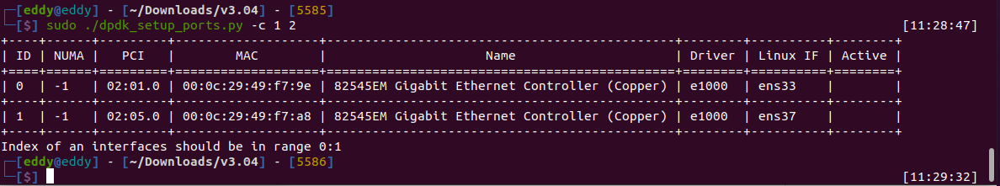
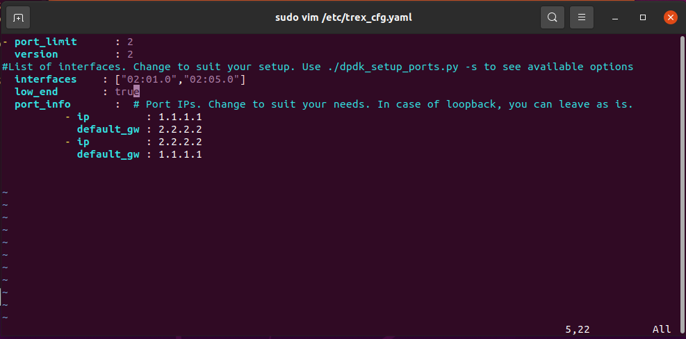
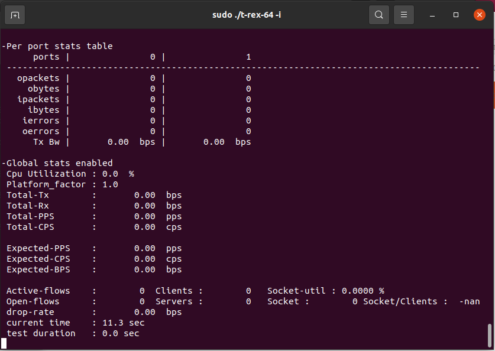
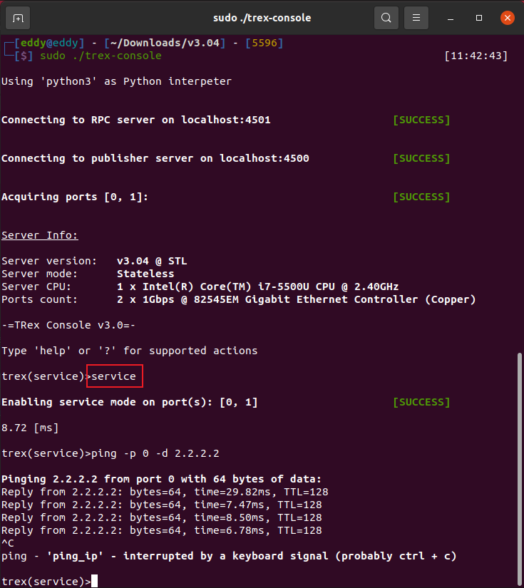

# trex使用

安装：直接下载对应包：[Index of /trex/release (cisco.com)](https://trex-tgn.cisco.com/trex/release/)

安装依赖包

```bash
sudo apt-get update
sudo apt-get install -y gcc g++ python git zlib1g-dev pciutils vim kmod strace wget
```

## 无状态模式（stateless）配置与使用

### 查看当前接口情况

```bash
sudo ./dpdk_setup_ports.py -s                                                     
```



### 绑定dpdk接口

```bash
sudo ./dpdk_setup_ports.py -c 1 2		#绑定两个接口
```



注释：Active 端口作为管理端口，管理端口不能被绑定，否则不能管理linux。

### 生成trex_cfg.ymal文件，也可手动更改

```bash
sudo ./dpdk_setup_ports.py -c 02:01.0 02:05.0 -o /etc/trex_cfg.yaml
```

### 复制配置文件

```bash
cp  cfg/simple_cfg.yaml  /etc/trex_cfg.yaml
```

### 修改配置文件和自己的拓扑相符合

```bash
sudo vim /etc/trex_cfg.yaml

- port_limit      : 2						#端口数量限制
  version         : 2						#trex 版本
#List of interfaces. Change to suit your setup. Use ./dpdk_setup_ports.py -s to see available options
  interfaces    : ["02:01.0","02:05.0"]		#对应绑定网卡的bdf号
  low_end       : true
  port_info       :  # Port IPs. Change to suit your needs. In case of loopback, you can leave as is.
          - ip         : 1.1.1.1			#本端eth1的虚接口地址
            default_gw : 2.2.2.2			#对端DUT接口地址
          - ip         : 2.2.2.2			#本端eth2的虚接口地址
            default_gw : 1.1.1.1			#对端DUT接口地址
```



其中`interfaces`为需要使用的网卡的BDF号，若使用虚拟机，出现[问题1](#err1)的相关错误，可添加`low_end`

### 启动trex服务器

```bash
sudo ./t-rex-64 -i
```

服务器启动后，可以监听各个端口的收发包情况



### console连接环境确认

打开控制台、进入servicee模式，执行ping命令，确认环境：



### 发送流量

```bash
start -f stl/simple_3pkt.py -a
```


## 恢复网卡正常使用

```bash
sudo dpdk-devbind.py -b e1000 02:01.0 02:05.0
```


## 常见错误

### <span id="err1">问题1</span>：EAL: invalid core list, please check specified cores are part of 0-1

```bash
EAL: invalid core list, please check specified cores are part of 0-1
```

解决方法

[如何在配置较低的虚拟机上编译并运行支持bird的trex - staylight - 博客园 (cnblogs.com)](https://www.cnblogs.com/liudf0716/p/15948980.html)

```bash
sudo vim /etc/etc/trex_cfg.yaml
```

添加`low_end:true`

```bash
- version: 2
  interfaces: ['02:02.0', '02:03.0']
  low_end: true
  stack: linux_based
```

## 参考

[【安装文档】TRex流量分析仪保姆级安装指南--基于VMware虚拟机（ubantu18.04@Intel 82545EM） - dayceng - 博客园 (cnblogs.com)](https://www.cnblogs.com/DAYceng/p/16878732.html)

[报文发生器 TRex 的配置和使用_trex工具-CSDN博客](https://blog.csdn.net/lingshengxiyou/article/details/128885262)

[发包工具 TRex stateless 使用笔记_trex发包工具学习笔记-CSDN博客](https://blog.csdn.net/force_eagle/article/details/105665424?spm=1001.2101.3001.6650.5&utm_medium=distribute.pc_relevant.none-task-blog-2~default~CTRLIST~Rate-5-105665424-blog-128885262.235^v38^pc_relevant_anti_t3_base&depth_1-utm_source=distribute.pc_relevant.none-task-blog-2~default~CTRLIST~Rate-5-105665424-blog-128885262.235^v38^pc_relevant_anti_t3_base&utm_relevant_index=7)

[TRex Frequently Asked Questions (cisco.com)](https://trex-tgn.cisco.com/trex/doc/trex_faq.html#_general)

[TRex学习（一）环境搭建和测试 - CodeAntenna](https://codeantenna.com/a/h2aavGsNi2)

[TRex，一个基于DPDK的数据包发生器，测试仪 - 熊猫滚滚 - 博客园 (cnblogs.com)](https://www.cnblogs.com/pandaroll/p/11617801.html)

[报文发生器 TRex 的配置和使用 - 锦瑟，无端 - 博客园 (cnblogs.com)](https://www.cnblogs.com/cscshi/p/16583997.html)

trex下载：[Index of /trex/release (cisco.com)](https://trex-tgn.cisco.com/trex/release/)

专栏：[Trex_analylx2047的博客-CSDN博客](https://blog.csdn.net/analylx2047/category_11848251.html)

