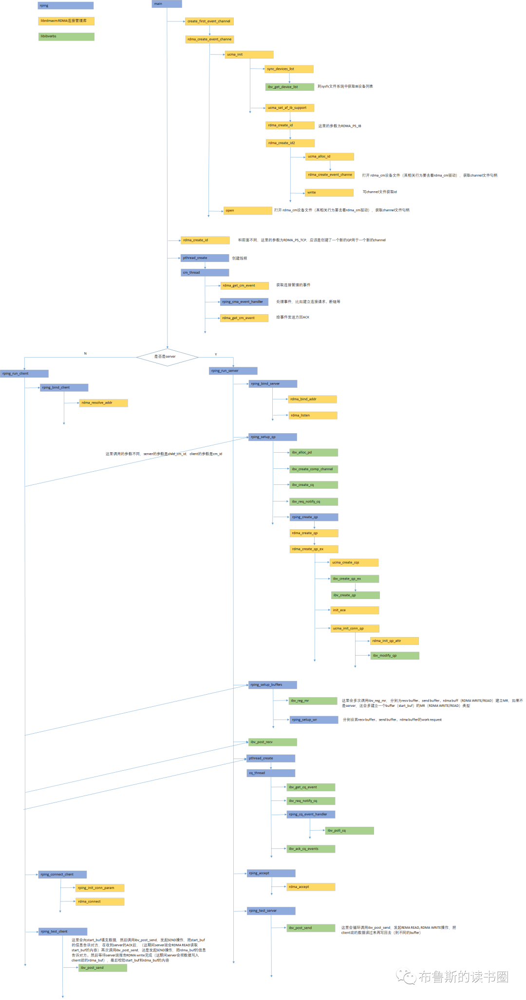
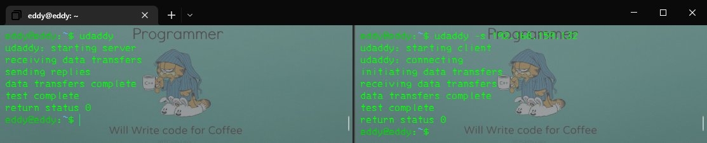
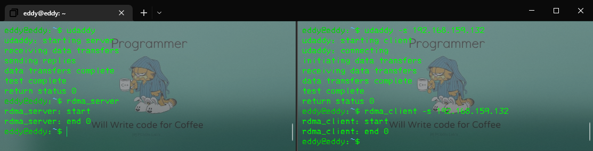
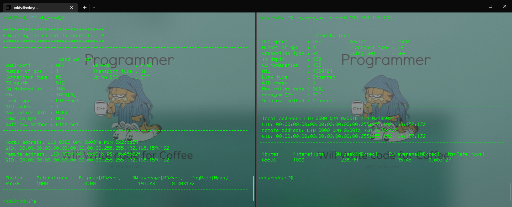
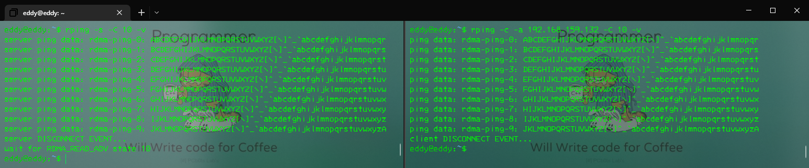
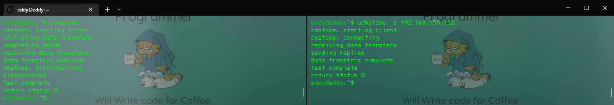
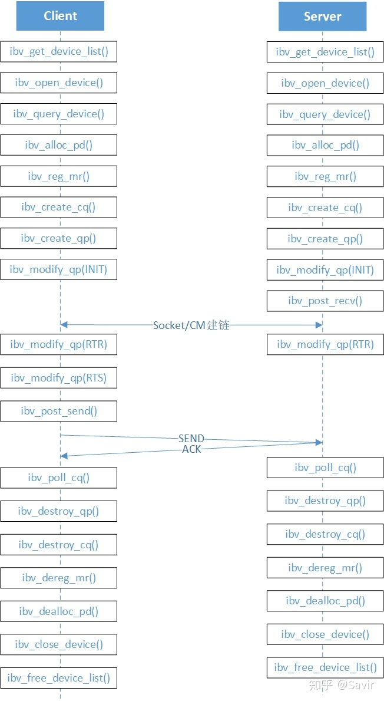

# RDMA_Verbs编程

---

广义的Verbs API分为两部分：

**IB_VERBS**

&emsp;&emsp;接口以ibv_xx（用户态）或者ib_xx（内核态）作为前缀，是最基础的编程接口；

**RDMA_CM**

&emsp;&emsp;以rdma_为前缀，主要分为两个功能：

**CMA（Connection Management Abstraction）**

&emsp;&emsp;在Socket和Verbs API基础上实现，用于CM建链并交换信息的一组接口。CM建链是在Socket基础上封装为QP实现，从用户的角度来看，是在通过AP交换之后数据交换所需要的QPN，Key等信息。

**CM_VERBS**

&emsp;&emsp;RDMA_CM主要用于管理连接，使通信的双方能够确定彼此的GID和QPN信息，从而可以进行后续的交互处理。

&emsp;&emsp;RDMA_CM也可以用于数据交换，相当于在Verbs API上有封装了一套数据交换接口。

&emsp;&emsp;侠义的Verbs API指以ibv_ /ib_为前缀的用户态Verbs接口，因为RDMA的典型应用是在用户态，下文主要介绍用户态的Verbs API。

Linux内核RDMA子系统

代码仓库[https://git.kernel.org/pub/scm/linux/kernel/git/rdma/rdma.git/](https://git.kernel.org/pub/scm/linux/kernel/git/rdma/rdma.git/)

代码位于内核driver/infiniband/目录下，包括核心代码和各厂商的驱动代码；

Linux内核RDMA子系统邮件订阅[[Majordomo Lists at VGER.KERNEL.ORG](http://vger.kernel.org/vger-lists.html#linux-rdma)]([Majordomo Lists at VGER.KERNEL.ORG](http://vger.kernel.org/vger-lists.html#linux-rdma))


---

## rdma-core

rdma-core GitHub维护仓库 [https://github.com/linux-rdma/rdma-core](https://github.com/linux-rdma/rdma-core)

安装步骤：

1. 下载rdma-core源码并安装依赖包

```bash
cd ~ git clone https://github.com/linux-rdma/rdma-core.git
sudo $ apt-get install build-essential cmake gcc libudev-dev libnl-3-dev libnl-route-3-dev ninja-build pkg-config valgrind python3-dev cython3 python3-docutils pandoc
bash build.sh
```


## [libibverbs](https://downloads.openfabrics.org/verbs/README.html)

针对各种RDMA设备的硬件特定库和工具，

## librdmacm

代码维护仓库：[ofiwg/librdmacm (github.com)](https://github.com/ofiwg/librdmacm)



图来自[RDMA应用程序系列——rping程序简介 - 墨天轮 (modb.pro)](https://www.modb.pro/db/485335)

[构建参考](https://blog.csdn.net/qq_36537040/article/details/115769105)

安装步骤：

1. 下载libibverbs源码并安装依赖包

```bash
cd ~
git clone https://github.com/ofiwg/librdmacm.git
cd librdmacm
sudo apt-get install autoconf automake gettext libtool libibverbs*
```

2. 编译安装libibverbs

```bash
cd ~/librdmacm
./autogen.sh
./configure
make
```

### 测试RDMA CM

#### udaddy

服务端

```bash
udaddy
```

客户端

```bash
udaddy -s 192.168.159.131
```



return 0表示正常退出。

#### rdma_server，rdma_client

服务端

```bash
rdma_server
```

客户端

```bash
rdma_client -s 192.168.159.132
```



#### ib_send_bw性能测试

客户端

```bash
ib_send_bw
```

客户端

```bash
ib_send_bw -d rxe0
```



#### rping

服务端

```bash
rping -s -C 101 -v
```

客户端

```bash
rping -c -a 192.168.159.132 -C 10 -v
```



#### ucmatose

服务端

```bash
ucmatose
```

客户端

```bash
ucmatose -s 192.168.159.132
```




### Hello World步骤

1. Get the device list；
2. Open the requested device
3. Query the device capabilites
4. Allocate a Protection Domain to contain your resources
5. Register a memory region
6. Create a Completion Queue（CQ）
7. Create a Queue Pair（QP）
8. Bring up a QP
9. Post work requests and poll for completion
10. Cleanup


1. 获取设备列表；
2. 打开请求的设备
3. 查询设备能力
4. 分配保护域以包含您的资源
5. 注册内存区
6. 创建完成队列(CQ)
7. 创建队列对(QP)
8. 提出一个QP
9. 发布工作请求并轮询完成
10. 清理



### QP状态迁移

#### RST（Reset）

复位状态。当一个QP通过Create QP创建好之后就处于这个状态，相关的资源都已经申请好了，但是这个QP目前什么都做不了，其无法接收用户下发的WQE，也无法接受对端某个QP的消息。

#### INIT（Initialized）

已初始化状态。这个状态下，用户可以通过Post Receive给这个QP下发Receive WR，但是接收到的消息并不会被处理，会被静默丢弃；如果用户下发了一个Post Send的WR，则会报错。

#### RTR（Ready to Receive）

准备接收状态。在INIT状态的基础上，RQ可以正常工作，即对于接收到的消息，可以按照其中WQE的指示搬移数据到指定内存位置。此状态下SQ仍然不能工作。

#### RTS（Ready to Send）

准备发送状态。在RTR基础上，SQ可以正常工作，即用户可以进行Post Send，并且硬件也会根据SQ的内容将数据发送出去。进入该状态前，QP必须已于对端建立好链接。

#### SQD（Send Queue Drain）

SQ排空状态。顾名思义，该状态会将SQ队列中现存的未处理的WQE全部处理掉，这个时候用户还可以下发新的WQE下来，但是这些WQE要等到旧的WQE全处理之后才会被处理。

#### SQEr（Send Queue Error）

SQ错误状态。当某个Send WR发生完成错误（即硬件通过CQE告知驱动发生的错误）时，会导致QP进入此状态。

#### ERR（Error）

即错误状态。其他状态如果发生了错误，都可能进入该状态。Error状态时，QP会停止处理WQE，已经处理到一半的WQE也会停止。上层需要在修复错误后再将QP重新切换到RST的初始状态。

# 参考链接

[jcxue/RDMA-Tutorial: A tutorial on RDMA based programming using code examples (github.com)](https://github.com/jcxue/RDMA-Tutorial)

[RDMA简介 - 知乎 (zhihu.com)](https://zhuanlan.zhihu.com/p/336793481)

[用戶端作業 - IBM 說明文件](https://www.ibm.com/docs/zh-tw/aix/7.1?topic=cm-client-operation)

[How To Enable, Verify and Troubleshoot RDMA (force.com)](https://mymellanox.force.com/mellanoxcommunity/s/article/How-To-Enable-Verify-and-Troubleshoot-RDMA) RDMA CM测试参考

[RDMA over Converged Ethernet (RoCE) - MLNX_OFED v5.2-1.0.4.0 - NVIDIA Networking Docs](https://docs.nvidia.com/networking/pages/viewpage.action?pageId=39284930)RDMA CM测试参考

[rping 指令 - IBM 說明文件](https://www.ibm.com/docs/zh-tw/aix/7.1?topic=commands-rping-command)

[新人エンジニアの赤面ブログ 『Mellanox 社製品を使ってみましょう！(1)～NIC 後編～ 』 - 半導体事業 - マクニカ (macnica.co.jp)](https://www.macnica.co.jp/business/semiconductor/articles/mellanox/138/) 迈络思驱动安装。

[rdma_cm(7) — librdmacm-dev — Debian testing — Debian Manpages](https://manpages.debian.org/testing/librdmacm-dev/rdma_cm.7.en.html) librdmacm API文档。

[RDMA read and write with IB verbs | The Geek in the Corner (wordpress.com)](https://thegeekinthecorner.wordpress.com/2010/09/28/rdma-read-and-write-with-ib-verbs/) 编程示例。

